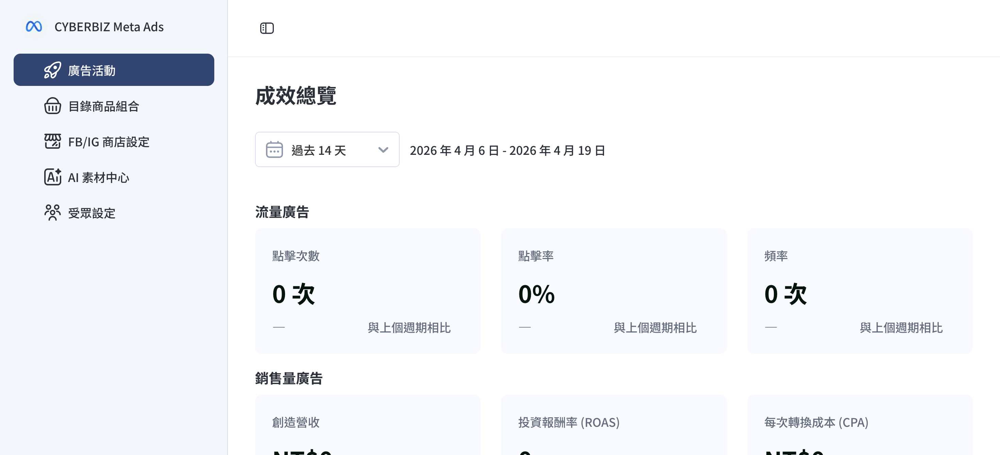

{ .subtitle }

[:lucide-bolt:{ title="適用功能" }](../../resources/conventions#適用功能) | APP MARKET
{ .doc-badge }

{ .hero-page }

## Meta Ads App 說明

**Meta Ads App** 是位於 CYBERBIZ 「APP MARKET」中的擴充功能，讓商家能直接在官網後台為電商官網創建並投放廣告至 Meta 平台（Facebook、Instagram 等），並隨時追蹤廣告表現。

## 安裝前置必要條件

在安裝 Meta Ads App 之前，請務必依序完成以下操作，否則系統會自動跳轉至對應設定頁：

- [x] **串接 [Meta 商業擴充套件](../mbe/設定 FBE 帳號授權與資產連結.md){ data-preview }**：確保 EC 後台已與 Facebook 相關資產（粉專、像素、目錄）連結成功。
- [x] **建立 [Meta 廣告帳號](建立 Meta 廣告帳號並儲值.md){ data-preview }**：需先於後台建立專屬廣告帳號。
- [x] **完成 [廣告金儲值](建立 Meta 廣告帳號並儲值.md#儲值廣告金){ data-preview }**：商家需預先儲值廣告預算至後台方可開始投放（最低門檻為 NT$15,000）。

## 安裝步驟教學

1.  **進入設定頁面**：登入 CYBERBIZ 管理後台，前往 **「第三方整合」** > **「Facebook 整合 (廣告/註冊登入)」** > **「廣告活動設定」**。
2.  **啟動串接**：點擊頁面中的 **「前往串接」** 按鈕。
3.  **安裝應用程式**：
    *   進入 Meta Ads 說明頁面後，點擊 **「安裝應用程式」**。
    *   *註：若尚未串接商業擴充套件或建立廣告帳號，系統此時會自動引導您至該設定頁面。*
4.  **確認授權**：系統會導向確認頁面，請閱讀並 **同意相關隱私條款**，最後點擊 **「確認安裝」**。
5.  **完成安裝**：安裝完成後，您即可透過上述後台路徑進入 Meta Ads App 介面，開始創建廣告活動或目錄商品組合。

## 常見問題與注意事項

*   **數據保留**：改至 Meta Ads App 投放廣告後，原先在 EC 平台中設定好的廣告資料與設定都會**妥善保留**，僅操作位置變更，不影響廣告執行。
*   **錯誤排除**：若安裝時出現「Error Code」或異常錯誤訊息，建議先嘗試**重新安裝**。若問題持續，請聯繫 CYBERBIZ 客服人員協助排查。
*   **廣告創建失敗**：若 App 安裝成功但在「創建廣告」時失敗，通常與 Meta 資產權限有關，可嘗試手動將權限分享給 CYBERBIZ 企業管理平台。

安裝完成後，您可以直接在 App 介面點選「創建廣告活動」，利用 Meta 的**高效速成行銷活動 (ASC)** 功能，由 AI 自動為您的廣告挑選受眾並決定最佳版位。

## 後續操作

- :lucide-import:{ .lg }
  [____]()
  。

- :lucide-ban:{ .lg }
  [____]()
  。

## 常見問題

??? quote ""

