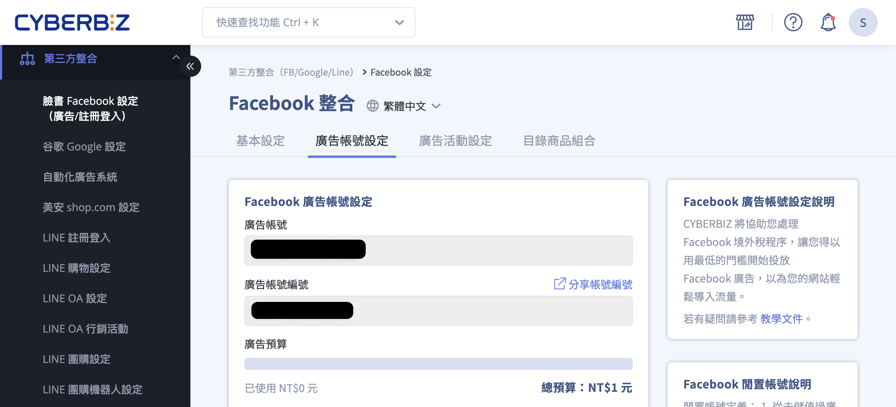
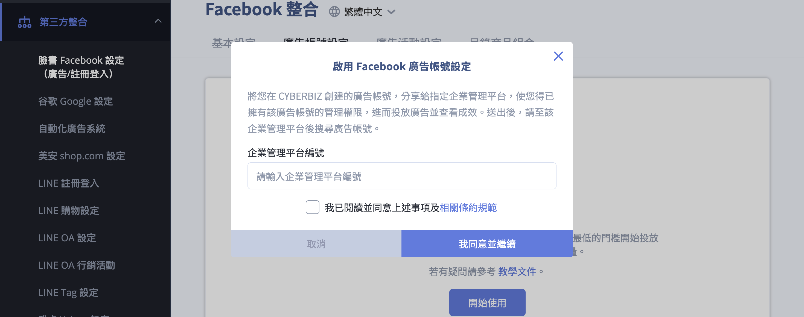
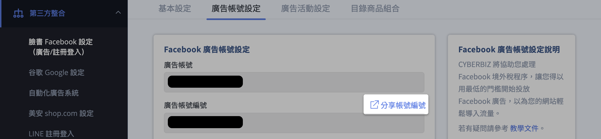
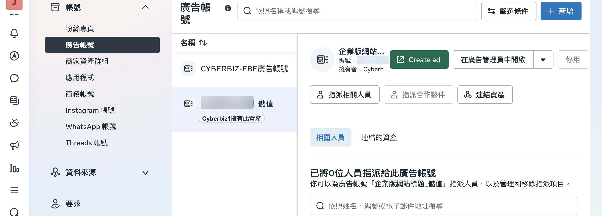
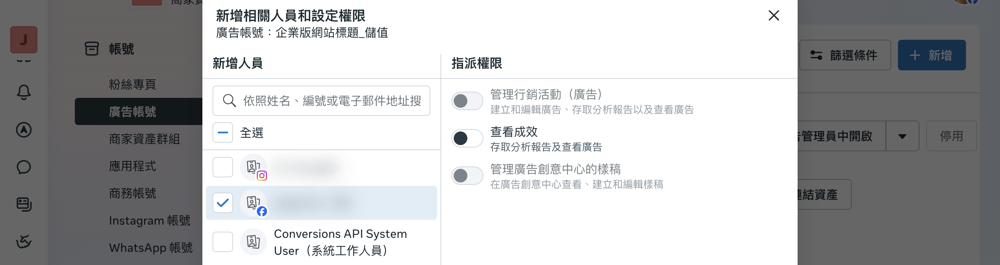
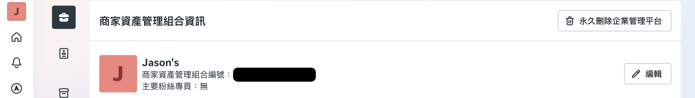
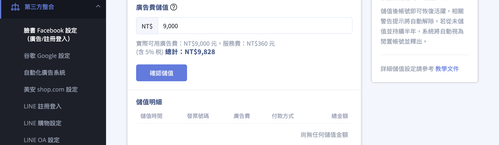

{ .subtitle }

{ .doc-badge }

{ .hero-page }

## 建立 Meta 廣告帳號說明

透過 CYBERBIZ 建立 Meta 廣告帳號，商家可由系統代開廣告費發票並支付費用，免去自行向國稅局申報境外稅的繁瑣程序。

## 前置需求
    
- [x] 建立廣告帳號前，請確保您已擁有 **企業管理帳號及相關資產權限**。若尚未建立，請先 [前往 Meta 企業管理平台](https://business.facebook.com/) 註冊。

## 廣告帳號建立

1. **後台路徑**：進入管理後台，點選 **「第三方整合」** > **「臉書 Facebook 設定（廣告/註冊登入）」** > **「廣告帳號設定」**。
2. **啟動流程**：點擊 **「開始使用」**。
3. **輸入企業管理平台編號**：在彈跳視窗中輸入您的 [企業管理平台編號](#查詢企業管理平台編號){ data-preview }。
4. **同意條款**：閱讀相關條約後勾選「我已閱讀」並按下 **「我同意並繼續」** 即可完成建立。
5. **建立規則**：系統建立的廣告帳號名稱預設為 **「CYBERBIZ註冊網域名稱_儲值」**。

## 分享廣告帳號權限

[建立廣告帳號](#廣告帳號建立){ data-preview } 後，需將操作權限分享給商家的企業管理平台：

1. **後台路徑**：**「第三方整合」** > **「臉書 Facebook 設定（廣告/註冊登入）」** > **「廣告帳號設定」**。
2. **分享帳號**：點擊 **「分享帳號編號」**，輸入欲分享的 [企業管理平台編號](#查詢企業管理平台編號){ data-preview }。

    

3. **確認連結**：分享完成後，請至 [**企業管理平台**](https://business.facebook.com/latest/settings) > **「帳號」** > **「廣告帳號」**，確認能看到名稱為 **「CYBERBIZ註冊網域名稱_儲值」** 的廣告帳號，即表示連結成功。

    

    !!! tip "如需指派操作/管理權限給企業管理平台中的人員，可於此頁面進行設定。"

4. **操作限制**：**尚未完成儲值前，該帳號僅能查看成效，無法投放廣告**；需儲值完畢後方可指派人員進行廣告投放。

    

## 查詢企業管理平台編號

1. 登入 [企業管理平台設定頁面](https://business.facebook.com/latest/settings)。
2. 點選 **「設定」** > **「商家資訊」**。
3. 商家資產管理組合編號（企業管理平台編號）即顯示於名稱下方。

!!! note "相關資源：[Meta 官方說明](https://www.facebook.com/business/help/1181250022022158)。"

## 像素 (Pixel) 設定

為了追蹤消費者行為，需手動將既有的像素連結至新建立的廣告帳號：

1. **進入企業管理平台**：進入 [設定 :lucide-external-link:](https://business.facebook.com/latest/settings)，點選「資料來源」> **「資料集或像素」**。
2. **新增資產**：選擇欲綁定的像素，點選「連結的資產」> **「新增資產」**。
3. **完成連結**：選取名稱為「商店名_儲值」的廣告帳號並確認新增。

## 儲值廣告金

!!! info "儲值規範與費用計算"

    - **儲值限制**：**最低儲值門檻為新台幣 15,000 元**。
    - **費用計算**：扣款總計 = 廣告預算 × (1 + 服務費% + 5% 稅金)。
        - **企業版**：4% 手續費 + 5% 稅金
        - **一般版**：5% 手續費 + 5% 稅金
    - **時效說明**：廣告預算儲值後 **沒有時間限制**，不會因一個月未用完而被洗掉。
    - **閒置帳號提醒**：若帳號建立後 **滿六個月未曾儲值**，將被視為「閒置帳號」並被系統釋出，屆時商家將失去該帳號操作權限。

商家必須預先儲值費用至後台方可開始投放：

1. **進入設定頁面**：登入 CYBERBIZ 管理後台，前往 **第三方整合 > 臉書 Facebook 設定（廣告/註冊登入）> 廣告帳戶設定**。
2. **設定儲值金額**：在 **廣告費儲值** 金額欄位輸入欲儲值的金額，點擊 **確認** 套用變更。
3. **(選填) 設定低餘額提醒**：在同頁面上方方的 **儲值提醒** 區塊，您可以根據需求自定義提醒水位。

    * **自定義比例**：可自行輸入預算消耗百分比（例如設定為 80% 時發送通知）。
    * **開啟通知**：確保開關處於「開啟」狀態，以避免廣告因預算耗盡而中斷。

## 後續操作

- :lucide-rocket:{ .lg }  
  [進行廣告活動設定](./設定-Meta-廣告活動.md)  
  完成以上步驟後，即可接續進行廣告活動設定，直接於 CYBERBIZ 後台投放廣告。

## 常見問題

??? quote ""

