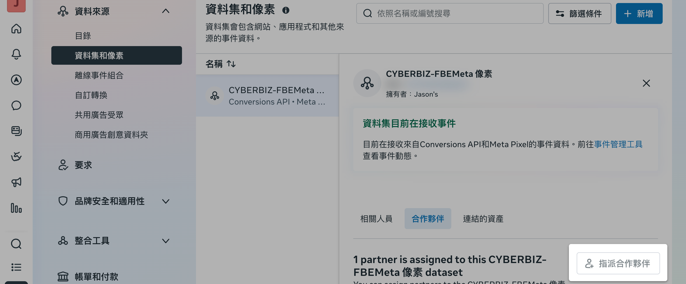
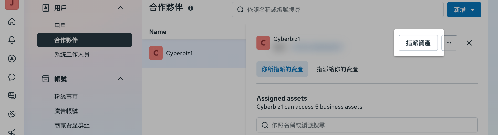
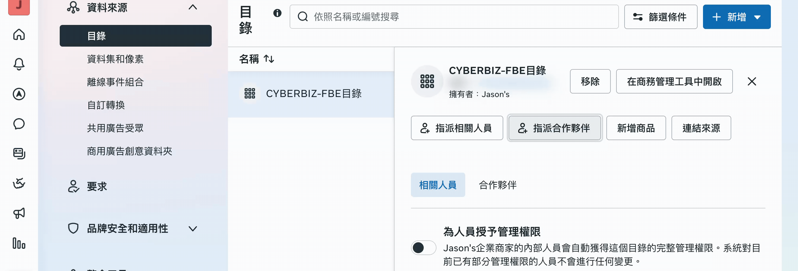

{ .subtitle }

{ .doc-badge }

{ .hero-page }

## 授權資產給 CYBERBIZ 說明

若商家在 CYBERBIZ 後台進行 Meta 廣告投放時，遇到 **廣告創建失敗** 的特殊情境，可透過手動分享資產權限給 CYBERBIZ 並通知客服來排除問題。

## 設定前置條件

在進行手動分享前，請務必先確認以下事項：

- [x] **完成 [廣告帳號建立與儲值](建立 Meta 廣告帳號並儲值.md){ data-preview }**：請先確認已完成「建立 Meta 廣告帳號並完成儲值」的所有步驟。
- [x] **完成 [像素 (Pixel) 設定](建立 Meta 廣告帳號並儲值.md#像素-pixel-設定){ data-preview }**：務必確認已完成廣告帳號建立中的「像素 (Pixel) 設定」步驟。
- [x] **針對正確資產分享**：請先完成 [FBE 帳號授權與資產連結](../mbe/設定 FBE 帳號授權與資產連結.md){ data-preview }，確認您於後台「新版商業擴充套件」中所設定的特定資產。

## 手動分享資產權限步驟

!!! warning "核對資產" 
    指派權限前，請確保企業平台設定中所選資產與 [商業擴充套件設定](../mbe/設定 FBE 帳號授權與資產連結.md){ data-preview } 中所顯示的資訊一致

### 分享粉絲專頁權限

1. 登入 [企業管理平台設定](https://business.facebook.com/latest/settings)，於左側選單點選「帳號」>「**粉絲專頁**」。
2. 點擊「**指派合作夥伴**」> 選擇 **企業管理平台編號**，輸入 **CYBERBIZ 企業管理平台編號：`481801283092517`**。
3. 勾選部分管理權限中的「**廣告**」、「**洞察報告**」，並點擊「繼續」完成。

---

### 分享像素權限

1. 登入 [企業管理平台設定](https://business.facebook.com/latest/settings)，於左側選單點選「資料來源」>「**資料集和像素**」。
2. 選取欲分享的像素，點擊「**指派合作夥伴**」> 選擇 **企業管理平台編號**，輸入 **CYBERBIZ 企業管理平台編號：`481801283092517`**。
3. 勾選部分管理權限中的「**查看像素**」，點擊「繼續」> 選擇「**以代理商身分代表我的業務 (as an agency for my business)**」。

??? failure "出現「已建立合作夥伴企業管理平台關係」錯誤"

    1. 請改點選左側選單「用戶」>「**合作夥伴**」。
    2. 找到「**Cyberbiz1**」這個 BM 帳號。
    3. 點擊「**分享資產**」。
    4. 在「資料集」或「像素」中找到對應像素，勾選「**使用事件資料集**」權限並點擊「指派資產」。

    

---

### 分享目錄權限

1. 登入 [企業管理平台設定](https://business.facebook.com/latest/settings)，於左側選單點選「資料來源」>「**目錄**」。
2. 點擊「**指派合作夥伴**」> 選擇 **企業管理平台編號**，輸入 **CYBERBIZ 企業管理平台編號：`481801283092517`**。
3. 勾選開放部分管理權限中的「**建立廣告**」，並點擊「繼續」。

## 完成後續處理

1.  **通知客服**：手動分享完成後，請務必 **通知 CYBERBIZ 客服人員**。
2.  **等待回覆**：待 CYBERBIZ 完成系統端的後續處理並正式回覆後，您即可再次嘗試 [設定 Meta 廣告活動](設定 Meta 廣告活動.md){ data-preview }。

## 後續操作

- :lucide-megaphone:{ .lg }   
  [__設定 Meta 廣告活動__](設定 Meta 廣告活動.md){ data-preview }       
  完成權限分享後，即可開始創建廣告活動，設定廣告預算、目標與素材。

## 常見問題

??? quote "分享權限時出現「已建立合作夥伴企業管理平台關係」錯誤該怎麼辦？"

    請改點選左側選單「用戶」>「合作夥伴」，找到「Cyberbiz1」這個 BM 帳號，點擊「分享資產」，在「資料集」或「像素」中找到對應像素，勾選「使用事件資料集」權限並點擊「指派資產」。

??? quote "權限分享完成後還是需要通知客服嗎？"

    是的，手動分享完成後，請務必通知 CYBERBIZ 客服人員，待 CYBERBIZ 完成系統端的後續處理並正式回覆後，您即可再次嘗試執行廣告活動設定。
