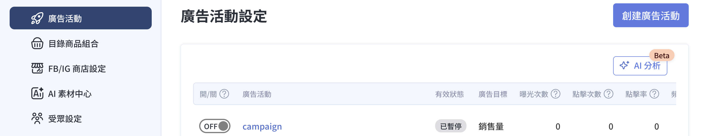
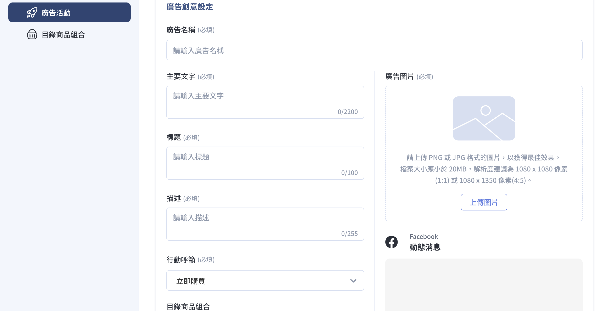
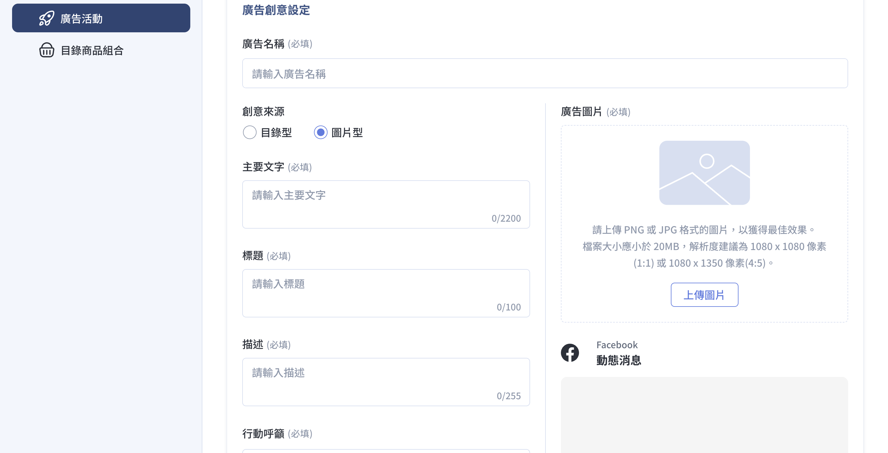
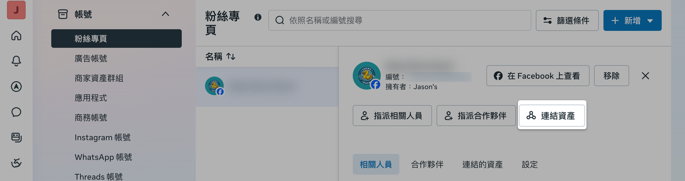

透過 CYBERBIZ Meta Ads App 管理 Meta 廣告活動，設定廣告預算、目標受眾與素材，掌握廣告投放成效。
{ .subtitle }

{ .hero-page }

## Meta 廣告活動設定說明

在 CYBERBIZ 後台完成 Meta 廣告活動配置。透過此整合功能，您可以直接管理廣告預算、目標與素材，無需頻繁切換至 Meta 後台進行操作。

## 使用前提

在開始設定之前，請確認已完成以下前置作業：

- [x] **重新 [串接 Facebook 商業擴充套件](../mbe/設定 FBE 帳號授權與資產連結.md){ data-preview }**：因應 Meta 系統更新，建議商家務必重新串接一次，以確保資料同步正常。
- [x] **完成 [廣告帳號建立與儲值](建立 Meta 廣告帳號並儲值.md){ data-preview }**：必須先完成廣告帳號申請，且 **廣告金儲值需大於新台幣 15,000 元** 後方可開始投放。

## 創建廣告活動流程

1. **進入 Meta Ads App**：登入 CYBERBIZ 管理後台，前往 **第三方整合 > 臉書 Facebook 設定 > 廣告活動設定**。

    - 尚未串接：點擊「立即串接」（參考：[安裝 Meta Ads App](../../../app-market/安裝 Meta Ads App.md){ data-preview }）。
    - 已完成串接：點擊「立即前往」。

2. **啟動編輯**：點擊左側導覽列的 廣告活動 > 創建廣告活動。

    

3. **完成配置設定**：進入編輯介面後，請依序完成以下內容配置：

    

    - :lucide-goal: [活動目標設定](#活動目標設定){data-preview }  
    - :lucide-calendar: [活動內容設定](#活動內容設定){ data-preview }  
    - :lucide-image-play: [廣告創意設定](#廣告創意設定){ data-preview }  

    

4. **儲存設定**：點擊頁面下方的 **儲存** 按鈕以完成配置。

---

### 活動目標設定

根據品牌現狀與行銷需求選擇合適的活動目標：

*   **流量廣告**：旨在將消費者導流至官網特定頁面（如首頁、品牌介紹頁）。特別適合 **品牌起步期** 或 **新品上市**，用於前期蒐集數據並建立受眾基礎。
*   **銷售量廣告**：將廣告綁定官網商品群。適合 **具備穩定流量** 的商家，針對特定商品提高購買機率與銷售轉單。

??? note "目標差異與預算規範參考"

    | 項目 | 流量廣告 | 銷售量廣告 |
    | :--- | :--- | :--- |
    | **主要目的** | 導流至指定頁面 | 提升商品銷售轉換 |
    | **每日預算** | **請大於 NT$150** | **請大於 NT$50** |
    | **操作重點** | 選擇導流頁面 | 綁定商品目錄/組合 |
    | **建議搭配** | 新品發布、品牌介紹 | 熱賣品頁面、促銷活動頁 |

---

### 活動內容設定

設定廣告名稱、每日預算與投放起訖時間。

| 欄位名稱 | 說明 | 備註 |
| :--- | :--- | :--- |
| **廣告活動名稱** | 建議包含日期與產品名，方便後續對照。 | 必填 |
| **每日預算** | 建議參考 [每日預算指南](設定 Meta 廣告每日預算.md){ data-preview } 設定。 | 必填 |
| **開始時間** | 預設為立即開始，亦可預排時程。 | — |
| **結束時間** | 預設為持續投放，亦可設定預計停止日期。 | — |

=== "流量目標"

    

=== "銷售量目標"

    

---

### 廣告創意設定

配置廣告素材與文案，單一活動內最多可設定 20 組廣告創意。

| 欄位名稱 | 設定說明 | 備註 / 關聯功能 |
| :--- | :--- | :--- |
| **廣告名稱** | 輸入廣告創意名稱。 | 內部管理用 |
| **創意來源** | 根據選定的「活動目標」提供對應選項： - **銷售量廣告**：可選 **目錄型** 或 **圖片型**。 - **流量廣告**：預設為 **圖片型**。  [查看廣告呈現效果差異](#廣告呈現效果){ data-preview }| **目錄型**：抓取 Pixel 蒐集之商品資訊，請確認[正確連結](建立 Meta 廣告帳號並儲值.md#像素-pixel-設定){ data-preview }。 **PLUS/企業版** 商家若有 [上傳商品影片](../../../products/creation/設定商品影片.md){ data-preview } 並 [同步目錄](){ data-preview }，廣告將以影片與商品圖輪播展現。 |
| **填寫文案** | 輸入 **主要文字**、**標題** 與 **描述**。 |  |
| **行動呼籲** | 設定廣告上的功能按鈕文字（如：立即購買、來去逛逛、查看更多）。 | 建議根據行銷目標選擇 |
| **目錄商品組合** | 選擇欲投放廣告的 [目錄商品組合](設定 Meta 廣告的目錄商品組合.md){ data-preview }。您可以透過預先建立的特定商品集合，實現精準投放。 | ※ 商品需為 **公開且已上架** 狀態。 |
| **UTM 參數** | 設定來源 (Source)、媒介 (Medium) 與名稱 (Campaign)。 | 用於第三方工具追蹤成效 |

=== "流量目標"

    

=== "銷售量目標"

    

## 廣告呈現效果

=== "目錄型"

    

=== "圖片型"

    

    - 
    - 

    

## 疑難排解

- :lucide-wrench:{ .lg }   
  [__手動分享資產權限給 CYBERBIZ__](手動分享資產權限給 CYBERBIZ.md){ data-preview }       
  若廣告創建失敗，可透過手動分享資產權限（粉絲專頁、像素、目錄）給 CYBERBIZ 企業管理平台來排除問題。

## 後續操作

- :lucide-chart-line:{ .lg }   
  [__使用 Meta 廣告成效分析__](使用 Meta 廣告成效分析.md){ data-preview }       
  透過 CYBERBIZ 後台直接掌握廣告投放成效，查看 ROAS、創造營收、廣告花費等關鍵指標，並可使用 AI Insights 獲取數據洞察與優化建議。

## 常見問題

??? quote "廣告受眾是誰？"

    系統搭配 Meta 的[**高效速成行銷活動 (ASC)** :lucide-external-link:](https://www.facebook.com/business/help/1362234537597370){ target="_blank" }，透過 AI 自動挑選 CPA 最低、ROAS 最高的受眾群體進行收斂，商家無需手動設定參數。

??? quote "廣告版位在哪裡？"

    由 AI 自動決定成交率最高的版位，包含 Facebook 貼文、Instagram 限時動態、Reels、Messenger 等。

??? quote "可以在 Instagram 上面投放廣告嗎？"

    可以。前提是您需要先連結您的 Facebook 粉絲專頁以及 Instagram 帳號。連結的方式很簡單，只要到 [企業管理平台後台](https://business.facebook.com/latest/settings)，在「帳號」下選擇「粉絲專頁」，點擊「連結資產」，點擊「Instagram 帳號」，選定欲連結的 Instagram 帳號，即完成帳號連結。

    

??? quote "流量廣告與銷售量廣告的差異為何？"

    流量廣告旨在將消費者導流至官網特定頁面（如首頁，品牌介紹頁），適合品牌起步期或新品上市；銷售量廣告則將廣告綁定官網商品群，適合具備穩定流量的商家，針對特定商品提高購買機會。每日預算部分，流量廣告建議大於 NTD 150，銷售量廣告建議大於 NTD 50。

??? quote "單一廣告活動最多可設定多少組廣告創意？"

    單一活動內最多可設定 20 組廣告創意，商家可透過「進階搜尋」依照標籤、廠商或類型篩選出特定商品（需為公開且已上架），組成特定的商品群投放廣告。

??? quote "如何解決廣告創建失敗的問題？"

    廣告創建失敗通常為權限問題。請參考[手動分享資產權限給 CYBERBIZ](手動分享資產權限給 CYBERBIZ.md){ data-preview }說明，將資產權限分享給 **CYBERBIZ 企業管理平台（編號：481801283092517）**，並通知客服人員排查。
