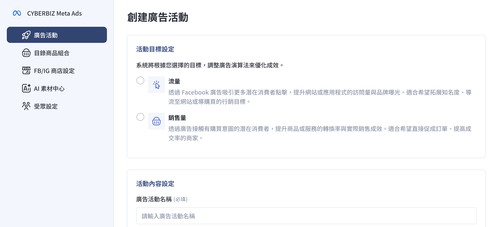
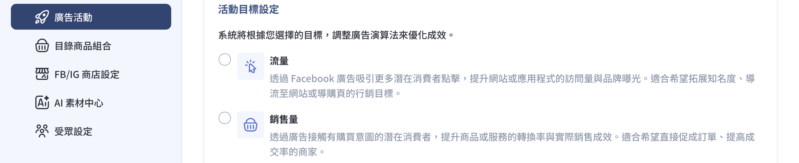
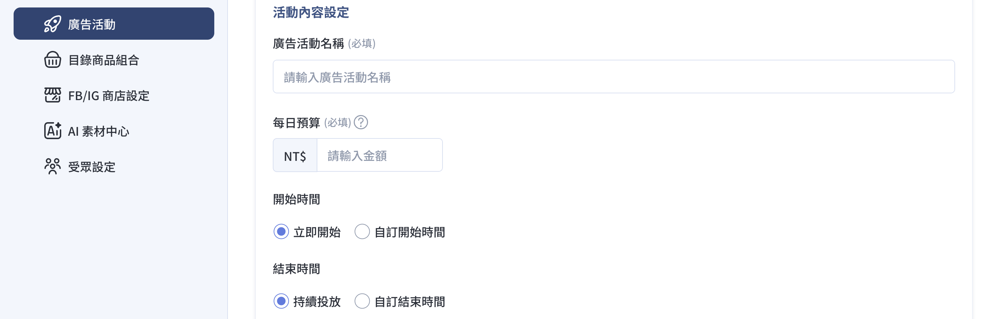
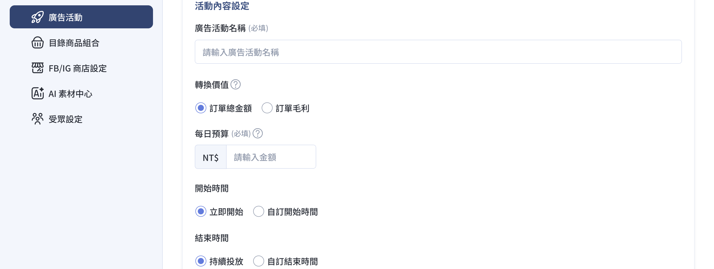

{ .subtitle }

{ .doc-badge }

{ .hero-page }

## Meta 廣告活動設定說明

在 CYBERBIZ 後台完成 Meta 廣告活動配置。透過此整合功能，您可以直接管理廣告預算、目標與素材，無需頻繁切換至 Meta 後台進行操作。

## 使用前提

在開始設定之前，請確認已完成以下前置作業：

- [x] **重新 [串接 Facebook 商業擴充套件](../mbe/設定 FBE 帳號授權與資產連結.md){ data-preview }**：因應 Meta 系統更新，建議商家務必重新串接一次，以確保資料同步正常。
- [x] **完成 [廣告帳號建立與儲值](建立 Meta 廣告帳號並儲值.md){ data-preview }**：必須先完成廣告帳號申請，且 **廣告金儲值需大於新台幣 15,000 元** 後方可開始投放。

## 選擇廣告目標：流量 vs 銷售量

您可以根據品牌現狀與行銷需求選擇合適的活動目標：

*   **流量廣告**：旨在將消費者導流至官網特定頁面（如首頁、品牌介紹頁）。特別適合 **品牌起步期** 或 **新品上市**，用於前期蒐集數據並建立受眾基礎。
*   **銷售量廣告**：將廣告綁定官網商品群。適合 **具備穩定流量** 的商家，針對特定商品提高購買機率與銷售轉單。

???+ note "目標差異與預算規範參考"

    | 項目 | 流量廣告 | 銷售量廣告 |
    | :--- | :--- | :--- |
    | **主要目的** | 導流至指定頁面 | 提升商品銷售轉換 |
    | **每日預算** | **請大於 NT$150** | **請大於 NT$50** |
    | **操作重點** | 選擇導流頁面 | 綁定商品目錄/組合 |
    | **建議搭配** | 新品發布、品牌介紹 | 熱賣品頁面、促銷活動頁 |

## 創建廣告活動步驟

1.  **進入 Meta Ads App**：登入 CYBERBIZ 管理後台，前往「第三方整合」>「Facebook 整合」>「廣告活動設定」。根據您的串接狀態點擊進入：

    - 若尚未串接，點擊「立即串接」開始安裝程序。若需詳細安裝引導，請參閱 [安裝 Meta Ads App](../../../app-market/安裝 Meta Ads App.md){ data-preview }。
    - 若已完成串接，請點擊「立即前往」。

2.  **新增活動**：點擊「創建廣告活動」，於「活動目標設定」選擇「流量」或「銷售量」。

    

3.  **內容填寫**：設定「廣告活動名稱」、「[每日預算](設定 Meta 廣告每日預算.md){ data-preview }」、「轉換價值」（銷售量）以及廣告的開始與結束時間。
    *   *投放建議*：初期可設定較高預算以加速 AI 學習，建議每週至少累積 30-50 次轉換。

    === "流量"

        

    === "銷售量"

        

4. **配置廣告素材**：根據您選擇的廣告目標，進入下方的「[廣告創意與商品組合](#廣告創意與商品組合設定)」流程。

## 廣告創意與商品組合設定

在同一個廣告活動下，您可以設定多組廣告（上限為 20 個），並控制各別狀態。

1. **廣告名稱**：輸入廣告活動名稱。
2.  **創意來源**：

    === "目錄型 (銷售量廣告專用)"

        抓取 [Pixel 已蒐集到的商品資訊](建立 Meta 廣告帳號並儲值.md#像素-pixel-設定){ data-preview }。

          !!! info "PLUS 版商家若有 [上傳商品影片](../../../products/creation/設定商品影片.md){ data-preview } 並 [同步目錄](){ data-preview }，廣告將以影片與商品圖輪播展現。"

    === "圖片型"

        商家自行上傳特定廣告圖片。

*   **目錄型**（銷售量廣告專用）：抓取 [Pixel 已蒐集到的商品資訊](建立 Meta 廣告帳號並儲值.md#像素-pixel-設定){ data-preview }。**PLUS 版商家**若有 [上傳商品影片](../../../products/creation/設定商品影片.md){ data-preview } 並 [同步目錄](){ data-preview }，廣告將以影片與商品圖輪播展現。
    *   **圖片型**：商家自行上傳特定廣告圖片。
3.  **目錄商品組合**：您可以透過「進階搜尋」依照標籤、廠商或類型篩選出特定商品（需為**公開且已上架**），組成特定的商品群投放廣告。
4.  **填寫文案**：輸入主要文字、標題與描述，並設定消費者點擊後導向的「廣告活動連結」。
5.  **儲存與預覽**：確認右側預覽畫面無誤後點擊「儲存」即完成設定。

## 常見問題 FAQ

*   **廣告受眾是誰？** 系統搭配 Meta 的**高效速成行銷活動 (ASC)**，透過 AI 自動挑選 CPA 最低、ROAS 最高的受眾群體進行收斂，商家無需手動設定參數。
*   **廣告版位在哪裡？** 由 AI 自動決定成交率最高的版位，包含 Facebook 貼文、Instagram 限時動態、Reels、Messenger 等。
*   **廣告創建失敗怎麼辦？** 通常為權限問題。請嘗試手動將資產權限分享給 **CYBERBIZ 企業管理平台（編號：481801283092517）**，並通知客服人員排查。

## 後續操作

- :lucide-import:{ .lg }
  [____]()
  。

- :lucide-ban:{ .lg }
  [____]()
  。

## 常見問題

??? quote ""

