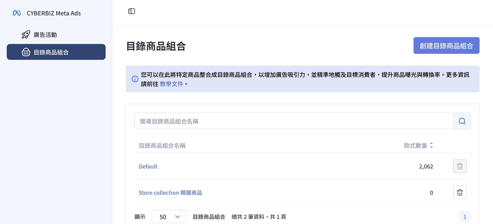
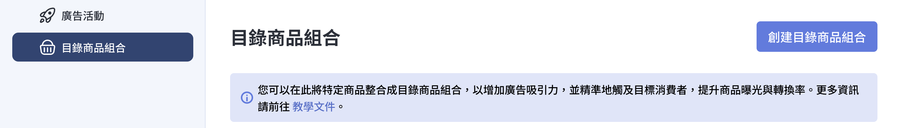
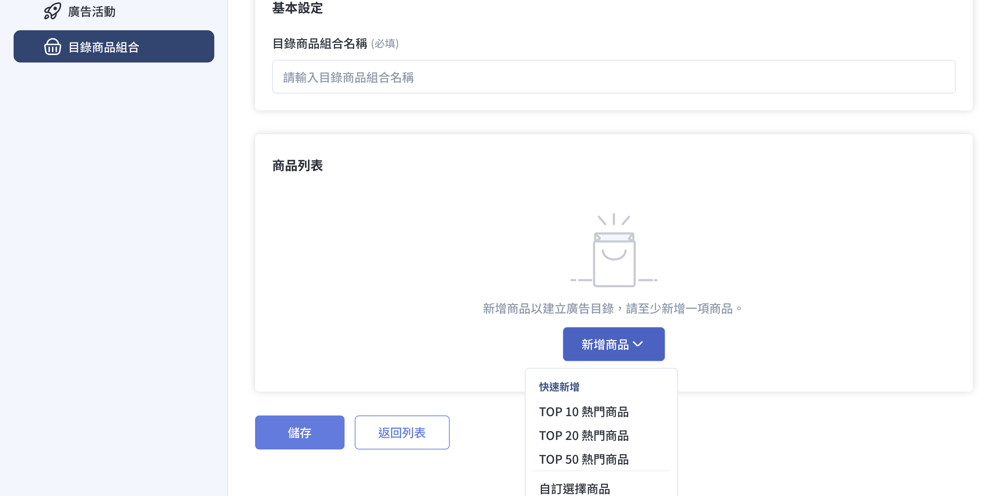
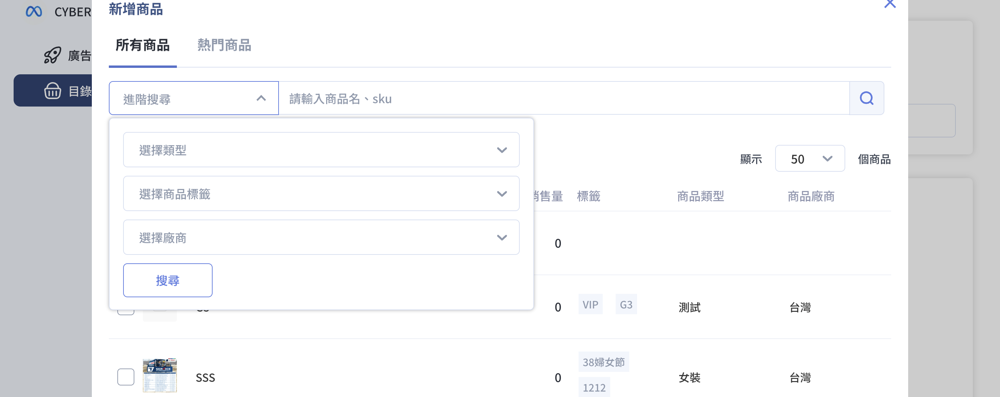
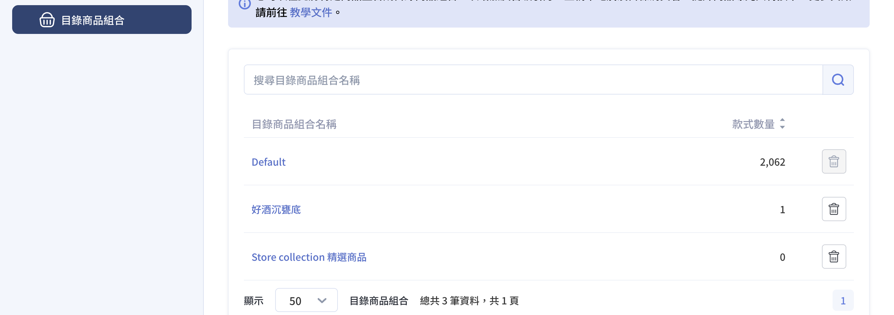
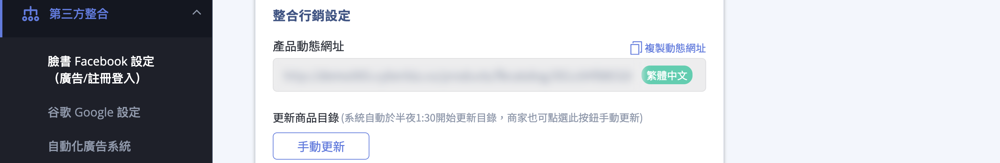
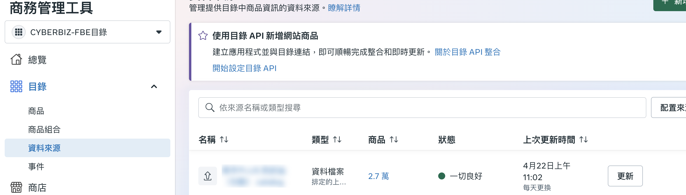
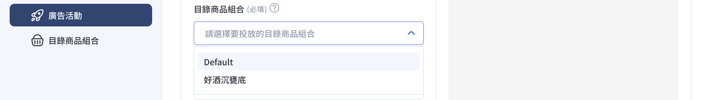

透過 CYBERBIZ Meta Ads App 建立目錄商品組合，篩選特定商品以投放 Meta 目錄型或圖片型廣告。
{ .subtitle }

{ .hero-page }

## Meta 廣告目錄商品組合說明

「**Meta 廣告目錄商品組合**」功能，能讓商家因應特殊促銷檔期或特定銷售需求，直接從 CYBERBIZ 後台篩選出特定的商品組合，並精準地投放在 Meta 的[目錄型廣告或圖片型廣告](設定 Meta 廣告活動.md#廣告呈現效果){ data-preview }中。

## 設定前置必要條件

在開始新增商品組合前，請務必確認完成以下事項：

- [x] **[重新串接 FBE](../mbe/設定 FBE 帳號授權與資產連結.md){ data-preview }**：因應 Meta 功能更新，請商家務必重新串接一次「Facebook 新版商業擴充套件」。
- [x] **[建立廣告帳號並儲值](建立 Meta 廣告帳號並儲值.md){ data-preview }**：需先建立廣告帳號並完成廣告金儲值，才能進行後續投放設定。

## 新增目錄商品組合步驟

1.  **進入 Meta Ads App**：登入 CYBERBIZ 管理後台，前往 **第三方整合 > 臉書 Facebook 設定（廣告/註冊登入） > 目錄商品組合**。

    - 尚未串接：點擊「立即串接」進行初始化（參考：[安裝 Meta Ads App](../../../app-market/安裝 Meta Ads App.md){ data-preview }）。
    - 已完成串接：點擊「**立即前往**」。

2.  **啟動創建**：點擊左側導覽列的 目錄商品組合 > 創建目錄商品組合。

    

3.  **命名與新增**：輸入「目錄商品組合名稱」，點擊「新增商品」並選擇加入方式：

    - **快速新增**：可直接選取系統計算的 TOP 10 / 20 / 50 熱門商品。
    - **自訂選擇商品**：點選後進入進階篩選介面。

    

4.  **篩選與限制條件**：若選擇「自訂選擇商品」，可以透過以下邏輯精確篩選商品：

    - **彈性篩選**：可先切換 所有商品 或 熱門商品 範疇，再依據類型、標籤、廠商或關鍵字進行搜尋。
    - **選取限制**：系統僅支援選取狀態為「公開」且「已上架」的商品。
    - **自動排除機制**：帶有「贈品」或「排除product feed」標籤的商品將無法被選取。瞭解 [如何設定商品排除標籤](../../../products/categorization/管理商品標籤.md#排除上傳至第三方平台標籤){ data-preview }

    

    !!! info "篩選邏輯設定請參考 [後台商品篩選設定](../../../products/get-started/使用商品管理介面管理商品.md#後台搜尋商品){ data-preview }。"

5.  **確認並儲存**：確認商品清單無誤後，點擊右下角「確認新增」並「儲存」，即完成組合建立。
6. **管理與檢視**：儲存成功後，您可以在「目錄商品組合」首頁的列表區域，查看、編輯或刪除已建立的組合。

    

## 商品同步與異常排除

### 手動更新目錄

若您剛在官網後台更新商品資料，該資訊可能不會立即反應在 Meta。若遇到選取商品卻導致更新失敗，可依下列步驟手動更新目錄：

1.  **進入操作頁面**：登入 CYBERBIZ 管理後台，前往 **第三方整合 > 臉書 Facebook 設定（廣告/註冊登入） > 基本設定**。
2.  **執行手動更新**：於「商品目錄」區塊點擊「手動更新」，系統將即時將最新的商品資料推送至 Meta。

---

### Meta 端更新

若 CYBERBIZ 端更新後仍無法同步，您也可以前往 Meta 商務管理工具強制更新資料來源：

1.  **進入商務管理工具**：登入 [Meta 商務管理工具](https://business.facebook.com/commerce_manager)，點擊目標目錄。
2.  **選擇資料來源**：進入目標目錄後，點擊 **目錄 > 資料來源**。
3.  **要求更新**：點擊「**更新**」按鈕，強制同步商品資料。

## 應用於廣告活動

建立好目錄商品組合後，即可依此創建廣告：

1.  在 Meta Ads App 中的 **廣告活動** 分頁，點擊「**創建廣告活動**」。
2.  在 **廣告創意設定** 中，可在「**目錄商品組合**」欄位選取您剛建立好的商品清單。
3.  後續可搭配 Meta 的「高效速成行銷活動 (ASC)」進行投放，讓 AI 自動優化受眾與版位。

## 後續操作

- :lucide-package-x:{ .lg }   
  [__排除商品同步__](../../../products/categorization/管理商品標籤.md#排除上傳至第三方平台標籤){ data-preview }       
  若有特定商品不希望同步至 Meta，可在該商品標籤填入「贈品」或「排除product feed」，系統將自動排除。

- :lucide-rocket:{ .lg }   
  [__建立廣告活動__](./設定%20Meta%20廣告活動.md){ data-preview }       
  完成目錄商品組合設定後，即可依此建立 Meta 廣告活動，選擇「目錄型」或「圖片型」創意來源進行投放。

## 常見問題

??? quote "哪些商品無法被選入目錄商品組合？"

    - 狀態非「公開」或「已上架」的商品
    - 帶有「贈品」或「排除product feed」標籤的商品

??? quote "目錄商品組合建立後多久會同步到 Meta？"

    系統會自動同步。若未立即反應，可至「[手動更新目錄](#手動更新目錄)」強制更新。

??? quote "如何確認商品已成功同步到 Meta 目錄？"

    在建立廣告活動時，若商品能在「目錄商品組合」中選取即表示同步成功；或至 [Meta 商務管理工具](https://business.facebook.com/commerce_manager) 查看目錄資料。

