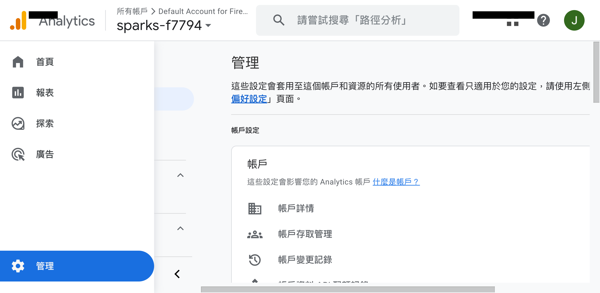
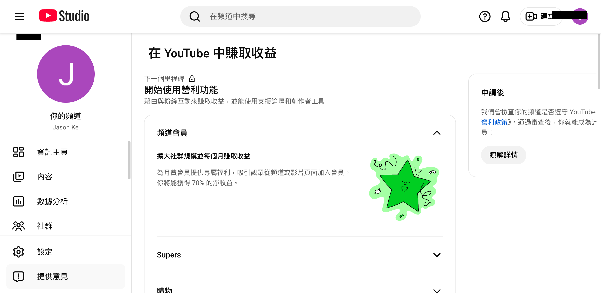
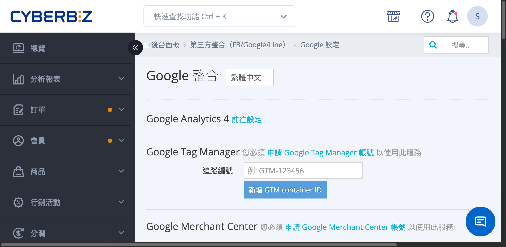

{ .subtitle }

{ .doc-badge }

{ .hero-page }

## 什麼是 YouTube Shopping

**YouTube Shopping** 是一項強大的功能，允許商家在 YouTube 影片、直播及短影音中植入官網商品資訊與連結，藉此增加商品曝光並促進流量變現。[瞭解更多 :lucide-external-link:](https://support.google.com/youtube/answer/12257682?hl=zh-Hant)

## YouTube Shopping 設定流程

## **第一階段：帳號建立與後台綁定**

在申請 YouTube Shopping 之前，必須先完成 Google 兩大工具的串接。

-   :lucide-tags:{ .lg .middle } __建立並驗證 GMC 帳號__

    ---

    進入 Google Merchant Center (GMC) 完成商家基本資訊設定，並確認商店所有權完成驗證。

    [:lucide-arrow-right: 設定教學](設定 Google Merchant Center 並同步 CYBERBIZ 商品.md){ data-preview }    

-   :lucide-chart-no-axes-column-increasing:{ .lg .middle } __建立並串接 GA4 帳號__

    ---

    在 Google Analytics 後台取得 「評估 ID」，前往 CYBERBIZ 後台填入評估 ID 完成串接。

    [:lucide-arrow-right: 設定教學](ga/建立並串接 Google Analytics.md){ data-preview }

## **第二階段：YPP 資格申請**

商家頻道必須具備 [**YouTube 合作夥伴計畫 (YPP)** :lucide-external-link:](https://support.google.com/youtube/answer/72851?hl=zh-Hant&ref_topic=9153642) 的營利資格才能開啟購物功能。

1.  **確認資格**：登入 [YouTube Studio :lucide-external-link:](https://studio.youtube.com/)，點選左側選單的「營利」。若顯示綠色星星，代表尚未擁有資格。

    { .screenshot }

2.  **線上申請**：當訂閱人數達 1,000 人且觀看時數達 4,000 小時（或 Shorts 觀看次數達 1,000 萬次）時，即可直接透過 YouTube Studio 申請 YPP 資格。資格與申請詳情，請參考[官方說明 :lucide-external-link:](https://support.google.com/youtube/answer/72851?hl=zh-hk&co=GENIE.Platform%3DDesktop)。
3.  **完成 AdSense 驗證**：申請通過後，在 YouTube Studio 後台點選「收取款項」並開始使用，填寫個人資訊以完成 AdSense 註冊。[瞭解詳情 :lucide-external-link:](https://support.google.com/youtube/answer/11602441?hl=zh-Hant&ref_topic=11449917&sjid=3703724191269892924-NC)。

## **第三階段：申請與連結商店**

當上述帳號與資格皆準備完成後，即可進行最後的連結步驟。

1.  **連結 GMC 與 GA4**：進入 GA4 後台搜尋「GMC」，選取對應的 Merchant Center 帳號進行連結，並確認 GMC 內的「自動標記功能」已開啟。

    { .screenshot }

2.  **連結 YouTube 頻道與官網**：進入 YouTube Studio 的「營利」→「購物」分頁，點選「連結商店」，並選擇「其他商店」後指定您的 GMC 帳號。

    { .screenshot }

3.  **上傳產品動態饋給 (Product Feed)**：
    *   從 CYBERBIZ 後台複製「**產品動態饋給連結**」（路徑：第三方整合 > 谷歌 Google 設定 > Google Merchant Center）。
    *   至 GMC 後台的「產品」→「添加商品」→「透過文件添加商品」，貼入連結並完成語系與國家設定。

    { .screenshot }

    { .screenshot }

## **維護與成效追蹤**

*   **商品自動下架機制**：若動態饋給上的商品資訊**超過 30 天**未在 GMC 更新，將會從 YouTube 自動下架。建議商家**每 28 天**操作一次更新以維持狀態。
*   **成效追蹤**：您可以在 GA4 的「探索」功能中，利用維度「工作階段手動字詞」來篩選開頭為 **「UC」** 的數據，即可查看來自 YouTube Shopping 的導購訂單與總收益。

## **直播小秘訣**

在 YouTube 直播時，商家可以預先安排直播時間並產出網址進行宣傳。直播進行中，建議利用 **「直播置頂」** 功能，將預先建立好的商品頁面（如一頁式商店）網址釘選在留言區，讓消費者能更直觀地選購商品。

## 後續操作

- :lucide-import:{ .lg }
  [____]()
  。

- :lucide-ban:{ .lg }
  [____]()
  。

## 常見問題

??? quote ""

