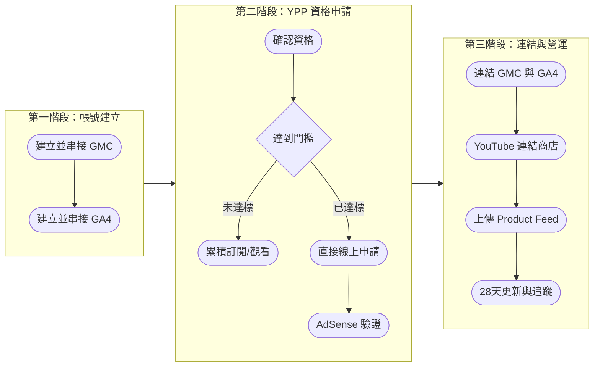
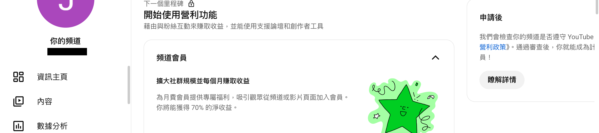
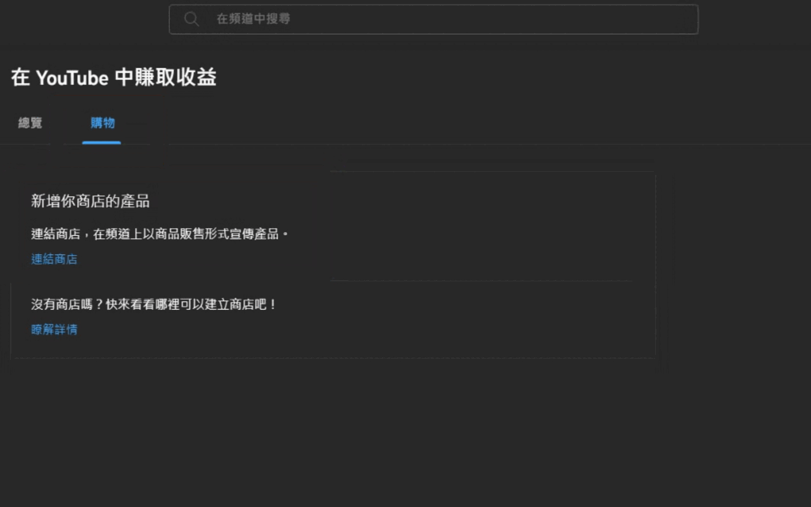
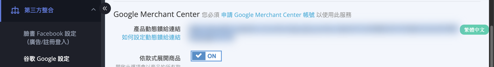
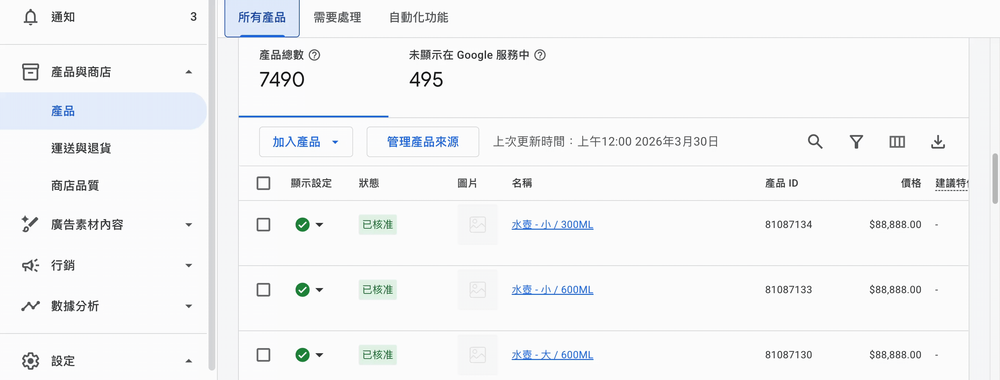
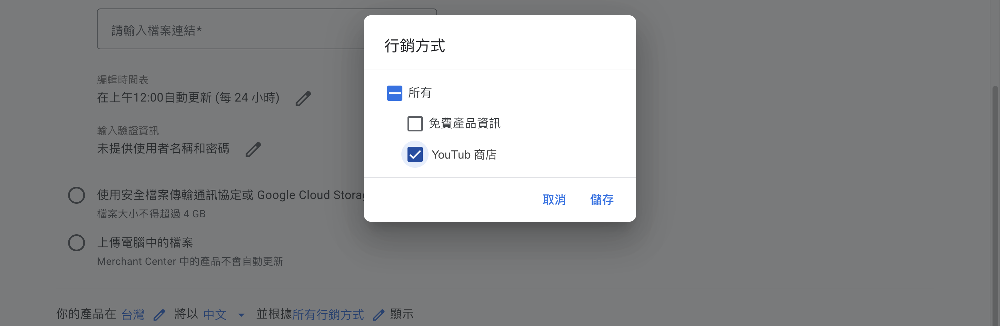
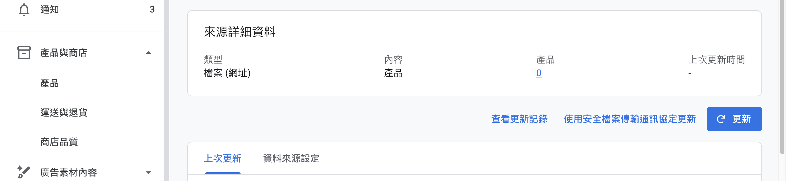

透過 YouTube Shopping 在影片、直播、短影音中植入商品資訊與連結，提升商品曝光與流量變現。
{ .subtitle }

## 什麼是 YouTube Shopping

**YouTube Shopping** 可在 YouTube 影片、直播、短影音中植入官網商品資訊與連結。商家若有製作影片、經營 YouTube 頻道、在 YouTube 直播，可進一步設定以增加商品曝光、促進流量變現。[瞭解更多 :lucide-external-link:](https://support.google.com/youtube/answer/12257682?hl=zh-Hant)

!!! warning "適用對象"
    YouTube Shopping 為 **YouTube 合作夥伴計畫 (YPP)** 功能，適用於已有 YouTube 頻道並達到營利門檻（訂閱 1,000 人 + 觀看時數 4,000 小時）的創作者。

## YouTube Shopping 設定流程

## **第一階段：帳號建立與後台綁定**

在申請 YouTube Shopping 之前，必須先完成 Google 兩大工具的串接。

-   :lucide-tags:{ .lg .middle } __建立並驗證 GMC 帳號__

    ---

    進入 Google Merchant Center (GMC) 完成商家基本資訊設定，並確認商店所有權完成驗證。

    [:lucide-arrow-right: 設定教學](設定 Google Merchant Center 並同步 CYBERBIZ 商品.md){ data-preview }    

-   :lucide-chart-no-axes-column-increasing:{ .lg .middle } __建立並串接 GA4 帳號__

    ---

    在 Google Analytics 後台取得 「評估 ID」，前往 CYBERBIZ 後台填入評估 ID 完成串接。

    [:lucide-arrow-right: 設定教學](ga/建立並串接 Google Analytics.md){ data-preview }

## **第二階段：YPP 資格申請**

商家頻道必須具備 [**YouTube 合作夥伴計畫 (YPP)** :lucide-external-link:](https://support.google.com/youtube/answer/72851?hl=zh-Hant&ref_topic=9153642) 的營利資格才能開啟購物功能。

1.  **確認資格**：登入 [YouTube Studio :lucide-external-link:](https://studio.youtube.com/)，點選左側選單的「營利」。若顯示綠色星星，代表尚未擁有資格。

    { .screenshot }

2.  **線上申請**：當訂閱人數達 1,000 人且觀看時數達 4,000 小時（或 Shorts 觀看次數達 1,000 萬次）時，即可直接透過 YouTube Studio 申請 YPP 資格。資格與申請詳情，請參考[官方說明 :lucide-external-link:](https://support.google.com/youtube/answer/72851?hl=zh-hk&co=GENIE.Platform%3DDesktop)。
3.  **完成 AdSense 驗證**：申請通過後，在 YouTube Studio 後台點選「收取款項」並開始使用，填寫個人資訊以完成 AdSense 註冊。[瞭解詳情 :lucide-external-link:](https://support.google.com/youtube/answer/11602441?hl=zh-Hant&ref_topic=11449917&sjid=3703724191269892924-NC)。

## **第三階段：申請與連結商店**

當上述帳號與資格皆準備完成後，即可進行最後的連結步驟。

1.  **連結 GMC 與 GA4**：在 Merchant Center 設定中啟用自動標記，並將 [GA4 連結至 Merchant Center](設定%20GMC%20重要事件來源追蹤與自動標記.md#將-ga4-連結至-merchant-center){ data-preview }。
2.  **連結 YouTube 頻道與官網**：進入 [YouTube Studio :lucide-external-link:](https://studio.youtube.com/) 的「營利」>「購物」分頁，點選「連結商店」，並選擇「其他商店」後指定您的 GMC 帳號。設定詳情，看參考[官方說明 :lucide-external-link:](https://support.google.com/youtube/answer/12258186?sjid=15941351074417695736-NC#)

    { .screenshot }

3.  **上傳產品動態饋給 (Product Feed)**：
    - **獲取連結**：登入 CYBERBIZ 管理後台，前往 第三方整合 > 谷歌 Google 設定 > Google Merchant Center，複製「產品動態饋給連結」。

        

    - **匯入 GMC**：進入 GMC 後台，依序點擊 產品 > 所有產品 > 加入產品 > 新增其他產品來源，並貼入剛才複製的連結。

        

    - **啟用 YouTube 目的地**：在「行銷方式」設定中，務必勾選 YouTube 商店，並點擊儲存以確保商品能同步至 YouTube 平台。

        
     
    - **完成與手動更新**：點擊「繼續」完成設定。進入來源詳情頁面後，點擊「更新」可強制系統抓取最新商品資訊。

        

        !!! warning "商品自動下架機制"
            若動態饋給上的商品資訊 **超過 30 天** 未在 GMC 更新，將會從 YouTube 自動下架。建議商家 **每 28 天** 操作一次更新以維持狀態。

## 追蹤 YouTube Shopping 成效

透過 GA4 探索功能追蹤 YouTube Shopping 帶來的網站轉換成效。

1.  **建立新報告**：在 GA4 後台左側選單點選「探索」，點選「空白」。

2.  **加入總收益/工作階段指標**：點選「指標」>「收益」> 勾選「總收益」以及「工作階段」> 勾選「工作階段」，並點擊確認。

    

3.  **加入維度**：點選「維度」>「流量來源」> 勾選「工作階段手動字詞」> 「確認」。

    

4.  **設定篩選條件**：
    - 「列」加入「工作階段手動字詞」
    - 「值」加入「工作階段」
    - 「值」加入「總收益」
    - 「篩選器」加入「工作階段手動字詞」，條件設定為「開頭為」「UC」

    

6.  **設定期間**：點擊日期選單，可選擇時間區間查看指定時段資料。

    

## **直播小秘訣**

在 YouTube 直播時，商家可以預先安排直播時間並產出網址進行宣傳。直播進行中，建議利用 **「直播置頂」** 功能，將預先建立好的商品頁面（如一頁式商店）網址釘選在留言區，讓消費者能更直觀地選購商品。

## 後續操作

- :lucide-play:{ .lg }   
  [__在影片內容中標記產品__:lucide-external-link:](https://support.google.com/youtube/answer/10191533)  
  在上傳的 YouTube 影片中標記商品，讓觀眾可直接點擊購買。

- :lucide-video:{ .lg }   
  [__在直播中標記產品__:lucide-external-link:](https://support.google.com/youtube/answer/12299016)  
  在 YouTube 直播時即時標記商品，即時推廣產品。

- :lucide-megaphone:{ .lg }   
  [__直播購物宣傳技巧__:lucide-external-link:](https://support.google.com/merchants/answer/12375318)  
  透過 YouTube 直播購物功能宣傳產品的最佳實踐與技巧。

## 常見問題

??? quote "申請 YouTube Shopping 需要什麼資格？"

    YouTube Shopping 為 **YouTube 合作夥伴計畫 (YPP)** 功能。商家需擁有 YouTube 頻道，並達到營利門檻（訂閱 1,000 人 + 觀看時數 4,000 小時，或 Shorts 觀看次數達 1,000 萬次）才能申請。

??? quote "如何將 CYBERBIZ 商品同步到 YouTube？"

    請依序執行以下步驟：

    1. 在 CYBERBIZ 後台取得「產品動態饋給連結」（第三方整合 > 谷歌 Google 設定 > Google Merchant Center）。
    2. 進入 GMC 後台，加入產品來源並貼入連結。
    3. 在「行銷方式」中勾選 YouTube 商店並儲存。

??? quote "商品為什麼會從 YouTube 自動下架？"

    若動態饋給上的商品資訊 **超過 30 天** 未在 GMC 更新，將會從 YouTube 自動下架。建議商家 **每 28 天** 操作一次更新以維持狀態。

