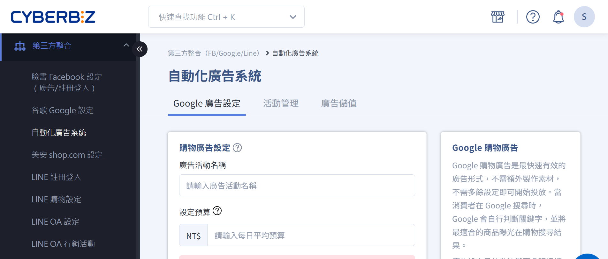
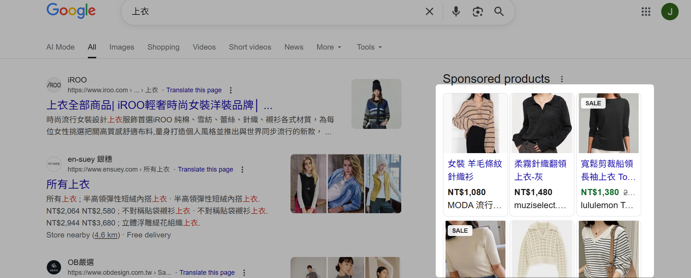
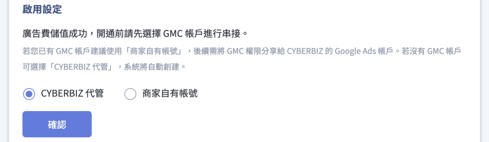
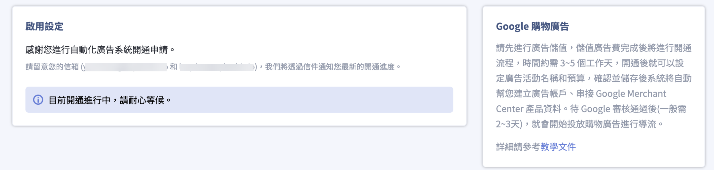
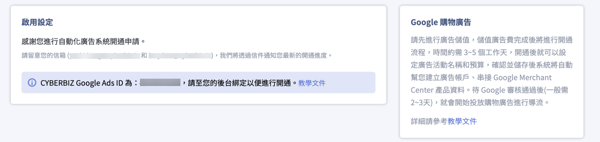
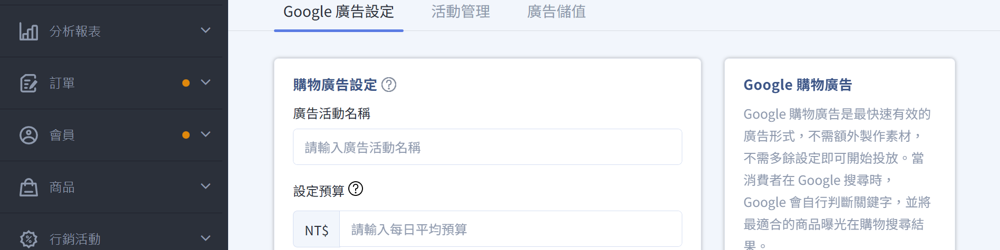
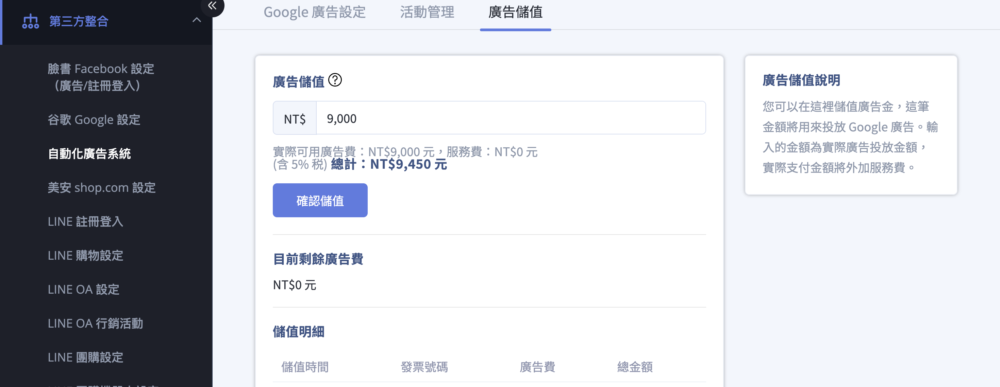
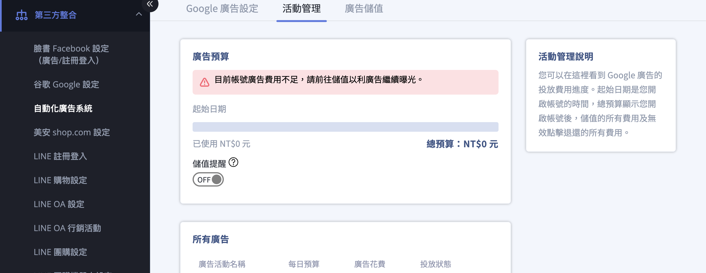

{ .hero-page }

## 自動化廣告介紹 { #intro-automated-ads }

**自動化廣告系統** 主要串接 **Google 購物廣告**，商家無需自行製作廣告素材，系統會自動將官網商品資訊同步至 Google，讓商品在相關關鍵字的搜尋結果中以圖卡形式曝光，藉此導入精準流量並促成購買。

??? example "Google 購物廣告效果" 
    1. 當顧客在 Google 搜尋關鍵字時，若 Google 判斷該關鍵字與您的商品相關，商品就會以圖卡形式出現在搜尋結果頁。
    2. 顧客點擊廣告後，進入商品頁完成購物。

    

## 頁面功能總覽 { #overview-automated-ads }

開通後，自動化廣告系統提供三個頁籤：

| 頁籤 | 用途 |
| :-- | :-- |
| [Google 廣告設定](#operate-automated-ads-campaign) | 設定廣告活動名稱、每日預算，並控制投放狀態(暫停/恢復) |
| [活動管理](#operate-automated-ads-manage) | 查看廣告預算進度、所有廣告花費，並設定儲值提醒 |
| [廣告儲值](#operate-automated-ads-charge) | 儲值廣告費、查看目前剩餘廣告費與儲值明細 |

## 使用前提與限制 { #prerequisites-automated-ads }

- [x] **公司聯絡資訊**：開通前須至 **「一般設定」** 填妥[公司聯絡資訊](../../website-management/setup-store-basic-info.md#operate-general-preferences-company-info){ title="設定網站基本資訊" }，否則無法完成 GMC 串接。
- [x] **GMC 帳號**：須選擇 **「CYBERBIZ 代管」** 或提供 **「商家自有帳號」**，二擇一進行串接。

## 計費規則 { #pricing-automated-ads }

| 項目 | 規則 |
| :-- | :-- |
| 最低儲值金額 | 首次申請開通時，廣告費最低儲值 $9,000 |
| 服務費 | 首次儲值免服務費；開通後每次儲值收取 5% 服務費[^fee] |
| 每日預算建議 | 建議每日不低於 300 元，行銷檔期可調高 2~4 倍 |

[^fee]: 開通後每次儲值收取 5% 服務費。以信用卡儲值另加收 2.5% 刷卡手續費。

## 操作步驟 { #operate-automated-ads }

### 申請開通與首次儲值 { #operate-automated-ads-apply }

1. **進入頁面**：前往後台，點選 <strong class="inline-path">第三方整合 > 自動化廣告系統</strong>。
2. **申請開通**：於頁面點擊 **「申請開通」**，進入啟用設定。
3. **完成首次儲值**：依畫面輸入廣告費金額，完成付款。首次儲值 **免服務費**。
4. **等待開通**：儲值成功後系統開始開通流程，約需 3~5 個工作天，完成後將以 email 通知您。

---

### 選擇 GMC 串接方式 { #operate-automated-ads-gmc }

首次儲值成功後，系統會請您選擇 Google Merchant Center(GMC)帳號的串接方式。同一個網站只能聲明一個 GMC 擁有權，請選定後勿任意更換。

=== "CYBERBIZ 代管(適合新手)"
    !!! tip "選擇 CYBERBIZ 代管，若廣告投放異常可由系統端快速排查，不需自行操作。"

    適合尚未擁有 GMC 帳號的商家，由 CYBERBIZ 自動建立並代為管理。

    1. 於 GMC 串接方式選擇 **「CYBERBIZ 代管」**。
    2. 若畫面提示網站所有權已被聲明，點擊 **「確認」** 繼續(點 **「返回」** 可改選自有帳號)。
    3. CYBERBIZ 會進行 GMC 聲明權轉移，請耐心等待開通。

    

    !!! warning "選擇 CYBERBIZ 代管後，請勿自行另外申請 GMC 帳號，以免廣告投放異常。代管帳號無法自行登入查看 GMC 數據。"

=== "商家自有帳號"
    適合已擁有 GMC 帳號的商家。

    1. 於 GMC 串接方式選擇 **「商家自有帳號」**。
    2. 輸入您的 GMC 帳號(GMC 後台右上角的九位數編號)。(參考 [GMC 串接設定指南](setup-google-merchant-center.md){ title="設定 Google Merchant Center 並同步 CYBERBIZ 商品" })
    3. 依畫面提示，至 GMC 後台將權限分享給 CYBERBIZ 的 Google Ads 帳號，完成 Google Ads ID 綁定。

    

    !!! info "系統每日定時檢查綁定狀態，綁定完成後即自動開通。"

---

### 設定 Google 廣告活動 { #operate-automated-ads-campaign }

開通完成後，進入 **「Google 廣告設定」** 頁籤設定您的購物廣告活動：

1. **輸入廣告活動名稱**：於 **「廣告活動名稱」** 欄位填入活動名稱。
2. **設定每日預算**：於 **「設定預算」** 欄位輸入每日平均預算(建議每日不低於 300 元[^budget])。
3. **確認並儲存**：點擊 **「確認並儲存」**，系統將自動建立廣告帳戶並串接 GMC 商品資料。待 Google 審核通過(約 2~3 天)即開始投放。
4. **調整投放狀態**：於 **「購物廣告投放狀態」** 區塊，可隨時點擊 **「暫停投放」** 或 **「恢復投放」** 控制[廣告投放狀態](../references/automated-ads-statuses.md#automated-ads-delivery-status){ data-preview }。

[^budget]: 行銷活動檔期建議將每日預算調高 2~4 倍，讓廣告發揮加乘效果。

---

### 廣告儲值 { #operate-automated-ads-charge }

廣告費用完前記得儲值，避免廣告被暫停：

1. 進入 **「廣告儲值」** 頁籤，查看 **「目前剩餘廣告費」**。
2. 輸入儲值金額(系統會顯示實際可用廣告費與服務費)，點擊 **「確認儲值」**。(點擊後會跳出視窗提供資訊填寫)
3. 完成付款後，發票將自動寄送至您的電子信箱，儲值紀錄顯示於 **「儲值明細」**。

---

### 查看成效與設定儲值提醒 { #operate-automated-ads-manage }

於 **「活動管理」** 頁籤掌握廣告花費與預算：

1. **查看廣告預算**：**「廣告預算」** 區塊顯示起始日期、已使用金額與總預算。
2. **查看所有廣告**：**「所有廣告」** 列表呈現每筆廣告的每日預算、廣告花費與投放狀態。
3. **設定儲值提醒**：於 **「儲值提醒」** 設定預算使用比例，當花費超過該比例時，系統會通知您儘快儲值。

## 重要規範與限制 { #specs-automated-ads }

!!! warning "同一個網站只能聲明一個 GMC 擁有權，請勿重複申請或任意更換，以免廣告投放發生錯誤。如需變更已串接的 GMC 來源，請聯繫客服。"

商品資訊就是廣告內容，請遵守以下規範以利通過 Google 審核：

- [x] **商品圖片**：不可包含宣傳文字、標語或品牌浮水印，請使用[純淨商品圖](../../products/create-and-manage/create-update-products.md#gmc-picture-specs)。[瞭解 GMC 圖片規範 :lucide-external-link:](https://support.google.com/merchants/answer/6324350#Image_guidelines)
- [x] **商品名稱**：須清楚並包含品牌、規格(尺寸、顏色、型號)等關鍵資訊。
- [x] **禁止商品**：不可投放成人內容、酒精飲料、受版權保護內容、賭博及未經核可的醫藥補給品。[瞭解禁止的內容 :lucide-external-link:](https://support.google.com/merchants/answer/6149970?hl=zh-Hant#con)

## 後續操作 { #next-steps-automated-ads }

- :lucide-chart-column-increasing:{ .lg }  
  [__廣告分析指南__](../../business-intelligence/ad-analytics-guide.md)  
  於「廣告分析報表」查看 Google 購物廣告的即時成效數據。

- :lucide-store:{ .lg }  
  [__GMC 串接設定__](setup-google-merchant-center.md)  
  設定 Google Merchant Center 並同步 CYBERBIZ 商品資料。

## 常見問題 { #faq-automated-ads }

??? quote "申請開通後，多久才能開始投放？"
    { #faq-automated-ads-activation-time }
    儲值成功後，開通約需 3~5 個工作天，完成後會以 email 通知您。完成廣告設定並儲存後，還需待 Google 審核通過(約 2~3 天)才會開始投放。

??? quote "為什麼廣告開始投放後，都還沒有看到廣告數據？"
    - Google 廣告審核需要約 3~5 天的時間，廣告審核通過後廣告會自動開跑，請您耐心等候。（如您的廣告一直沒有開始投放，請聯繫客服）
    - 如果您是使用自己的 GMC 帳號，請進入您的 GMC 帳號後台行檢查。 
	
        1. 至左側 **產品 > 診斷** 確認有效的商品項目是否有成功上傳產品。
        2. 至左側 **產品 > 動態饋給** 確認新增產品方式有無誤。可參考 [GMC 串接設定](setup-google-merchant-center.md){ title="設定 Google Merchant Center 並同步 CYBERBIZ 商品" }
        3. 至左側 **成長 > 管理計畫 > 購物廣告**，點選 **開始使用/修正未完成的內容**。並且確認購物廣告計畫裡面的項目 *除了*  **新增帳單詳細資料** 與 **建立廣告活動** 外，其他項目皆是打勾狀態。

??? quote "每日廣告預算應該設定多少？"
    { #faq-automated-ads-budget }
    建議每日預算最低不少於 300 元。若有行銷活動的規劃，建議在活動檔期將預算調高 2~4 倍，讓廣告發揮加乘效果。

??? quote "為什麼有些天數的廣告花費會超過每日預算？"
    { #faq-automated-ads-overspend }
    Google 會依每日流量變化與當月累積花費為您的支出最佳化，單日最高可達預算的兩倍，但整月花費不會超過「每日預算 × 30.4」。詳情請見 [Google 說明文件 :lucide-external-link:](https://support.google.com/google-ads/answer/1704443)。

??? quote "廣告儲值金有使用期限嗎？"
    { #faq-automated-ads-expiry }
    無使用效期，但請留意剩餘廣告費，避免因餘額不足導致廣告被暫停。可於 **「儲值提醒」** 設定預算使用比例通知。

??? quote "可以使用我自己的 Google Ads 帳號嗎？"
    { #faq-automated-ads-own-ads }
    不行。使用自動化廣告系統時，CYBERBIZ 會為您建立專屬的廣告帳戶。

??? quote "可以使用我自己的 GMC 帳號嗎？"
    { #faq-automated-ads-own-gmc }
    可以。選擇 **「商家自有帳號」** 即可，後續需將 GMC 權限分享給 CYBERBIZ 的 Google Ads 帳號完成綁定。

## 參考資料 { #reference-automated-ads }

- [廣告投放與開通狀態對照表](../references/automated-ads-statuses.md)
- [Google 購物廣告政策(官方說明) :lucide-external-link:](https://support.google.com/merchants/answer/6149970?hl=zh-Hant)

<!---->
<!-- --- -->
<!---->
<!-- ## 自動化廣告系統說明 -->
<!---->
<!-- **自動化廣告系統** 主要串接 **Google 購物廣告**，其核心優勢在於商家無需額外製作廣告素材，系統會自動將官網商品資訊同步至 Google，讓產品在相關關鍵字搜尋結果中以圖卡形式曝光，藉此導入精準流量並促成購買。 -->
<!---->
<!-- ### Google 購物廣告效果 -->
<!---->
<!-- 1. 當有人在 Google 搜尋關鍵字時，若 Google 判斷該關鍵字跟您的產品相關 ，您的產品就會以產品圖卡的方式出現在搜尋結果頁。   -->
<!-- 2. 使用者點擊廣告後，進入產品頁進行購物。  -->
<!---->
<!--  -->
<!---->
<!-- ## 申請開通步驟 -->
<!---->
<!-- 1.  **進入路徑**：前往管理後台，點選 <strong class="inline-path">第三方整合 > 自動化廣告系統</strong>。 -->
<!-- 2.  **執行開通**：點擊「申請開通」按鈕，並完成 **廣告金儲值** 以啟動後續設定。完成儲值後，回到設定頁面進行下一步驟。 -->
<!---->
<!--      -->
<!---->
<!--     !!! info "首次儲值免服務費，從第二次儲值開始將收取 5% 服務費。" -->
<!---->
<!-- 3.  **選擇 Google Merchant Center (GMC) 串接方式**： -->
<!--     *   [**建立 CYBERBIZ 代管 GMC 帳號**](#cyberbiz-代管)：適合新手，若投放異常由系統端快速排查，但商家無法自行登入該 GMC 查看數據。 -->
<!--     *   [**串接商家原本的 GMC 帳號**](#商家自有帳號)：需手動輸入自有 GMC 編號，並依照教學完成 Google Ads ID 綁定動作。 -->
<!---->
<!--      -->
<!---->
<!--     !!! warning "同一個網站只能聲明一個 GMC 擁有權，請勿隨意更換或重複申請，以免廣告錯誤。" -->
<!---->
<!-- --- -->
<!---->
<!-- #### CYBERBIZ 代管 -->
<!---->
<!-- 1. 啟用設定：點選 **CYBERBIZ 代管**。   -->
<!-- 2. 若顯示 **網站所有權已被聲明** 提示，點擊 **確認** 繼續。點 **返回** 可改使用商家自有帳號。   -->
<!-- 3. CYBERBIZ 會進行後續 GMC 聲明權轉移，請商家稍待開通。  -->
<!---->
<!--  -->
<!---->
<!-- !!! warning "建立 CYBERBIZ 代管 GMC 帳號後，請勿自行另外申請 GMC 帳號，以免廣告投放異常。" -->
<!-- --- -->
<!---->
<!-- #### 商家自有帳號 -->
<!---->
<!-- 1.  啟用設定：點選 **商家自有帳號**。 -->
<!-- 2.  GMC 帳戶：輸入商家的自有 GMC 帳號 ( 為一串九位數代碼，可至 GMC 後台右上角查看 )。如尚未建立 GMC，請參考 [GMC 串接設定指南](設定 Google Merchant Center 並同步 CYBERBI](setup-google-merchant-center.md)CYBERBIZ 商品" }。 -->
<!-- 3. 根據後台提示至 GMC 後台進行 Google Ads ID 綁定動作。 -->
<!---->
<!--  -->
<!---->
<!-- !!! info "系統將每日定時檢查商家是否綁定完成，綁定完成即開通。" -->
<!---->
<!-- ## 廣告與儲值設定 -->
<!---->
<!-- 自動化廣告系統目前支援 Google 購物廣告活動。[系統開通後](#申請開通步驟)，從以下路徑進行相關設定： -->
<!---->
<!-- 1. 登入 CYBERBIZ 管理後台，前往 **第三方整合 > 自動化廣告系統。** -->
<!-- 2. 依序設定相關頁籤：[Google 廣告設定](#google-廣告設定)、[活動管理](#活動管理)、[廣告儲值](#廣告儲值)。 -->
<!---->
<!-- ### Google 廣告設定   -->
<!---->
<!-- 開通後可於該頁面自訂「廣告活動名稱」、設定「每日平均預算」，並可隨時切換「投放狀態」（開啟或關閉）。 -->
<!---->
<!-- - 廣告活動名稱：輸入廣告活動的名稱。 -->
<!-- - 預算：每日廣告預算。如有行銷活動的規劃，建議您可以在活動檔期間將預算調高 2~4 倍，讓廣告發揮加乘效果。 -->
<!-- - 投放狀態：選擇開啟/關閉廣告活動。 -->
<!---->
<!--  -->
<!---->
<!-- --- -->
<!---->
<!-- ### 活動管理   -->
<!---->
<!-- 查看預算花費進度。   -->
<!---->
<!-- - 廣告預算：查看廣告預算。 -->
<!-- - 所有廣告：查看廣告設定資訊。 -->
<!---->
<!--  -->
<!---->
<!-- --- -->
<!---->
<!-- ### 廣告儲值   -->
<!---->
<!-- - 進行廣告金儲值。  -->
<!-- - 儲值後，發票將自動寄送到您留的電子信箱。 -->
<!---->
<!-- !!! info "首次儲值免服務費，第二次開始服務費為 5%。" -->
<!---->
<!--  -->
<!---->
<!-- ## Google 廣告商品設定最佳做法 -->
<!---->
<!-- 商品資訊即是廣告內容，請務必遵守以下規範以確保審核通過： -->
<!---->
<!-- - [x] **商品圖片**：不可包含宣傳文字、標語或品牌浮水印，應使用[純淨商品圖](../../products/create-and-manage/新增單一商品.md#google-圖片規範){ data-preview }。[瞭解 GMC 圖片規範 :lucide-external-link:](https://support.google.com/merchants/answer/6324350#Image_guidelines) -->
<!-- - [x] **商品名稱**：必須清楚且包含品牌名、規格（尺寸、顏色、型號）等關鍵資訊。 -->
<!-- - [x] **禁止商品**：系統禁止投放成人內容、酒精飲料、受版權保護內容、賭博以及未經核可的醫藥補給品廣告。[瞭解 GMC 禁止的內容 :lucide-external-link:](https://support.google.com/merchants/answer/6149970?hl=zh-Hant#con) -->
<!-- ## 後續操作 -->
<!---->
<!-- 
 -->
<!---->
<!-- - :lucide-chart-column-increasing:{ .lg }    -->
<!--   ](../../business-intelligence/ad-analytics-guide.md)s/廣告分析指南.md){ title="廣告分析指南" }      -->
<!--   商家可至「廣告分析報表」中查看即時數據。 -->
<!---->
<!-- 
 -->
<!---->
<!-- ## 常見問題 -->
<!---->
<!-- ??? quote "申請開通後，需要多久才能開始投放？" -->
<!-- 	在後台申請開通廣告自動化系統後，約 3~5 個工作天即可開通，開通後會同步發 email 通知您 。 -->
<!---->
<!-- ??? quote "為什麼廣告開始投放後，都還沒有看到廣告數據？" -->
<!--     - Google 廣告審核需要約 3~5 天的時間，廣告審核通過後廣告會自動開跑，請您耐心等候。（如您的廣告一直沒有開始投放，請聯繫客服） -->
<!--     - 如果您是使用自己的 GMC 帳號，請進入您的 GMC 帳號後台行檢查。  -->
<!---->
<!--         1. 至左側 **產品 > 診斷** 確認有效的商品項目是否有成功上傳產品。 -->
<!--         2. 至左側 **產品 > 動態饋給** 確認新增產品方式有無誤。可參考 [GMC 串接設定](設定 Google Merchant Center 並同步 CYBERBIZ 商品.md){ tit](setup-google-merchant-center.md)} -->
<!--         3. 至左側 **成長 > 管理計畫 > 購物廣告**，點選 **開始使用/修正未完成的內容**。並且確認購物廣告計畫裡面的項目 *除了*  **新增帳單詳細資料** 與 **建立廣告活動** 外，其他項目皆是打勾狀態。 -->
<!---->
<!-- ??? quote "每日廣告預算應該怎麼設定？" -->
<!-- 	為了讓廣告跑出成效，建議每日預算最低不要少於 300 元。如果您有行銷活動的規劃，建議您可以在活動檔期間將預算調高 2~4 倍，讓廣告發揮加乘效果！ -->
<!---->
<!-- ??? quote "為什麼有些天數的廣告花費會超過每日預算？" -->
<!-- 	Google 會依據每日流量變化、截至目前的當月花費等因素，為您的支出進行最佳化，最高可達預算的兩倍。然而，整月的花費不會超過每日花費 x 30.4。詳情請見 [Google 說明文件 :lucide-external-link:](https://support.google.com/google-ads/answer/1704443) -->
<!---->
<!-- ??? quote "廣告儲值金要多久使用完畢？" -->
<!-- 	無使用效期，但記得查看廣告剩餘預算，避免廣告被暫停。 -->
<!---->
<!---->
<!-- ??? quote "可以使用我自己的 Google Ads 帳號嗎？" -->
<!-- 	不行。使用自動化廣告系統，CYBERBIZ 會為您建立專屬的廣告帳戶。 -->
<!---->
<!-- ??? quote "可以使用我自己的 GMC (Google Merchant Center) 帳號嗎？" -->
<!-- 	可以。若您想使用自己的 GMC 帳戶，須將自己的 GMC 權限分享給 CYBERBIZ 的 Google Ads 帳號。 -->
