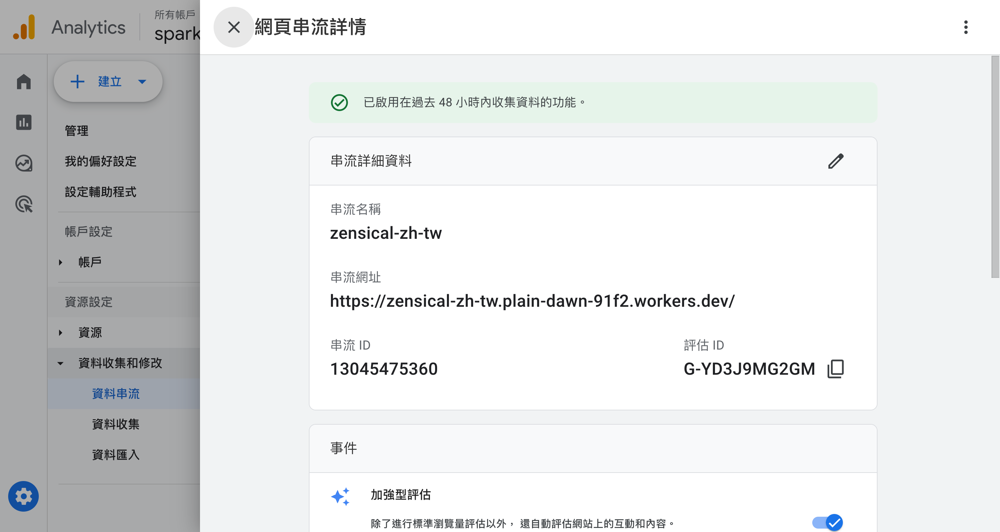

# 建立並串接 Google Analytics

{ .subtitle }

{ .doc-badge }

{ .hero-page }

## 什麼是 Google Analytics

Google Analytics (GA4) 是經營品牌網站必備的分析工具，能協助行銷人員追蹤流量與使用者行為。串接程序主要分為 **Google 後台帳號建立** 與 **官網後台編號填入** 兩大步驟。

## 建立 Google Analytics 帳號 (Google 端操作)

1.  **登入 GA 後台**：進入 [Google Analytics :lucide-external-link:](https://analytics.google.com/)，點擊「開始評估」。

2.  **設定帳戶與資源**：
    *   依序輸入「帳戶名稱」、「屬性名稱」。
    *   選擇產業類別、商家規模及業務目標，並勾選同意服務條款。

    { .screenshot }

3.  **設定資料收集來源**：
    *   在「資料收集」流程中選擇「**網站**」。
    *   輸入您的官網網址與網站名稱。
    *   此處建議開啟「加強型評估」，可自動記錄捲動、點擊、站內搜尋等行為。

    { .screenshot }

4.  **取得評估 ID**：
    *   設定完成後會進入「網站串流詳情」頁面，請複製以 `G-` 開頭的「**評估 ID**」。

    { .screenshot }

!!! info "詳細設定說明，可參考[官方說明 :lucide-external-link:](https://support.google.com/analytics/answer/9304153?hl=zh-Hant&ref_topic=14088998&sjid=385438859130631159-NC)。"

## 將 GA4 帳號串連至官網 (CYBERBIZ 後台操作)

!!! warning "注意事項"

    - 2022/12/27前開通的商家，需向後台客服視窗，申請開通 GA4 功能，並至 Google Analytics : 通用 GA 轉至 GA4完成設定。
    - 若版型過舊，將不支援使用GA4功能，若有需求之商家，請更新版型版本。

1.  **進入設定路徑**：前往管理後台，點選「**第三方整合**」>「**谷歌 Google 設定**」>「**Google 整合**」。

    { .screenshot }

2.  **填入編號**：
    *   於「Google Analytics 4」區域點選「前往設定」。
    *   將剛才複製的評估 ID 貼至「**GA4 tracking ID**」欄位中並儲存。
    *   *註：若您的版本較舊或尚未開通 GA4，需透過後台客服視窗申請開通。*

    { .screenshot }

## 如何查看是否安裝成功

1.  **測試行為**：開啟商店前台，隨意點擊商品並執行「**加入購物車**」動作。

    { .screenshot }

2.  **即時報表確認**：回到 GA4 後台，點擊側邊欄「報表」>「即時」或「即時總覽」，查看事件計數。若有出現數據變化，表示已成功串接。

    { .screenshot }

## 後續操作

為確保數據準確性，建議完成串接後進行以下調整：

- :lucide-import:{ .lg }   
  [__排除內部流量__](){ data-preview }     
  在 GA4 管理介面的「資料串流」中定義公司 IP，避免開發或行銷人員的瀏覽行為干擾分析。

- :lucide-ban:{ .lg }     
  [__列出不適用的參照連結__](){ data-preview }  
  將金物流服務商加入排除名單，以免轉換來源被誤判為第三方金流頁面。

- :lucide-ban:{ .lg }     
  [__延長資料保留期限__](){ data-preview }  
  GA4 預設資料僅保留 2 個月，建議至「資料收集與修改」>「資料保留」中手動改為 **14 個月**。
  
- :lucide-ban:{ .lg }     
  [__啟用 Google 信號__](){ data-preview }  
  開啟此功能可取得跨裝置的使用行為資料與更精確的使用者輪廓。

## 常見問題

??? quote ""

