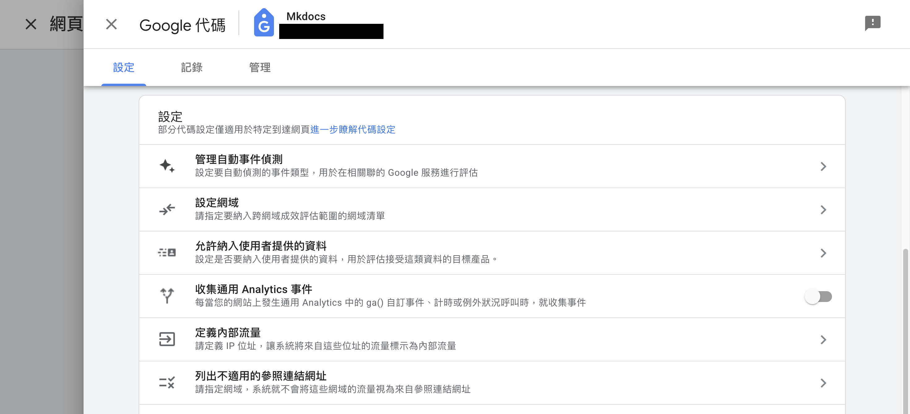
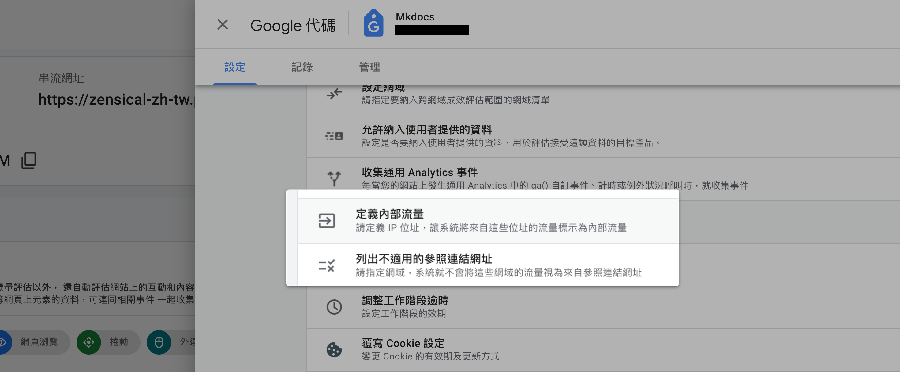
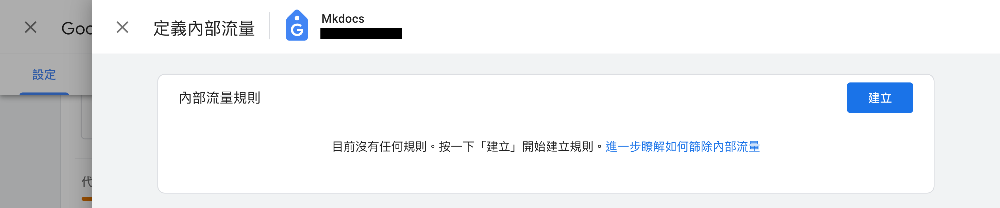
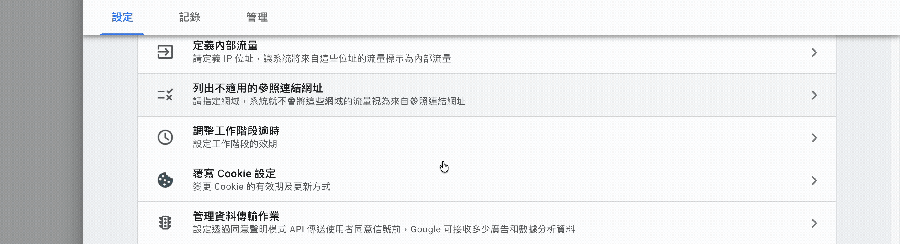

# 設定 GA4 排除內部流量與第三方參照來源

在 GA4 中設定排除公司內部 IP 流量，以及排除第三方金物流的參照連結，避免轉換來源被誤判。
{ .subtitle }

{ .hero-page }

## 排除內部與第三方流量說明

為了在 Google Analytics 4 (GA4) 中獲得準確的數據，排除公司內部人員產生的流量以及結帳流程中跳轉至第三方金物流網站的紀錄是非常重要的步驟，這能避免轉換來源被誤判，並提升流量評估的精確度。

## 進入 GA4 代碼設定頁面

在執行排除設定前，需先進入特定的代碼設定區域：

1.  進入 GA4 後台，點選左下角「管理」。
2.  依序進入「資源設定」>「資料收集和修改」>**「資料串流」**，點選與您官網綁定的串流。
3.  在串流詳情頁面，點選 **「進行代碼設定」**。
4.  在設定區塊點開 **「全部顯示」**，即可看到後續需要的進階設定功能。

{ .screenshot }

---

## 排除內部流量 (Internal Traffic)
內部流量是指開發、客服 or 行銷人員在操作官網時產生的瀏覽行為。排除這類流量可避免干擾訪客分析。

### Step 1. 定義內部流程 (IP 設定)

1.  在代碼設定頁面點選 **「定義內部流程」**，並點擊「建立」。
2.  設定「規則名稱」（如：公司辦公室）及輸入代表內部網路的 **「IP 位址」**（可同時新增多個）。

{ .screenshot }

---

### Step 2. 啟用資料篩選器

定義好 IP 後，必須啟用篩選器才會正式生效：

1.  回到 GA4 後台「管理」>「資源設定」>「資料收集和修改」>**「資料篩選器」**。
2.  點選系統預設好的 **Internal Traffic**。
3.  將「篩選器作業」設為「排除」，並將「篩選器狀態」改為 **「有效」** 後儲存。
4.  確認點選「啟用篩選器」完成設定。

{ .screenshot }

## 列出不適用的參照連結網址 (排除第三方網站)

當顧客跳轉至第三方金物流頁面（如綠界、LINE Pay、超商地圖）進行付款或選店時， GA4 常會將其誤判為新的推薦來源，導致工作階段中斷。

1.  在代碼設定頁面點選 **「列出不適用的參照連結網址」**。
2.  將常用的第三方金物流網址加入名單中。**建議排除的常見連結請見下方**。

| 分類 | 第三方服務商 | 建議排除連結 |
| :--- | :--- | :--- |
| **金流** | CYBERBIZPAY | `cyberbizpay.com` |
| **金流** | 綠界 | `pay.ecpay.com.tw`、`payment.ecpay.com.tw` |
| **金流** | 第三方支付 | `web-pay.line.me`、`onlinepay.jkopay.com` |
| **金流** | 藍新 | `core.newebpay.com` |
| **物流** | 7-11 | `ec.shopping7.com.tw`、`emap.pcsc.com.tw` |
| **物流** | 全家 | `mfme.map.com.tw`、`mfme2.map.com.tw` |
| **物流** | 萊爾富 | `ecmap.hilife.com.tw` |
| **物流** | 黑貓宅到店 | `appservice.ezcat.com.tw` |

---

## 重要提醒

*   **資料延遲**：完成設定後，GA4 可能需要 **24~48 小時** 處理資料，相關數據變化並非即時呈現。
*   **資料保留**：建議同步確認 GA4 的「資料保留」期限，建議手動由預設的 2 個月延長至 **14 個月**，以便進行長期趨勢分析。

## 常見問題

??? quote "為什麼需要排除第三方金物流的參照連結？"

    當顧客跳轉至第三方金物流頁面（如綠界、LINE Pay）進行付款或選店時，GA4 常會將其誤判為新的推薦來源，導致工作階段中斷並影響轉換歸因的準確度。

??? quote "設定完 IP 篩選器後，為什麼數據沒有立刻改變？"

    請檢查以下項目：

    - [x] 是否已在「資料篩選器」中將篩選器狀態改為 **「有效」**。
    - [x] GA4 資料處理約需 **24~48 小時**，設定後的數據變化並非即時呈現。
