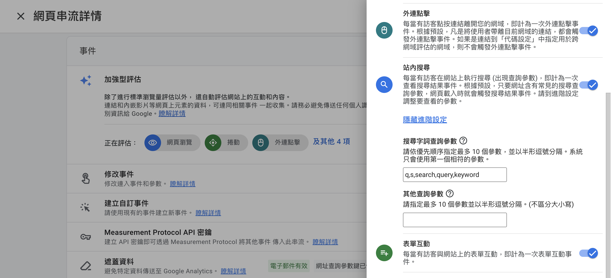
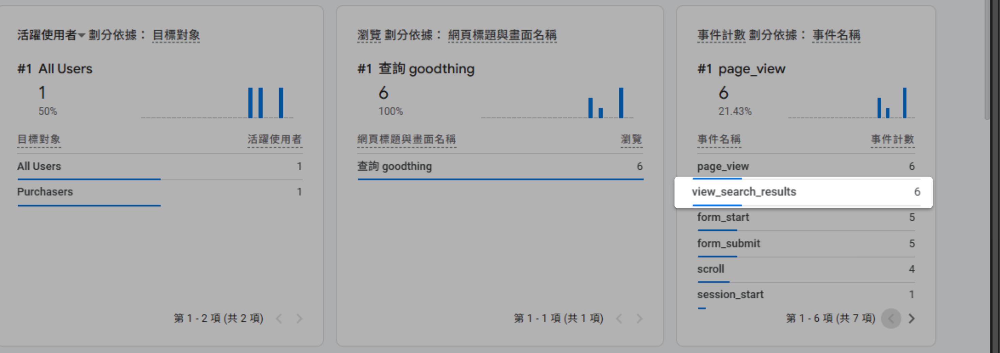
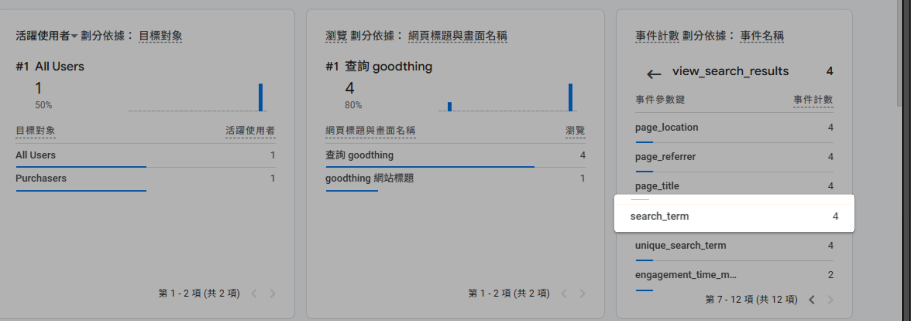

透過 GA4 加強型評估功能，追蹤使用者在官網上的站內搜尋行為，分析顧客的資訊需求與查找意圖。
{ .subtitle }

{ .hero-page }

## GA4 站內追蹤說明

開啟 **Google Analytics 4 (GA4)** 的站內搜尋追蹤功能，可以協助商家觀察使用者在網站上輸入的關鍵字，進而了解消費者的資訊需求與查找意圖。

## GA4 站內搜尋設定步驟

請登入您的 Google Analytics 後台，並依循以下路徑操作：

1.  **進入設定頁面**：點選左下角「管理」>「資源設定」>「資料收集和修改」>「**資料串流**」，並選擇您官網綁定的串流。
2.  **開啟加強型評估**：在「事件」區塊中找到「**加強型評估**」，點擊右側的齒輪圖示 :lucide-cog: 進入設定。
3.  **啟用站內搜尋**：找到「**站內搜尋**」項目並將開關開啟。
4.  **設定查詢參數**：點擊「**顯示進階設定**」，在「搜尋字詞查詢參數」欄位中輸入：`q,s,search,query,keyword`（請以半形逗號分隔），完成後儲存設定。

## 如何查看追蹤成果

設定完成後（且有使用者執行搜尋動作），您可以在 GA4 報表中查看結果：

1.  **即時報表檢視**：前往「報表」>「即時」或「即時總覽」，在「**事件計數**」區塊中尋找 `view_search_results` 事件。

    

2.  **查看關鍵字內容**：點擊 `view_search_results` 事件後，再點擊 `search_term` 參數，即可瀏覽使用者在官網上曾查詢過的 **關鍵字紀錄** 與搜尋次數。

    

!!! info "更多 GA4 追蹤事件資訊，請參考 [官方說明 :lucide-external-link:](https://support.google.com/analytics/answer/9322688?hl=zh-Hant#zippy=%2C%E5%8D%B3%E6%99%82%E5%A0%B1%E8%A1%A8%2Cdebugview-%E5%A0%B1%E8%A1%A8)。"

## 重要注意事項

*   **數據不回溯**：GA4 僅會從功能開啟後才開始記錄行為，無法追蹤串接或設定前的歷史紀錄。
*   **串接前提**：您的官網必須已正確串接 GA4 代碼（評估 ID），系統才能收集到數據。
*   **資料延遲**：若短時間內沒有人進行搜尋，該事件可能不會顯示資料；您可以自行在官網前台執行搜尋動作來進行測試。

## 常見問題

??? quote "設定完成後多久可以看到搜尋資料？"

    GA4 站內搜尋資料不會立即顯示，一般需要等待一段時間讓系統收集數據。若短時間內沒有使用者進行搜尋，該事件可能不會顯示資料。您可以自行在官網前台執行搜尋動作來加速測試。

??? quote "為什麼看不到搜尋關鍵字資料？"

    可能原因包括：

    - 官網尚未正確串接 GA4 代碼（評估 ID）
    - 功能剛設定完成，數據尚未開始收集（數據不回溯）
    - 該期間內沒有使用者執行搜尋動作

??? quote "可以追蹤哪些搜尋關鍵字？"

    只要使用者在官網前台輸入的搜尋關鍵字都會被記錄。您可以在 GA4 報表中點擊 `view_search_results` 事件，再查看 `search_term` 參數來瀏覽所有關鍵字紀錄與搜尋次數。

