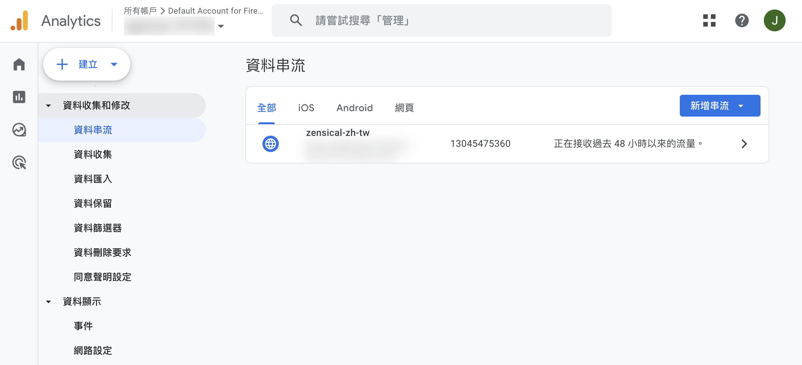
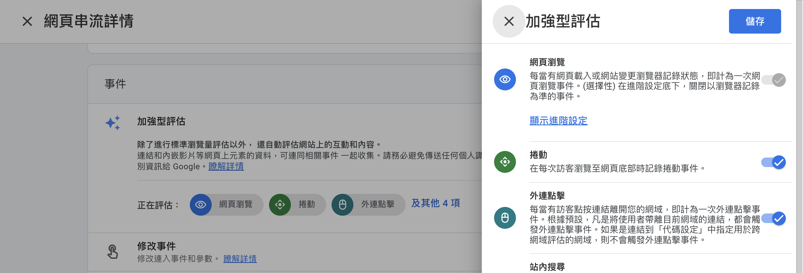
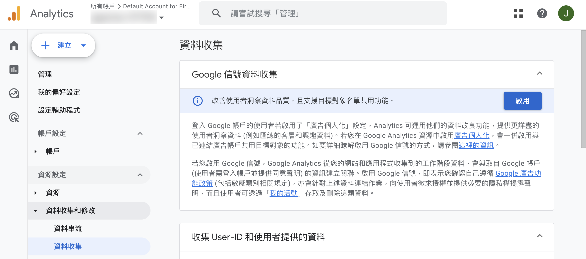
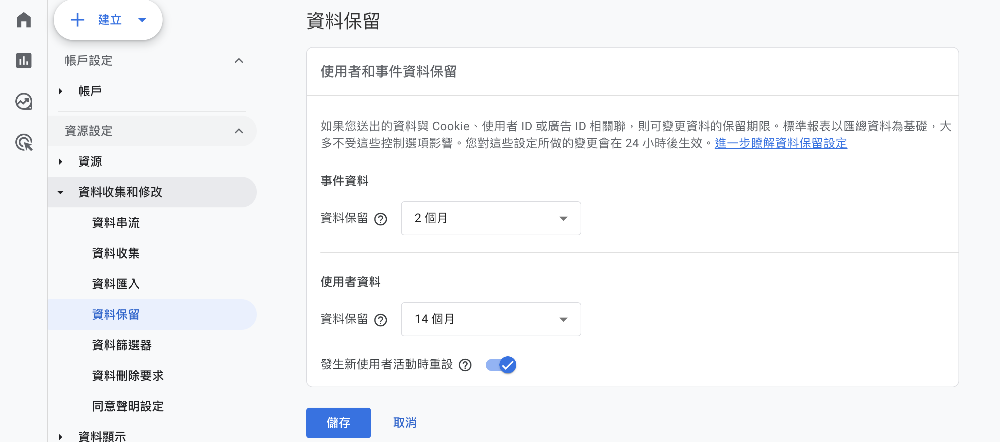
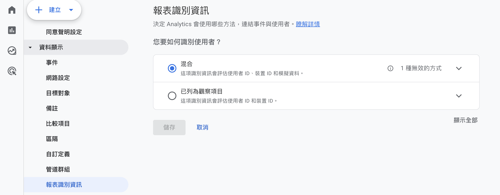

# 設定 Google Analytics 進階追蹤與資料分析

GA4 進階設定，包含加強型評估、Google 信號、資料保留期限調整及報表識別資訊設定，協助商家獲得更精確的流量數據與使用者輪廓。
{ .subtitle }

{ .hero-page }

## Google Analytics 進階資料分析說明

在完成 Google Analytics 4 (GA4) 與網站的基礎串接後，GA4 會開始記錄基本的流量資訊。若您希望深入分析網站流量與更精確的使用者輪廓，建議依照以下說明進行進階設定與調整。

## 加強型評估 (Enhanced Measurement)

這是 GA4 內建的自動追蹤功能，開啟後無需額外埋設程式碼，系統即可記錄使用者在網站上的多種互動行為。

*   **追蹤內容：** 包含網頁瀏覽、捲動頁面、點擊外部連結、站內搜尋、填寫表單、觀看影片及下載檔案。詳細追蹤事件說明，請參考[官方說明 :lucide-external-link:](https://support.google.com/analytics/answer/9216061?hl=zh-Hant&ref_topic=13367566&sjid=2617040479571463046-NC)。
*   **設定路徑：** 在 GA4 後台點選「管理」>「資料收集與修改」>「資料串流」> 選擇您的串流 >「事件」> 開啟「加強型評估」。

    

*   **進階設定：** 點擊齒輪圖示 :lucide-cog: 可依需求選擇要評估的特定事件。

    

## Google 信號 (Google Signals)

當使用者登入 Google 帳戶並開啟「廣告個人化」時，此功能可協助系統取得跨裝置、跨平台的使用行為資料，補足跨裝置的使用者視角。

*   **主要功能：** 性別、年齡、興趣等目標客群輪廓描繪，以及再行銷名單的建立。
*   **設定路徑：** 在 GA4 後台點選「管理」>「資源設定」>「資料收集與修改」>「資料收集」> 在「Google 信號資料收集」區域點擊「啟用」。

## 資料保留 (Data Retention)

GA4 預設的資料保留期限僅有 2 個月，對於需要觀察長期趨勢或建立再行銷名單的商家來說較為不足。

*   **建議調整：** 將資料保留期限延長至 **14 個月**。
*   **設定路徑：** 在 GA4 後台點選「管理」>「資源設定」>「資料收集與修改」>「資料保留」進行更改。

## 報表識別資訊 (Reporting Identity)

此技術可協助商家排除重複計算的使用者，例如同一位顧客先用手機瀏覽再用電腦下單，GA4 可將其辨識為同一使用者。

*   **常用模式：**
    *   **混合 (Mixed)：** 綜合所有可用訊號（User ID、Google 信號、裝置 ID），提供最完整的分析。
    *   **已列為觀察項目 (Observed)：** 僅使用實際觀察到的裝置資訊，報表結果較為保守貼近原始紀錄。
*   **設定路徑：** 在 GA4 後台點選「管理」>「資源設定」>「資料顯示」>「報表識別資訊」。

## 後續操作

- :lucide-funnel-x:{ .lg }   
  [__排除內部流量與不適用連結__](設定 GA4 排除內部流量與第三方參照來源.md){ data-preview }     
  為了避免數據偏差，建議排除公司內部人員的瀏覽紀錄以及外部金物流網址的干擾。

## 常見問題

??? quote "加強型評估 (Enhanced Measurement) 會追蹤哪些使用者行為？"

    開啟加強型評估後，系統會自動追蹤以下行為：

    - 網頁瀏覽
    - 捲動頁面
    - 點擊外部連結
    - 站內搜尋
    - 填寫表單
    - 觀看影片
    - 下載檔案

    這些都不需要額外埋設程式碼，系統會自動記錄。

??? quote "Google 信號 (Google Signals) 需要使用者登入 Google 帳戶嗎？"

    是的，Google 信號僅能在使用者登入 Google 帳戶並開啟「廣告個人化」時才能取得跨裝置資料。若使用者未登入或關閉廣告個人化，系統將無法追蹤其跨裝置行為。

??? quote "加強型評估與 Google 信號的功能差異為何？"

    雖然加強型評估與 Google 信號都能強化 GA4 的數據收集能力，但兩者的用途與資料來源有所不同，適用情境也不盡相同：

    | 功能 | 加強型評估 | Google 信號 |
    |------|------------|-------------|
    | 資料來源 | 網站本身的使用者互動行為 | 登入 Google 帳戶的使用者行為（跨裝置） |
    | 收集對象 | 所有訪客 | 登入 Google 並啟用廣告個人化設定的使用者 |
    | 收集內容 | 頁面瀏覽、捲動、搜尋、影片互動等行為 | 性別、年齡、興趣、裝置使用偏好、跨裝置互動 |
    | 使用情境 | 網站內容優化、使用者參與分析 | 跨裝置轉換追蹤、再行銷名單建立、目標客群輪廓描繪 |

    兩者可同時啟用，互為補充。加強型評估聚焦在「網站內互動」，而 Google 信號則補足「跨平台、跨裝置」的使用者視角。建議商家視行銷需求與隱私政策條款評估是否啟用 Google 信號。

??? quote "GA4 資料保留期限最長可以設定多久？"

    GA4 預設的資料保留期限為 2 個月，若需要觀察長期趨勢或建立再行銷名單，建議將資料保留期限延長至 14 個月。
