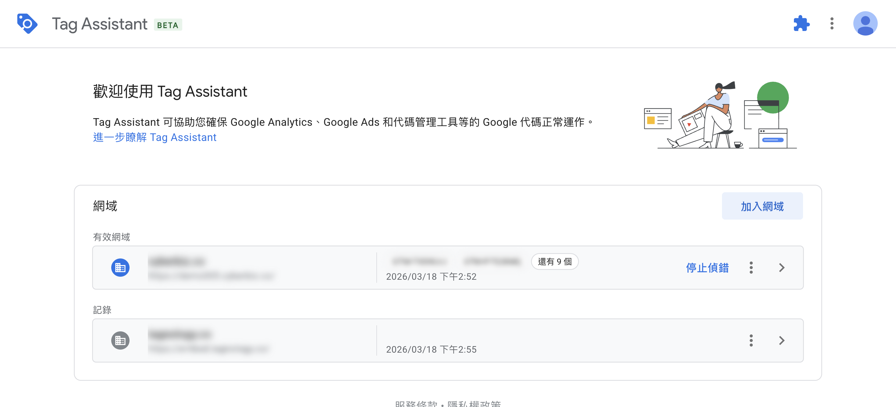
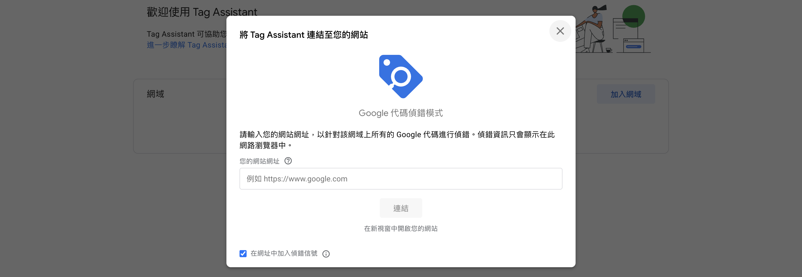
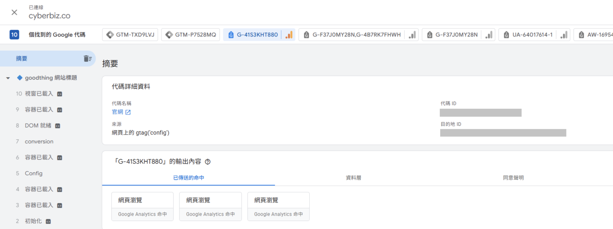

# 使用 Google Tag Assistant 驗證追蹤代碼是否正確安裝

使用 Google Tag Assistant 驗證 GA4、GTM、Google Ads 等追蹤代碼是否正確安裝與觸發。
{ .subtitle }

{ .hero-page }

## 什麼是 Google Tag Assistant 

使用 **Google Tag Assistant** 可以協助商家確認網站是否已成功安裝 **Google Analytics (GA4)**、**Google Tag Manager (GTM)** 或 **Google Ads** 等追蹤代碼，並即時偵測其執行狀態。

此工具提供兩種形式，建議搭配使用以完整掌握網站的追蹤狀況：

## Tag Assistant 擴充功能與網頁版差異

*   **Chrome 擴充功能**：適合 **快速查看** 代碼是否成功載入與執行。
*   **網頁版工具**：適合 **驗證事件觸發與除錯**，可完整紀錄使用者在網站上的操作行為與標籤參數。

---

## 如何安裝與使用 Chrome 擴充功能

1.  **安裝插件**：前往 Chrome 線上應用程式商店，搜尋「**Tag Assistant**」，進入說明頁面後點擊「**加到 Chrome**」。
2.  **確認圖示**：安裝成功後，瀏覽器右上方會出現一個 **藍色標籤圖示**（或在拼圖形狀的擴充功能列表中找到）。
3.  **即時偵測**：開啟想要檢查的官網頁面，點擊該藍色標籤圖示，系統會自動顯示目前網頁上偵測到的 Google 代碼列表。

!!! info "更多 Tag Assistant Chrome 擴充功能說明與教學，請參考 [官方說明 :lucide-external-link:](https://support.google.com/tagmanager/answer/16463290?hl=zh-Hant&ref_topic=15213501&sjid=3100390479866986802-NC)。"

---

## 於網頁版查看詳細事件資訊

若需進一步確認特定標籤（如結帳、加入購物車）是否正確觸發，請按照以下步驟操作：

1.  **登入與連結**：登入 [Google Tag 網頁版 :lucide-external-link:](https://tagassistant.google.com/)，點擊「**加入網域**」，輸入官網網址後點擊「**連結**」。

    

2.  **模擬操作**：系統會開啟一個新的網站分頁。在該分頁中模擬消費者的行為，例如 **點擊按鈕、完成結帳** 等。
3.  **檢查結果**：回到 Tag Assistant 網頁版頁面，即可詳細查看偵測到的 **Google 標籤** 以及各個 **事件的執行情況** 與參數內容。

    

!!! info "更多 Tag Assistant 說明與教學，請參考 [官方說明 :lucide-external-link:](https://support.google.com/tagmanager/answer/15212503?hl=zh-Hant&ref_topic=15213501&sjid=3100390479866986802-NC#)。"

## 常見問題

??? quote "如何確認 Google Analytics (GA4) 是否正確安裝？"

    打開官網任一頁面，點擊 Chrome 工具列上的 Tag Assistant 圖示，若有成功安裝，系統會自動顯示 GA4 代碼的偵測狀態。

??? quote "Chrome 擴充功能與網頁版有什麼不同？"

    Chrome 擴充功能適合快速檢查代碼是否有安裝，網頁版則可完整紀錄使用者在網站上的操作行為，適合用來驗證事件（如結帳、加入購物車）是否正確觸發。

??? quote "為什麼 Tag Assistant 偵測不到追蹤代碼？"

    請確認已完成以下事項：

    - [x] 已正確安裝 Chrome 擴充功能
    - [x] 頁面已重新載入
    - [x] 追蹤代碼已發布至正式環境

    若仍無法偵測，建議檢查 GTM 或 GA4 後台設定是否正確。
