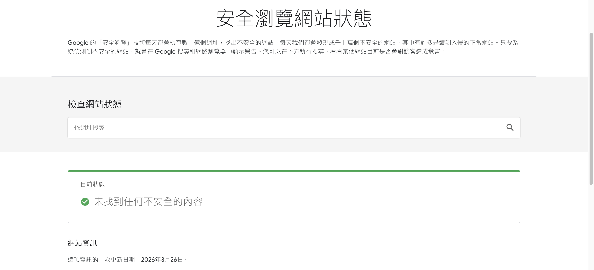
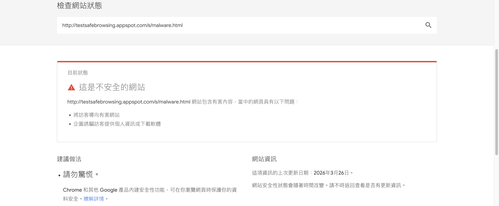
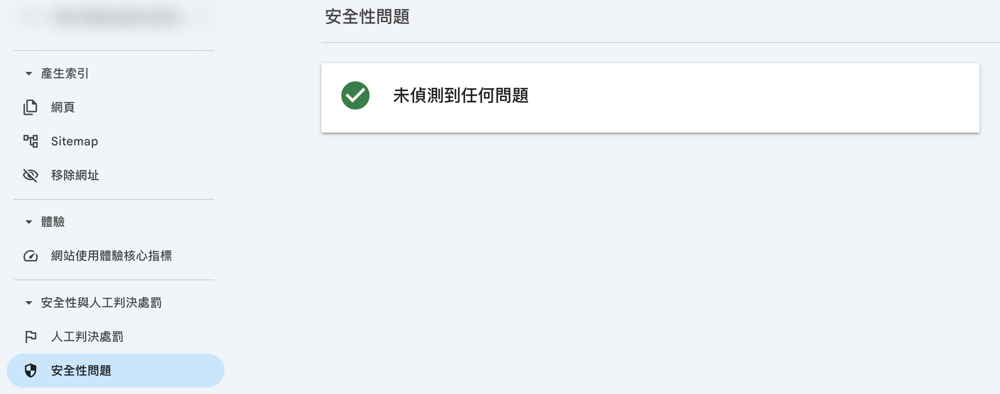

使用 Google 安全瀏覽網站狀態檢查工具，主動檢測官網是否存在安全性風險，並透過 GSC 申請審核解除警示。
{ .subtitle }

{ .hero-page }

## 什麼是安全瀏覽網站狀態

Google 提供「安全瀏覽網站狀態檢查工具」，可協助商家主動檢測官網是否存在安全性風險，避免因被判定為不安全網站，而影響品牌信任度與搜尋排名。

!!! info "進一步瞭解 Google Safe Browsing 與透明報告"
    
    - **Google Safe Browsing** 是一套網站安全防護機制，負責偵測惡意網站（如釣魚網站、惡意軟體、木馬程式），並在使用者造訪風險頁面時顯示警告，以降低資安威脅。[了解更多 :lucide-external-link:](https://safebrowsing.google.com/)
    - **Google 透明報告**（Transparency Report） 則是基於 Safe Browsing 的偵測結果，提供公開的安全數據與查詢工具，讓網站管理員檢查網站是否被標記為風險網站。[了解更多 :lucide-external-link:](https://transparencyreport.google.com/safe-browsing/about)

## 如何查詢網站是否有安全風險

1.  **前往工具頁面**：進入 [Google 檢查網站狀態 :lucide-external-link:](https://transparencyreport.google.com/safe-browsing/search) 工具頁面。
2.  **輸入網址**：在搜尋框內輸入您欲查詢的官網網址並執行搜尋。
3.  **辨識查詢結果**：
    *   ✅ **「未找到任何不安全的內容」**：代表 Google 目前尚未偵測到該網址有安全疑慮。
    *   ⚠️ **「這是不安全的網站」**：Google 會顯示簡短說明，指出網站可能包含誘導性內容、散播惡意軟體或其他違規情形。若網站被封鎖，使用者開啟時會看到明顯的[警示畫面 :lucide-external-link:](https://web.dev/articles/hacked?hl=zh-tw)。

## 若網站被標示為不安全，該如何處理

如果您的網站被判定為不安全，請依照以下步驟申請審核並解除警示：

1.  **查看解決方案**：您可以先參閱 Google 提供的「[申請審查 :lucide-external-link:](https://web.dev/articles/request-a-review?hl=zh-tw)」說明，了解各種安全性問題的對應處理方式。
2.  **進入 [Google Search Console :lucide-external-link:](https://search.google.com/search-console) (GSC)**：
    *   登入 GSC 後，於側邊欄點選 **「安全性與人工判決處罰」** > **「安全性問題」**。
    *   *提醒：若您尚未將網站加入 GSC，必須先完成「[網站所有權驗證](註冊並驗證 Google Search Console.md){ data-preview }」才能進行後續操作。*
3.  **修正問題**：根據 GSC 內顯示的警示細節，依照 Google 建議的步驟逐一修正網站問題。
4.  **提交重新審核**：修正完成後，在 GSC 頁面點擊 **「申請審核」**，Google 會重新檢查網站的安全狀態。

!!! info "提交審核申請後，Google 通常需要一定的作業時間來重新評估網站，相關處理進度以 Google 官方為準。"

## 後續操作

為了加強官網安全性，建議商家平時應開啟 CYBERBIZ 後台的相關安全設定，以降低帳號被盜用導致網站被植入惡意內容的風險。

- :lucide-monitor-smartphone:{ .lg }  
  [__二階段驗證__](../../website-management/設定與管理二階段驗證.md){ data-preview }       
  開啟 2FA 驗證機制，防止帳號被盜用，降低網站被植入惡意內容的風險。

- :lucide-brick-wall-shield:{ .lg }  
  [__IP 白名單__](../../website-management/設定網站安全性.md#白名單){ data-preview }       
  限制後台登入的 IP 來源，確保只有授權的 IP 才能存取管理介面。

## 常見問題

??? quote "提交審核申請後，需要多久才能解除警示？"

    Google 通常需要一定的作業時間來重新評估網站，相關處理進度以 Google 官方為準。

??? quote "如果網站被判定為不安全，會造成什麼影響？"

    當網站被 Google 標記為不安全時，使用者造訪網站時會看到明顯的警示畫面，可能導致：
    
    - 品牌信任度下降
    - 搜尋排名受到影響
    - 顧客流失與轉換率降低

??? quote "如何預防網站被標記為不安全？"

    建議平時應開啟 CYBERBIZ 後台的相關安全設定，以降低帳號被盜用導致網站被植入惡意內容的風險：

    - 開啟 **二階段驗證** (2FA)
    - 設定 **IP 白名單** 限制登入來源

