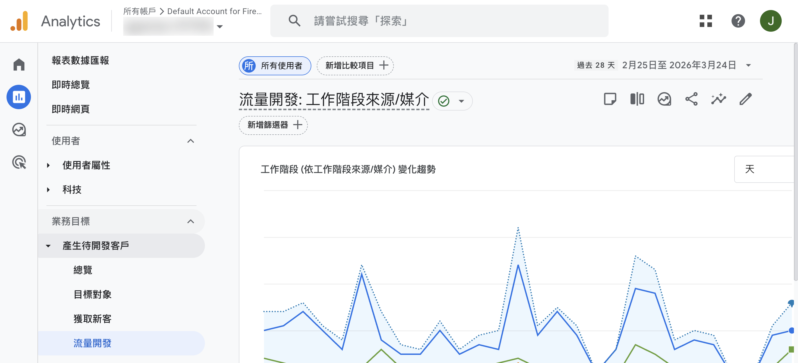
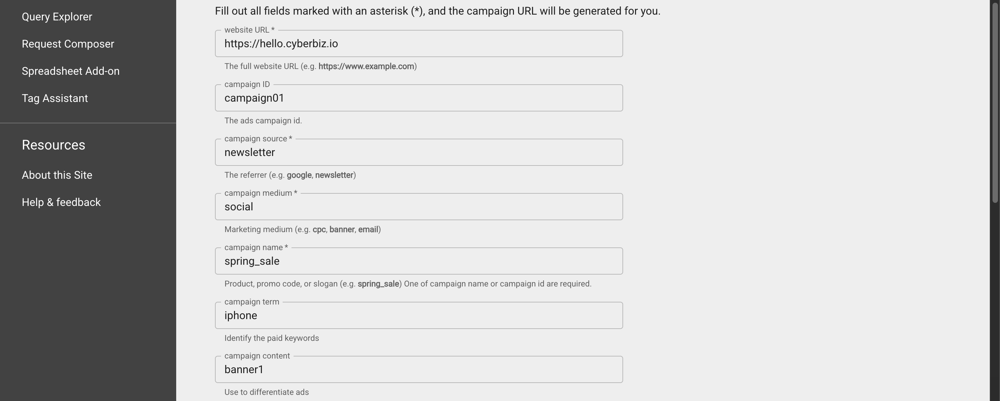

使用 UTM 參數標記行銷連結，追蹤流量來源並在 GA4 中分析各渠道成效。
{ .subtitle }

{ .hero-page }

## 什麼是 UTM

**UTM (Urchin Tracking Module)** 是一種附加在網址後方的小型參數，用於標記流量來源資訊。透過 UTM，商家能讓 Google Analytics (GA4) 準確記錄使用者是從哪個廣告、社群平台或電子郵件進入網站，這對於分析行銷成效與流量歸因至關重要。

## UTM 網址結構與常用參數介紹

一個含有 UTM 的網址範例為：`https://www.example.com/?utm_source=facebook&utm_medium=social`。  
常用的五大參數如下：

| 參數 | 必填 | 說明 | 範例 |
|:---|:---:|---|---|
| `utm_source` | :lucide-check: | 標註導流量的平台或網站 | `facebook`、`google`、`newsletter` |
| `utm_medium` |:lucide-check: | 標註流量的媒介形式 | `social` (社群)、`email`、`cpc` (付費點擊)、`live` (直播) |
| `utm_campaign` |:lucide-check: | 用於辨識特定的促銷活動 | `summer_sale`、`mothersday` |
| `utm_term` | - | 多用於付費搜尋廣告中的關鍵字標記 | `跑步鞋`、`iPhone15` |
| `utm_content` | - | 用於 A/B 測試 區分同一活動中不同的素材或連結位置 | `banner1`、`textlink_a` |

## UTM 設定工具：Campaign URL Builder

您可以使用 Google 官方提供的 [**Campaign URL Builder** :lucide-external-link:](https://ga-dev-tools.google/campaign-url-builder/) 快速生成連結：

1.  進入工具頁面，貼上想追蹤的官網網址。
2.  依序填入上述的參數名稱（建議使用英文字母）。

    

3.  系統會在下方即時生成含有 UTM 參數的完整網址，直接複製使用即可。

    

## UTM 參數格式與使用技巧

為了確保數據能被 GA4 正確統計，請務必遵守以下規範：

- [x] **英文大小寫需一致**：GA4 會區分大小寫，若同時使用 `Facebook` 與 `facebook`，系統會將其視為兩個不同的來源。
- [x] **禁止空格與特殊符號**：空格會導致網址產生亂碼。建議以 **底線 (_)** 或 **短橫線 (-)** 代替空格。
- [x] **統一使用英文字母**：避免使用中文字以防止編譯錯誤導致亂碼。
- [x] **建立 UTM 命名總表**：建議商家建立一份綜合大表記錄所有設定過的名稱，方便團隊成員遵循統一命名規則。

## 於 GA4 報表中查看數據

!!! warning "請先確定完成 [GA4 與官網的串接](ga/建立並串接 Google Analytics.md){ data-preview }，方可於 GA4 查看官網流量資訊。"

完成連結投放後，您可以在 GA4 後台查看成效：

1.  **路徑**：登入 [GA4 後台 :lucide-external-link:](https://analytics.google.com/analytics/web/)，前往「**報表**」>「**業務目標**」>「**產生待開發客戶**」>「**流量開發**」。
2.  **維度選擇**：在報表中將主要維度切換為「**工作階段來源/媒介**」。
3.  **分析數據**：即可查看各個渠道帶來的點擊量、使用者行為及轉換成效。
4. *提醒：GA4 資料處理約需 24~48 小時，數據並非即時呈現。*

## CYBERBIZ 系統特殊整合應用

- :lucide-hand-coins:{ .lg }  
  [__分潤/推薦連結__]()  
  若需在帶有推薦碼的網址（即包含 `?rcode=...`）手動添加 UTM，必須在 rcode 後方以「**&**」隔開參數。

- :lucide-smartphone:{ .lg }  
  [__APP 導購連結__]()  
  在後台設定 APP 自訂導購時，「廣告名稱」會自動成為 GA_UTM 的活動名稱。

- :lucide-file-spreadsheet:{ .lg }  
  [__訂單報表匯出 (企業版專用)__](../../orders/匯出訂單報表.md#步驟一選擇報表欄位){ data-preview }  
  後台「訂單報表匯出」支援選取 UTM 相關欄位（如來源、媒介、活動名稱等），方便商家直接下載 Excel 進行線下分析。

## 常見問題

??? quote "UTM 參數可以使用中文命名嗎？"
    不建議使用中文。UTM 參數應統一使用英文字母，避免因編譯錯誤導致網址出現亂碼，進而影響 GA4 數據統計的準確性。

??? quote "推薦碼網址要如何加上 UTM 參數？"
    若網址已包含推薦碼（`?rcode=...`），需在推薦碼參數後方以「**&**」隔開 UTM 參數。正確範例：`https://...?rcode=xxx&utm_source=facebook&utm_medium=social`。

??? quote "UTM 數據需要多久才會顯示在 GA4？"
    GA4 資料處理約需 **24~48 小時**，並非即時呈現。建立 UTM 連結後，請耐心等待數據回傳。

