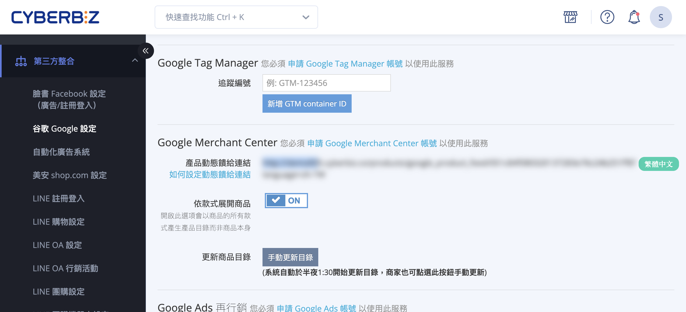
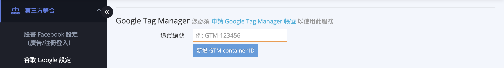

# 建立 Google Tag Manager 並串接 CYBERBIZ

{ .subtitle }

{ .doc-badge }

{ .hero-page }

## 什麼是 Google Tag Manager

**Google Tag Manager (GTM)** 是 Google 提供的一套免費標籤管理系統，能協助網頁管理人員在不需修改網站程式碼的情況下，快速安裝與更新各種追蹤標籤（如事件追蹤、再行銷代碼等）。

## 建立 GTM 帳戶與容器

1.  **建立帳戶**：登入 [Google Tag Manager :lucide-external-link:](https://tagmanager.google.com/)，點擊「建立帳戶」。輸入 **帳戶名稱**（建議使用公司或品牌名）並選擇國家。
2.  **設定容器**：輸入 **[容器](#GTM-核心詞彙表){ data-preview } 名稱**（建議填寫官網網址或名稱）並選擇目標平台為「**網路**」。
3.  **同意條款**：勾選同意服務條款後點擊「是」。
4.  **取得代碼**：系統會彈出安裝代碼視窗，請找到 **GTM-XXXXXX** 格式的容器 ID 並複製。

## CYBERBIZ 後台串接設定

1.  **進入路徑**：前往管理後台的「**第三方整合**」>「**谷歌 Google 設定**」。
2.  **填入 ID**：找到「**Google Tag Manager**」區塊，將複製的 ID 貼至「**追蹤編號含GTM**」欄位中並儲存。

## 重要注意事項（避免數據異常）

為確保資料紀錄的正確性，**以下工具在 CYBERBIZ 已有專屬串接方式，請務必透過系統後台直接設定，切勿另行使用 GTM 綁定**，以免發生代碼衝突或重複計算：

*   **Google Analytics (GA4)**。
*   **Google Ads 轉換追蹤**。
*   **Meta Pixel (臉書像素)**。

!!! warning "若您先前曾透過 GTM 設定上述工具的追蹤，在改用 CYBERBIZ 後台串接後，請務必 **移除 GTM 內的舊標籤**，否則會造成廣告數據不準確。"

## 檢查與驗證

完成設定後，您可以使用 **Google Tag Assistant**（Chrome 擴充功能或網頁版）來[檢測網站是否已成功安裝 GTM 代碼](使用 Google Tag Assistant 驗證追蹤代碼是否正確安裝.md){ data-preview }。

*   **Chrome 擴充功能**：適合快速查看代碼是否成功載入。
*   **網頁版工具**：可完整紀錄操作行為，驗證特定標籤是否正確觸發。

## GTM 核心詞彙表

| 術語 (Term) | 技術定義 (Technical Definition) | 簡單比喻 |
| :--- | :--- | :--- |
| **帳戶 (Account)** | GTM 管理架構的最高層級，通常代表一個公司或組織。 | **屋主**：管理所有權限的人。 |
| **容器 (Container)** | 安裝在網站上的 JavaScript 代碼片段，內含該網站所有的追蹤規則與標籤。 | **工具箱**：裝載所有工具的容器。 |
| **標籤 (Tag)** | 實際執行任務的程式碼片段（如：GA4 追蹤碼、Meta Pixel）。 | **「要做什麼？」**：傳送數據。 |
| **觸發條件 (Trigger)** | 偵測使用者行為的規則，決定標籤在何時執行（如：點擊按鈕、提交表單）。 | **「何時要做？」**：啟動開關。 |
| **變數 (Variable)** | 用於存取動態資訊的佔位符（如：網址、商品金額、訂單 ID）。 | **「情報細節」**：具體的數據值。 |
| **資料層 (Data Layer)** | 網站與 GTM 之間交換資訊的中繼站，確保動態數據穩定傳輸。 | **「情報信封」**：標準化的溝通格式。 |
| **預覽/偵錯 (Preview)** | 在正式發佈前測試標籤運作的環境，不會影響真實訪客。 | **「演習」**：確認沒問題後再正式上場。 |
| **版本 (Version)** | 容器設定的歷史存檔。每次發佈都會產生紀錄，以便錯誤時還原。 | **「存檔點」**：隨時可以搭時光機回頭。 |

## 後續操作

- :lucide-import:{ .lg }   
  [____]()     
  。

- :lucide-ban:{ .lg }     
  [____]()  
  。

## 常見問題

??? quote ""

