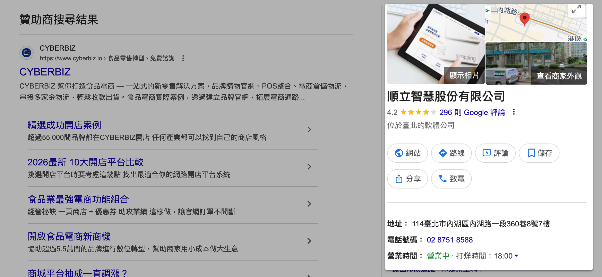

建立與驗證 Google 商家檔案，讓實體店面在 Google 搜尋與地圖上顯示商家資訊，提升品牌曝光與顧客信任感。
{ .subtitle }

{ .hero-page }

## 什麼是 Google 商家檔案

在 Google 建立「[我的商家檔案 :lucide-external-link:](https://business.google.com/tw/business-profile/)」（Google Business Profile）是實體店面或品牌經營者的重要步驟。這是一個免費工具，可讓商家管理自己在 Google 搜尋與 Google 地圖上的資訊，增加曝光並建立顧客信任感。

*   **核心功能**：讓商家在 Google 搜尋與地圖上展示官方資訊，協助潛在顧客更快速找到您。
*   **知識圖譜關聯**：建立並驗證檔案後，當用戶搜尋您的品牌時，搜尋結果右側可能會出現「知識圖譜」（整合型資訊卡片），顯示品牌的官方詳細資料。
*   **重要限制**：**僅有具備實體店面或提供實體服務的商家** 能夠註冊此檔案。瞭解 [商家資格 :lucide-external-link:](https://support.google.com/business/answer/13763036?sjid=3926033107048309425-NAA)。

## 建立步驟教學

!!! warning "此功能由 Google 官方提供與審核，相關操作與最新介面應以 [Google 官方資訊 :lucide-external-link:](https://support.google.com/business/answer/2911778?hl=zh-Hant&ref_topic=4596754&sjid=3926033107048309425-NA) 為準。"

1.  **開啟功能**：登入 [Google 地圖 :lucide-external-link:](https://www.google.com/maps)，點擊左側邊欄選單「**☰**」，並選擇「**新增你的商家**」。
2.  **基本資料**：輸入您的「商家名稱」與「業務類別」。
3.  **地點設定**：選擇是否要新增一個可供客戶親自造訪的實體地點。
4.  **服務範圍**：若您提供外送或到府服務，請輸入您的服務範圍。
5.  **聯絡資訊**：輸入電話號碼、網站網址等聯絡方式。
6.  **最新消息**：選擇是否願意接收商家相關的最新消息與建議。
7.  **驗證身分**：輸入「郵寄地址」以進行驗證程序。
8.  **營業資訊**：設定您的「營業時間」，並撰寫簡短的「商家描述」。
9.  **商家相片**：新增商店的實體相片或產品圖，增加吸引力。
10. **完成設定**：點擊「繼續」，等待 Google **驗證通過** 後，商家檔案即正式生效。

## 後續操作

- :lucide-search:{ .lg }   
  [__SEO 優化__]()     
  建立完成後，可與官網的 SEO 設定結合，進一步提升品牌在搜尋引擎上的自然排名。

## 常見問題

??? quote "誰可以建立 Google 商家檔案？"

    只有具備 **實體店面** 或提供 **實體服務** 的商家才能建立 Google 商家檔案。詳情請參考[商家資格官方說明 :lucide-external-link:](https://support.google.com/business/answer/13763036?hl=zh-Hant&ref_topic=4540086&sjid=3926033107048309425-NA)。

??? quote "驗證 Google 商家檔案需要多久時間？"

    Google 會透過「郵寄明信片」的方式寄送驗證碼到您提供的地址，通常需要 5-14 個工作天。收到驗證碼後輸入即可完成驗證。

??? quote "建立商家檔案後可以新增哪些資訊？"

    您可以新增商家名稱、業務類別、營業時間、聯絡電話、網站網址、商家描述、產品或門市相片等資訊。
