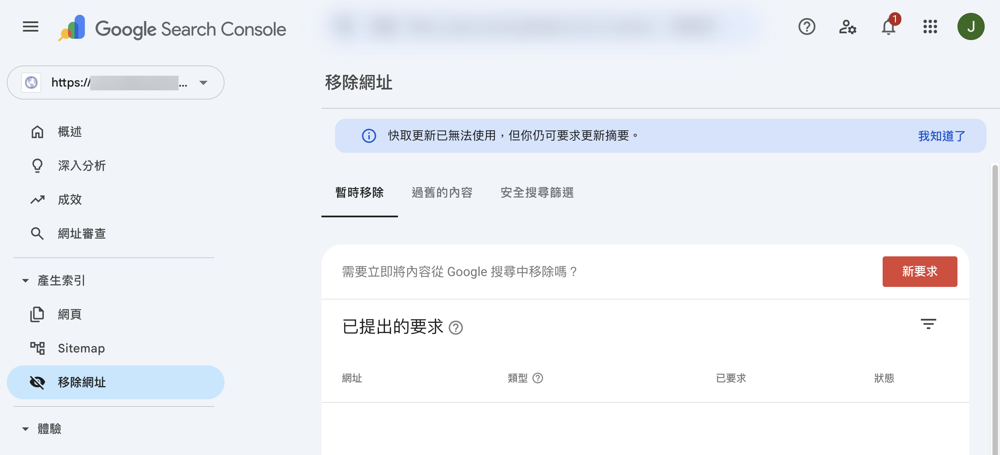
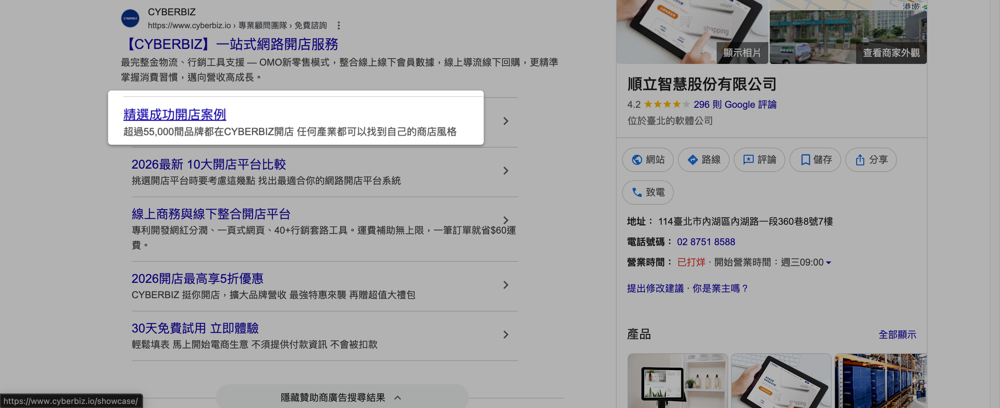

透過 Google Search Console 移除網址工具，排除特定網頁或子目錄出現在 Google 搜尋結果中。
{ .subtitle }

{ .hero-page }

## Google 搜尋結果排除說明

當您的品牌網站在 Google 搜尋結果中顯示出不希望曝光的子目錄頁面（例如活動舊頁、暫時不欲公開的內容，或是對 SEO 效益無幫助的結構頁面）時，可以透過 Google 官方提供的工具進行處理。

!!! note "更多詳情說明，請參考 [Google 官方說明 :lucide-external-link:](https://support.google.com/webmasters/answer/9689846)。"

## 認識 Google 搜尋結果中的「子目錄」

Google 搜尋結果中的子目錄是指搜尋結果下方所顯示的網站延伸頁面。這些頁面通常由 Google 自動判定並擷取，可能包含常見路徑如 `/products`、`/faq`、`/campaign`、`/showcase` 等。

## 使用 Google 移除網址工具步驟

網站擁有者可以利用 **Google Search Console (GSC)** 提供的「移除網址工具」，臨時性地排除特定頁面或子目錄出現在搜尋結果中。

1.  **登入 GSC**：登入 [Google Search Console :lucide-external-link:](https://search.google.com/search-console/)。
2.  **選擇資源**：選擇擁有管理權限的網站資源（若尚未驗證，請先完成 [Google Search Console 的註冊與認證](註冊並驗證 Google Search Console.md){ data-preview }）。
3.  **進入移除功能**：於側邊欄點選 **「產生索引」** > **「移除網址」**。
4.  **建立新要求**：於「暫時移除」頁籤中，點擊 **「新要求」**。
5.  **輸入網址與類型**：
    *   輸入欲移除的網址路徑。
    *   您可以選擇 **「封鎖特定網址」** 或 **「含有特定前置字元的所有網址」**。
6.  **提交申請**：確認資訊無誤後，點擊「下一頁」並 **「提交要求」**。

## 重要注意事項與限制

*   **暫時隱藏**：此功能僅能將網址於搜尋結果中 **暫時隱藏，時效約為 6 個月**。
*   **生效時間**：提交要求後，通常會在 **數小時至數日內** 生效，實際進度依 Google 處理為準。
*   **網頁仍存在**：此功能僅在搜尋結果中隱藏，**實際網頁仍可透過直接連結造訪**。
*   **秘密群組應用**：若您建立了「秘密商店群組頁」且不希望被 Google 索引，建議務必至 GSC 設定排除頁面，以阻擋其出現在搜尋結果中。
*   **客服支援**：此操作屬於 Google 官方工具的功能，相關處理進度以 Google 為準，CYBERBIZ 無提供此項操作的客服支援服務。

## 後續操作

- :lucide-eye-off:{ .lg }  
  [__關閉商品搜尋功能__](../../products/快速上手商品管理.md#商品排除搜尋){ data-preview }  
  透過後台商品管理的「商品搜尋功能」使特定商品不出現於搜尋結果中 。

## 常見問題

??? quote "使用 Google 移除網址工具可以永久刪除網頁嗎？"

    無法永久刪除。此功能僅能將網址於搜尋結果中 **暫時隱藏**，時效約為 **6 個月**。若希望長期排除，建議於網頁中加入 `noindex` meta 標籤或設定 robots.txt 規則。

??? quote "移除網址後多久會生效？"

    提交要求後，通常會在 **數小時至數日內** 生效，實際進度依 Google 處理為準。

??? quote "秘密商店群組頁需要特別處理嗎？"

    若您建立了「秘密商店群組頁」且不希望被 Google 索引，建議務必至 Google Search Console 設定排除頁面，以阻擋其出現在搜尋結果中。

