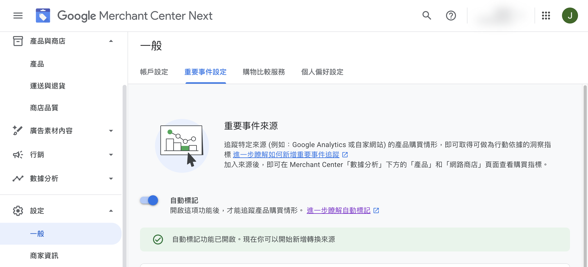
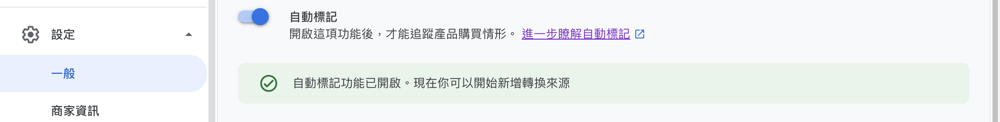
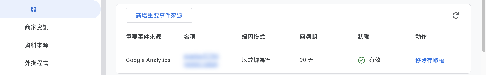
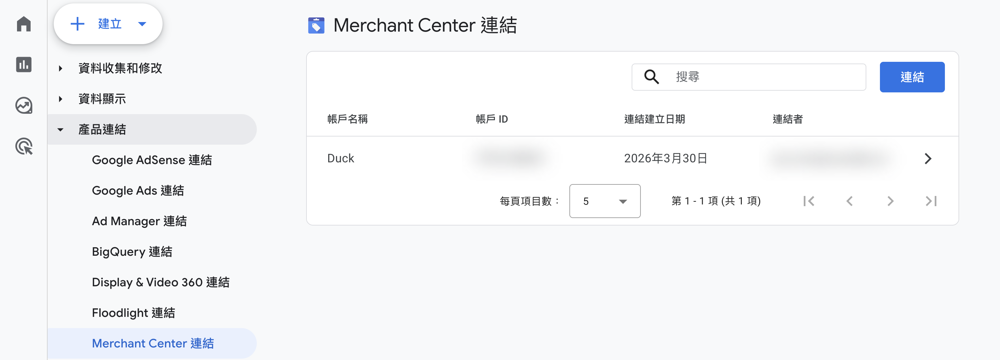

設定 Google Merchant Center 重要事件來源追蹤與自動標記功能，掌握產品購買指標。
{ .subtitle }

{ .hero-page }

## 什麼是重要事件來源追蹤

**重要事件來源 (Event Source)** 可追蹤特定來源（如 Google Analytics、自家網站等）的產品購買情形，藉此取得可做為行動依據的洞察指標。[瞭解更多 :lucide-external-link:](https://support.google.com/merchants/answer/14166401?hl=zh-Hant&sjid=15151417659935872406-NC)

## 什麼是自動標記

**自動標記 (Auto-tagging)** 是追蹤產品購買情形的必要功能。開啟後，Google 會自動在點擊廣告連結時添加參數，讓系統能準確關聯廣告點擊與轉換事件。[瞭解更多 :lucide-external-link:](https://support.google.com/merchants/answer/15191080?hl=zh-Hant#%E5%95%9F%E7%94%A8%E6%88%96%E5%81%9C%E7%94%A8%E8%87%AA%E5%8B%95%E6%A8%99%E8%A8%98)

## 自動標記設定

1.  **前往 GMC 設定**：登入 Google Merchant Center，點擊「設定」>「一般」>「重要事件設定」
2.  **找到自動標記**：在設定頁面中找到「自動標記」選項
3.  **開啟功能**：將「自動標記」切換為 **開啟** 狀態

{ .screenshot }

## 將 GA4 連結至 Merchant Center

將 GA4 連結至 Merchant Center 後，即可追蹤來自 Google 搜尋與購物廣告的轉換成效，並在 Merchant Center 的「數據分析」中查看購買指標。

!!! warning "操作前準備"

    在開始設定前，請確保已完成以下準備：

    - [x] 已完成 [Google Merchant Center 帳號設定](設定%20Google%20Merchant%20Center%20並同步%20CYBERBIZ%20商品.md){ data-preview }
    - [x] 已建立 [Google Analytics 4 (GA4) 資源並取得評估 ID](ga/建立並串接 Google Analytics.md){ data-preview }

1.  **前往 GMC 設定**：在 Merchant Center 左側導覽選單，點擊「設定」圖示
2.  **開啟重要事件設定**：點擊「設定」>「一般」>「重要事件設定」
3.  **啟用自動標記**：如果尚未啟用「自動標記」，請先開啟（這是連結至 GA4 的必要前提）
4.  **新增重要事件來源**：點擊「新增重要事件來源」
5.  **選取 Google Analytics**：選擇「Google Analytics」
6.  **完成連結**：點擊「前往 Google Analytics」彈出視窗，按照步驟完成授權。完成後重新整理頁面，即可在列表中查看連結。

!!! info "連結完成後，系統可能需要 24-48 小時才會開始顯示數據。設定詳情與說明，請參考[官方教學 :lucide-external-link:](https://support.google.com/merchants/answer/13881610?hl=zh-Hant#zippy=%2C%E5%89%8D%E5%BE%80-merchant-center)。"

??? success "確認連結狀態"

    完成設定後，可透過以下方式確認 GA4 已成功連結至 Merchant Center：

    - **GMC 端檢查：** 進入 GMC >「設定」> 「一般」> 「重要事件設定」> 「來源列表」，GA4 的狀態應該顯示為 **有效 (Active)** 或 **已連結 (Linked)**

        

    - **GA4 端檢查：** 進入 GA4 >「管理」>「產品連結」>「Merchant Center 連結」，確認你的 GMC ID 出現在清單中

        

## 後續操作

- :lucide-youtube:{ .lg }   
  [__YouTube Shopping__](YouTube%20Shopping%20%E8%A8%AD%E5%AE%9A%E6%8C%87%E5%8D%97.md){ data-preview }       
  進行產品購買轉換追蹤，在 YouTube 影片、直播及短影音中植入官網商品資訊。

- :lucide-trending-up:{ .lg }   
  [__Google 購物廣告__](設定 Google Ads 轉換追蹤.md){ data-preview }    
  準確回報廣告帶來的訂單成效，優化廣告投放效益。

## 常見問題

??? quote "為什麼必須開啟自動標記？"
    自動標記可讓 Google 自動在廣告點擊連結中加入追蹤參數，若未開啟，將無法準確追蹤廣告轉換成效。

??? quote "自動標記開啟後多久生效？"
    自動標記設定通常會立即生效，但部分資料可能需要 24-48 小時才會顯示在報表中。

??? quote "重要事件來源追蹤與自動標記有何差異？"
    - **自動標記**：用於追蹤 Google 廣告點擊與轉換的關聯
    - **重要事件來源**：可追蹤多個不同來源（Google Analytics、自家網站等）的購買情形
