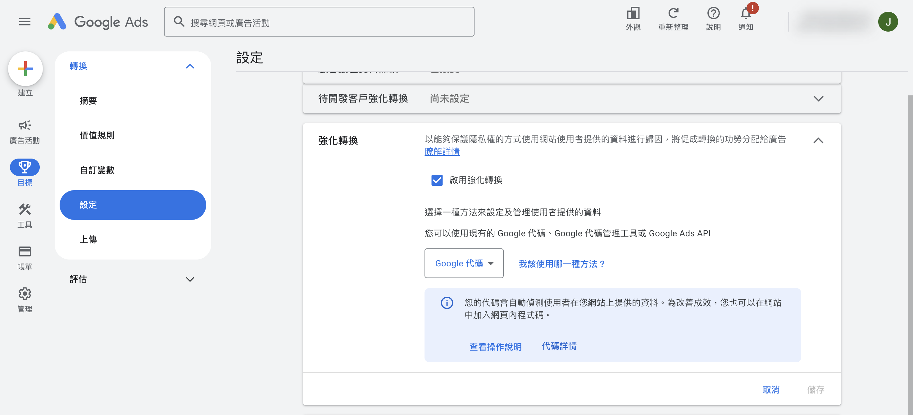
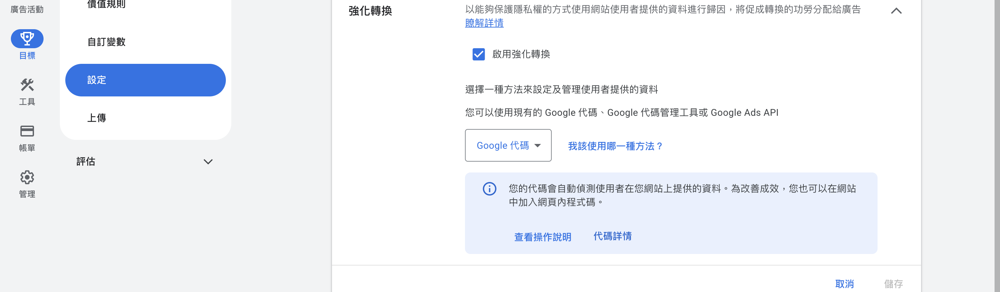

設定 Google Ads 強化轉換功能，讓系統收到更詳細的行為資料以優化廣告成效。
{ .subtitle }

[:lucide-tag:{ title="適用方案" }](../../../resources/conventions#適用方案) | 企業
{ .doc-badge }

{ .hero-page }

## 強化轉換說明

在 Google Ads 設定 **強化轉換（Enhanced Conversions）** 是一項進階功能，能讓系統在使用者完成轉換（如購買、填表）後收到更詳細的行為資料，進而優化並提升廣告成效。

## 為什麼要設定強化轉換

*   **數據補全**：當使用者與您的廣告互動後在網站上完成轉換，強化轉換能更準確地連結跨裝置的行為，補足因為隱私規範或 Cookie 限制而流失的追蹤數據。
*   **優化廣告出價**：藉由回傳更精確的轉換訊號，協助 Google Ads 的 AI 機器學習更有效地優化廣告投遞與出價策略。

## 設定前注意事項

1.  **適用版本限制**：此功能為 **CYBERBIZ 企業版商家專用**。
2.  **前置需求**：在設定強化轉換之前，請務必確保已根據教學文件完成在 [Google Ads 建立轉換追蹤](設定 Google Ads 轉換追蹤.md){ data-preview } 的基本設定。

## 操作步驟教學 (Google Ads 端)

請登入您的 Google Ads 後台，並依循以下路徑操作：

1.  **進入設定頁面**：於側邊選單點擊「**目標**」>「**設定**」>「**強化轉換**」。
2.  **開啟功能**：在頁面中找到「強化轉換」區塊，勾選「**啟用強化轉換**」。
3.  **選擇代碼方式**：在設定選項中選擇「**Google 代碼**」。
4.  **完成儲存**：點擊「**儲存**」按鈕，即可完成 Google Ads 端的設定流程。

## 常見問題

??? quote "誰可以使用強化轉換功能？"
    強化轉換為 **CYBERBIZ 企業版商家專用** 功能，其他方案無法使用。

??? quote "設定強化轉換需要先完成什麼前置設定？"
    在設定強化轉換之前，必須先完成 [Google Ads 轉換追蹤](設定 Google Ads 轉換追蹤.md) 的基本設定，才能啟用強化轉換功能。

??? quote "強化轉換對廣告投放有什麼幫助？"
    強化轉換能補足因隱私規範或 Cookie 限制而流失的追蹤數據，並回傳更精確的轉換訊號，協助 Google Ads AI 優化廣告投遞與出價策略。

