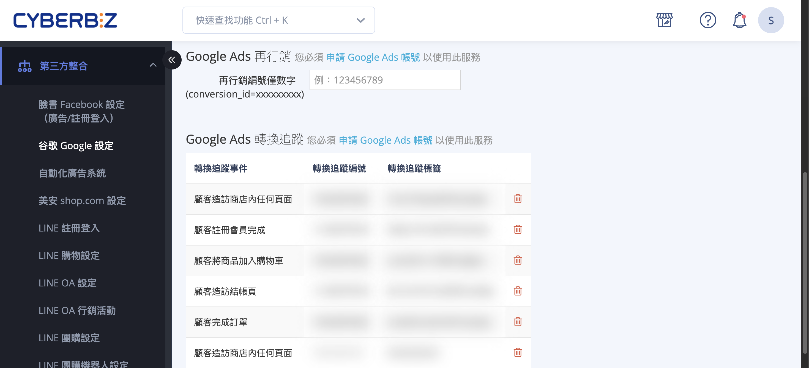
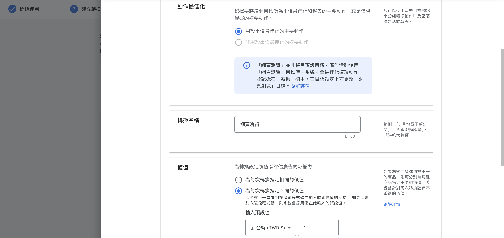
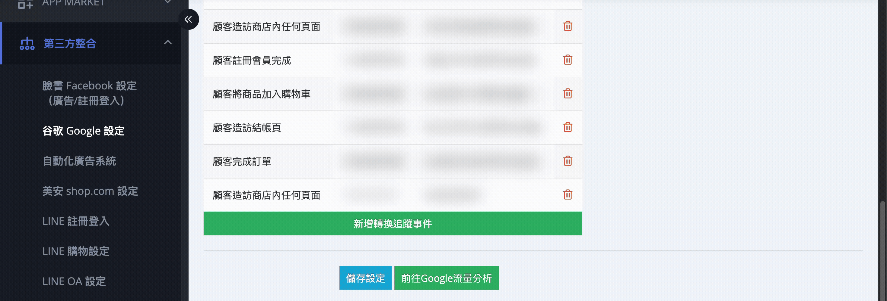
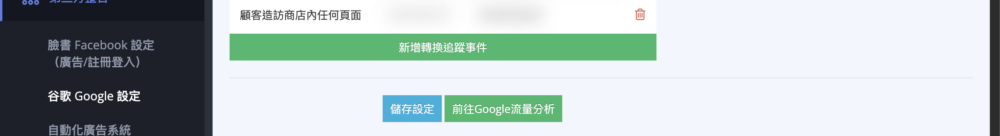

設定 Google Ads 轉換追蹤與再行銷功能，追蹤廣告成效並優化投放策略。
{ .subtitle }

{ .hero-page }

## 什麼是 Google Ads

Google Ads（原名 Google AdWords）是 Google 提供的線上廣告平台，商家可透過競價方式在 Google 搜尋結果、Google 合作網站及 YouTube 等管道投放廣告。Google Ads 提供多種廣告形式，包括搜尋廣告、多媒體廣告、購物廣告和影片廣告，商家可依據產品特性和行銷目標選擇適合的廣告類型。[瞭解詳情 :lucide-external-link:](https://support.google.com/google-ads/answer/6146252)。

## 為何需要設定「轉換追蹤」

「轉換」是指使用者點擊廣告後，在網站上完成的關鍵動作（如：結帳、註冊會員、填寫表單）。
在 Google Ads 建立轉換追蹤，能協助商家觀測廣告成效、了解客戶行為，並進一步優化廣告精準度。CYBERBIZ 提供與 Google 轉換代碼的串接功能，以下為詳細的設定步驟：

## 開始前的準備

- [x] **建立廣告活動**：商家必須先[建立第一個 Google 廣告活動 :lucide-external-link:](https://ads.google.com/aw/campaigns?supportResource=google-ads/answer/10207423)，方可開始建立轉換追蹤。設定詳情，請參考[官方說明 :lucide-external-link:](https://support.google.com/google-ads/answer/6324971?hl=zh-Hant)。

## 在 Google Ads 建立轉換動作

1.  **進入轉換頁面**：登入 Google Ads 管理後台，於側邊欄點擊「**目標**」>「**摘要**」，點擊「**建立轉換動作**」。
2.  **選擇類別**：選擇「**網頁瀏覽**」。
3.  **建立轉換**：點擊 **建立轉換**，**資料來源** 選擇建立廣告活動時填寫的網站網址。
4. **轉換方式**：選擇「**使用程式碼手動設定**」。

    

5.  **設定轉換詳細資料**：
    *   **動作最佳化**：依需求選擇要追蹤的動作事件（如：購買、加入購物車）。
    *   **轉換名稱**：依需求為此轉換命名。
    *   **價值**：若類別選擇「**購買**」，請選「**為每次轉換指定不同的價值**」；其餘類別建議選擇「為每次轉換指定相同的價值」。
    *   **計算方式**：若無特殊需求，建議選擇「**每次**」。

    

6.  **完成與取得代碼**：
    *   設定完成後點擊「完成」。若有多個行為要追蹤，請在此頁面 **再次點擊「新增轉換動作」**，切勿分開建立。
    *   點擊「**儲存並繼續**」。
    *   選擇「**使用 Google 代碼管理工具**」頁籤，即可查看並複製「**轉換 ID**」與「**轉換標籤**」。
    - 確認資訊後，點擊 **同意並完成** 完成流程。 

    

## 將轉換代碼填入 CYBERBIZ 後台

**操作路徑：** 登入 CYBERBIZ 管理後台，前往 「**第三方整合**」 > 「**谷歌 Google 設定**」> Google Ads 轉換相關區塊。

1.  **Google Ads 再行銷**：
    *   將 Google 提供的「**轉換 ID**」填入「**再行銷編號僅數字**」欄位。

    

2.  **Google Ads 轉換追蹤**：
    *   點擊「**新增轉換追蹤事件**」。
    *   **轉換追蹤事件**：根據您在 Google 端設定的「目標類別」，選擇後台對應的事件（如：購買對應「顧客完成訂單」）。

        ??? note "目標類別與轉換追蹤事件對應表"
            
            | Google Ads 目標類別 | CYBERBIZ 後台追蹤事件 |
            |------------------|------------------|
            | 網頁瀏覽 | 顧客造訪商店內任何頁面 |
            | 網頁瀏覽 | 顧客造訪商店首頁 |
            | 開始結帳 | 顧客造訪結帳頁 |
            | 完成註冊 | 顧客註冊會員 |
            | 購買 | 顧客完成訂單 |
            | 加入購物車 | 顧客將商品加入購物車 |

    *   **轉換追蹤編號**：貼上「**轉換 ID**」。
    *   **轉換追蹤標籤**：貼上對應事件的「**轉換標籤**」。

    

3.  **儲存設定**。

    

!!! warning "注意事項"

    *   **避免重複埋設**：若先前曾透過 GTM 設定 Google 廣告追蹤，在 CYBERBIZ 後台設定完成後，**必須移除 GTM 中的相關標籤**，以免發生 Code 碼衝突導致數據不準確。
    *   **自動化廣告限制**：若商家使用的是由 [CYBERBIZ 代管](設定自動化廣告.md#cyberbiz-代管)的「**自動化廣告系統**」，則 **無法** 透過上述方式在個人 Google Ads 帳號中查看數據，需前往 CYBERBIZ 後台查看。

## 常見問題

??? quote "自動化廣告可以設置轉換追蹤嗎？"
    不行，自動化廣告由 CYBERBIZ 帳號代管，恕無法透過 Google Ads 查看數據，商家可前往後台查看數據。

??? quote "轉換代碼無法追蹤到官網的消費者行為？"
    請確認 CYBERBIZ 管理後台中的相關設定，「再行銷編號僅數字」與「轉換追蹤編號」代碼相同，如有不同，請確認是否按照步驟7新增轉換動作。

??? quote "已經使用 GTM 埋設 Google Ads，需要移除嗎？"
    需要。若先前透過 Google 代碼管理工具（GTM）設定廣告追蹤，在 CYBERBIZ 後台完成設定後，請務必移除 GTM 中的相關標籤，避免代碼衝突導致數據不準確。

??? quote "如何追蹤多個轉換事件？"
    若有多個行為要追蹤，請在 Google Ads 的同一個轉換動作頁面中 **再次點擊「新增轉換動作」** 新增事件，切勿分開建立多個轉換動作。
