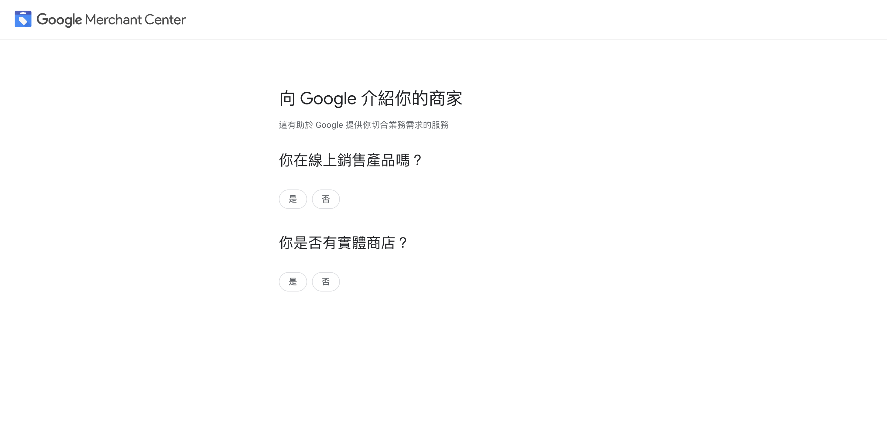
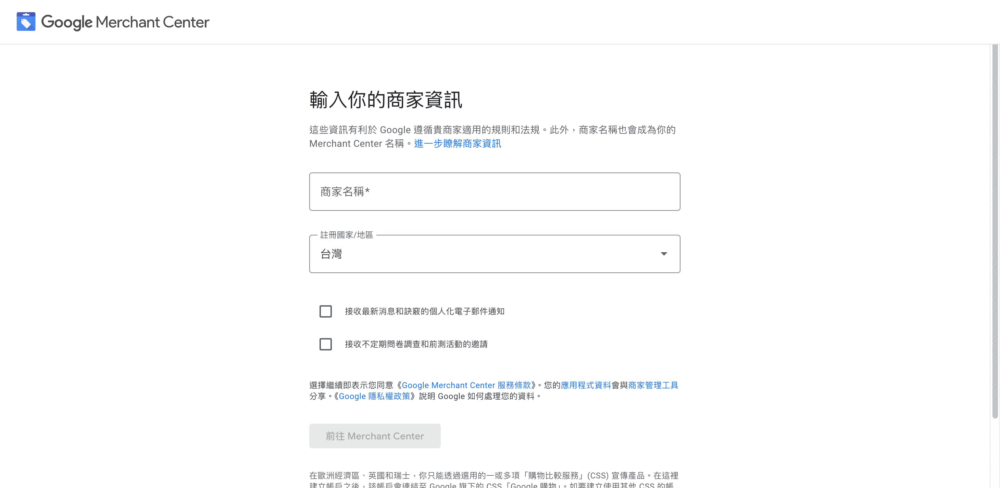
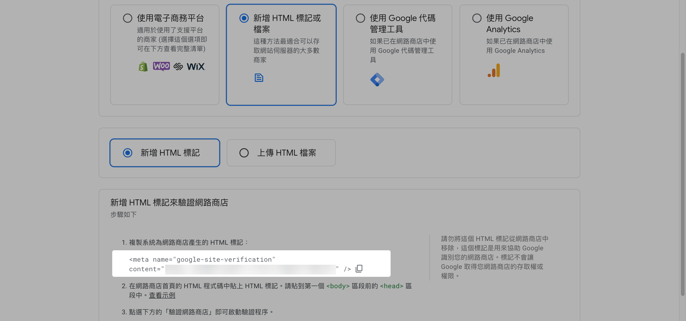
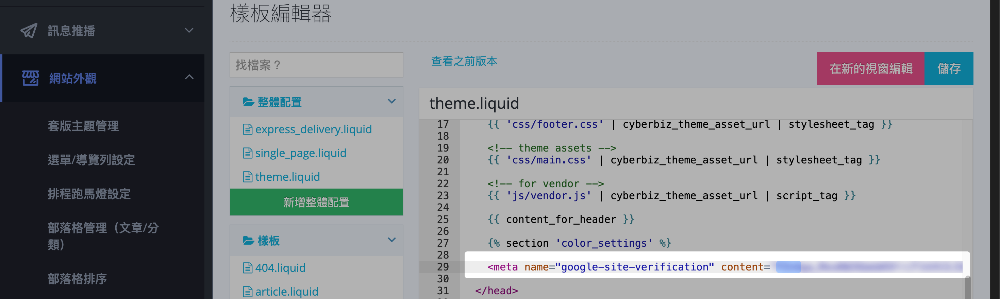
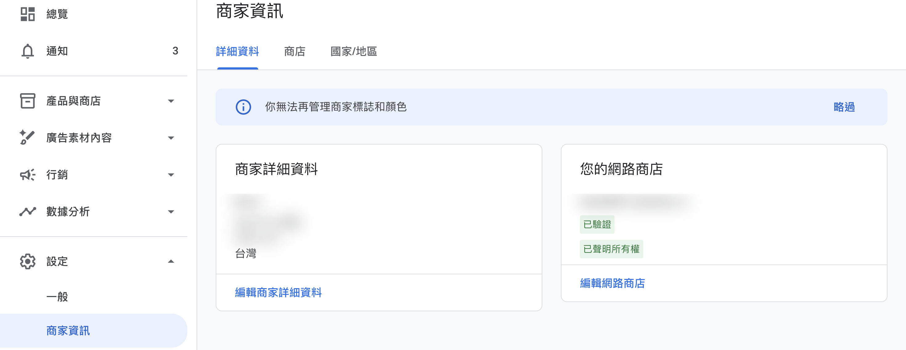
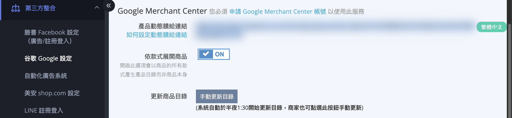
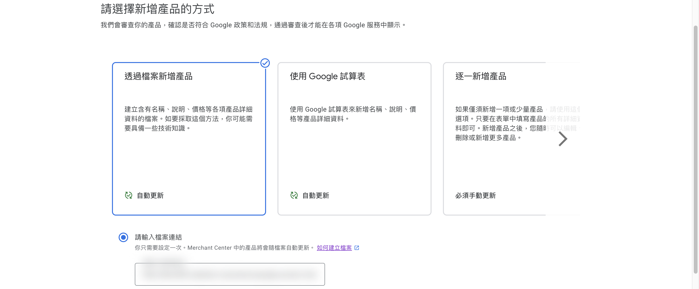
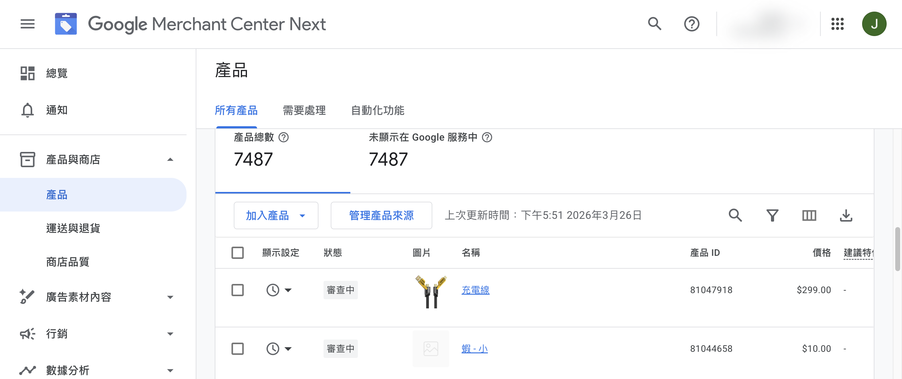
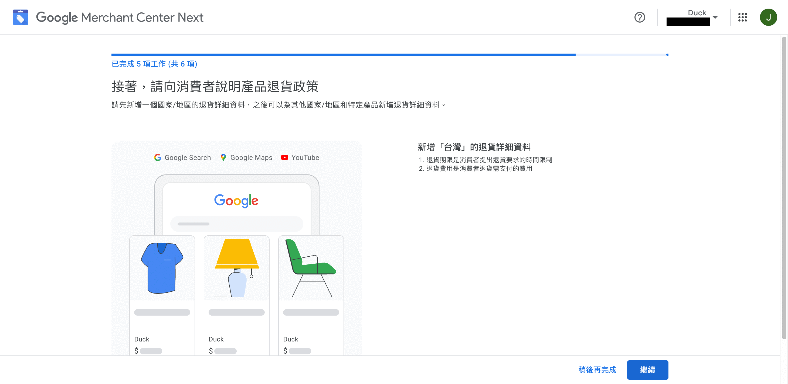
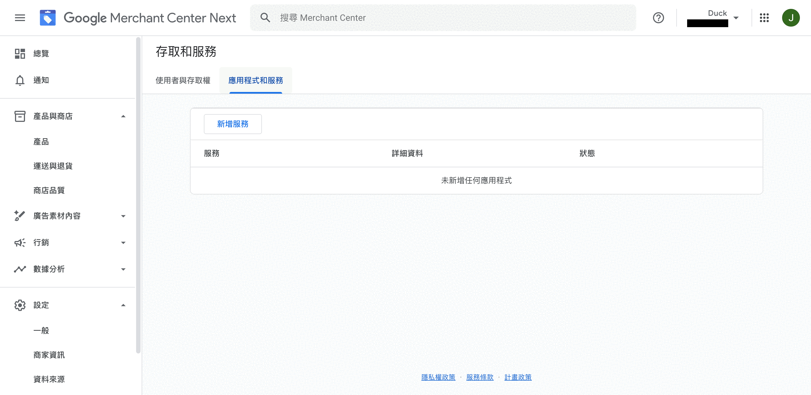

串接 Google Merchant Center (GMC)、同步商品資料至 Google 搜尋與購物廣告。
{ .subtitle }

{ title="串接 GMC：第三方整合 > Google > Google Merchant Center" .hero-page }

## 什麼是 Google Merchant Center

**Google Merchant Center (GMC)** [:lucide-external-link:](https://www.google.com/retail/solutions/merchant-center/) 是 Google 提供的商品資料管理平台，可將商品資訊同步至 Google 搜尋結果中的購物區塊及 Google 購物廣告，藉此提升商品曝光與轉換成效。[了解更多 :lucide-external-link:](https://support.google.com/merchants/answer/12159157?hl=zh-Hant)

!!! note "為什麼要使用 GMC"
    - **提升商品曝光**：商品會出現在 Google 搜尋結果的購物區塊，增加潛在顧客瀏覽量。
    - **精準投放廣告**：搭配 Google Ads 推廣商品，鎖定目標受眾，提高轉換率。
    - **自動化管理**：自動同步商品庫存、價格與圖片，減少手動維護工作。
    - **數據追蹤與優化**：收集使用者互動與廣告成效資料，支援後續分析與優化。

## 如何申請 Google Merchant Center (Google 端操作)

### 建立帳戶

!!! warning "重要提醒"
    若您是為了投放 **Google 自動化廣告**，可選擇由 CYBERBIZ 代管 GMC 帳號，請直接在自動化廣告設定頁創建，避免自行申請導致權限衝突或廣告異常。瞭解[如何設置自動化廣告](設定自動化廣告.md){ data-preview }。

1.  **前往 GMC**：前往 [Google Merchant Center :lucide-external-link:](https://www.google.com/retail/solutions/merchant-center/) 並點擊「立即開始」
2.  **選擇商店類型**：選擇「是」表示你有線上商店，選擇是否有實體商店，輸入商店網址
3.  **前往 Merchant Center**：閱讀「免費展示說明」後，點擊「前往 Merchant Center」

{ .screenshot }

---

### 設定商家資訊

1.  **輸入商家名稱**：在「商家名稱」欄位輸入你的商家名稱
2.  **設定商家地址**：輸入公司登記地址（城市、州/省、郵遞區號）
3.  **完成設定**：點擊「前往 Merchant Center」進入主儀表板

{ .screenshot }

---

### 驗證網站

1.  **選擇驗證方式**：選擇「新增 HTML 標記或檔案」>「新增 HTML 標記」
2.  **複製 HTML 標記**：複製系統產生的 meta 標籤

    

3.  **貼至 CYBERBIZ 後台**：進入「網站外觀」>「套版主題管理」>「CSS/HTML 編輯器」> 將標籤貼在 `</head>` 上方

    

4.  **完成驗證**：回到 GMC 點擊「驗證網路商店」以完成驗證程序。完成驗證後，可點擊 **繼續** 接續[新增/同步商品資料](#同步商品資料-Product-Feed-設定)步驟。

    

    ??? success "如何確認商店驗證狀態？"
        完成驗證後，您可以透過查看商家資訊確認商店已正確關聯。
            
        - **前往路徑**：登入 GMC 後台，前往 「設定」 > 「商家資訊」 > 「詳細資料」 > 「您的網路商店」。
        - **預期結果**：確認該欄位顯示為 `已驗證` 與 `已聲明所有權`。[瞭解驗證與聲明 :lucide-external-link:](https://support.google.com/merchants/answer/11586344?sjid=11682918307320921706-NC#zippy=%2C%E9%A9%97%E8%AD%89%E5%92%8C%E8%81%B2%E6%98%8E%E6%98%AF%E4%BB%80%E9%BA%BC%E6%84%8F%E6%80%9D)

        
---

### 同步商品資料 (Product Feed 設定)

1.  **複製饋給連結**：至 CYBERBIZ 後台「第三方整合」>「谷歌 Google 設定」>「Google Merchant Center」，複製「**產品動態饋給連結**」。

    - **依款式展開商品**：若您的商品有多種變化屬性，建議開啟此功能，能讓每個選項都在 Google 上被個別展示，提升曝光機會。

        *   **開啟 (ON)**：適合服飾、鞋款等需讓每個顏色或尺寸單獨曝光的商家。
        *   **關閉 (OFF)**：適合電子產品或款式差異小的商家。

    - **更新商品目錄**：系統固定每日凌晨 1:30 更新，若有急需可點擊「手動更新目錄」（一小時限一次）。

    

2.  **上傳產品**：回到 GMC 後台，選擇「透過檔案新增產品」，將剛才複製的連結貼入「請輸入檔案連結」欄位。

    

    ??? success "如何驗證商品同步狀態？"
        同步完成後，請依循以下步驟核對 Google 後台的商品資料：
        
        - **前往路徑**：進入 GMC 後台，前往「產品與商品」 > 「產品」 > 「所有產品」。
        - **預期結果**：確認清單中已出現商店商品及其對應狀態。
        - **請注意**：初次上傳後，商品資訊可能需要數小時至 24 小時才會完全顯示在清單中。

        

---

### 設定運送方式

1.  **選擇國家/地區**：選擇「台灣」並點擊「繼續」
2.  **設定運送時間**：設定訂單截止時間、處理時間（0-1天）、運送時間（0-1天）
3.  **設定運費**：選擇「免運費」並點擊「儲存」

{ .screenshot }

---

### 設定退貨政策

1.  **設定退貨資訊**：選擇退貨期限和退貨費用
2.  **完成設定**：點擊「繼續」完成 GMC 帳戶設定

{ .screenshot }

## 串接 Google Ads 帳戶

1.  **前往設定**：在 GMC 後台點選「設定」>「存取和服務」
2.  **新增服務**：點擊「應用程式和服務」分頁，然後點擊「新增服務」
3.  **選擇 Google Ads**：選取「Google Ads」服務
4.  **關聯帳戶**：選擇欲關聯的 Google Ads 帳戶並點擊「關聯」即可完成

{ .screenshot }

## 商品詳細設定建議

*   **Google 商品類別**：建議至商品設定頁的「Google 產品類別」手動選擇正確類別，能讓廣告投放更精準。詳細操作請參考[編輯商品描述與商品設定](../../products/creation/編輯商品描述與商品設定.md){ data-preview }。
*   **圖片規範**：請選擇 **無價格、無宣傳標語、無品牌浮水印** 的圖片，否則可能不符合 [Google 規範](../../products/creation/新增單一商品.md#Google-圖片規範){ data-preview }。

## 哪些商品不會被上傳 (自動排除邏輯)

系統會自動排除以下情況的商品，不會上傳至 GMC：

1.  **不公開的商品**（眼睛圖示關閉）。
2.  **已下架或達下架時間** 的商品。
3.  **標籤設定為「贈品」** 或 **「排除product feed」** 的商品。

## 後續操作

- :lucide-footprints:{ .lg }   
  [__Google Ads 轉換追蹤__](設定 Google Ads 轉換追蹤.md){ data-preview }     
  設定 Google Ads 轉換追蹤代碼，回報廣告帶來的訂單成效，優化廣告投放效益。

- :lucide-chart-column-increasing:{ .lg }   
  [__Google Analytics 追蹤__](ga/設定 Google Analytics 進階追蹤與資料分析.md){ data-preview }     
  整合 GA4 分析，追蹤使用者從 Google 搜尋到網站後的行為流量。

## 常見問題

??? quote "CYBERBIZ 代管 GMC 帳號與自行申請 GMC 帳號有何差異？"
    若選擇由 CYBERBIZ 代管 GMC 帳號，系統會自動處理相關設定與維護，避免因手動操作導致的權限變更或廣告投放異常。若您已透過自動化廣告設定頁創建廣告並選擇代管，請勿自行另外申請 GMC 帳號。

??? quote "哪些商品不會上傳至 Google 商品資料 (Product Feed)？"
    系統會自動排除不公開的商品、已達下架時間的商品，以及標籤設定為 *贈品* 或 *排除product feed* 的商品。

??? quote "Google 商品類別可以批次設定嗎？"
    目前 Google 商品類別需逐筆商品設定，無法批次套用。

??? quote "商品圖片需要符合哪些規範？"
    請選擇 **無價格、無宣傳標語、無品牌浮水印** 的圖片，否則可能不符合 Google 規格。詳細規範請參考 [新增單一商品 - Google 圖片規範](../../products/creation/新增單一商品.md#Google-圖片規範)。

??? quote "產品資料多久更新一次？"
    系統固定每日凌晨 1:30 自動更新，若有急需可點擊「手動更新目錄」（一小時限一次）。
