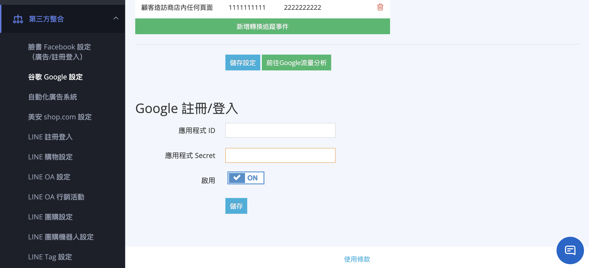
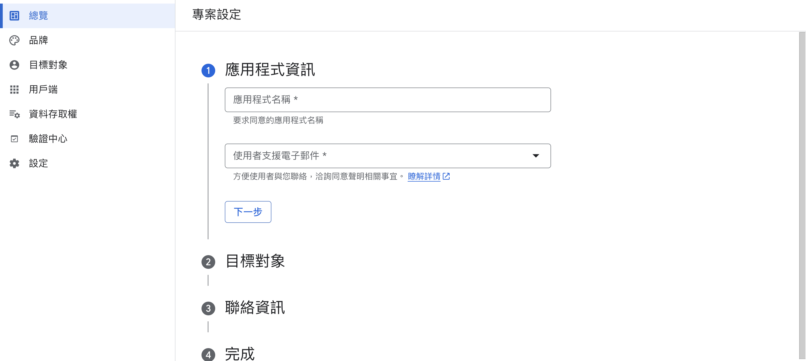
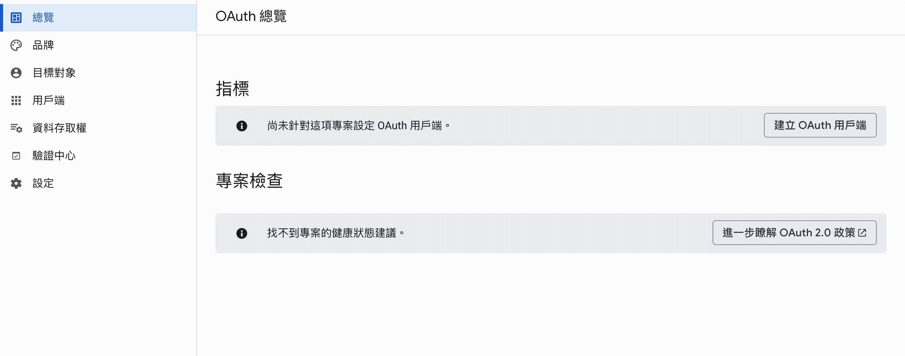
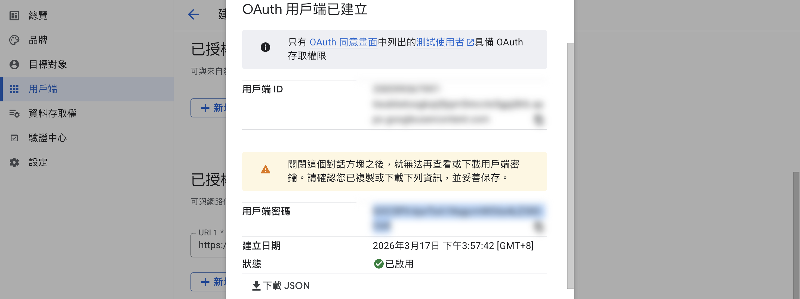
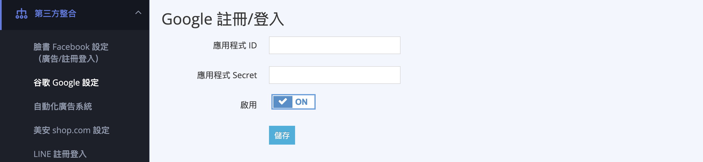
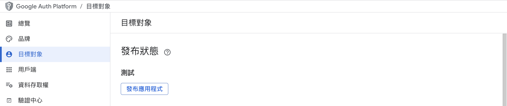

# 設定 Google 快速登入

{ .subtitle }

{ .doc-badge }

{ .hero-page }

## Google 快速登入說明

**「Google 快速登入」** 功能讓消費者在註冊或登入會員時，可以直接使用其 Google 帳戶進行一鍵操作，系統會自動根據消費者輸入的電子郵件信箱新增會員資料，或將其 Google 帳戶與現有會員資訊進行綁定。

## Google Cloud Platform 端設定

商家需先在 Google 開發者平台建立專案並取得串接所需的憑證資訊。

1.  **建立專案**：請參考 Google 官方指南 [建立 Google Cloud 專案 :lucide-external-link:](https://developers.google.com/workspace/guides/create-project?hl=zh-tw#google-cloud-console) 完成建立動作。
2.  **配置 OAuth 同意畫面**：依照 [設定 OAuth 同意畫面 :lucide-external-link:](https://developers.google.com/workspace/guides/configure-oauth-consent?hl=zh-tw#configure_oauth_consent) 指引完成設定。
    *   點擊「開始」進入專案設定頁。
    *   **應用程式資訊**：輸入應用程式名稱及使用者支援電子郵件。
    *   **目標對象**：選擇「**外部**」。
    *   **聯絡資訊**：輸入聯絡電子郵件地址並完成建立。

    

3.  **建立 OAuth 用戶端 ID**：請參考 [建立 OAuth 用戶端 ID 官方教學 :lucide-external-link:](https://developers.google.com/workspace/guides/create-credentials?hl=zh-tw#oauth-client-id)，並於設定過程中填入以下 CYBERBIZ 專屬參數
    *   點選「總覽」或「憑證」，點擊「**建立 OAuth 用戶端 ID**」。
    *   **應用程式類型**：選擇「**網頁應用程式**」。
    *   **已授權的重新導向 URL**：點擊「新增 URL」，輸入 `https://{你的商店網址}/customer/auth/google_oauth2/callback`。

    

4.  **取得金鑰**：建立後，系統會彈出視窗顯示「**用戶端編號**」與「**用戶端密碼**」，請複製這兩組資訊。

    

---

## CYBERBIZ 後台串接設定

取得金鑰後，需回到官網後台完成最後的開啟動作。

1.  **進入路徑**：前往管理後台的「**第三方整合**」>「**谷歌 Google 設定**」。
2.  **填寫資訊**：找到「**Google 註冊/登入**」區塊。
    *   將 Google Cloud 的「用戶端編號」填入後台「**應用程式 ID**」欄位。
    *   將 Google Cloud 的「用戶端密碼」填入後台「**應用程式 Secret**」欄位。

    

3.  **發布應用程式**：回到 Google Cloud Platform 側邊欄，點選「目標對象」，點擊「**發布應用程式**」，狀態確認無誤後即可完成。

    

## 完成設定畫面

完成設定，顧客即可於官網前台以 Google 帳戶註冊/登入網站。

## 重要注意事項與系統邏輯

*   **帳號合併機制**：若消費者使用 Google、LINE 或 Facebook 快速登入時輸入 **同一個電子郵件信箱**，系統會將其視為同一位會員，並在後台會員明細頁註明帳號類型。
*   **會員註記**：透過此方式註冊的會員，在後台「帳號類型」欄位會顯示為「**Google 快速登入**」。
*   **重新導向錯誤排除**：若消費者登入時出現錯誤，請檢查 Google 後台的「已授權的重新導向 URL」是否完整填入商店網址且格式正確。

## 後續操作

- :lucide-import:{ .lg }   
  [____]()     
  。

- :lucide-ban:{ .lg }     
  [____]()  
  。

## 常見問題

??? quote "設定完成後需要多久時間生效？"

    設定完成且發布應用程式後，消費者即可立即使用 Google 帳戶進行快速登入，無需等待時間。

??? quote "如果消費者登入時出現錯誤該怎麼辦？"

    請先檢查 Google Cloud Platform 的「已授權的重新導向 URL」是否已完整填入商店網址（格式為 `https://{你的商店網址}/customer/auth/google_oauth2/callback`），並確認狀態為已發布。

??? quote "消費者可以使用 Google 快速登入綁定現有會員帳號嗎？"

    可以。若消費者已具有會員帳號，使用 Google 快速登入輸入相同的電子郵件信箱，系統會自動將 Google 帳戶與既有會員資料進行綁定。

