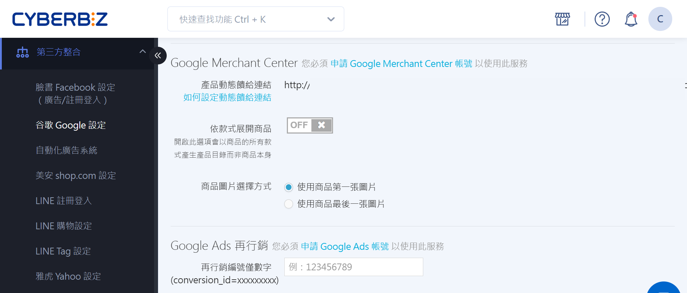
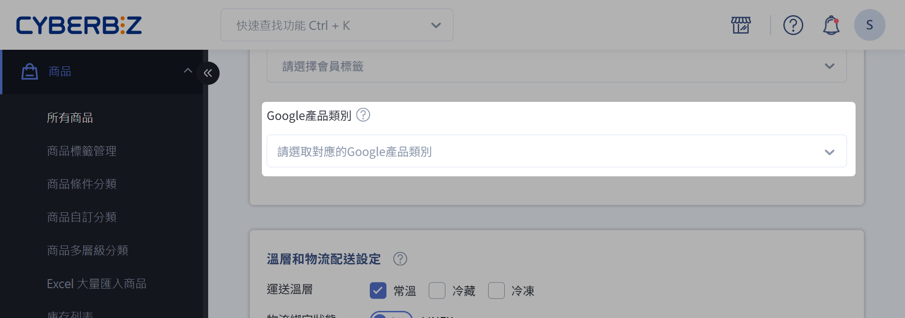
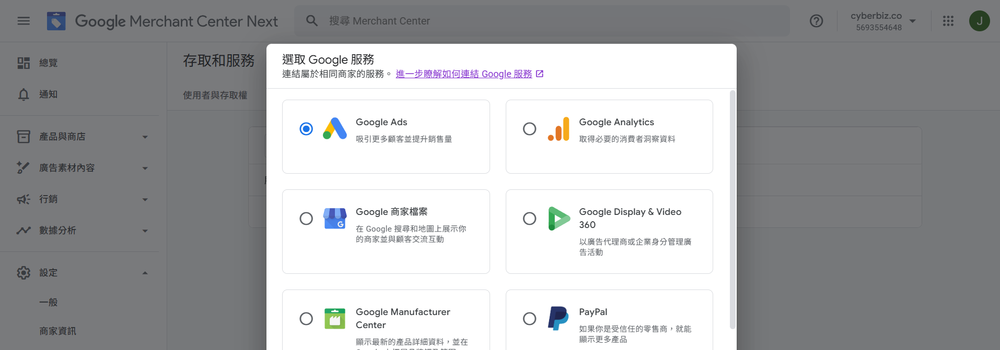

# 設定 Google 購物廣告
串接 Google Merchant Center (GMC)、同步商品資料至 Google 搜尋與購物廣告。
{ .subtitle }

{ title="串接 GMC：第三方整合 > Google > Google Merchant Center" .hero-page }

## 串接 GMC 的好處

Google Merchant Center (GMC) 是 Google 提供的商品資料上傳與管理平台，可將商家商品資訊整合至 Google 生態系統（如 Google 搜尋與 Google 購物廣告），以提升商品曝光、廣告成效與轉換效率，並支援自動化管理。

- **提升商品曝光**：商品會出現在 Google 搜尋結果的購物區塊，增加潛在顧客瀏覽量。
- **精準投放廣告**：搭配 Google Ads 推廣商品，鎖定目標受眾，提高轉換率。
- **自動化管理**：自動同步商品庫存、價格與圖片，減少手動維護工作。
- **數據追蹤與優化**：收集使用者互動與廣告成效資料，支援後續分析與優化。

## 設定商品資料同步方式

串接 Google Merchant Center 前，請先於 CYBERBIZ 後台設定相關欄位，以確保商品資料能正確傳送至 GMC。

1. 登入 CYBERBIZ 管理後台，前往 **第三方整合 > 谷歌 Google 設定**。
2. 在 **Google Merchant Center** 區塊，設定商品同步選項：
	- 依款式展開商品：選擇是否將每個商品款式都傳送至 GMC。  
    > 開啟 (ON)：適合需要讓每一種款式都單獨曝光（例如：不同顏色或尺寸的服飾、鞋款）。  
    > 關閉 (OFF)：適合僅需展示主要商品圖片的品項（例如：電子產品、家電、筆電）。
	
		!!! tip "最佳做法"
			若您的商品有多種變化屬性，建議開啟 *依款式展開商品* 讓每個選項都在 Google 上被個別展示，提升曝光機會。
			
	- 商品圖片選擇方式：設定 GMC 抓取哪一張圖片作為商品圖（可選第一張圖或最後一張圖）。
	> 為確保廣告正常投放，請確認商品圖片符合 [Google 產品資料規格](https://support.google.com/merchants/answer/6324350)。

		

		
		:material-check-circle: 符合規範：無浮水印
		{ .screenshot }

		:material-close-circle: 不符合規範：有浮水印 
		{ .screenshot }

		

	
1. 點擊 **手動更新目錄** 即時更新商品目錄，或由系統於每日凌晨 1:30 自動更新。

## 設定 Google 商品類別

為了讓商品能出現在更合適的搜尋結果中，建議您手動設定 Google 商品類別。透過自行選擇分類，可讓廣告投放與成效追蹤更加精準。

1. 登入 CYBERBIZ 管理後台，前往 **商品 > 所有商品**。
2. 點選欲設定的商品名稱進入編輯頁面，點擊 **設定** 頁籤。
3. 在 **Google 產品類別** 欄位選擇適用的產品類別。
> 若未手動設定，Google 會自動指定分類，但可能無法精確對應商品特性。  
> 可從 Google 提供的既有類別清單中選擇，無法自訂名稱或新增分類，目前無法批次套用。

    

4. 設定完成後，可至 **產品動態饋給連結** 查看結果。
	- 在 CYBERBIZ 管理後台，前往 **第三方整合 > 谷歌 Google 設定**。
	- 在 Google Merchant Center 區塊，找到 **產品動態饋給連結** ，複製該連結並貼到瀏覽器網址列，即可下載產品動態饋給檔案。

	

## 申請 GMC 帳號

!!! warning "注意事項" 
    若您要投放 Google 自動化廣告，請直接在自動化廣告設定頁創建 [CYBERBIZ 代管 GMC 帳號](設定自動化廣告.md#cyberbiz-代管)並設定廣告，無須另外自行申請 GMC 帳號。如此可避免因人員操作 GMC 帳號造成權限變更造成廣告投遞異常。

1. 進入 [Google Merchant Center :material-open-in-new:](https://www.google.com/retail/)，點擊 **立即開始**。
> 需要 Google 帳戶電子郵件地址和密碼才能建立 GMC 帳戶，且每個電子郵件地址僅限建立一個。

2. 依序設定以下資訊。

    === "新增商家地址"

        { .screenshot }

    === "確認網路商店"

        1.  輸入網路商店網址。
        2.  選擇 **新增 HTML 標記或檔案**。
        3.  選擇 **新增 HTML 標記**。
        4.  複製 **系統為網路商店產生的 HTML 標記** 程式碼。
        5.  登入 CYBERBIZ 管理後台，前往 **網站外觀 > 套版主題管理 > 選擇操作「CSS/HTML 編輯器」>「theme.liquid」**。
        6.  將 HTML 標記貼至 `</head>` 上方。

        { .screenshot }
        { .screenshot }

    === "新增產品運送方式"

        依步驟輸入商家配送資訊。

        { .screenshot }
        { .screenshot }
        { .screenshot }
        { .screenshot }

    === "新增退貨政策"

        依步驟輸入商家退貨政策。

        { .screenshot }
        { .screenshot }
        { .screenshot }

    === "新增產品"

        1. 選取國家/地區：選取商品適用的國家或地區。

            { .screenshot }

        ２. 複製產品動態饋給連結。
        > 前往 CYBERBIZ 管理後台，前往 **第三方整合 > 谷歌 Google 設定 > Google Merchant Center**，複製 **產品動態饋給連結**。

            { .screenshot }

        3. 貼上連結。
	        - 回到 GMC 後台，選擇 **透過檔案新增產品**。
            - 將 **產品動態饋給連結** 貼至 **請輸入檔案連結**。

            { .screenshot }

3. 待資料上傳後，可於產品頁查看完成畫面。
> 上傳所需時間依產品數量而有所不同，請稍待片刻。

    { .screenshot }

## 排除商品上傳至 GMC

系統會自動排除以下三種類型的商品，不會將其上傳至 Google Merchant Center。

| 商品類型      | 說明                          | 上傳至 GMC          |
| --------- | --------------------------- | ---------------- |
| 不公開的商品    | 商品顯示設定為 *眼睛關起來* :material-eye-off:| :material-close: |
| 已達下架時間的商品 | 系統已設定下架時間，商品自動排除            | :material-close: |
| 標籤排除商品    | 商品標籤設定為 `贈品` 或 `排除product feed`:lucide-asterisk:  :lucide-triangle-alert: *排除* 與 *product* 中間請勿添加空格 | :material-close: |

!!! info "含有 `贈品` 跟 `排除product feed` 標籤的商品亦不會出現在 Google 搜尋結果中。瞭解解更多[排除標籤相關設定](管理商品標籤.md#排除上傳至第三方平台標籤)。"

## GMC 串接 Google Ads 帳戶

1. 登入您的 Google Merchant Center 帳戶。
2. 在左側導覽選單中，依序點擊 **設定 > 存取權和服務 > 應用程式和服務**。
3. 點擊 **新增服務**，然後選取 **Google Ads**。
4. 選擇要連結的 Google Ads 帳戶。
5. 確認串接資訊正確後，點擊 **關聯**。

## 常見問題

??? quote "CYBERBIZ 代管 GMC 帳號與自行申請 GMC 帳號有何差異？"
    若選擇由 CYBERBIZ 代管 GMC 帳號，系統會自動處理相關設定與維護，避免因手動操作導致的權限變更或廣告投放異常。若您已透過自動化廣告設定頁創建廣告並選擇代管，請勿自行另外申請 GMC 帳號。

??? quote "哪些商品不會上傳至 Google 商品資料 (Product Feed)？"
    系統會自動排除不公開的商品、已達下架時間的商品，以及標籤設定為 *贈品* 或 *排除product feed* 的商品。

??? quote "Google 商品類別可以批次設定嗎？"
    目前 Google 商品類別需逐筆商品設定，無法批次套用。

## 延伸閱讀

- [排除特定商品上傳至 GMC](管理商品標籤.md#排除上傳至第三方平台標籤)
