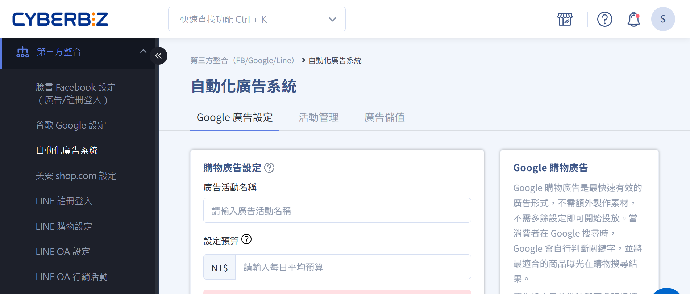
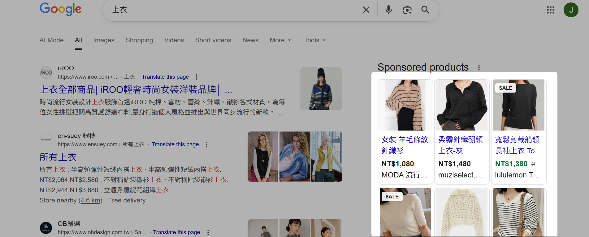
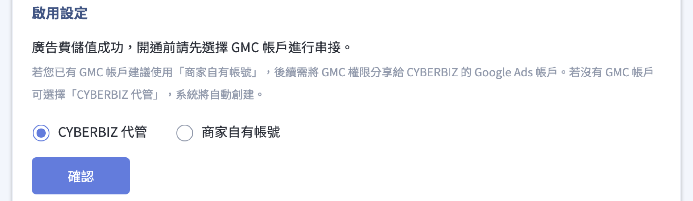
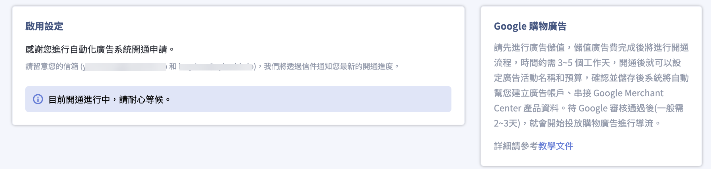
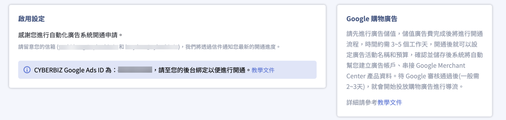
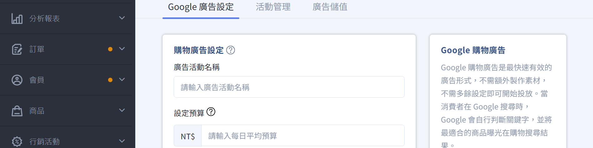
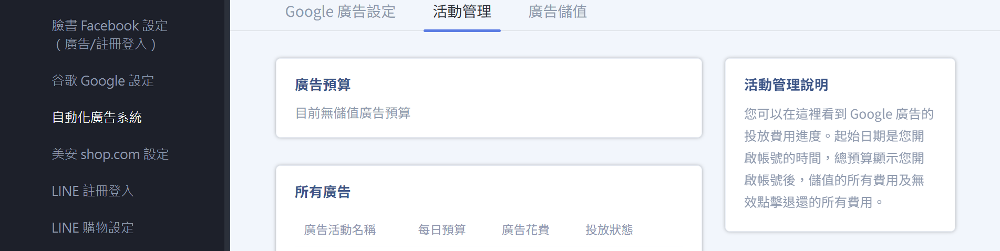
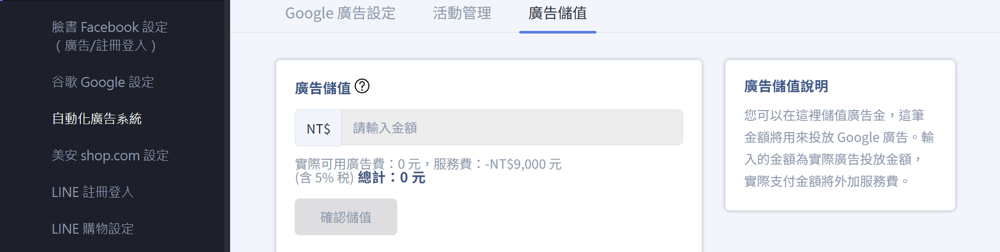

串接 Google 購物廣告，立即開始投放廣告。
{ .subtitle }

{ title="自動化廣告系統：第三方整合 > 自動化廣告系統" .hero-page }

## 自動化廣告系統說明

**自動化廣告系統** 主要串接 **Google 購物廣告**，其核心優勢在於商家無需額外製作廣告素材，系統會自動將官網商品資訊同步至 Google，讓產品在相關關鍵字搜尋結果中以圖卡形式曝光，藉此導入精準流量並促成購買。

### Google 購物廣告效果

1. 當有人在 Google 搜尋關鍵字時，若 Google 判斷該關鍵字跟您的產品相關 ，您的產品就會以產品圖卡的方式出現在搜尋結果頁。  
2. 使用者點擊廣告後，進入產品頁進行購物。 

## 申請開通步驟

1.  **進入路徑**：前往管理後台，點選 **「第三方整合」** > **「自動化廣告系統」**。
2.  **執行開通**：點擊「申請開通」按鈕，並完成 **廣告金儲值** 以啟動後續設定。完成儲值後，回到設定頁面進行下一步驟。

    

    !!! info "首次儲值免服務費，從第二次儲值開始將收取 5% 服務費。"

3.  **選擇 Google Merchant Center (GMC) 串接方式**：
    *   [**建立 CYBERBIZ 代管 GMC 帳號**](#cyberbiz-代管)：適合新手，若投放異常由系統端快速排查，但商家無法自行登入該 GMC 查看數據。
    *   [**串接商家原本的 GMC 帳號**](#商家自有帳號)：需手動輸入自有 GMC 編號，並依照教學完成 Google Ads ID 綁定動作。
   
    

    !!! warning "同一個網站只能聲明一個 GMC 擁有權，請勿隨意更換或重複申請，以免廣告錯誤。"

---

#### CYBERBIZ 代管

1. 啟用設定：點選 **CYBERBIZ 代管**。  
2. 若顯示 **網站所有權已被聲明** 提示，點擊 **確認** 繼續。點 **返回** 可改使用商家自有帳號。  
3. CYBERBIZ 會進行後續 GMC 聲明權轉移，請商家稍待開通。 

!!! warning "建立 CYBERBIZ 代管 GMC 帳號後，請勿自行另外申請 GMC 帳號，以免廣告投放異常。"
---

#### 商家自有帳號

1.  啟用設定：點選 **商家自有帳號**。
2. GMC 帳戶：輸入商家的自有 GMC 帳號 ( 為一串九位數代碼，可至 GMC 後台右上角查看 )。
3. 根據後台提示至 GMC 後台進行 Google Ads ID 綁定動作。

!!! info "系統將每日定時檢查商家是否綁定完成，綁定完成即開通。"

## 廣告與儲值設定

自動化廣告系統目前支援 Google 購物廣告活動。[系統開通後](#申請開通步驟)，從以下路徑進行相關設定：

1. 登入 CYBERBIZ 管理後台，前往 **第三方整合 > 自動化廣告系統。**
2. 依序設定相關頁籤：[Google 廣告設定](#google-廣告設定)、[活動管理](#活動管理)、[廣告儲值](#廣告儲值)。

---

### Google 廣告設定  

開通後可於該頁面自訂「廣告活動名稱」、設定「每日平均預算」，並可隨時切換「投放狀態」（開啟或關閉）。

- 廣告活動名稱：輸入廣告活動的名稱。
- 預算：每日廣告預算。如有行銷活動的規劃，建議您可以在活動檔期間將預算調高 2~4 倍，讓廣告發揮加乘效果。
- 投放狀態：選擇開啟/關閉廣告活動。

---

### 活動管理  

查看預算花費進度。  

- 廣告預算：查看廣告預算。
- 所有廣告：查看廣告設定資訊。

---

### 廣告儲值  

- 進行廣告金儲值。 
- 儲值後，發票將自動寄送到您留的電子信箱。

!!! info "首次儲值免服務費，第二次開始服務費為 5%。"

## Google 廣告商品設定最佳做法

商品資訊即是廣告內容，請務必遵守以下規範以確保審核通過：

- [x] **商品圖片**：不可包含宣傳文字、標語或品牌浮水印，應使用[純淨商品圖](../../products/creation/新增單一商品.md#google-圖片規範){ data-preview }。[瞭解 GMC 圖片規範 :lucide-external-link:](https://support.google.com/merchants/answer/6324350#Image_guidelines)
- [x] **商品名稱**：必須清楚且包含品牌名、規格（尺寸、顏色、型號）等關鍵資訊。
- [x] **禁止商品**：系統禁止投放成人內容、酒精飲料、受版權保護內容、賭博以及未經核可的醫藥補給品廣告。[瞭解 GMC 禁止的內容 :lucide-external-link:](https://support.google.com/merchants/answer/6149970?hl=zh-Hant#con)

## 成效追蹤與指標

商家可至 **「分析報表」** > **「廣告分析」** 查看即時數據。

*   **ROAS（廣告投資報酬率）**：這是最重要的指標，反映每花費 1 元廣告費帶來的營收比率。
*   **其他指標**：包含曝光數、點擊數、點閱率（CTR）、平均點擊成本（CPC）、轉換數與轉換率。

## 後續操作

- :lucide-chart-column-increasing:{ .lg }   
  [__成效追蹤與指標__]()     
  匯入編輯過的商品 Excel 檔案，同步更新多筆商品的商品描述與配送相關設定。

## 常見問題

??? quote "申請開通後，需要多久才能開始投放？"
	在後台申請開通廣告自動化系統後，約 3~5 個工作天即可開通，開通後會同步發 email 通知您 。

??? quote "為什麼廣告開始投放後，都還沒有看到廣告數據？"
	- Google 廣告審核需要約 3~5 天的時間，廣告審核通過後廣告會自動開跑，請您耐心等候。（如您的廣告一直沒有開始投放，請聯繫客服）
	- 如果您是使用自己的 GMC 帳號，請進入您的 GMC 帳號後台行檢查。 
	
      1. 至左側 **產品 > 診斷** 確認有效的商品項目是否有成功上傳產品。
      2. 至左側 **產品 > 動態饋給** 確認新增產品方式有無誤。可參考 [GMC 串接設定](設定 Google Merchant Center 並同步 CYBERBIZ 商品.md){ data-preview }
      3. 至左側 **成長 > 管理計畫 > 購物廣告**，點選 **開始使用/修正未完成的內容**。並且確認購物廣告計畫裡面的項目 *除了*  **新增帳單詳細資料** 與 **建立廣告活動** 外，其他項目皆是打勾狀態。

??? quote "每日廣告預算應該怎麼設定？"
	為了讓廣告跑出成效，建議每日預算最低不要少於 300 元。如果您有行銷活動的規劃，建議您可以在活動檔期間將預算調高 2~4 倍，讓廣告發揮加乘效果！

??? quote "為什麼有些天數的廣告花費會超過每日預算？"
	Google 會依據每日流量變化、截至目前的當月花費等因素，為您的支出進行最佳化，最高可達預算的兩倍。然而，整月的花費不會超過每日花費 x 30.4。詳情請見 [Google 說明文件 :lucide-external-link:](https://support.google.com/google-ads/answer/1704443)

??? quote "廣告儲值金要多久使用完畢？"
	無使用效期，但記得查看廣告剩餘預算，避免廣告被暫停。

??? quote "可以使用我自己的 Google Ads 帳號嗎？"
	不行。使用自動化廣告系統，CYBERBIZ 會為您建立專屬的廣告帳戶。

??? quote "可以使用我自己的 GMC (Google Merchant Center) 帳號嗎？"
	可以。若您想使用自己的 GMC 帳戶，須將自己的 GMC 權限分享給 CYBERBIZ 的 Google Ads 帳號。

