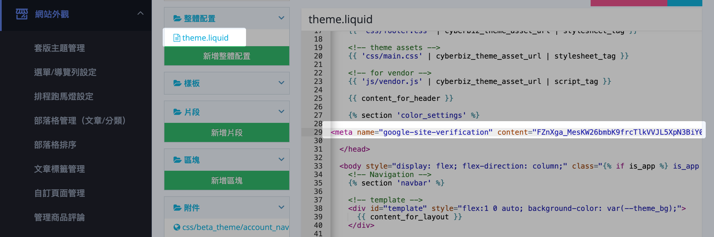

# 註冊並驗證 Google Search Console

在 Google Search Console 註冊並驗證網站擁有權，以監測網站搜尋表現。
{ .subtitle }

{ .hero-page }

## 為什麼要使用 GSC  

**Google Search Console (GSC)** 是 Google 提供的免費網站管理工具，驗證後可協助您：

- **監測搜尋表現**：查看網站在 Google 搜尋中的點擊次數、曝光次數與平均排名。
- **提交網站地圖**：主動通知 Google 您的網頁結構，加速索引收錄。
- **診斷 SEO 問題**：偵測爬蟲錯誤、行動裝置可用性問題與網頁索引狀態。
- **優化網站效能**：根據搜尋數據調整內容策略，提升自然流量。

!!! note "更多 Google Search Console 資訊，請參考 [官方說明 :lucide-external-link:](https://support.google.com/webmasters/answer/9128668?hl=zh-Hant)。"

## 操作前準備

- [x] **帳號統一**：請確保登入 Google Search Console 帳號與您的 Google Analytics (GA) 帳號為同一組，且具備該帳號管理員權限。
- [x] **網域設定**：建議先將官網後台的主網域設定為「自有網域」，並開啟「總是導向」功能，以確保搜尋引擎收錄的一致性。

## 註冊與驗證步驟

1. **進入 GSC**：前往 [Google Search Console :lucide-external-link:](https://search.google.com/search-console/) 頁面，點選「立即開始」。
2. **輸入網址**：在資源類型選擇介面中，點選右側的 **「網址前置字元」**，並輸入您的官網網址（需包含 https://）。
3. **選取驗證方式**：驗證方式請選擇 **「HTML 標記」**，系統會產生一段程式碼，請點擊旁邊的按鈕複製該代碼。

    

4. **埋設代碼至 CYBERBIZ 後台**：
    * 進入管理後台路徑：**「網站外觀」** > **「套版主題管理」** > 選擇操作 **「CSS/HTML 編輯器」** > 點擊左側的 **`theme.liquid`** 檔案。
    * 將剛才複製的 HTML 標記代碼貼在檔案內容中的 **`</head>`** 標籤前面，並儲存設定。

    

5. **完成驗證**：回到 Google Search Console 的頁面，點選 **「驗證」**。驗證完成後會跳出「已驗證擁有權」的彈窗，點擊「前往資源」即可開始查看數據。

## 後續操作

- :lucide-map:{ .lg }   
  [__提交網站地圖__](../../marketing/seo/將 Sitemap 提交至 Google Search Console.md){ data-preview }     
  註冊與驗證完成後，最重要且優先的動作是進行網站地圖 (Sitemap) 的提交。

## 常見問題

??? quote "為什麼要驗證 Google Search Console？"

    驗證 GSC 後，您才能使用該工具監測網站在 Google 搜尋中的表現、提交 Sitemap，並查看 SEO 相關數據（如點擊次數、曝光次數），是網站營運與優化的基礎。

??? quote "可以選擇其他驗證方式嗎？"

    可以的。GSC 提供多種驗證方式（如網域供應商、DNS 記錄等），本文件以 **HTML 標記** 為例，是最直覺且廣泛適用的方式。

??? quote "驗證失敗怎麼辦？"

    請確認已完成以下事項：

    - [x] HTML 標記已正確貼在 `</head>` 標籤之前
    - [x] 程式碼已儲存
    - [x] 網站頁面已重新載入

    若仍無法通過驗證，建議清除瀏覽器快取後再嘗試。
