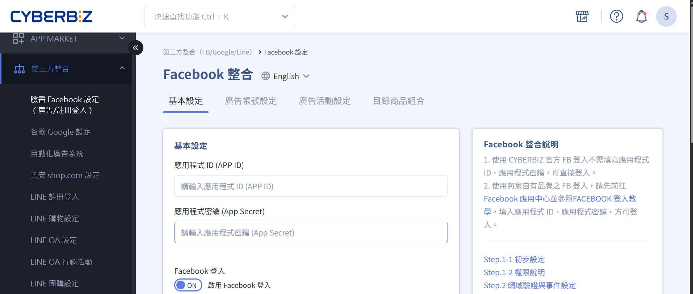

# 整合串接

{ .hero-page }

## Facebook

## Google

## LINE

---

=== "第三方平台整合"

	

	-   :material-google: __Google__

		---

	-   :lucide-facebook: __Facebook__
		 
		 ---

	-   :simple-line: __LINE__

		---

	-   :lucide-webhook: __第三方 API 串接__
	    
	    ---
	    

	    
	    [設定第三方 API](設定第三方API.md)  
	    [管理 API 金鑰與權限](API金鑰權限.md)  
	    [測試 API 串接](API測試.md)  
	    
	    

	
	-   :lucide-shopping-cart: __電商平台整合__
	    
	    ---
	    

	    
	    [串接蝦皮 / PChome](蝦皮PChome串接.md)  
	    [同步商品與訂單](商品訂單同步.md)  
	    [排除贈品與特殊商品](排除贈品同步.md)  
	    
	    

	
	-   :lucide-credit-card: __金流串接__
	    
	    ---
	    

	    
	    [串接第三方支付](第三方支付設定.md)  
	    [管理支付方式與狀態](支付方式管理.md)  
	    
	    

	
	

=== "APP MARKET"

	

	
	-   :material-clock-fast:{ .lg .middle } __Set up in 5 minutes__
	
	    ---
	
	    Install [`zensical`](#) with [`pip`](#) and get up
	    and running in minutes
	
	    [:octicons-arrow-right-24: Getting started](#)
	
	-   :fontawesome-brands-markdown:{ .lg .middle } __It's just Markdown__
	
	    ---
	
	    Focus on your content and generate a responsive and searchable static site
	
	    [:octicons-arrow-right-24: Reference](#)
	
	

=== "API"

	

	
	-   :material-clock-fast:{ .lg .middle } __Set up in 5 minutes__
	
	    ---
	
	    Install [`zensical`](#) with [`pip`](#) and get up
	    and running in minutes
	
	    [:octicons-arrow-right-24: Getting started](#)
	
	-   :fontawesome-brands-markdown:{ .lg .middle } __It's just Markdown__
	
	    ---
	
	    Focus on your content and generate a responsive and searchable static site
	
	    [:octicons-arrow-right-24: Reference](#)
	
	

	
=== "自動化流程"

	

	
	-   :lucide-repeat: __自動化任務__
	    
	    ---
	    

	    
	    [設定訂單自動化流程](訂單自動化流程.md)  
	    [自動更新庫存與價格](自動更新庫存價格.md)  
	    
	    

	
	-   :lucide-bell: __通知與 Webhook__
	    
	    ---
	    

	    
	    [設定 Webhook 通知](Webhook通知設定.md)  
	    [第三方系統事件推送](事件推送設定.md)  
	    
	    

	
	

=== "報表與監控"

	

	
	-   :lucide-bar-chart: __串接報表__
	    
	    ---
	    

	    
	    [整合第三方報表](第三方報表整合.md)  
	    [監控 API 呼叫與錯誤](API監控.md)  
	    
	    

	
	-   :lucide-pie-chart: __數據分析__
	    
	    ---
	    

	    
	    [跨平台銷售分析](跨平台銷售分析.md)  
	    [會員與訂單資料整合分析](會員訂單整合分析.md)  
	    
	    

	
	

=== "系統與權限"

	

	
	-   :lucide-key: __權限管理__
	    
	    ---
	    

	    
	    [控制 API 存取權限](API權限設定.md)  
	    [管理第三方整合操作權限](整合操作權限.md)  
	    
	    

	
	-   :lucide-shield-check: __安全管理__
	    
	    ---
	    

	    
	    [設定整合安全規則](整合安全規則.md)  
	    [異常串接與錯誤提醒](串接錯誤提醒.md)  
	    
	    

	
	

