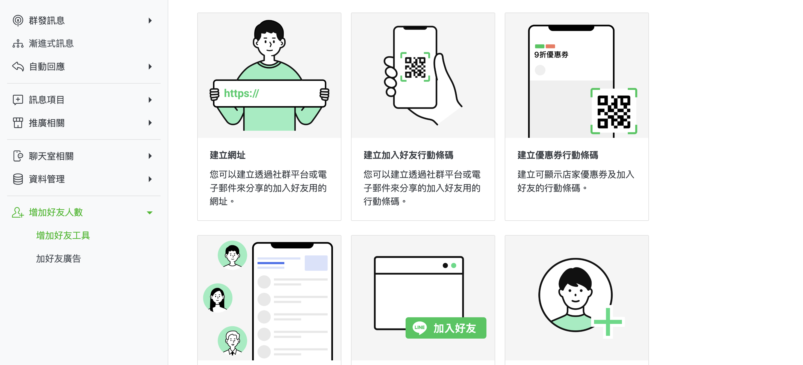
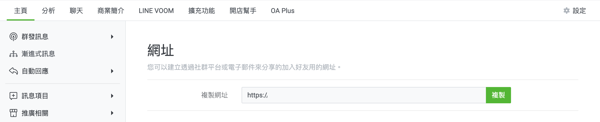

{ .subtitle }

{ .hero-page }

## LINE 加入好友工具說明

商家可以透過多種工具與版位引導顧客加入 LINE 官方帳號（LINE OA），以增加品牌與會員的黏著度。以下為 **LINE 增加好友工具** 的應用說明與教學：

## 前置準備：取得加入好友連結

在設定官網功能前，需先從 LINE 官方後台取得專屬連結：

1. 登入 [**LINE Official Account Manager** :lucide-external-link:](https://manager.line.biz/)。

2. 路徑：選擇帳號 >  **主頁 > 增加好友人數 > 加入好友指南 > 建立網址**。

3. 點選 **複製** 即可獲得該連結。

## 主動出擊：簡訊與 Email 好友邀請（企業版專用）

商家可以針對「尚未綁定 LINE OA」的官網會員發送邀請訊息：

1. **設定路徑**：後台「訊息推播」>「LINE OA 加入好友邀請」。

2. **發送管道**：可勾選【簡訊】（針對有手機號碼者）或【E-mail】（針對有 Email 者）。

3. **注意事項**：簡訊範本內容若超過 70 個字元會分封計費；若網址過長，建議使用第三方縮網址工具。

## 官網版位應用（拖拉版型設定）

透過官網視覺引導，讓瀏覽網頁的顧客隨時能點擊加入：

- **右側彈窗廣告**：

    - 設定路徑：後台「網站外觀」>「套版主題管理」>「網站設定」>「彈窗廣告」。

    - 應用：圖片建議使用「加入好友行動條碼（QR Code）」，圖片連結則填入從 LINE OAM 複製的網址。

- **頁腳 (Footer) ICON**：

    - 設定路徑：後台「網站外觀」>「套版主題管理」>「網站設定」>「頁腳」。

    - 應用：在【社群媒體設定】中開啟 Line 並填入連結。

- **選單/導覽列設定**：

    - 商家可至 LINE OAM 複製「建立按鈕」的語法，直接在官網選單中顯示加入好友圖片。

    - 設定路徑：後台「網站外觀」>「選單/導覽列設定」>「新增連結」（選擇外部連結並貼上網址）。

## 關鍵節點：訂單成立與付款完成頁

商家可在顧客購買完成後的「訂單成立頁」與「訂單付款完成頁」新增加入 LINE 好友的連結或圖片，這是轉換率極高的時機。

- **設定方式**：需先向 CYBERBIZ 客服申請開通，開通後可至 HTML/CSS 編輯器中的 `order_done_extra_content.liquid` 進行程式碼埋設。

## 誘因引導：綁定會員送優惠券

透過贈送優惠券提升顧客加入並綁定的意願：

1. **設定路徑**：後台「第三方整合」>「LINE OA 行銷活動」。

2. **功能開啟**：啟用「LINE @ 綁定贈送優惠券」並設定折扣種類（金額/百分比）與門檻。

3. **特定連結**：務必引導顧客透過 `https://你的網址/customer/auth/line?line_action=line_login` 進行綁定，系統才能正確判定並發券。

## 進階技術應用：LIFF (推薦)

**LINE LIFF** 是目前使用者體驗最佳的工具，能大幅縮短路徑：

- **核心功能**：消費者在 LINE 內點擊 LIFF 網址，可實現「**一鍵自動登入、同時加入好友、註冊會員並完成帳號綁定**」。

- **設定路徑**：後台「第三方整合」>「LINE 註冊登入」> 開啟「自動產生 LIFF 網址」。

- **應用建議**：商家應統一使用於後台生成的 LIFF 網址，並將其埋設在官網、圖文選單或推播訊息中，避免 iOS 用戶跳轉兩次瀏覽器的不佳體驗。

## 實體場景應用：門市助理

若有實體門市，店員可透過專屬 **QR Code** 引導顧客掃描，一次完成加入 LINE 好友、官網註冊與門市推薦人綁定。

## 後續操作

- :lucide-import:{ .lg }   
  [____]()     
  。

- :lucide-ban:{ .lg }     
  [____]()  
  。

## 常見問題

??? quote ""