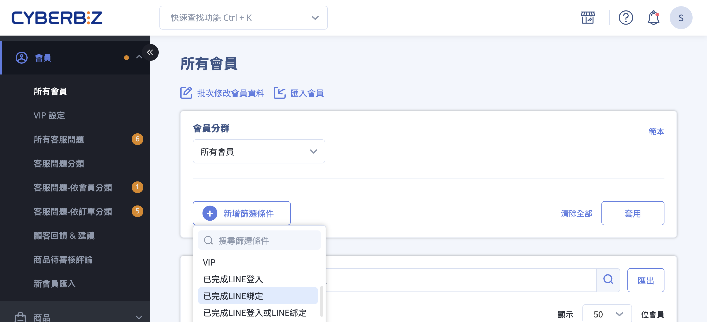
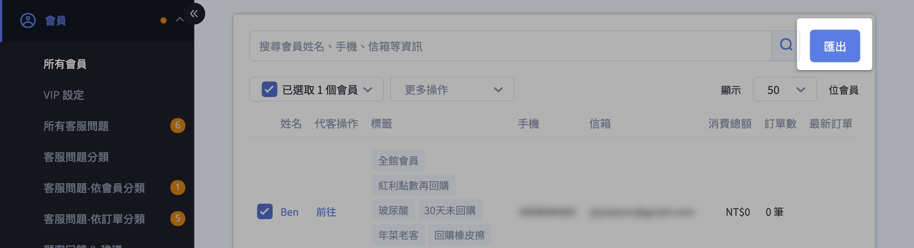

# 篩選與應用 LINE OA 綁定會員名單

使用會員篩選器找出 LINE OA 綁定會員，並匯出或用於行銷受眾。
{ .subtitle }

[:lucide-tag:{ title="適用方案" }](../../../resources/conventions#適用方案) | 進階 PLUS / 高手 PLUS / 企業
{ .doc-badge }

{ .hero-page }

## 篩選 LINE 綁定會員說明

您可以透過後台的會員篩選器，快速識別出哪些會員已經完成 [**LINE OA 官方帳號與官網會員的綁定**](綁定 LINE 官方帳號與官網會員.md){ data-preview } ，以便進行後續的分眾行銷或受眾打包。

以下是詳細的操作說明與教學：

## 篩選綁定名單

1. **進入路徑**：前往管理後台的 **會員 > 所有會員**。
2. **開啟篩選器**：點選搜尋欄位中的 **新增篩選條件** 或點擊輸入關鍵字處，系統會跳出篩選條件選單。
3. **設定篩選條件**：
    - 在下拉選單中找到 **已完成 LINE 綁定**（或 **綁定LINE@**）選項。
    - 依據需求選擇 **是**（找出已綁定者）或 **否**（找出尚未綁定者）。
4. **套用篩選**：點選 **套用** 後，下方列表即會顯示符合該條件的會員名單。

## 名單匯出與應用

1. **匯出至信箱**：
    - 篩選完成後，個別勾選欲匯出的會員，或一次勾選當頁所有會員後，點選 **匯出** 按鈕。
    - 閱讀注意事項並勾選同意，點擊 **同意匯出資料**。
    - 系統會將該份名單的 **Excel 檔** 寄送至指定的信箱中。

	

2. **打包 LINE 受眾 (企業版 / PLUS 版 專用)**：
    - 若您篩選的是「已綁定」的會員，可以在儲存該分群時，選擇將此包受眾 [**同步上傳至 LINE OA 後台**](設定 LINE OA 受眾串接.md){ data-preview }  ，用於精準的訊息推播或廣告投放。

## 後續操作

- :lucide-user-round-plus:{ .lg }   
  [__行銷應用__](../../notifications/發送 LINE 加入好友邀請.md){ data-preview }       
  對於「未綁定」的會員，商家可以利用簡訊或 Email 發送「LINE OA 加入好友邀請」，並提供優惠券來提升綁定率。

<!--
- :lucide-ban:{ .lg }     
  [____]()  
  。
-->

## 常見問題

??? quote "什麼是 LINE 綁定？"
	篩選器中的「已完成 LINE 綁定」是指會員已完成官網會員帳號與 LINE OA 帳號的連動。

??? quote "LINE 綁定跟 LINE 快速登入的差別？"
	透過「LINE 快速登入」的會員不一定有完成「LINE OA 綁定」，商家應引導會員完成綁定流程，才能使用 LINE 推播通知等進階功能。

??? quote "為什麼篩選出的「已綁定」人數，與 LINE OA 後台的好友數不一致？" 
	這通常是因為兩者的定義不同： 
	
	- **官網後台：** 顯示的是「已完成官網會員帳號與 LINE 帳號連動」的會員。 
	- **LINE OA 後台：** 顯示的是「所有加入好友」的人數（包含未註冊官網會員、或僅追蹤但未綁定者）。 此外，若會員在綁定後 **封鎖** 了您的 LINE 官方帳號，官網後台仍可能顯示為「已綁定」，但 LINE 後台則會將其排除在有效受眾外。

??? quote "我剛完成 LINE OA 串接，為什麼篩選不到任何已綁定會員？" 
	請檢查以下兩點： 
	
	1. **歷史資料：** 在串接完成「前」就已經加入 LINE 的好友，必須重新點擊選單中的「會員綁定」連結，系統才能完成身份比對。 
	2. **同步時間：** 若您是剛完成受眾打包，數據同步至 LINE 後台約需 **15-30 分鐘** 的處理時間，建議稍後再前往 LINE Official Account Manager 查看。

??? quote "可以使用「手機門號」或「Email」來篩選尚未綁定的 LINE 會員嗎？" 
	可以。您可以先在「所有會員」中使用篩選器設定「已完成 LINE 綁定：**否**」，接著匯出該名單。這份名單即包含所有未綁定會員的聯繫資訊，您可據此進行簡訊 (SMS) 或 EDM 導流。

??? quote "為什麼我的後台沒有「同步上傳至 LINE OA」的選項？" 
	此功能為 **進階 PLUS / 高手 PLUS / 企業版** 專屬功能。若您的方案符合但仍未看見選項，請確認： 
	
	1. 是否已在「第三方整合」完成 LINE OA 的 **Messaging API** 正確串接。 
	2. 您的後台權限是否具備「會員匯出」或「行銷受眾打包」之權限。
