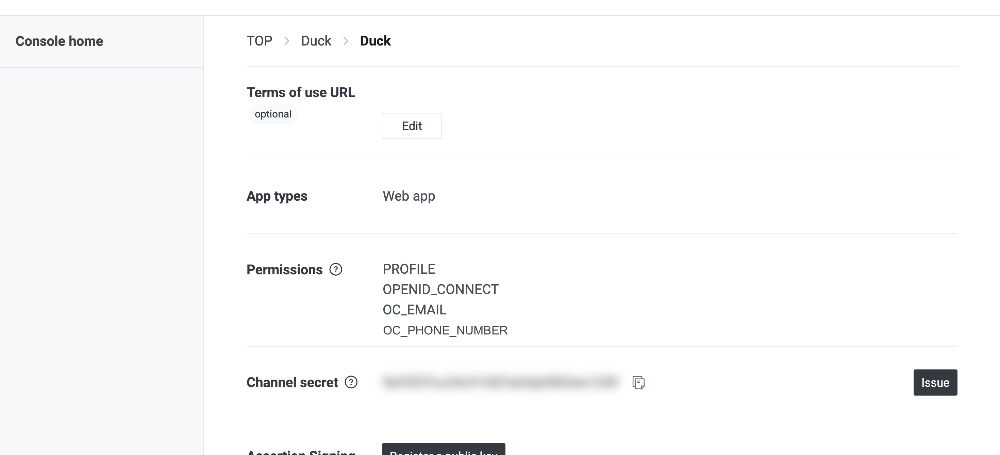
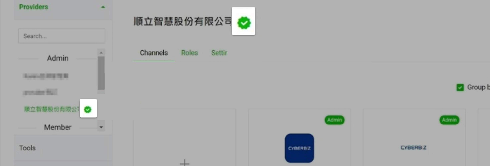
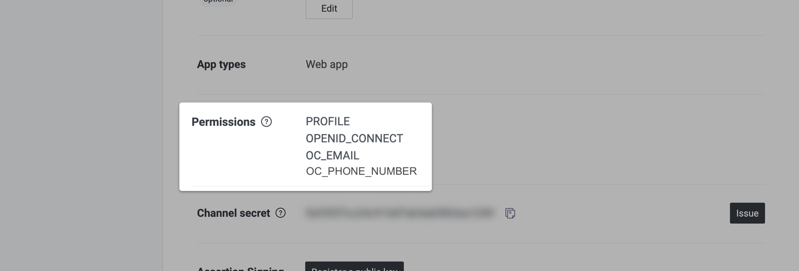
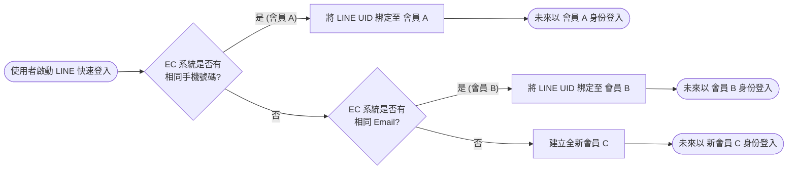
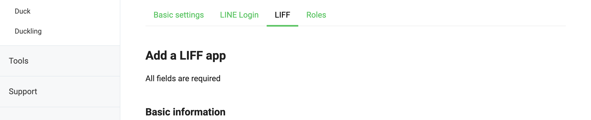
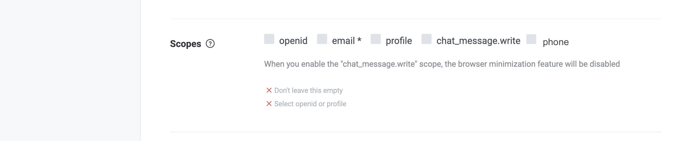

# 設定 LINE 快速登入時取得會員手機號碼

串接 LINE 認證權限，在快速登入流程中自動取得並驗證會員手機號碼，以提升帳號比對精準度與資料完整性。
{ .subtitle }

{ .hero-page }

## 什麼是 LINE 快速登入時取得會員手機號碼 

**LINE 快速登入時取得會員手機號碼** 是一項進階功能，能協助商家在顧客使用 LINE 登入時取得手機號碼授權，藉此建立或更新官網會員資料。

以下為該功能的詳細說明與設定教學：

## 設定前置必備條件

商家必須同時符合以下三個條件，方可使用此功能：

- [x] [**完成 LINE 快速登入串接**](設定 LINE 快速登入.md){ data-preview }  ：官網後台已完成基礎的 LINE 登入功能設定。

- [x] **LINE Provider 認證**：您的 LINE Provider 必須已通過認證，成為 **LINE Certified Provider**。

	- 若您尚未擁有 LINE Certified Provider 的資格，可洽詢您配合的 [LINE 合作夥伴 :lucide-external-link:](https://tw.linebiz.com/partner/sales-partner/)，或參閱 [申請說明文件](https://drive.google.com/file/d/1oSF07fHFdx_s4gXVhDv0zw81Su3usQKY/view?usp=sharing)。
	-  註：根據 LINE 規範，僅開放「公司、商行、商號」申請認證，個人、農場或財團法人無法申請。

- [x] **LINE 官方帳號認證**：您的 LINE 官方帳號必須為 **藍色盾牌（認證帳號）** 或 **綠色盾牌（企業帳號）**。
	- 瞭解 [LINE 帳號等級差異 :lucide-external-link:](https://tw.linebiz.com/column/lac-verified/)。
	- 參閱 [LINE 認證官方帳號申請流程 :lucide-external-link:](https://tw.linebiz.com/column/line-lac-id-0418/)。

## LINE 開發者後台資格確認

請登入 [LINE Developers :lucide-external-link:](https://developers.line.biz/) 進行以下確認：

1. **確認 Provider 狀態**：在 Provider 首頁確認該項目旁是否有認證標章（綠色勾號）。

	
	
2. **檢查權限設定**：

	- 點選與官網串接的 **LINE Login Channel**。
	
	- 進入 **Basic Settings** 頁籤，向下捲動至 **Permissions** 位置。

	- 確認權限清單中包含 **OC_PHONE_NUMBER**。

	
	
## 系統比對邏輯與情境

一般的 LINE 快速登入僅會抓取會員的 Email 進行帳號比對，但開啟此功能後，系統的處理邏輯會變更為：

- **比對順序**：系統會 **先進行「手機號碼」比對**，若無匹配結果，再進行「Email」比對。

- **適用對象**：此功能適用於手機號碼已在官網註冊過或未註冊過的會員。

### 邏輯流程圖

此圖表展現系統判斷的優先權：**手機號碼 (Priority 1) > 電子郵件 (Priority 2) > 建立新帳號**。

??? example "情況 A：手機號碼「已存在」於 EC 系統"

	當 LINE 帳號的手機號碼與 EC 系統中 **會員 A** 的手機號碼一致時：

	|**觸發情境**|**LINE 帳號 Email 狀態**|**系統處理動作 (UID 綁定)**|**未來登入狀態**|**備註**|
	|---|---|---|---|---|
	|**情境 1**|已註冊於 EC，且屬於 **會員 A** |將 LINE UID 綁定至 **會員 A**|等同 **會員 A** 登入|最理想的完全比對狀態。|
	|**情境 2**|已註冊於 EC，但屬於 **他人**|將 LINE UID 綁定至 **會員 A**|等同 **會員 A** 登入|**不存取** 該 LINE Email，以手機號碼比對為準。|
	|**情境 3**|未註冊於 EC|將 LINE UID 綁定至 **會員 A**|等同 **會員 A** 登入|**不存取** 該 LINE Email。|

??? example "情況 B：手機號碼「不存在」於 EC 系統"

	當 LINE 帳號的手機號碼尚未在 EC 系統註冊過時：
	
	|**觸發情境**|**LINE 帳號 Email 狀態**|**系統處理動作 (UID 綁定)**|**未來登入狀態**|**備註**|
	|---|---|---|---|---|
	|**情境 1**|已註冊於 EC (屬於 **會員 B** )|將 LINE UID 綁定至 **會員 B**|等同 **會員 B** 登入| **不存取** 該 LINE 手機號碼，以 Email 比對為準。|
	|**情境 2**|未註冊於 EC|**建立新會員 C**|等同 **新會員 C** 登入|同時存取 LINE 的 Email、手機與 UID 建立新資料。|

## 搭配 LIFF 應用

[:lucide-tag:{ title="適用方案" }](../../../resources/conventions#適用方案) | PLUS / 企業
{ .doc-badge }

若商家具備 LINE Certified Provider 資格，還可以透過 **LIFF** 功能進一步蒐集手機資訊：

1. 前往 [LINE Developers 後台 :lucide-external-link:](https://developers.line.biz/) 。
2. 進入對應的 Channel，切換至 **LIFF** 頁籤。

	

3. 在 **Scopes (權限範圍)** 區塊中，勾選 **phone** 選項。

	

4. **設定後的實際效果：**
	
	- **顧客端：** 會員點擊 LIFF 連結時，授權畫面將額外出現「請求手機號碼」項目。

	- **商家端：** 系統將自動取得該會員於 LINE 綁定的手機號碼，並實現 **自動登入、同步完成官網會員綁定** 的極速流程。

!!! info "關於 LIFF 的完整設定說明，請參閱 [如何設定 LIFF 自動登入](設定 LIFF 自動登入與會員綁定.md){ data-preview }。"

## 重要注意事項

- **非追溯性**：此功能 **不包含** 取得「功能設定完成前」已進行過 LINE 快速登入的會員手機號碼。

- **驗證通知**：若商家在顧客註冊設定中開啟了「註冊時驗證電話」，系統會發送簡訊驗證碼，此過程會產生簡訊費用（扣除 **1 點 CYBER 幣**）。

- **隱碼保護**：列印訂單明細時，若商家有開啟安全設定，取得的手機號碼會以隱碼（例如 `093******3`）顯示以保護個資。

## 常見問題

??? quote "若 LINE 的手機號碼與官網紀錄不一致，系統如何處理"
	系統採 **「手機號碼優先」** 策略。若 LINE 提供的手機號碼已存在於系統（會員 A），無論其 Email 為何，皆會強制綁定至會員 A。若該號碼完全無紀錄且 Email 也未註冊，則視為新客建立資料。

??? quote "開啟功能後，舊有的 LINE 登入會員會自動補齊手機號碼嗎" 
	**不會。** 此功能不具備追溯性。系統僅能在功能啟用後、會員「下次重新授權登入」時，透過 API 取得當下的手機資訊。

??? quote "為何 LINE Developers 後台未顯示 `OC_PHONE_NUMBER` 選項" 
	此權限具備硬性門檻：您的 Provider 必須具備 **LINE Certified Provider（認證提供者）** 資格（顯示綠色勾號標章）。若資格不符，該權限欄位將不會出現在管理介面中。

??? quote "顧客拒絕手機號碼授權時，是否會導致登入失敗"
	**不會。** 登入流程仍可完成，但系統會因無法取得手機號碼而自動降級（Fallback）至「僅以 Email 比對」的標準模式。

??? quote "使用此功能是否會產生額外費用" 
	功能本身免費，但若商家開啟了「註冊時驗證電話」設定，系統在建立新會員帳號時會發送驗證簡訊，每則將扣除 **1 點 CYBER 幣**。

??? quote "後台顯示的手機號碼為何部分被遮蔽（如 `0912***456`）"
	這是系統的 **隱碼保護機制**。若商家啟用了個資安全設定，系統會自動在報表與明細中隱藏部分號碼以符合合規要求。