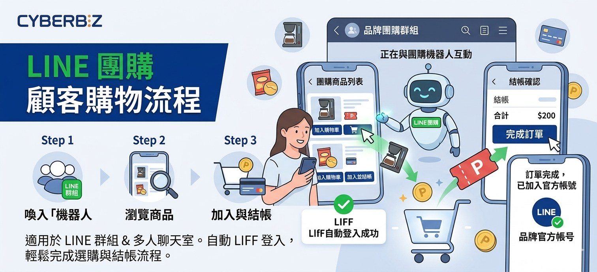
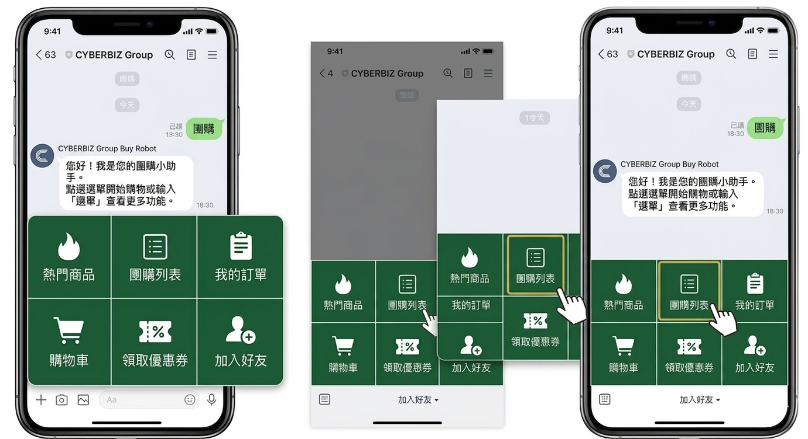
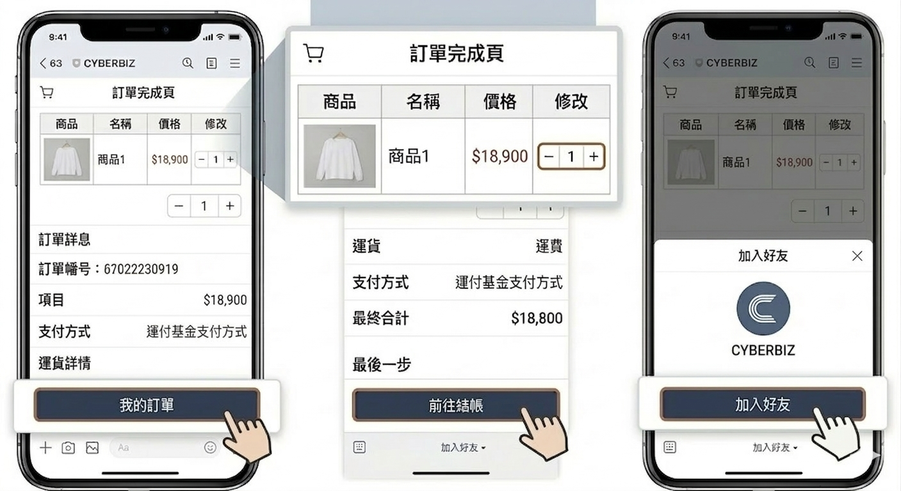

# 使用 LINE 團購進行購物

顧客如何在 LINE 群組中透過團購機器人瀏覽商品、加入購物車並完成訂單結帳流程。
{ .subtitle }

[:lucide-tag:{ title="適用方案" }](../../../resources/conventions#適用方案) | 企業
{ .doc-badge }

{ .hero-page }

## LINE 團購購物說明

LINE 團購功能的顧客即為 **LINE 群組或多人聊天室的成員**。顧客主要透過與 **團購機器人** 互動來進行選購與結帳。

以下為顧客操作 LINE 團購的詳細教學：

## 前置需求

在引導顧客使用團購功能前，請確保商家後台已完成以下配置：

- [x] **團購機器人設定**：已完成 [LINE 團購機器人設定](設定 LINE 團購機器人.md){ data-preview }，並成功加入目標群組。
- [x] **團購商品設定**：已完成 [LINE 團購商品設定](設定 LINE 團購商品.md){ data-preview }，並設定好團購價。
- [x] **團購群組設定**：已完成 [LINE 團購群組設定](設定 LINE 團購群組.md){ data-preview }，並設定好商品分類、分潤跟活動期間。

## 如何喚起團購功能

顧客可以透過以下兩種方式開始購物：

1.  **呼叫團購機器人選單**：
    *   在 LINE 群組中輸入「**團購**」，系統會呼叫出團購機器人的圖文選單。
    *   點選選單中的「**團購列表**」即可查看目前活動中的商品。
2.  **輸入關鍵字自動回覆**：顧客可以直接輸入特定文字來觸發對應功能：
    *   輸入「**選單**」：喚出主選單。
    *   輸入「**團購**」：直接進入商品瀏覽頁面。
    *   輸入「**加入好友**」：獲取加入品牌官方帳號的連結。

## 瀏覽與挑選商品

進入團購商品列表後，顧客的操作流程如下：

*   **瀏覽商品**：點選欲購買的商品圖，若商品較多可點選「**顯示更多商品**」。
*   **查看詳情**：點擊商品的「放大鏡」按鈕，可進入商品詳情頁查看規格與描述。
*   **挑選動作**：
    *   點選「**加入購物車**」：將商品存入清單並繼續選購其他項目。
    *   點選「**加入並結帳**」：直接跳轉至結帳頁面。

## 結帳與付款流程

1.  **進入購物車/結帳頁**：
    *   顧客可以點選機器人選單中的「**前往結帳**」。
    *   在結帳頁面中，顧客可以返回上一頁繼續選購，或手動修改購物清單中的數量。
2.  **確認金額與下單**：
    *   滑至頁面最下方確認結帳總額後，點擊前往結帳。
    *   **請注意**：團購購物車內部的商品金額已是團購優惠價，因此 **不開放搭配官網內的一般行銷活動**（如全館折扣、滿額贈等）使用。
3.  **完成訂單**：
    *   付款完成後，系統會自動跳轉至「加入好友頁」，引導顧客加入品牌的 LINE 官方帳號，將群組成員轉化為品牌好友。

## 操作注意事項

*   **適用環境**：此功能僅限於 **LINE 群組** 或 **多人聊天室** 使用。由於 LINE 社群 (OpenChat) 具有匿名性，目前並不支援在此類環境操作。
*   **帳號綁定**：系統會透過 LIFF 技術自動套用顧客的 LINE 帳戶資訊進行快速登入，讓購物流程更流暢。

## 常見問題

??? quote "為什麼我在 LINE 社群 (OpenChat) 輸入「團購」卻沒有反應？"
    目前 LINE 團購機器人 僅支援「LINE 群組」與「多人聊天室」。由於 LINE 社群具備匿名性，LINE 官方 API 限制了機器人在該環境下的部分功能與資訊讀取，因此無法使用。

??? quote "團購訂單可以使用官網的折價券或紅利點數嗎？"
    不可以。 由於團購商品已套用專屬的「團購優惠價」，為了避免折扣重疊，團購購物車內部的金額為最終優惠價，不支援搭配官網的一般行銷活動（如：全館折扣、滿額贈、折價券、紅利扣抵等）。

??? quote "顧客點擊「前往結帳」後顯示登入失敗或空白頁面？"
    請確認以下兩點：

    - LIFF 設定：請檢查後台的 LINE 登入授權是否正常開啟。
    - 瀏覽器環境：請顧客確保是在 LINE App 內直接打開連結，而非複製網址到外部瀏覽器（如 Safari 或 Chrome）執行，以確保 LIFF 自動登入機制生效。

??? quote "顧客下單後，商家要去哪裡查看這筆訂單？"
    商家可登入 CYBERBIZ 管理後台 > 訂單管理 > 所有訂單，透過搜尋篩選「訂單來源」或查看訂單標籤，即可識別來自 LINE 團購管道的專屬訂單。詳情請參考 [如何查看 LINE 團購訂單](設定 LINE 團購群組.md#訂單查看與紀錄管理){ data-preview }。

??? quote "團購機器人可以同時在多個群組運作嗎？"
    可以。 只要機器人有被邀請進入該群組，且商家後台已完成該群組的綁定與活動設定，機器人即可在多個群組同時提供導購服務。
