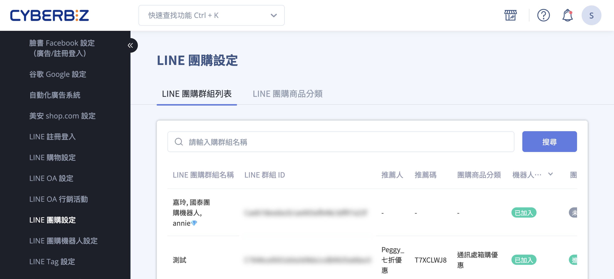
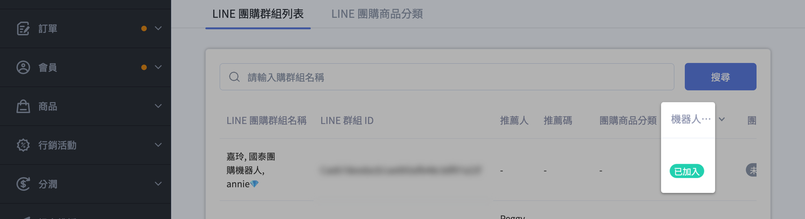
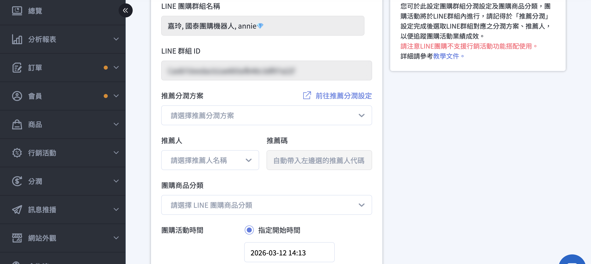
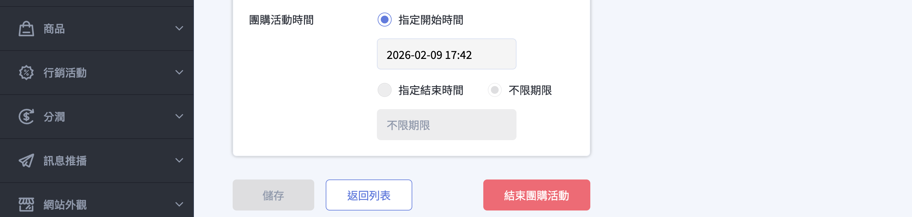
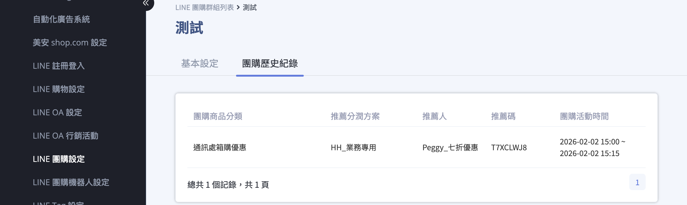

# 設定 LINE 團購群組

設定 LINE 團購群組的分潤方案、商品分類與活動時間，讓團購主可在指定的 LINE 群組中進行團購活動。
{ .subtitle }

[:lucide-tag:{ title="適用方案" }](../../../resources/conventions#適用方案) | 企業
{ .doc-badge }

{ .hero-page }

## LINE 團購群組說明

**「LINE 團購群組設定」** 是 LINE 團購功能的核心環節，商家可在此設定群組對應的分潤方案、代碼，管理活動內容並查看歷史紀錄。

以下為 LINE 團購群組設定的詳細操作說明：

## 前置必要作業

在編輯群組內容前，商家必須先依序完成以下三項設定：

- [x] [**LINE 團購機器人設定**](設定 LINE 團購機器人.md){ data-preview }：建立專屬機器人並完成 Messaging API 與 LIFF 串接。
- [x] [**推薦分潤代碼設定**](../../../profit-sharing/設定推薦人分潤方案.md){ data-preview }：於分潤系統中設定好「推薦人分潤」方案。
- [x] [**團購商品分類設定**](設定 LINE 團購商品.md){ data-preview }：選取欲販售的商品並設定團購價。

## 新增 LINE 團購群組

1.  商家需先請團購主（團主）將「團購機器人」加入其 LINE 官方帳號好友。
2.  由團購主將 **團購機器人邀請進入特定的 LINE 團購群組**。
3.  機器人加入群組後，系統會自動在後台「群組列表」中 **自動新增** 該群組名稱及群組 ID（機器人狀態顯示 `已加入`）。
4.  請注意，**一個 LINE 群組一次只能存在一支機器人**。

## 編輯群組活動內容

1.  **進入設定**：在後台團購群組列表中選定目標群組，點選「編輯」:lucide-square-pen: 進入「基本設定」頁。
2.  **綁定分潤**：選取該群組活動對應的 **「推薦分潤方案」、「推薦人」及「推薦碼」**。
3.  **套用商品**：選取該活動要套用的「**團購商品分類**」。
4.  **設定時間**：設定活動的起始時間。若未修改預設的「指定開始時間」，則活動將從點選「儲存」的那一刻開始計算。
    *   *註：若活動尚未開始，可隨時更新時間；活動開始後則無法變更，僅能提前結束。*

## 結束團購活動的情況

團購活動會因以下三種情況而結束：

-  **手動結束**：在「基本設定」中點選「結束團購活動」。
    *   *手動結束後，系統僅保留群組名稱與 ID，若要重開活動需重新設定其餘欄位。*
-  **時間到期**：到達原本設定的「指定結束時間」。
-  **機器人退群**：當團購機器人被移出該 LINE 群組時，活動也會終止。

## 訂單查看與紀錄管理

*  **查看訂單**：商家可前往「**訂單**」>「**所有訂單**」，展開篩選器並選擇「**LINE 團購**」來查看專屬訂單。

    

*  **歷史紀錄**：活動結束後，該筆資料會移至編輯頁面中的「團購歷史紀錄」，方便商家隨時回顧群組過往的活動表現。

    

*  **分潤查詢**：若團購主需查看下單情形，商家可提供 [分潤報表下載連結](../../../profit-sharing/查詢分潤夥伴與代碼資訊.md#任務三提供第三方推薦人外部查詢連結){ data-preview } 供其查閱。

## 常見問題

??? quote "為什麼我的 LINE 群組沒有出現在後台清單中？"

    請確認以下兩點：

    1. 機器人是否已成功加入該 LINE 群組？（必須由團主主動邀請進入）。
    2. 加入後，請在群組內隨意輸入一段文字（如：`哈囉`），觸發機器人與系統的首次連線，系統才會自動同步群組 ID 至後台。

??? quote "如果團購主不小心把機器人踢出群組，活動會消失嗎？"
    機器人退群後，**當前活動會立即終止**。雖然過往的訂單紀錄會保留在「歷史紀錄」中，但若要重新啟動，必須重新邀請機器人入群並再次進行「基本設定」與「綁定商品」。

??? quote "一個 LINE 團購群組可以同時跑多個分潤方案嗎？"
    **不可以。** 一個群組在同一時間只能綁定一個「推薦碼」與一套「團購商品分類」。若有新的檔期需求，請先結束舊活動後再重新設定。
