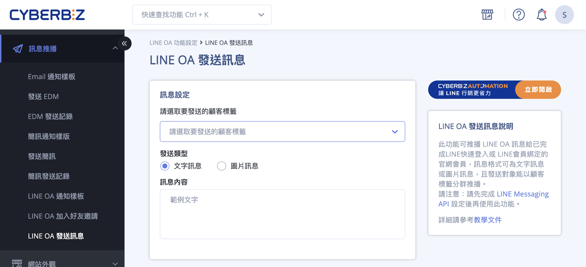

# 設定與發送 LINE OA 分眾訊息推播

設定並發送 LINE OA 分眾訊息推播給指定標籤會員。
{ .subtitle }

[:lucide-tag:{ title="適用方案" }](../../../resources/conventions#適用方案) | 專業 PLUS / 進階 PLUS / 高手 PLUS / 企業  
[:lucide-grid-2x2-plus:{ title="適用擴充" }](../../resources/conventions#適用擴充) | AUTOMATION 
{ .doc-badge }

{ .hero-page }

## LINE OA 分眾訊息推播說明

**「LINE OA 分眾訊息推播」** 功能讓商家可以針對特定標籤的會員發送精準訊息，提升轉換率並節省不必要的訊息費用。

以下為詳細的操作說明與教學：

## 前置必要作業

在使用分眾推播功能前，必須確保完成以下設定：

- [x] [**串接 Messaging API**](串接 LINE Messaging API.md){ data-preview }：商家必須先完成 LINE Messaging API 的串接設定，方可透過 CYBERBIZ 後台發送訊息。
- [x] **收集會員 UID**：訊息僅能發送給曾透過 **「[LINE 快速登入](設定 LINE 快速登入.md){ data-preview }」** 或 **「[已綁定 LINE OA](綁定 LINE 官方帳號與官網會員.md){ data-preview }」** 的官網會員，因為這些行為才會在官網系統留下發送訊息所需的 UID。
- [x] **好友狀態確認**：僅有 **LINE OA 的好友**（且未封鎖官方帳號者）才能成功收到訊息。
- [x] **訊息費用**：LINE 推播服務會根據您在 LINE 官方帳號設定的訊息方案計費，手動推播與自動通知皆屬付費項目，僅發送成功的訊息會計費。

## 手動發送分眾訊息步驟

1.  **後台路徑**：進入管理後台，點選 **訊息推播 > LINE OA 發送訊息**。
2.  **設定顧客標籤**：在「顧客標籤」欄位勾選您欲傳送的對象（此為必填）。系統會自動篩選出符合標籤且具備 UID 的會員。
3.  **選擇發送類型**（一次僅能選擇一種模式）：
    *   **文字訊息**：支援換行與 **emoji**，不限制字元數。點擊送出後會立即排程發送。
    *   **圖片訊息**：上傳單張圖片（建議規格：**1MB 以內、1000x1000px**，支援 JPG/PNG/JPEG/GIF），並可設定圖片點擊後導轉的連結。

## 後續操作

- :lucide-zap:{ .lg }   
  [__進階自動化推播__](../../app-market/automation/使用 AUTOMATION 建立自動化推播流程.md){ data-preview }  
設定自動發送訊息給「VIP 會員」、「潛在忠誠顧客」、「沉睡客戶」或針對「未結帳購物車」進行提醒。

## 常見問題

??? quote "為什麼會員有 UID 記錄，卻沒有收到 LINE 推播訊息？"
    訊息發送失敗通常歸類為以下三大原因，請依序排查：

    1. 顧客狀態限制 (使用者端)

        - [ ] **好友關係中斷**：會員雖曾綁定 UID，但目前已 **封鎖** 該官方帳號，或已 **刪除** 好友。
        - **帳號非好友**：會員僅在官網完成 LINE 登入，但未曾加入您的 LINE 官方帳號。

    2. 商家設定與額度 (商家端)

        - **LINE 訊息額度用盡**：請檢查 LINE Official Account Manager 後台的「訊息使用量」，若當月免費或付費額度已達上限，訊息將無法送出。
        - **API 串接失效**：請確認 Messaging API 的 Channel Access Token 是否有效，或是否曾在 LINE 後台更動設定導致斷連。

    3. 發送邏輯過濾 (系統端)

        - **重複發送限制**：若使用 AUTOMATION 流程，請檢查是否設定了「指定天數內不重複發送」，系統會自動排除近期已收過訊息的會員。
    
??? quote "手動發送與 AUTOMATION 自動化發送的訊息額度如何計算？"
    無論是手動推播還是透過 AUTOMATION 觸發，皆屬於 Messaging API 推播訊息。

    * 費用完全依照您與 LINE 簽署的官方帳號方案（低/中/高用量）計費。
    * 僅發送成功的訊息會列入計費，若因封鎖導致發送失敗則不計費。
