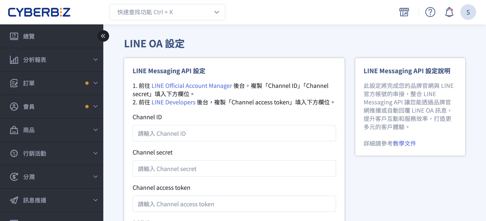
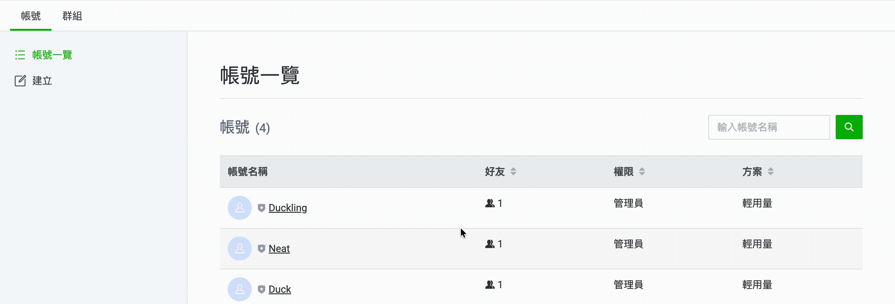
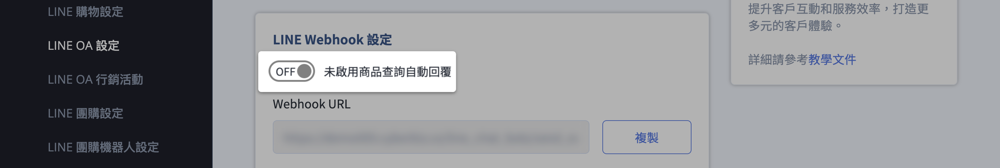
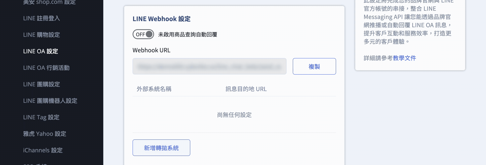

# 串接 LINE Messaging API

整合 LINE OA 與 CYBERBIZ 系統，實現自動化訂單通知、精準分眾行銷與即時商品關鍵字搜尋功能。
{ .subtitle }

[:lucide-tag:{ title="適用方案" }](../../resources/conventions#適用方案) | 專業 PLUS / 進階 PLUS / 高手 PLUS / 企業
{ .doc-badge }

{ .hero-page }

## 串接 LINE OA Messaging API 說明

將 LINE 官方帳號（OA）與 CYBERBIZ 系統整合，可實現自動化顧客溝通，包含發送訂單狀態通知、精準分眾推播，以及提供 LINE 內的商品關鍵字搜尋功能。

!!! info "什麼是 Messaging API？"
	 Messaging API 是 LINE 開放給開發者的技術介面。透過此串接，CYBERBIZ 系統得依據特定事件（如：顧客下單、待付款提醒）**自動** 發送個人化訊息，無需人工操作。

## 前置準備與限制

在開始串接前，請務必確認以下事項：

- **費用說明：** LINE 推播服務會根據 LINE 官方帳號的訊息方案計費，自動傳送的訂單通知亦屬付費項目。

- **發送條件：** 系統僅能發送訊息給已完成 **「LINE 帳號綁定」** 或 **「LINE 快速登入」** 的會員（須取得用戶 UID）。

請依序完成以下步驟，以確保系統正確連動：

## 步驟一：建立與設定 LINE 官方帳號

1. **建立 LINE 官方帳號** 前往 [LINE Official Account Manager](https://manager.line.biz/) 建立帳號。
> **注意：**「國家/地區」務必選擇 **台灣**。
2. **啟用 Messaging API** 在管理後台點選欲設定的帳號，進入後點擊右上角 **設定 > Messaging API > 啟用 Messaging API**。
3. **配置服務提供者 (Provider)** 選擇既有的 Provider 或建立新項目。
> :lucide-triangle-alert:  LINE Messaging API channel 與 Provider 綁定後便無法修改，請務必確認連動到正確的 Provider。

    !!! info "什麼是服務提供者 (Provider)？" 
		Provider 代表提供服務的品牌主體。若要確保「LINE 登入」與「Messaging API」的資料互通（例如同步會員 UID），兩者必須設定在 **同一個 Provider** 下。詳情參閱 [LINE 官方文件說明 :lucide-external-link:](https://tw.linebiz.com/manual/line-official-account/line-porvider-and-channel-intro/)。

4. **基本資料填寫：** 視需求填入官網的「隱私權政策」與「服務條款」網址。

 
## 步驟二：取得串接金鑰並回填至 CYBERBIZ

1. **進入 LINE 開發者後台** 登入 [LINE Developers Console](https://developers.line.biz/console/)，並點選稍早建立的 Messaging API 頻道。

2. **取得頻道憑證 (Channel Credentials)** 分別於不同頁籤複製以下資訊：

    - **Basic settings 頁籤：** 複製 **Channel ID** 與 **Channel secret**。

    - **Messaging API 頁籤：** 滑至頁面底部，於「Channel access token」欄位點擊 **Issue** 並複製產生的金鑰。

	
 
3. **回填至 CYBERBIZ 管理後台** 開啟 CYBERBIZ 後台，前往 **第三方整合 > LINE OA 設定**。

    - 將上述三項資訊（Channel ID、Channel secret、Channel access token）填入對應欄位。

    - 點擊 **儲存** 完成金鑰配置。

## 步驟三：開啟 Webhook 功能

1. **取得 Webhook 網址** 前往 CYBERBIZ 管理後台 **第三方整合 > LINE OA 設定**，複製系統生成的 **Webhook URL**。

    - **網址範例：** `https://[你的網域]/line_chat_bots/send_event`

2. **於 LINE 設定 Webhook** 建議直接在 **[LINE Developers](https://developers.line.biz/console/)** 後台操作，以確保功能完整開啟：

    - **填入網址：** 在「Messaging API」頁籤下找到 **Webhook URL** 欄位，點擊「Edit」貼入網址並儲存。

    - **開啟開關（關鍵）：** 務必將 **Use webhook** 選項切換為 **開啟 (On)**，系統才能接收訊息回傳。

    - **驗證連線：** 點擊「Verify」按鈕，若顯示「Success」代表串接成功。

3. **調整回應設定** 前往 **LINE Official Account Manager > 設定 > 回應設定**：

    - **回應模式：** 務必設為 **「聊天機器人」(Chatbot)**。

    - **自動回應訊息：** 建議設為 **「停用」**，改由系統（如 CYBERBIZ 或客服系統）統一發送訊息，避免產生重疊回覆。

## 步驟四：進階功能應用（選擇性）

完成基礎串接後，您可以根據品牌營運需求，進一步配置以下進階功能：

### LINE 關鍵字搜尋商品

- **功能說明：** 開啟後，顧客可在 LINE 對話框輸入關鍵字（如：項鍊、咖啡豆），系統將自動回傳官網相關商品清單。

- **價值：** 縮短購物路徑，讓 LINE 官方帳號成為移動端的商品導購入口。

### 第三方系統資料轉拋 (Webhook Relay)

- **功能說明：** 若您的 LINE OA 同時串接了其他第三方平台（如 **Omnichat**, **Smarter**, **Easychat**），可透過 CYBERBIZ 設定「轉拋系統」。

- **技術規格：** 系統會將 LINE 接收到的事件同步轉發至您指定的 URL。

 	- **限制：** 最多可設定 **5 組** 轉拋網址。

### 自動化通知樣板

- **功能說明：** 當訂單或會員狀態異動時，系統自動發送標準化通知。

- **支援分類：**

	- **訂單類：** 訂單成立、付款成功、取消訂單。

	- **物流類：** 已出貨、到店提醒、簽收成功。

	- **顧客類：** 註冊成功、生日禮、紅利點數異動。

- **前提條件：** 消費者須先完成 **LINE 帳號綁定**，系統方能識別 UID 並發送個人化通知。

操作說明請參閱 [**LINE OA 訊息樣板設定**](../../notifications/設定與管理 LINE OA 通知樣板.md){ data-preview }  。

## 相關操作

- :lucide-layout-template:{ .lg }  
  [**LINE OA 訊息樣板設定**](../../notifications/設定與管理 LINE OA 通知樣板.md){ data-preview }    
  設定訂單、物流與顧客類自動通知樣板。

- :lucide-link-2:{ .lg }  
  [**綁定 LINE 帳號與官網會員**](綁定 LINE 官方帳號與官網會員.md){ data-preview }    
  了解如何讓會員完成 LINE 綁定以接收通知。

## 常見問題

??? quote "為什麼點擊「Verify」驗證 Webhook 時顯示錯誤"
	請檢查 **Webhook 網址是否包含 `https` 以及開頭是否有空格。** LINE 強制要求 Webhook 必須使用加密的 `https` 協定。此外，請確認 **Use webhook** 開關已切換至 **On**，且 Webhook URL 結尾路徑完整（如：`/line_chat_bots/send_event`）。

??? quote "完成串接後，為什麼訂單通知還是沒有發出"
	主因通常為 **「會員尚未完成 LINE 綁定」。** Messaging API 必須依賴消費者的 `UID` 才能指定發送對象。若顧客僅是追蹤 OA 但未進行官網會員綁定，系統將無法獲取 UID。建議在購物官網顯眼處設置「LINE 快速登入」以提高綁定率。

??? quote "LINE 回應設定中的「聊天模式」與「Webhook」可以同時並存嗎"
	若要由 CYBERBIZ 發送自動通知，必須設為 **「聊天機器人 (Webhook)」模式。** 一旦開啟此模式，LINE 官方的一般對話功能將受限。若需同時使用人工客服聊天與自動通知，建議搭配 **Webhook Relay (轉拋)** 功能將訊息導流至客服平台（如 Omnichat）。

??? quote "更換 LINE 官方帳號時，需要重新設定嗎"
	是的，**金鑰具有唯一性。** Channel ID、Secret 與 Token 皆綁定於單一 LINE Channel。若更換帳號，必須在 CYBERBIZ 後台重新回填新的憑證，並更新 Webhook URL 以確保數據導向正確。

