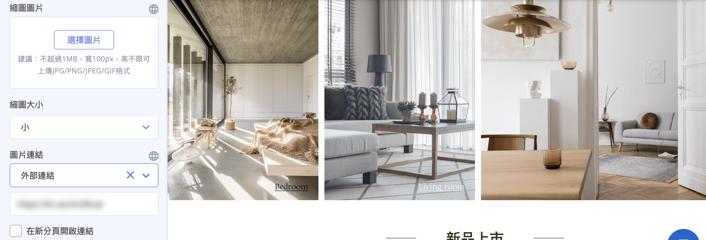
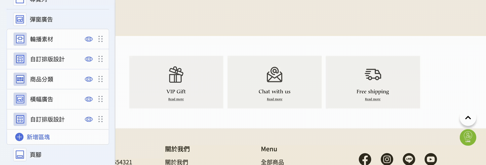
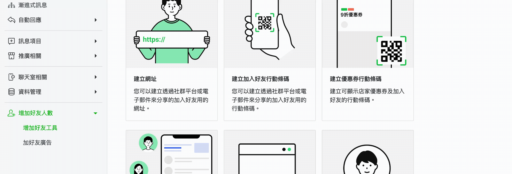
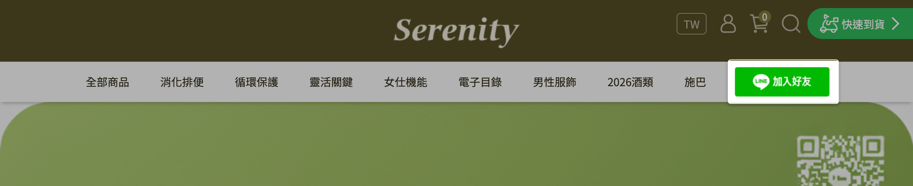

# 在官網新增 LINE 加入好友入口

在拖拉版型網站中新增 LINE 官方帳號加入好友入口，透過彈窗、輪播、頁腳或導覽列引導訪客加入好友。
{ .subtitle }

[:lucide-toggle-right:{ title="適用功能" }](../../resources/conventions#適用功能) | 拖拉版型
{ .doc-badge }

{ .hero-page }

## 拖拉版型加入好友工具說明

商家可以透過多種內建功能，將 LINE OA 官方帳號的邀請資訊（如連結、QR Code、圖片等）呈現於官網中，以提升品牌與會員的黏著度。

以下為針對拖拉版型設定 LINE OA 增加好友工具的詳細教學：

## 前置準備：取得 LINE 好友連結

在開始設定前，請先取得 LINE 官方帳號的加入好友連結與宣傳素材。

- [x] 請確保已自行設置好品牌官網的 LINE OA 帳號。
- [x] 在進行官網設定前，請先至 **LINE Official Account Manager** 取得宣傳素材：

	1. 登入 [**LINE Official Account Manager** :lucide-external-link:](https://manager.line.biz)，進入 **主頁 > 增加好友人數 > 增加好友工具**。
	2. 在此處您可以選擇複製 **「網址」**、下載 **「行動條碼 (QR Code)」** 或複製 **「加入好友按鈕」** 的語法。

## 官網應用方式設定

### 右側彈窗廣告 (彈跳視窗)

這是最直接引導顧客加入好友的方式。

- **後台路徑**：前往 **網站外觀 > 套版主題管理 > 網站設定 > 彈窗廣告**。
- **設定步驟**：
    1. 新增一個圖片區塊。

		

    2. **上傳圖片**：建議在電腦/平板/手機版圖片中上傳「加入好友行動條碼」圖片或貼上 URL 連結。

		

    3. **縮圖設定**：商家可自行製作縮圖，並根據前台畫面調整縮圖大小。
    4. **圖片連結**：選擇外部連結，貼上從 LINE Official Account Manager [複製的「好友網址」](../../notifications/發送 LINE 加入好友邀請.md#get-line-oa-add-friend-link){ data-preview }。

		

    5. **儲存設定**。
    
- **完成設定畫面**：

	

---

### 輪播素材 (Banner)

利用首頁的大型橫幅廣告進行視覺推廣。

- **後台路徑**：前往「網站外觀」>「套版主題管理」>「網站設定」>**「輪播素材」**。
- **設定步驟**：
    1. 點選「新增區塊」並點擊編輯。
    2. **上傳圖片**：上傳設計好的 LINE 推廣圖（電腦版圖片為必傳）。
    3. **SEO 優化**：務必填寫「圖片替代文字」以優化搜尋引擎功能。
    4. **停留設定**：在「其他版面設定」中可 [調整素材停留秒數與邊距](../../website-appearance/拖拉版型網站設定#版面細節設定-其他版面設計)。

	

- **完成設定畫面**：

	

!!! note "更多輪播素材相關設定，請參閱 [輪播素材設定說明](../../website-appearance/拖拉版型網站設定#輪播素材)。"

---

### 頁腳 ICON 設定 (Footer)

在網站底部固定放置 LINE 的社群圖示。

- **後台路徑**：前往「網站外觀」>「套版主題管理」>「網站設定」>**「頁腳」**。
- **設定步驟**：
    1. 點選「其他版面設計」。
    2. 找到 **「社群媒體設定」**，將 **LINE 開啟** 並貼上好友邀請連結。

---

### 選單/導覽列設定

將加入好友的功能直接放進網站的主選單中。

- **後台路徑**：前往「網站外觀」>**「選單/導覽列設定」**。
- **設定步驟**：
    1. 先至 [LINE Official Account Manager :lucide-external-link:](https://manager.line.biz/) 複製 **「建立按鈕」** 的語法。

		

    2. 在 CYBERBIZ 選單設定介面中點選欲設定的選單，進入編輯頁面，再點擊 **「新增連結」**。
    3. **新增選單項目**：貼上剛才複製的按鈕語法。
    4. **連結項目**：選擇 **「外部連結」**，並貼上 [LINE 好友邀請網址](../../notifications/發送 LINE 加入好友邀請.md#get-line-oa-add-friend-link){ data-preview }。

		

    5. 儲存選單後，前台導覽列即可出現加入好友的圖片連結。

		

!!! note "更多選單與導覽列設定，請參閱 [選單/導覽列設定說明](../../website-appearance/設定選單與導覽列.md){ data-preview }  。"

---

## 相關操作

- :lucide-grip-vertical:{ .lg }   
  [__拖拉版型設定__](../../website-appearance/拖拉版型網站設定.md){ data-preview }  
  拖拉版型的詳細功能跟設定說明。

---

## 常見問題

??? quote "為什麼我在「選單/導覽列」貼上按鈕語法後，前台圖示顯示異常" 
	
	前台顯示異常通常與複製內容不完整有關，請按照以下步驟排查： 
	
	1. **確認完整複製**：請務必點擊 LINE 後台的 **「複製」** 按鈕，避免手動選取文字（手動選取容易漏掉關鍵的 HTML 標籤）。 
	2. **禁止修改代碼**：請直接貼上原始語法，**不可手動刪減** 任何符號或空格。 
	3. **清除前後空格**：貼上後請確認文字輸入框的前後沒有多餘的「空格」或「換行」。

??? quote "手機版用戶點擊「加入好友」連結時，會直接開啟 LINE App 嗎" 
	是的。 若用戶使用手機瀏覽器，點擊網址後系統會自動偵測並觸發 **Deep Link** 開啟 LINE App 並跳轉至加入好友頁面。 若是在電腦版點擊，則會引導用戶掃描 QR Code 或登入 LINE 網頁版。

??? quote "如果我更換了 LINE OA 帳號，官網的連結會自動更新嗎" 
	**不會。** LINE 的好友邀請連結是綁定特定帳號 ID 的。 若您更換了官方帳號，必須手動回到「彈窗廣告」、「輪播素材」、「頁腳」及「選單」等處，逐一替換為新的邀請連結與 QR Code 圖片。