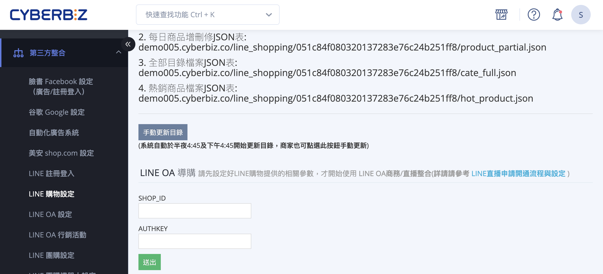
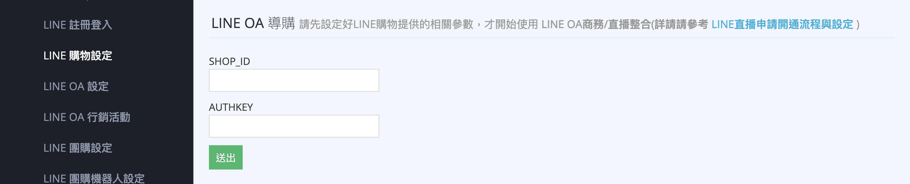
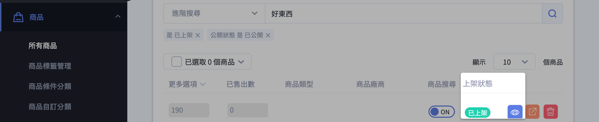
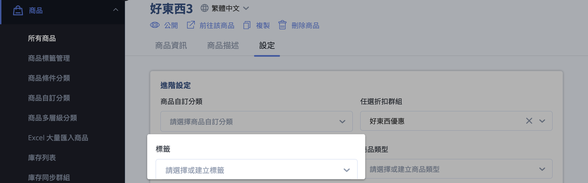
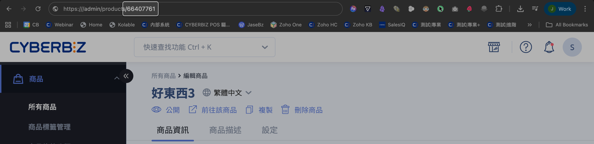
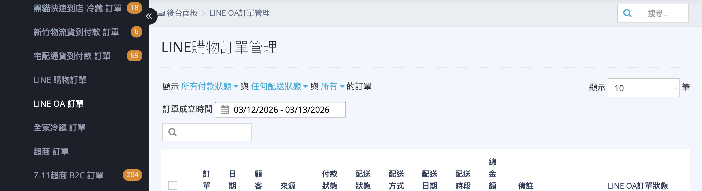

# 申請與設定 LINE 直播功能

如何申請 LINE 直播功能，並完成後台參數設定與商品串接。
{ .subtitle }

[:lucide-tag:{ title="適用方案" }](../../../resources/conventions#適用方案) | 專業 PLUS / 進階 PLUS / 高手 PLUS / 企業
{ .doc-badge }

{ .hero-page }

## LINE 直播說明

**「LINE 直播」**（邊看邊買模式）讓商家能直接在 LINE 官方帳號進行購物直播，並導購至官網下單。

!!! info "更多 LINE 直播功能資訊，請參閱 [LINE LIVE 官方說明 :lucide-external-link:](https://tw.linebiz.com/service/account-solutions/line-live/)。"

## 申請資格與注意事項

- **帳號類型限制**：僅限 **「認證帳號（藍色盾牌）」** 申請。認證申請流程，請參閱 [官方說明 :lucide-external-link:](LINE官方文件)。
    *   **一般帳號（灰色盾牌）**：目前不開放申請。
    *   **企業帳號（綠色盾牌）**：為邀請制，亦具備資格。
- **官方帳號好友數**：建議好友數達 **1000 人以上**，以確保觀看與轉單成效。
- **顧客限制**：顧客必須是官方帳號好友，且 [**已完成官網會員與 LINE OA 的綁定**](綁定 LINE 官方帳號與官網會員.md){ data-preview }，方可進入直播間並下單。
- **直播頻率建議**：建議每月至少直播 4 場以上，以培養與好友的觀看默契。

## 申請與上線流程

1.  **填寫表單**：向 CYBERBIZ 索取並填寫 [直播資格申請表 :lucide-external-link:](https://docs.google.com/forms/d/e/1FAIpQLSeaMKpcK0DOaTvZDy_229oV3mV_k50-oKKTljdGh9sUXuRD1A/viewform)。

    ??? abstract "LINE 直播開通申請表單"
        

          <iframe src="https://docs.google.com/forms/d/e/1FAIpQLSeaMKpcK0DOaTvZDy_229oV3mV_k50-oKKTljdGh9sUXuRD1A/viewform?embedded=true" 
            style="position: absolute; top: 0; left: 0; width: 100%; height: 100%;" 
            frameborder="0">
          </iframe>
        

2.  **資格開通等待期**：確認申請後，CYBERBIZ 會協助開啟後台串接並請 LINE 核發參數，此過程 **約需 30 天**。
3.  **權限開啟**：商家需前往後台 **管理中心 > 網站權限 > 管理者列表**，**開啟「後台小幫手權限」**，由 CYBERBIZ 專員協助後台參數設定。
4.  **正式開通**：LINE 官方會發信通知開通完成。商家收到信後即可開始直播，LINE 同時會提供直播後台的教學課程。

##  後台設定與參數回填

若商家已收到參數信件，請自行至後台回填（或由專員協助）：

*   **設定位置**：登入 CYBERBIZ 管理後台，前往 **第三方整合 > LINE購物設定 > 頁面下半部 「LINE OA 導購」 區塊**。
*   **填寫欄位**：填入系統提供的 **「SHOP_ID」** 與 **「AUTHKEY」** 並儲存。

## 商品串接與同步邏輯

為確保直播時能成功搜尋到商品，商品必須符合以下條件：

1.  **商品狀態**：必須為「公開」且「已上架」。

    

2.  **標籤排除**：商品標籤欄位 **不得** 設有「贈品」或「排除product feed」。

    

3.  **同步時間**：
    *   **CYBERBIZ 自動更新**：每日 4:45 AM 及 4:45 PM 自動產出產品目錄。
    *   **LINE 自動同步**：每日 5:00 AM 將目錄資訊同步至 LINE 直播後台。
    *   **手動更新**：若急需同步修改後的商品資訊，可至「LINE購物設定」點擊 **「手動更新目錄」**（一小時僅限點擊一次）。
4.  **搜尋商品建議**：於直播後台搜尋商品時，建議使用 **Product ID (PID)** 最為精準。
    *   *PID 取得方式：點開後台商品編輯頁（商品資訊頁籤）網址最後方的數字，或從[匯出商品列表中查看 ID 欄位](../../products/Excel 大量匯入商品.md#判斷-excel-上傳商品是新增還是更新){ data-preview }。*

    

## 訂單查看

透過 LINE 直播導購完成的訂單，商家可至管理後台的「**訂單**」>「**LINE OA訂單**」進行查看與管理。

## 後續操作

- :lucide-book:{ .lg }   
  [__LINE 直播應用手冊__ :lucide-external-link:](https://drive.google.com/file/d/1cOVeAlq9l55rjU2yR_8krxWafSXOzZ2P/view)     
  針對 CYBERBIZ 客戶的完整指南，涵蓋 LINE 直播市場趨勢、介面功能與後台操作。

- :lucide-book:{ .lg }     
  [__直播工具應用手冊__ :lucide-external-link:](https://drive.google.com/file/d/1hiAUhEv0TA-N4jBb3HZmuZPQqDT4qOur/view)  
  詳解 FB、IG 及 YT 等平台的直播導購技巧，並教學如何利用一頁式商店與 UTM 追蹤成效 。

## 常見問題

??? quote "為什麼我搜尋不到剛上架的商品？"
    商品同步至 LINE 直播後台需要時間。CYBERBIZ 系統固定於每日 4:45 AM/PM 產出目錄，而 LINE 則在 5:00 AM 進行同步。

    若您在非同步時段更新商品，請至後台 **「LINE 購物設定」** 點擊 **「手動更新目錄」**，並於一小時後再前往 LINE 後台檢查。

??? quote "我的 LINE 官方帳號是灰色盾牌，可以申請嗎？"
    不可以。目前 LINE 直播功能僅開放給 「認證帳號（藍色盾牌）」 或 「企業帳號（綠色盾牌）」。若您目前為一般帳號（灰色盾牌），需先向 LINE 官方申請帳號認證。

??? quote "消費者在直播間下單，一定要綁定官網會員嗎？"
    是的。為了確保訂單能正確回傳至 CYBERBIZ 後台並計算紅利點數或優惠，消費者必須：

    1. 成為您的 LINE OA 好友。
    2. 完成 LINE 帳號與官網會員綁定。

    若未完成綁定，消費者將無法順利進入「邊看邊買」的結帳流程。

??? quote "如何判斷該筆訂單來自 LINE 直播？"
    所有透過此功能產生的訂單都會標記來源。您可以前往 訂單 > LINE OA 訂單 頁面，該分頁下顯示的所有訂單即為透過 LINE 直播導購完成的交易。

??? quote "申請表單填寫後，多久可以正式開播？"
    由於流程涉及 LINE 官方核發參數（SHOP_ID 與 AUTHKEY），整體作業時間約需 30 個工作天。建議商家提早規劃行銷檔期。
