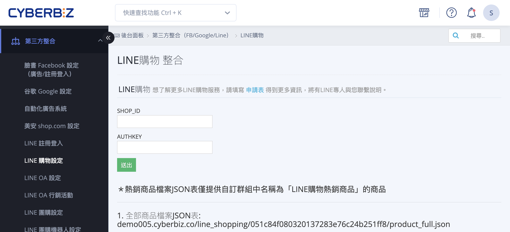
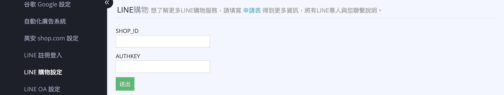

# 申請與設定 LINE 購物導購

申請 LINE 購物導購並完成後台串接設定，將 LINE 購物流量導入官網下單。
{ .subtitle }

[:lucide-tag:{ title="適用方案" }](../../../resources/conventions#適用方案) | 專業 PLUS / 進階 PLUS / 高手 PLUS / 企業
{ .doc-badge }

{ .hero-page }

## LINE 購物說明

**LINE 購物** 是一個結合導購、點數回饋、比價的電商平台。透過將官網與 LINE 購物串接，商家可以利用 LINE 購物 APP 或其官方帳號入口，將顧客導購至官網下單。

以下為 LINE 購物的申請流程、後台設定及相關注意事項：

## 重要提醒

*   **適用版本**：此功能僅提供給 **PLUS版 及企業版** 用戶使用。
*   **開放平台性質**：LINE 購物為公開平台，消費者無須是商家的 LINE 官方帳號好友，也無須綁定 OA，即可進行下單。
*   **精準搜尋商品**：於 LINE 直播或相關後台搜尋商品時，建議使用 **Product ID (PID)** 最為精準。PID 可在商品編輯網址最後方的數字或匯出的商品報表中取得。

## 申請開通流程

1.  **填寫申請表**：商家需先填寫申請表以取得更多資訊，後續將有 LINE 專人聯繫說明。

    ??? abstract "LINE 購物開通申請表單"
        

          <iframe src="https://docs.google.com/forms/d/e/1FAIpQLSeaMKpcK0DOaTvZDy_229oV3mV_k50-oKKTljdGh9sUXuRD1A/viewform?embedded=true" 
            style="position: absolute; top: 0; left: 0; width: 100%; height: 100%;" 
            frameborder="0">
          </iframe>
        

2.  **資格審核**：由 LINE 進行前期接洽與資格審核，審核通過後 LINE 會通知 CYBERBIZ 開通資格。
3.  **開啟協助權限**：商家需在 CYBERBIZ 後台開啟協助權限，以便專員協助設定參數。
    *   **路徑**：「管理中心」>「網站權限」>「管理者列表」。
4.  **填入參數**：CYBERBIZ 專員會協助將 LINE 提供之 **「SHOP_ID」** 與 **「AUTHKEY」** 填入系統中。
    *   **路徑**：「第三方整合」>「LINE購物設定」> 頁面上半區塊「LINE購物」。

## 商品串接邏輯與條件

商品必須同時符合以下三個條件，才會成功出現在產品目錄中：

- [x] **狀態為「公開」**。
- [x] **狀態為「已上架」**。
- [x] **標籤排除**：商品標籤內 **不得** 設有「贈品」或「排除product feed」之關鍵字。

!!! tip "檢驗頁面與路徑，可參閱 LINE 直播文件中的 [商品串接與同步邏輯](申請與設定 LINE 直播功能.md#商品串接與同步邏輯){ data-preview }。"

## 目錄更新與同步時間

*   **自動更新**：CYBERBIZ 後台產品目錄於 **每日 4:45 AM 及 4:45 PM** 自動產出；LINE 則於 **每日 5:00 AM** 將資訊同步至其後台。
*   **手動更新**：若需即時同步修改的商品資訊，可至「LINE 購物設定」點擊 **「手動更新目錄」** 按鈕（每小時限點擊一次）。
*   **前置作業**：建議最晚於直播或活動 **一天前** 完成所有商品設定，以確保目錄能順利同步。

## 訂單查看與管理

*   **訂單歸類**：透過 LINE 購物導購完成的訂單，可於 [**「訂單」>「LINE 購物訂單」**](group-buy/設定 LINE 團購群組.md#訂單查看與紀錄管理){ data-preview } 中查看。
*   **導購來源追蹤**：商家也可在匯出的訂單報表中[查看「導購來源」欄位](../../orders/匯出訂單報表.md#步驟一選擇報表欄位){ data-preview }，確認訂單是否來自 LINE 購物。

## 常見問題

??? quote "為什麼訂單已經成立了，卻沒有出現在「LINE 購物訂單」中？"
    這通常有以下幾種可能：

    1. **消費者路徑中斷**：消費者雖然是從 LINE 購物進入官網，但在下單前曾切換瀏覽器、開啟無痕模式，或點擊了其他廣告來源（如 FB/Google 廣告），導致追蹤代碼（Cookie）被覆蓋。
    2. **Cookie 過期**：LINE 購物的追蹤期效通常有其時限（視 LINE 規範而定），若消費者點擊後過久才下單，則不會歸類為導購訂單。
    3. **手動輸入網址**：消費者在 LINE 購物看到商品後，自行重新開啟瀏覽器輸入網址進入官網，此行為無法追蹤。

??? quote "為什麼我修改了商品價格，LINE 購物平台卻還是舊的？"
    LINE 購物並非即時同步，系統會依照固定排程更新：

    * **自動同步**：每日 5:00 AM 更新。若您在 10:00 AM 修改價格，最快要到隔日清晨才會更新。
    * **手動同步**：您可以至「LINE 購物設定」點擊「手動更新目錄」來強制更新（每小時限一次）。

??? quote "如果消費者取消訂單或退貨，LINE POINTS 點數會收回嗎？"
    會。當商家在 CYBERBIZ 後台將訂單狀態更新為「已取消」或「退貨完成」時，系統會同步資訊給 LINE，LINE 將不會發放（或扣回）該筆訂單對應的點數。

??? quote "為什麼特定的商品一直沒有出現在 LINE 購物的目錄中？"
    請檢查該商品是否誤標了 「贈品」 或 「排除product feed」 標籤。這類標籤會觸發過濾機制，使商品不進入同步清單。
