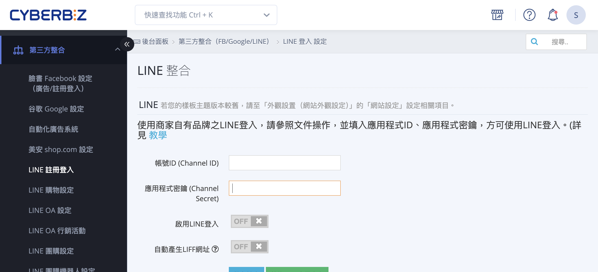
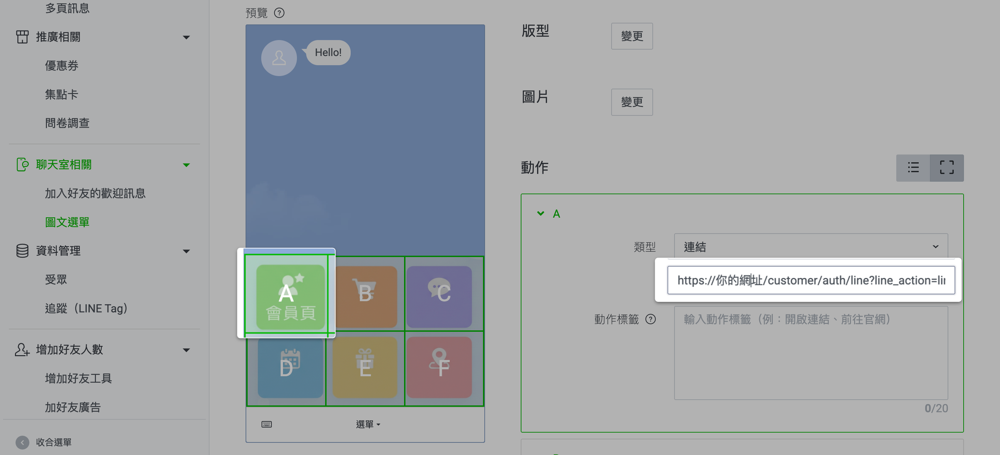
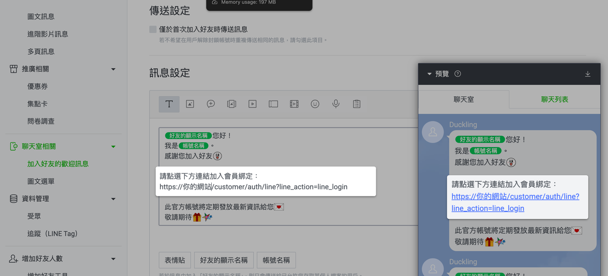
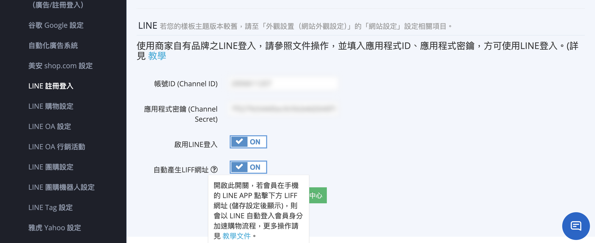

# 綁定 LINE 官方帳號與官網會員

透過 LINE Official Account、LINE Login 與 LIFF，完成官網會員與 LINE 帳號的綁定流程，以支援自動化通知與精準行銷應用。
{ .subtitle }

[:lucide-lock:{ title="適用方案" }](../../resources/conventions#適用方案) | 專業PLUS / 進階PLUS / 高手PLUS / 企業
{ .doc-badge }

{ .hero-page }

## 什麼是 LINE 官方帳號與官網會員綁定

**LINE OA 官方帳號綁定官網會員** 是整合線上與線下會員資料、進行精準行銷的核心功能。透過綁定，商家可以收集會員的 **LINE UID**，進而發送自動化的訂單/物流通知訊息。

以下為 LINE OA 官方帳號綁定官網會員的詳細說明與教學：

## 綁定前置作業

商家必須先完成以下系統串接設定，資料才能互通：

- [x] [**建立與串接 Messaging API**](串接 LINE Messaging API.md){ data-preview }  ：完成 LINE 官方帳號與 CYBERBIZ 後台的 API 串接。

- [x] [**設定 LINE Login (快速登入)**](設定 LINE 快速登入.md){ data-preview }  ：務必將「LINE 登入」與「Messaging API」設定在 **同一個 LINE Developers Provider (服務提供者)** 中。

- [x] **啟用 LINE 快速登入**：消費者需透過 LINE 快速登入註冊或登入，才能完成綁定流程。

## 商家後台設定方法

商家需提供特定連結引導顧客操作，主要有三種應用情境：

### 設定圖文選單

這是最常用的引導方式。

- **操作路徑**：進入 [LINE Official Account Manager :lucide-external-link:](https://manager.line.biz/) > **聊天室相關 > 圖文選單**。

- **設定連結**：建議使用「會員資料頁」作為跳轉頁，連結格式為：`https://你的網址/customer/auth/line?line_action=line_login`。

- **效果**：尚未綁定的顧客點擊後會先進行綁定動作，已綁定的顧客則直接進入登入狀態的指定頁面。

> :lucide-info: 詳細設定流程，請參閱 [LINE 圖文選單設定](設定 LINE 圖文選單.md){ data-preview }  或查看 [LINE 官方說明文件 :lucide-external-link:](https://tw.linebiz.com/manual/line-official-account/oa-manager-richmenu/)。

---

### 設定加入好友的歡迎訊息

- **操作路徑**：進入 [LINE Official Account Manager :lucide-external-link:](https://manager.line.biz/)  > **聊天室相關 > 加入好友的歡迎訊息**。

- **設定內容**：在訊息中加入上述的綁定連結。這對於首次加入官方帳號的會員最有效。

> :lucide-info: **參考資料**：有關加入好友訊息的詳細製作規格，請參閱 [LINE 官方說明文件 :lucide-external-link:](https://tw.linebiz.com/manual/line-official-account/20200514welcomemessage/)。

---

### 使用 LIFF 自動綁定 (推薦方式)

- **功能特色**：開啟後，消費者點選網址會自動套用 LINE 帳戶資訊。若顧客非好友或非會員，點選連結可 **同時加入好友、註冊官網會員並完成綁定**。

- **操作路徑**：後台 **第三方整合 > LINE 註冊登入 > 開啟 自動產生 LIFF 網址**。

- **應用**：商家可複製系統產生的 LIFF 網址，製作成 QR Code 供消費者掃描。

>:lucide-info: 詳細操作說明，請參閱 [如何設定 LIFF](設定 LIFF 自動登入與會員綁定.md){ data-preview }。  

## 顧客端綁定流程

1. 點擊商家提供的 **綁定連結** 或 **LIFF 網址**。

2. 進入 **LINE 用戶資料授權頁面**，點擊許可。

3. 系統執行 **快速跳轉**（顯示載入中）並導向官網首頁或指定頁面。

4. 最後跳轉至目的頁面，此時消費者已處於 **會員登入狀態** 且完成綁定。

## 綁定後的進階功能與好處

- :lucide-bell-ring:{ .lg }  
  [__自動發送提醒樣板__](../../notifications/設定與管理 LINE OA 通知樣板.md){ data-preview }  
  自動回覆訂單確認、貨物發送、到店提醒及未付款提醒等訊息。

- :lucide-ticket-percent:{ .lg }  
  [__綁定送優惠券__](設定 LINE 綁定會員贈送優惠券.md){ data-preview }  
  設定「LINE @ 綁定贈送優惠券功能」來增加顧客綁定意願。

- :lucide-scan-barcode:{ .lg }  
  [__顯示會員條碼 (OMO 應用)__](設定 LINE 圖文選單#omo-實體門市應用)    
  顧客可於 LINE 選單調出會員條碼，供實體門市 POS 機掃描進行紅利或優惠券折抵。

- **自動發送提醒樣板**：可自動回覆訂單確認、貨物發送、到店提醒及未付款提醒等訊息。

- [**綁定送優惠券**](設定 LINE 綁定會員贈送優惠券.md){ data-preview }  ：可設定「LINE @ 綁定贈送優惠券功能」來增加顧客綁定意願。

- [**顯示會員條碼 (OMO 應用)**](設定 LINE 圖文選單#omo-實體門市應用)：綁定後，顧客可於 LINE 選單調出會員條碼，供實體門市 POS 機掃描進行紅利或優惠券折抵。

- **受眾串接與推播**：商家可在後台篩選「已完成 LINE 綁定」的會員，將受眾上傳至 LINE OA 後台進行精準行銷訊息發送。

## 重要注意事項

- **非好友限制**：透過 LINE 快速登入的顧客 **不一定有綁定 LINE OA**，且只有成為 LINE OA 好友且未封鎖的帳號，才能收到 LINE 推播訊息。

- **單一綁定規則**：顧客的 LINE 帳號必須先在 LINE App 中 **綁定 Email**，才可順利執行 LINE 快速登入與綁定。

- **連結正確性**：若網址帶有 `/customer/auth/line?line_action` 參數，則每次點選皆會跳出綁定畫面；若不希望重複跳轉，僅需針對「首次綁定」的功能進行設定即可。

## 常見問題

??? quote "為什麼會員已完成 LINE 快速登入，卻沒有出現在 LINE 官方帳號的好友名單中？" 
	
	**原因分析**：LINE 快速登入（LINE Login）與 LINE 官方帳號（Messaging API）是兩個獨立的授權。若會員僅在官網登入而未點選「加入好友」，則無法同步。 
	
	**解決方案**：建議商家在 LINE Developers 控制台開啟 **[Auto-login]** 內的 **[Add official account as a friend]** 功能，強制在登入流程中詢問是否加入好友。

??? quote "顧客點擊綁定連結後出現「無效的請求 (Invalid Request)」或錯誤畫面" 

	**檢查清單**： 
	
	1. **Provider 檢查**：請確認「LINE Login」與「Messaging API」是否位在同一個 **Provider (服務提供者)** 下。若分屬不同 Provider，UID 將無法互通。 
	2. **回呼 URL 設定**：檢查 LINE Developers 後台的 `Callback URL` 是否已正確填入 CYBERBIZ 提供之完整路徑。 
	3. **SSL 憑證**：確保官網的 HTTPS 協定運作正常。

??? quote "同一個 LINE 帳號可以綁定多個官網會員帳號嗎" 
	不可以。為了確保資料唯一性與安全性，**一個 LINE 帳號僅能綁定一個官網會員帳號**。若顧客嘗試綁定第二個帳號，系統將提示已完成綁定或跳轉至原綁定帳號。

??? quote "如何判斷會員是否已經完成 LINE 連結綁定" 
	
	**管理端查看**：商家可進入 CYBERBIZ 後台的「會員管理」，查看會員資料欄位。若該會員具有 **LINE UID** 資訊，即代表已成功完成綁定。 
	
	**用戶端查看**：會員於官網登入後，在「個人資料」頁面應會顯示 LINE 已連動之狀態。

??? quote "為什麼 LIFF 網址比一般 URL 連結更推薦用於綁定" 

	**技術優勢**： 
	
	1. **無縫驗證**：LIFF (LINE Front-end Framework) 能在 LINE App 內直接取得用戶授權，減少跳轉至外部瀏覽器需重新登入的摩擦。 
	2. **多效合一**：透過 LIFF 連結，系統可同時執行「追蹤好友」、「會員註冊」與「身份綁定」三個動作，大幅提升轉化率。