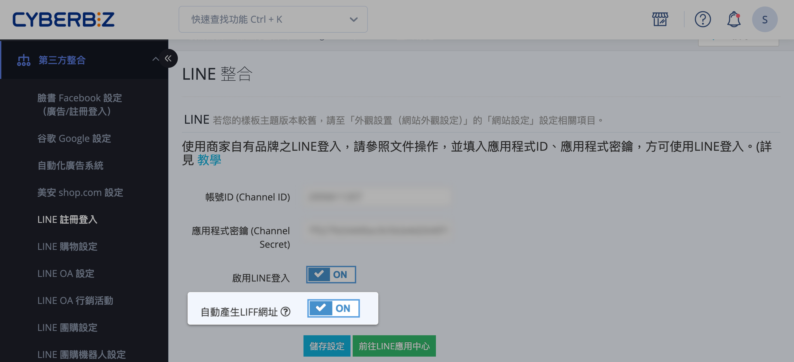
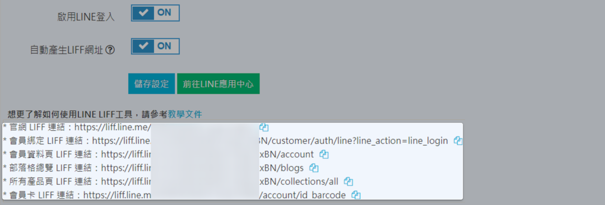
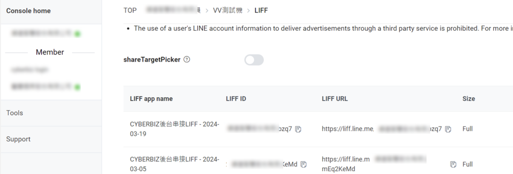

# 設定 LIFF 自動登入與會員綁定

使用 LIFF 實現會員自動登入，並同步完成官方帳號好友加入與會員帳號綁定。
{ .subtitle }

[:lucide-lock:{ title="適用方案" }](../../resources/conventions#適用方案) | 專業PLUS / 進階PLUS / 高手PLUS / 企業
{ .doc-badge }

{ .hero-page }

## 什麼是 LIFF

**LINE Front-end Framework（LIFF）** 是由 LINE 提供的 Web App 嵌入框架，可讓網站頁面直接在 LINE App 內開啟，並存取 LINE 使用者身分資訊。

透過 LIFF 開啟的頁面，可視為「運行在 LINE 環境中的網站」，具備以下能力：

- 取得 LINE 使用者識別資訊
    
- 自動完成會員登入
    
- 搭配官方帳號進行好友綁定

## 為什麼要使用 LIFF

使用 LIFF 的主要目的，是 **降低會員登入與導購流程的摩擦成本**：

- **自動登入：** 會員在 LINE 內點擊連結時，系統可自動辨識 LINE 身分並完成登入，無需手動輸入帳密。
    
- **同步綁定：** 顧客首次點擊時，可同步觸發「加入官方帳號好友」、「註冊官網會員」與「帳號綁定」三大動作。
    
- **避免跳轉問題：** 解決一般網址在 LINE 中需經過外部瀏覽器跳轉的體驗問題。

## 後台設定步驟

1. **進入路徑：** 登入後台，前往 **第三方整合 > LINE 註冊登入**。

2. **連動確認：** 
	
	- [x] 已完成[「LINE 快速登入」設定](設定 LINE 快速登入.md){ data-preview }。  
	
	- [x] 已完成 [LINE OA 與 LINE Login Channel 連動](設定 LINE 快速登入/#導引加入好友)。

4. **啟用 LIFF：** 開啟 **自動產生 LIFF 網址** 開關，並點選 **儲存設定**。

5. **複製網址：** 儲存後頁面下方會出現全站 LIFF 網址，點選藍色圖示 :lucide-files: 即可複製。

	

	??? note "LIFF 網址說明"

		當您啟用「自動產生 LIFF 網址」並儲存後，系統會自動產生一組 **全站 LIFF 專屬網址**。
		
		此網址具備以下特性：
		
		- 為系統自動產生，無需手動設定。
		- 已綁定目前商店與 LINE Login Channel。
		- 可直接作為所有導購連結的「入口網址」。

6. **LINE Developers 同步狀態：** 完成上述步驟後，LINE Developers 後台會自動同步產生對應的 LIFF 設定。

	
    > :lucide-triangle-alert: 請 **統一使用 CYBERBIZ 後台生成** 的 LIFF 連結，請勿擅自更動 LINE Developers 後台中的專屬 LIFF 設定，以免導致跳轉機制失效。

	!!! tip "想要在 LIFF 流程中一併取得會員手機號碼？"
		若您擁有 LINE Certified Provider 資格( 參閱 [申請 LINE Certified Provider 文件 :lucide-external-link:](https://drive.google.com/file/d/1oSF07fHFdx_s4gXVhDv0zw81Su3usQKY/view))，可以進一步開啟 `phone` 權限。詳細設定請參閱 [如何設定 LINE 快速登入時取得會員手機號碼](設定 LINE 快速登入時取得會員手機號碼#搭配-liff-應用)。

## 如何製作特定頁面的 LIFF 連結

若要引導顧客進入特定活動頁或商品頁，請遵循以下替換規則：

- **規則：** 將原始指定網址的「網域部分」替換成「LIFF URL 前綴」即可。

- **範例（以一頁式商店為例）：**

	- 原始網址：`https://shop.com/events/sales`

	- LIFF 網址：`https://liff.line.me/20011118364-jwZ5bzq7/events/sales`

## 前台使用者流程

1. **點選連結：** 消費者在 LINE 內點擊 LIFF 網址。

2. **授權頁面：** 首次開啟需經過 LINE 用戶資料授權頁（具備 Certified Provider 資格可在此預勾選「加入好友」）。

3. **快速跳轉：** 畫面顯示載入中並快速跳轉。

4. **進入目標頁：** 以 **會員登入狀態** 進入指定目的頁面。

## 應用情境範例

商家可將 LIFF 連結埋設於以下位置：

- [**LINE 圖文選單**](設定 LINE 圖文選單.md){ data-preview }  ： 設定「會員中心」連結，方便顧客一鍵查看點數與等級。

- **訊息推播：** 發送「訂單紀錄」連結，讓顧客快速追蹤出貨狀態。

- **線下 OMO：** 製作成 **QR Code** 置於實體門市，引導過路客一鍵成為數位會員並綁定。

- **社群導購：** 在 LINE 群組或聊天室分享特定商品頁或一頁式商店連結。

## 注意事項與限制

- **iOS 瀏覽器設定：** 若 iOS 用戶在 LINE APP 的「LINE Labs」內開啟了「預設瀏覽器開啟連結」，則 LIFF 自動登入功能將不適用。

- **認證標章：** 只有具備 **LINE Certified Provider** 認證的商家，才能在授權頁預勾選「加入好友」。

- **資格限制：** LINE Certified Provider 僅開放「公司、商行、商號」申請，個人或財團法人無法申請。

## 常見問題

??? quote "為什麼點選 LIFF 連結後，系統沒有自動加好友"
	這通常與 **LINE 管道設定** 或 **商家資格** 有關：

	- **連動檢查：** 請確認 LINE Developers 後台的 Login Channel 中，「Linked OA」是否已正確選取您的官方帳號。
    
	- **認證資格：** 只有通過 **LINE Certified Provider (認證提供者)** 審核的商家，才能在授權頁面顯示「加入好友」勾選框。一般開發者帳號僅能進行登入與身份辨識。
    

??? quote "使用者點擊 LIFF 連結後出現 404 錯誤或無效頁面，該如何排查"

	請依照以下順序檢查：

	1. **網址格式：** 確認 LIFF ID 是否正確（格式應為 `https://liff.line.me/APP_ID/path`）。
    
	2. **Endpoint URL：** 檢查 LINE Developers 後台的 LIFF Endpoint URL 是否指向正確的官網網域，且包含 `https://`。
    
	3. **重新儲存：** 嘗試在 CYBERBIZ 後台關閉並重新開啟「自動產生 LIFF 網址」開關，觸發系統重新同步設定。
    

??? quote "可以在外部瀏覽器（如 Chrome, Safari）使用 LIFF 連結嗎"

	可以，但行為有所不同：

	- **在 LINE App 內：** 享有無縫自動登入體驗。
    
	- **在外部瀏覽器：** 系統會引導使用者至 LINE 登入頁面。使用者需輸入 LINE 帳密或使用行動條碼登入後，才會導回原設定頁面。
    

??? quote "為什麼 iOS 使用者點擊連結後跳轉到了 Safari，而不是在 LINE 內開啟"

	這是因為該使用者的 LINE 設定啟用了 **「LINE Labs」中的「使用預設瀏覽器開啟連結」** 功能。 當此項設定開啟時，所有網址（包含 LIFF）都會被強制導向系統瀏覽器，導致無法直接取得 LINE App 內的授權環境。建議商家在活動說明中提醒使用者關閉此設定以獲得最佳體驗。

??? quote "如果我更換了 LINE 官方帳號（OA），原有的 LIFF 網址還能用嗎"

	**不能。** LIFF 網址是綁定在特定的 LINE Login Channel 之下。若您更換了連動的 OA 或 Login Channel，必須在 CYBERBIZ 後台重新設定連動，並重新產生/發佈新的 LIFF 網址，舊網址將會失效。