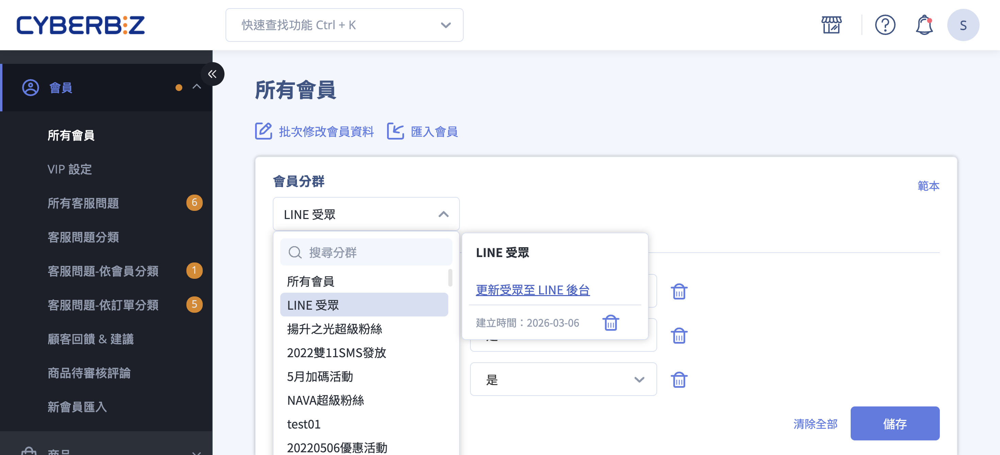
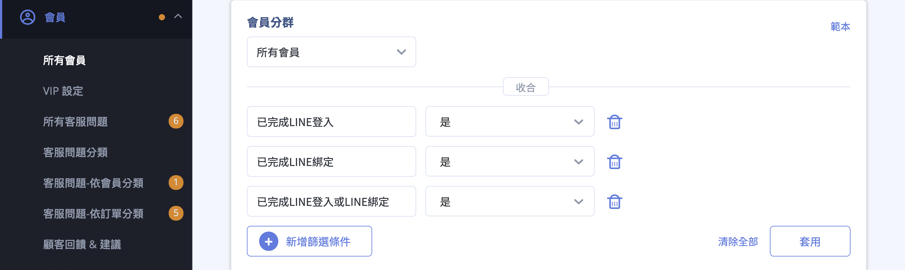
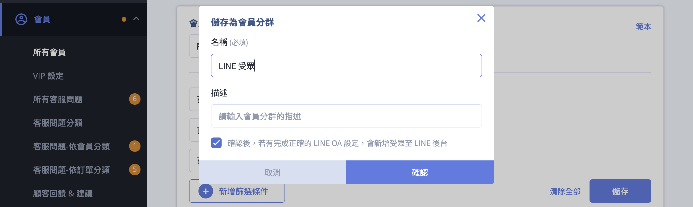
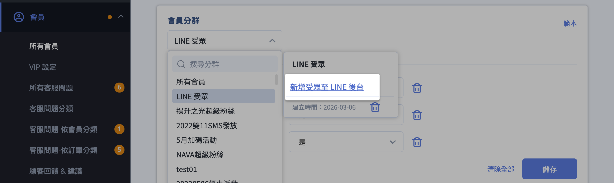
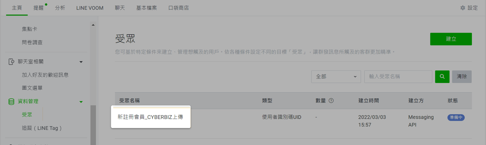
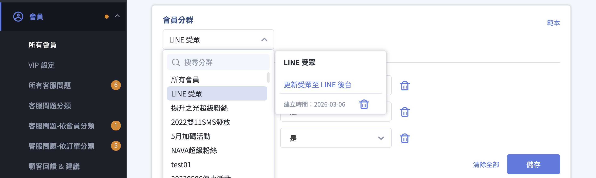
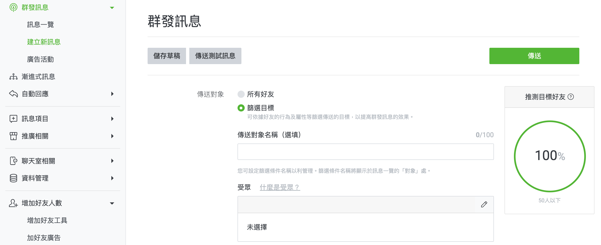
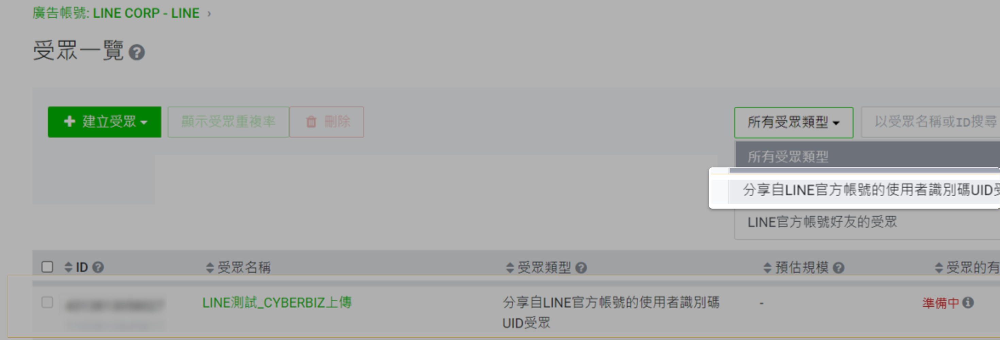
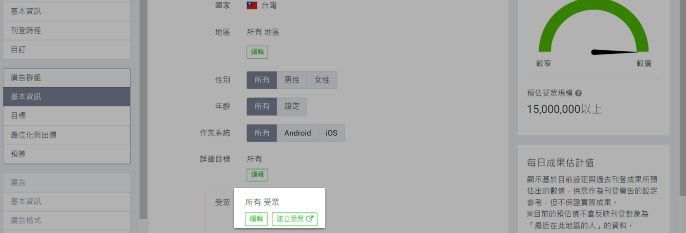

# 設定 LINE OA 受眾串接

將篩選出的會員 UID 同步至 LINE OA 建立受眾，用於訊息推播與 LAP 廣告投放。
{ .subtitle }

[:lucide-tag:{ title="適用方案" }](../../../resources/conventions#適用方案) | 專業 PLUS / 進階 PLUS / 高手 PLUS / 企業
{ .doc-badge }

{ .hero-page }

## LINE 受眾串接說明

**LINE OA 受眾串接** 功能允許商家透過後台會員篩選器，將「使用 LINE 快速登入」或「已綁定 LINE OA」的會員 UID 打包傳送至 LINE 後台建立受眾。這對於後續進行 **精準訊息推播** 或 **LAP 廣告投放** 非常有用。

以下為詳細的操作說明與教學：

## 前置作業與限制

- [x] **必要設定**：商家必須先完成 [**LINE Messaging API** 的串接設定](串接 LINE Messaging API.md){ data-preview }  ，方可使用此功能。
- [x] **管理權限**：由 CYBERBIZ 建立的受眾，**無法直接在 LINE 後台更新或刪除**，必須透過 CYBERBIZ 後台進行同步處理。

## 建立受眾至 LINE 後台步驟

1. **進入路徑**：前往管理後台 **會員 > 所有會員**。
2. **設定篩選條件**：點選搜尋欄開啟「篩選器」，**必須** 新增以下任一條件，否則無法傳送至 LINE：
    - 「已完成 LINE 登入」
    - 「已完成 LINE 綁定」
    - 「已完成 LINE 登入或 LINE 綁定」

	

3. **套用與儲存**：設定完畢後點選 **套用**，確認名單無誤後點選右方區塊的 **儲存**。
4. **輸入資訊**：輸入受眾的【名稱】與【描述】，並 **勾選下方欄位** 後按下「確認」。

	

5. **查看分群**：點選 **會員分群** 選單可查看所建立 LINE 受眾分群，點擊 **新增至 LINE 後台** 將受眾新增至 LINE 後台。

	
	
6. **檢查結果**：進入 LINE OA 管理後台（主頁 > 資料管理 > 受眾）查看，成功串接的受眾名稱會顯示為「**(篩選條件名稱)_CYBERBIZ上傳**」。

	

## 受眾管理（更新與刪除）

- **更新受眾**：若會員名單有變動，請至「所有會員」頁面點選「**更新受眾至 LINE 後台**」，系統會將最新的篩選結果同步至 LINE。
- **刪除受眾**：在篩選條件列表中，點選欲移除受眾旁的「**刪除**」按鈕。
    - _注意：點選刪除後，CYBERBIZ 後台的篩選條件與 LINE OA 後台的受眾將會 **同步刪除**。_

!!! warning "由 CYBERBIZ 建立的受眾，**無法直接在 LINE 後台更新或刪除**，必須透過 CYBERBIZ 後台進行同步處理。"

## 如何應用 LINE 受眾

### LINE OA 訊息推播

- 在 LINE OA 後台「群發訊息」時，傳送對象選擇「**篩選目標**」，點擊 編輯按鈕 :lucide-pencil: 可新增受眾。

	

- 新增受眾並選擇 CYBERBIZ 傳送的名稱，可設定為「包含」或「不包含」該受眾。

### Ad Manager (LAP) 廣告投放

- 在 [Ad Manager :lucide-external-link:](https://admanager.line.biz/home/) 點選「受眾」>「建立受眾」，選擇「**分享自 LINE 官方帳號的使用者識別碼 UID 受眾**」。

	

- 之後建立廣告群組時，即可選用此受眾包進行精準投放。

	

!!! info "瞭解 [什麼是 LINE 成效型廣告投放 (LAP) :lucide-external-link:](https://tw.linebiz.com/service/display-solutions/line-ads-platform/)。"

## 常見問題

??? quote "為什麼我在 LINE 後台看不到同步過來的受眾？" 
	請確認以下事項： 
	
	- **串接狀態**：請檢查 `第三方整合` > `LINE OA` 中的 **Messaging API** 相關欄位是否已正確設定。 
	- **權限確認**：確保您的 LINE OA 管理員權限足夠，且在 CYBERBIZ 後台點擊了「新增至 LINE 後台」按鈕。 
	- **作業時間**：LINE 系統接收資料後，通常需要 **15 - 60 分鐘** 進行處理。若狀態顯示為「準備中」，請稍後再查看。

??? quote "為什麼同步後的受眾人數比 CYBERBIZ 篩選出來的人數少？" 
	這是因為 **UID 匹配限制**： * 受眾包僅能包含「已授權 LINE 登入」或「已連動 LINE 官方帳號」的會員。 * 若會員僅有手機號碼但未曾點擊 LINE 授權，其資料無法打包為 UID 傳送至 LINE。 * LINE 系統會過濾無效或已封鎖的 UID。

??? quote "受眾名單會自動更新嗎？" 
	**不會自動同步。** CYBERBIZ 的受眾同步屬於「手動更新」機制。若您的會員名單有變動（例如：有新會員符合篩選條件），您必須回到 `會員` > `所有會員` > `會員分群選單`，選擇相關的分群名稱，點選 **「更新受眾至 LINE 後台」**，系統才會將最新的資料傳送至 LINE。

??? quote "在 LINE 後台手動刪除受眾會發生什麼事？" 
	**不建議這樣操作。** 由於此受眾是由 CYBERBIZ API 建立，若在 LINE 後台直接操作刪除，可能會導致兩邊系統狀態不一致（斷鏈）。請務必從 **CYBERBIZ 管理後台** 執行刪除動作，系統會自動發出指令同步刪除 LINE 端受眾。

??? quote "為什麼同步受眾時出現「受眾人數不足」的錯誤？" 
	根據 LINE 的官方限制，受眾包的人數至少需包含 **50 筆以上的有效 UID**。若您的篩選結果少於 50 人，LINE 後台可能無法正常建立受眾或無法用於訊息推播。
