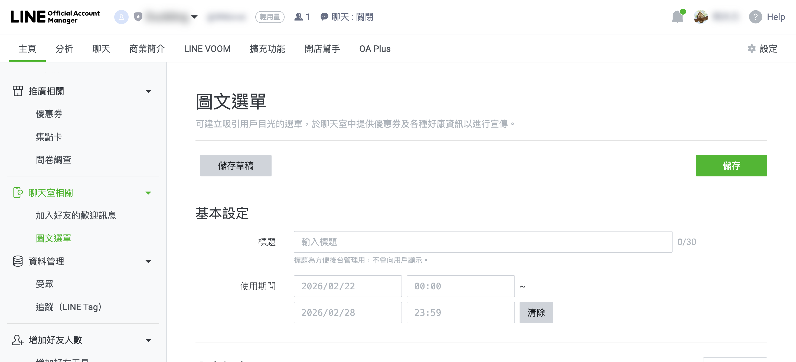
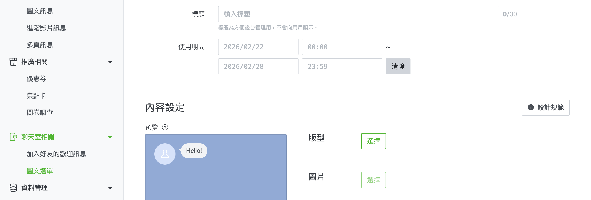
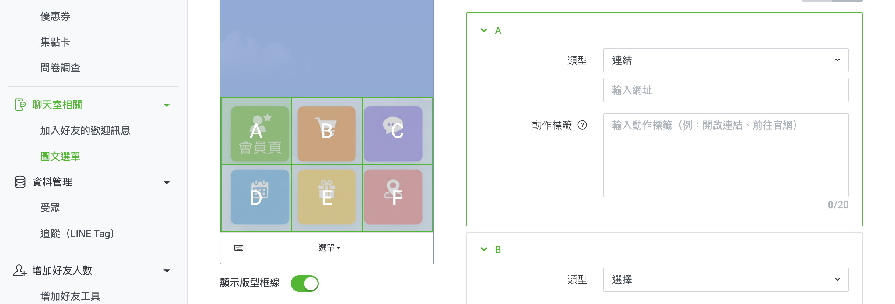
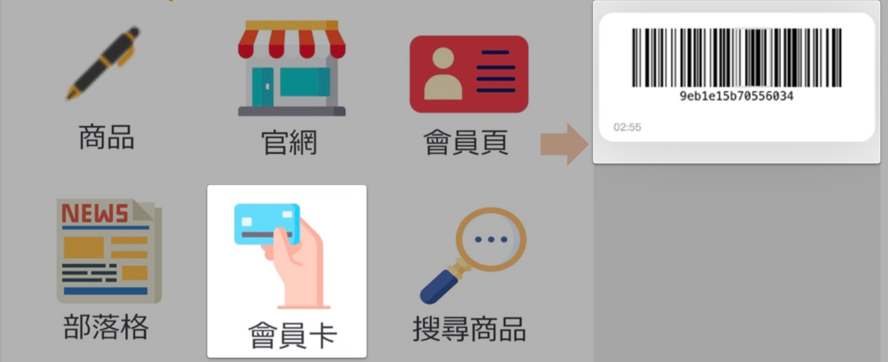
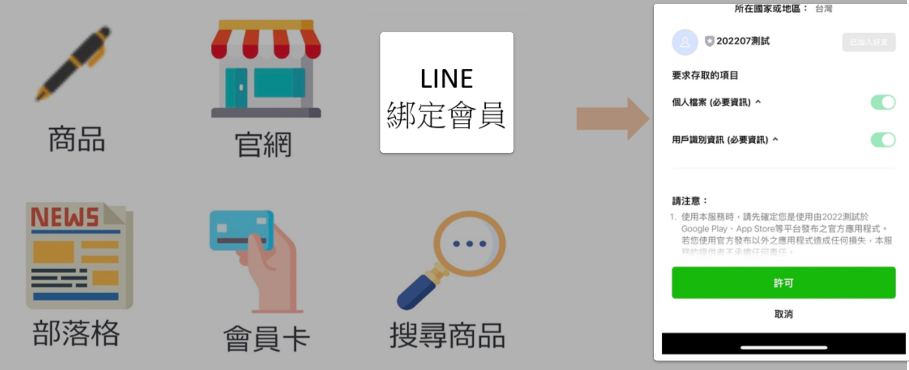

# 設定 LINE 圖文選單

建立與設定 LINE 圖文選單，讓顧客可透過官方帳號快速導覽商品、會員中心與導購頁面。
{ .subtitle }

[:lucide-tag:{ title="適用方案" }](../../resources/conventions#適用方案) | 專業 PLUS / 進階 PLUS / 高手 PLUS / 企業
{ .doc-badge }

{ .hero-page }

## 什麼是 LINE 圖文選單

 **LINE 圖文選單** 是推廣商品與引導消費者快速查找資料的重要工具。您可以透過選單配置「關鍵字搜尋商品」、「會員資料查看」或「導購連結」等功能。

以下為 LINE 圖文選單的詳細設定說明與教學：

## 設定前置準備

在開始設定前，請確保完成以下事項：

- [x] **方案確認**：確認您目前使用的 LINE OA 方案 **支援 API 串接**。

- [x] **API 串接**：須先完成  [**LINE Messaging API**  的串接](串接 LINE Messaging API.md){ data-preview }  設定。

- [x] **連結規範**：圖文選單的連結 **請勿使用短網址**，以免導致代碼失效。

## 建立圖文選單步驟

1. **進入 LINE 管理後台**：登入 [LINE Official Account Manager :lucide-external-link:](https://www.google.com/url?sa=E&q=https%3A%2F%2Fmanager.line.biz%2F)，選擇您的官方帳號。

2. **建立選單項目**：從左側選單選擇 **聊天室相關 > 圖文選單**，點選 **建立圖文選單**。

3. **設定基本資訊**：

	- **標題**：供內部辨識，顧客不會看到。

	- **使用期間**：設定選單要在何時顯示。

	- **選單列顯示文字**：顯示於聊天室最下方的按鈕文字（如：點我看更多）。
	
	- **預設顯示方式**：可選擇預設展開或隱藏。

4. **設定版型與圖片**：

	- 選擇適合的 **版型** 分塊方式。

	- 上傳圖片：支援 **JPG、JPEG、PNG**，容量須在 **1 MB** 以下。

	- 圖片尺寸建議：共有 2500x1786、1200x810、800x540 等六種規格（單位 px）。

> :lucide-info: 詳細設定流程，請參閱 [LINE 官方說明文件 :lucide-external-link:](https://tw.linebiz.com/manual/line-official-account/oa-manager-richmenu/)。

## 設定圖文選單動作

在設定各區塊的動作時，通常選擇類型為 **連結**。

- **連結網址：** 請輸入欲導流之目標頁面的完整連結（須包含 `https://`）。
- **動作標籤：** 無障礙支援，在適用情況下將以語音朗讀此處說明文字；在不支援的裝置上只會顯示文字。

請依需求選擇以下對應連結：

### 常用功能路徑對照表

將下方的 **網址代號** 接在您的官網網域之後即可生效（例如：`https://www.yourshop.com/account`）。

|**功能名稱**|**網址代號 (Path Alias)**|**應用場景與備註**|
|---|---|---|
|**官網首頁**|`/`|導向品牌首頁，增加品牌導流|
|**會員資料頁**|`account`|顧客查詢個人資料、訂單紀錄與紅利點數|
|**部落格總覽**|`blogs`|導向內容行銷文章列表|
|**所有產品頁**|`collections/all`|展示商店內所有上架商品|
|**電子票券**|`account/eticket_orders`|供顧客查看已購買之虛擬票券/核銷碼|
|**會員卡 (條碼)**|`account/id_barcode`|**OMO 應用**：供線下門市掃描核銷 (POS 專屬)|
|**特定搜尋結果**|`search?q=關鍵字`|直接導向特定關鍵字的搜尋結果 (請將「關鍵字」替換，如欲推廣商品)|

---

### 連結組合規範與範例

根據顧客瀏覽的目的與身分驗證需求，請選擇對應的連結構造方式：

---

#### 一般瀏覽模式 (不強制登入)

若希望顧客不經過 LINE 帳號綁定即可直接瀏覽頁面，請使用標準格式。

- **構造公式**：`https://[你的網域]/[網址代號]`
    
- **範例**：`https://testtest.co/collections/all`
    
---

#### 特定頁面直連

若欲導流至特定商品頁、群組頁或自訂頁面，請直接複製該頁面的完整 URL。

- **範例**：`https://testtest.co/products/summer-sale`

---

#### OMO 實體門市應用

若於選單設置「會員卡」按鈕，方便顧客在線下結帳時出示，請使用專屬路徑。

- **連結網址**：`https://你的網址/account/id_barcode`
    
- **前提條件**：需確認系統方案已啟用 **CYBERBIZ POS** 功能並已完成 [LINE 會員綁定設定](綁定 LINE 官方帳號與官網會員.md){ data-preview }  。

!!! note "延伸閱讀：門市端如何操作"
	詳細的 POS 掃碼登入、紅利折抵及常見問題排除說明，請參閱 [如何設定與使用 LINE  會員條碼 (POS 串接)](../../../pos/integrations/line/設定與使用 LINE 顯示會員條碼（串接 POS 結帳）.md){ data-preview }  。

---

### 會員帳號綁定機制（建議）

為了確保系統能發送自動化的 **訂單通知** 與 **物流狀態更新**，建議將選單中具備會員性質的區塊（如：會員中心）設定為「自動綁定連結」。

#### 設定資訊

- **綁定連結**：`https://[你的網域]/customer/auth/line?line_action=line_login`
    

#### 運作邏輯說明

- **尚未綁定者**：點擊後會觸發 LINE 授權畫面，完成授權即自動完成官網會員綁定，隨後導向登入狀態頁面。
    
- **已完成綁定者**：點擊後會直接以「登入狀態」進入目標頁面，提升購物體驗。
    

!!! warning "重要提醒"
	
	- 避免重複跳轉流程： 帶有`line_action=line_login` 參數的網址會持續觸發驗證流程。建議僅在「首次綁定」或「登入/註冊」按鈕使用此網址；其餘一般導購按鈕建議使用普通連結。
	- LINE OA 訊息計費規範： 啟用自動化通知功能前，請務必評估營運成本。LINE 官方帳號的訊息發送（包含：手動群發、自動化訂單通知、物流更新）均計入付費額度。相關計費標準請參閱官方 [加購訊息價目表 :lucide-external-link:](https://tw.linebiz.com/service/account-solutions/line-official-account/)。

!!! note "更多會員綁定方法，請參閱 [LINE 會員綁定](綁定 LINE 官方帳號與官網會員#商家後台設定方法)。"

## 如何確認圖文選單已成功顯示

完成設定後，請於手機開啟 LINE App 並確認：

- 官方帳號聊天室底部顯示圖文選單
- 點擊選單可正確導向指定頁面
- 已設定期間的選單於指定時間顯示

## 後續操作

- :lucide-link:{ .lg }   
  [__LIFF 網址優化__](設定 LIFF 自動登入與會員綁定.md){ data-preview }       
  改用 EC 後台生成的 **LIFF 網址**。消費者點擊後可在 LINE 內自動套用帳戶資訊，實現「一鍵加入好友、註冊會員並完成綁定」，優化使用體驗。

- :lucide-search:{ .lg }     
  [__關鍵字搜尋商品__](串接 LINE Messaging API.md#line-關鍵字搜尋商品){ data-preview }    
  串接 Webhook 後，顧客可在 LINE 對話框輸入關鍵字，由系統自動回覆搜尋到的商品訊息。

## 常見問題

??? quote "為什麼我的圖文選單上傳圖片後顯示「解析度不符」"

	LINE 對於圖文選單的圖片尺寸有嚴格規範。請確保您的圖片符合以下條件：

	- **檔案格式**：JPG, JPEG, PNG。
	- **檔案大小**：1 MB 以下。
	- **像素尺寸**：必須完全符合 LINE 指定的六種規格（如 大尺寸：$2500 \times 1786$ px 或 $1200 \times 810$ px；小尺寸：$2500 \times 843$ px）。即使只差 1 像素也會導致上傳失敗。

??? quote "設定了「自動綁定連結」，但使用者點擊後卻出現錯誤畫面"

	這通常與 **LINE Login** 的回呼網址 (Callback URL) 設定有關。請檢查：

	1. [LINE Developers 控制台](https://developers.line.biz/) 中的 **LINE Login** 頻道狀態是否為「Published」。

	2. 確認 **Callback URL** 是否正確填入您的官網網址。

	3. 連結中是否包含完整的 `https://`。

??? quote "為什麼點擊選單連結時，會跳出「請在外部瀏覽器開啟」的提示？"

	這通常是因為連結使用了 **短網址**（如 bit.ly）或非安全連結（http）。

	- **解決方案**：請務必使用官網產出的 **原始長網址**。

	- **優化建議**：若希望在 LINE App 內直接開啟且不跳出 App，建議將連結更換為 **LIFF 網址**，可提供更流暢的內嵌式網頁體驗。

??? quote "我更新了圖文選單，但手機版 LINE 還是顯示舊的"

	這是因為手機端存有快取 (Cache)。請嘗試以下步驟：

	1. 徹底關閉 LINE App 並重新開啟。

	2. 取消追蹤官方帳號後，重新加入好友。

	3. 若設定了「使用期間」，請確認當前時間是否在設定的區間內。