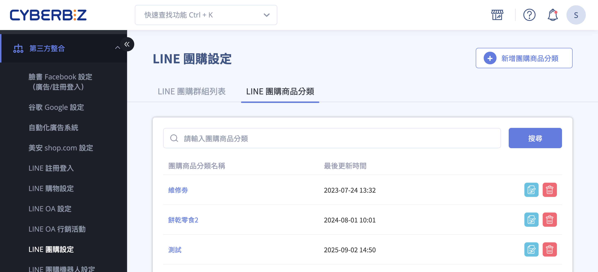
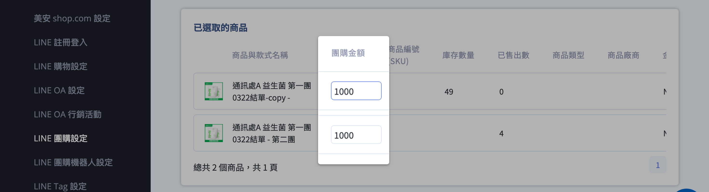
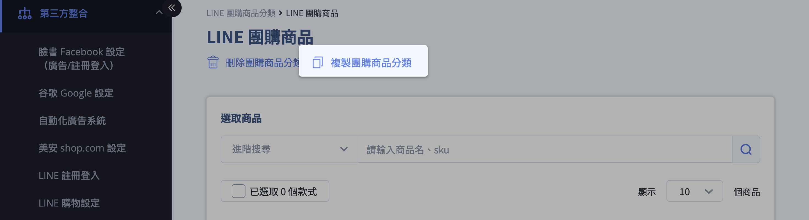

# 設定 LINE 團購商品

{ .subtitle }

{ .doc-badge }

{ .hero-page }

## LINE 團購商品說明

**「LINE 團購商品設定」** 功能讓商家可以從官網公開商品中挑選品項，建立專屬的團購商品清單並設定獨立的「團購價」。

以下為團購商品設定的詳細說明與操作教學：

## 新增團購商品分類

1.  **進入路徑：** 登入 CYBERBIZ 管理後台，前往 **第三方整合 > LINE 團購設定**。
2.  **新增分類：** 點擊「**新增團購商品分類**」按鈕。
3.  **命名分類：** 輸入此團購商品分類的名稱。**請注意：名稱一旦儲存後便無法修改**，若需更名必須重新新增或使用複製功能。
4.  **選取商品：** 從列表中勾選欲加入團購的商品，點擊操作選單後選擇「加入所選商品」。 
    
    - 確認狀態： 加入成功的商品將自動顯示於下方的「已選取商品」列表。
    - 多規格處理： 若商品包含多個款式（規格），系統將自動展開並個別列出。商家可針對不同款式設定差異化的團購價。

    

5.  **編輯價格：** 在 **已選取商品** 列表中，輸入該商品在 LINE 群組內販售的「團購價錢」，完成後儲存。

    

---

## 複製團購商品分類 (進階應用)

若您希望針對不同的團購主（團主）提供相同的商品組合，但給予不同的優惠價格，可利用「複製」功能來節省設定時間：

1.  **執行複製：** 進入商品分類編輯頁面，在已建立的分類旁點選「**複製團購商品分類**」。
2.  **重新命名：** 為複製出的新分類命名（例如加上團主名稱以利辨識），儲存後即可進入該分類。
3.  **調整價格：** 針對該位團主的優惠策略，修改分類內的商品團購價。

---

## 重要注意事項

*   **商品來源：** 僅能選取商城中狀態為「公開」的商品。
*   **名稱限制：** 團購商品分類名稱儲存後即鎖定，若需更換請務必透過新增或複製功能處理。
*   **款式呈現：** 在 LINE 團購介面中，不同款式的商品會個別出現在列表中供群組成員挑選。
*   **行銷活動限制：** 團購購物車 **不開放** 搭配官網內的一般行銷活動（如全館折扣、滿額贈等）使用。

## 後續操作

- :lucide-users:{ .lg }     
  [__團購群組設定__](){ data-preview }  
  將機器人加入群組，並設定分潤方案與活動時間。

## 常見問題

??? quote "為什麼我在「選取商品」列表中找不到某件商品？"
    請檢查該商品在官網後台的狀態是否為 「公開」。系統為了確保消費者能正常下單，僅會抓取已上架且公開的商品。

??? quote "團購商品分類的名稱寫錯了怎麼辦？"
    由於系統限制名稱儲存後無法直接編輯，建議您使用 「複製團購商品分類」 功能，輸入正確名稱後儲存，並將原有的舊分類刪除。

??? quote "團購價可以設定得比官網原價高嗎？"
    可以。系統允許自定義團購價，但為了維護團購轉換率，建議團購價應優於或等於官網售價。

??? quote "消費者在 LINE 團購下單時，可以使用官網的優惠券或紅利折抵嗎？"
    不可以。 誠如「重要注意事項」所述，LINE 團購為獨立結帳流程，目前不支援官網的一般行銷活動（如優惠券、紅利、全館滿額折等）。
