# 設定 LINE 團購機器人

建立並設定 LINE 團購機器人，完成 Messaging API、Webhook 與 LIFF 串接，讓使用者可在 LINE 群組內進行團購購物。
{ .subtitle }

[:lucide-tag:{ title="適用方案" }](../../../resources/conventions#適用方案) | 企業
{ .doc-badge }

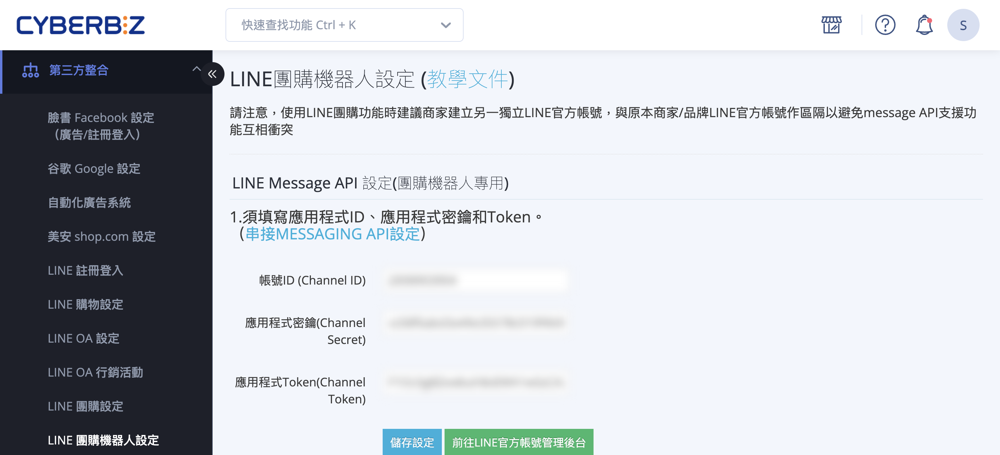{ .hero-page }

## 什麼是 LINE 團購機器人

**LINE 團購機器人設定** 是執行 LINE 群組團購功能的基礎。透過設定專屬的團購機器人並將其加入 LINE 群組，成員即可在群組內直接進行購物。

以下是 **LINE 團購機器人設定** 的詳細教學：

## 使用情境與限制

*   **功能目的**：協助商家在 LINE 群組內進行團購活動，並引導成員加入品牌官方帳號好友。
*   **適用環境**：僅限於 **LINE 群組** 或 **多人聊天室**。由於匿名性限制，不支援 LINE 社群 (OpenChat)。
*   **建議做法**：建議將「品牌官方帳號」與「團購機器人帳號」分開建立，以避免功能干擾。兩者應選擇 **同一個服務提供者 (LINE Provider)**，以便用戶資料流通。

???+ note "LINE 官方帳號與團購機器人分流架構圖"
    ```mermaid
        graph LR
            %% Define Node Styles
            classDef provider fill:#76B947,stroke:#5E9639,color:#fff,font-weight:bold;
            classDef officialAccount fill:#5B9BD5,stroke:#4A80B1,color:#fff,font-weight:bold;
            classDef notes fill:none,stroke:none,color:#333,text-align:left;

            %% Nodes
            P("服務提供者<br>(LINE Provider)<br>ex. CYBERBIZ Provider"):::provider

            OA1("LINE官方帳號1<br>(品牌官方帳號)<br>ex. CYBERBIZ品牌官方帳號"):::officialAccount
            
            OA2("LINE官方帳號2<br>(團購機器人官方帳號)<br>ex. CYBERBIZ團購官方帳號"):::officialAccount

            N1("會員經營<br>訊息推播<br>分眾行銷<br>互動遊戲<br>客服問答..."):::notes
            
            N2("團購活動"):::notes

            %% Connections
            P --> OA1
            P --> OA2
            
            %% Attach Notes (Invisible lines to position text)
            OA1 -.- N1
            OA2 -.- N2
    ```

## 前置需求

在開始設定前，請確保您具備以下條件：

- [x] 一個 LINE Provider
- [x] 一個品牌 LINE 官方帳號
- [x] 一個團購機器人 LINE 官方帳號
- [x] CYBERBIZ 後台管理權限
---

## 機器人專用 Messaging API 設定

1.  **建立帳號**：至 [LINE OA Manager :lucide-external-link:](https://manager.line.biz/) 創建一個專屬團購用的 LINE 官方帳號。

    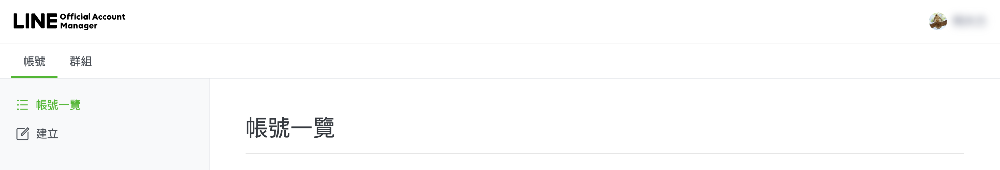

2.  **帳號設定**：於「設定」>「帳號設定」中，將「加入群組或多人聊天室」設為「**接受邀請加入群組或多人聊天室**」。

    

3.  **回應設定**：在「回應設定」中，
    - 啟用【聊天】功能。
    - 將【回應模式】設為「**手動聊天＋自動回應訊息**」。
    - **停用**「加入好友的歡迎訊息」。

    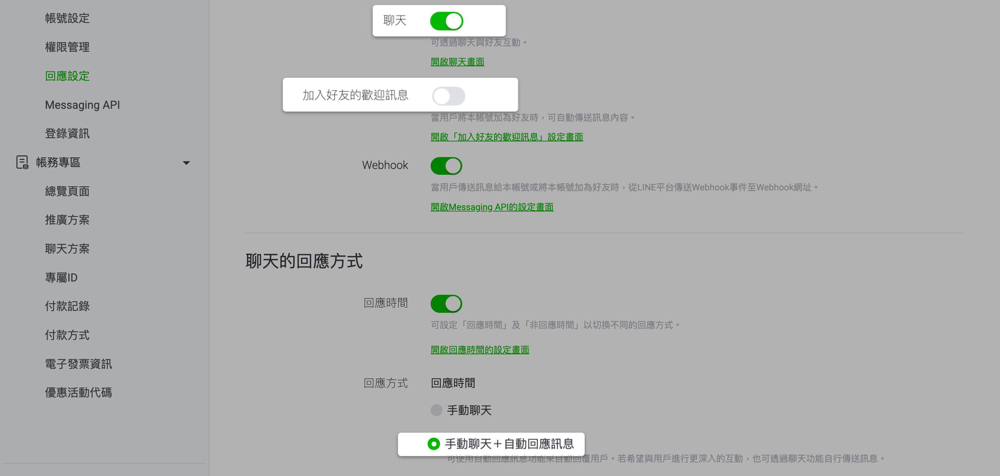

4.  **啟用 Messaging API**：點選「啟用 Messaging API」，並選擇與品牌官網相同的 **LINE Provider**。

    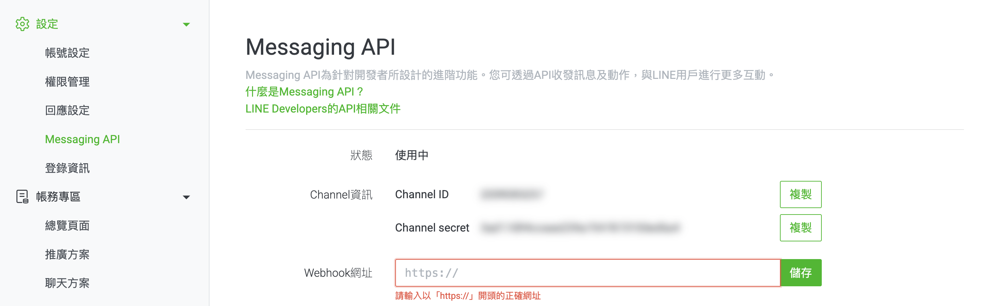
    
    !!! warning "確保消費者身分 (UID) 一致"
        若您的品牌已經建立 LINE Provider（服務提供者），請選擇「現有提供者」，**不要重新建立新的 Provider**。 
        
        **原因**：LINE 的使用者識別碼（UID）是依 Provider 進行管理。若機器人與品牌官方帳號屬於不同 Provider，系統將無法辨識為同一位使用者。

        **影響**：將「品牌官方帳號」與「團購機器人」建立在 **同一個 Provider** 下，可確保會員身份一致，並避免資料串接失敗。

5.  **串接後台**：

    *   將 LINE 的 Channel 資訊複製到 CYBERBIZ 後台（路徑：**第三方整合** > **LINE 團購機器人設定**）。
    
        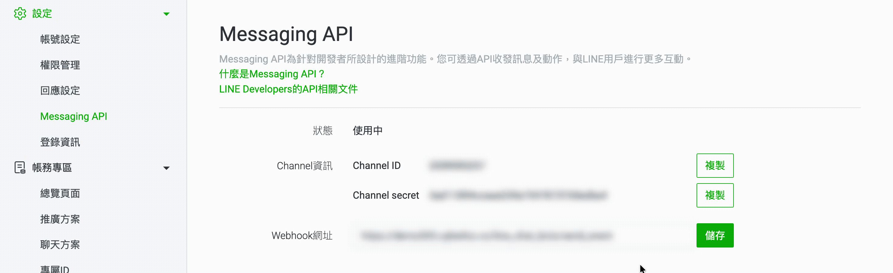

    *   將 CYBERBIZ 提供的 **Webhook 網址** 貼回 LINE OA Manager 的 Messaging API 設定中，並點擊儲存。

        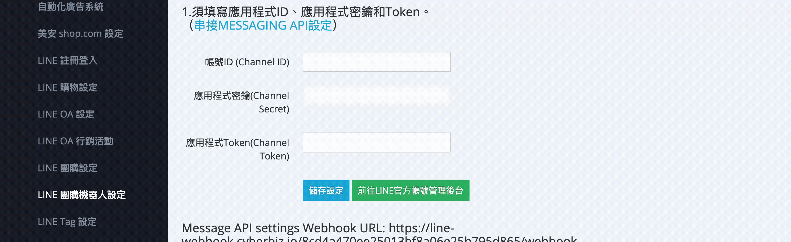

6.  **取得 Access Token**：
    - 至 [LINE Developers Console :lucide-external-link:](https://developers.line.biz/console) 進入該帳號，或從 LINE OA Manager 的 Messaging API 頁面中直接點擊引導連結進入。
    
        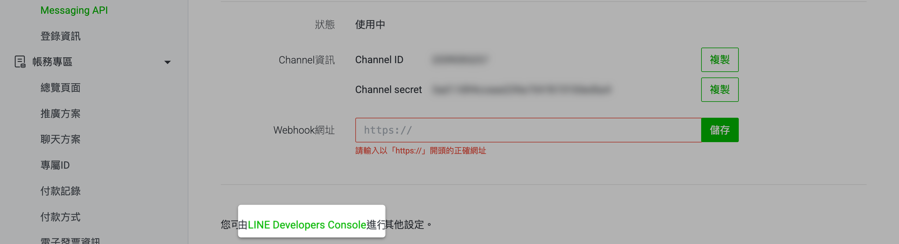

    - 在「Messaging API」頁籤將 **Use webhook** 開啟，並貼上從 CYBERBIZ 後台複製的 Webhook 網址。
    
        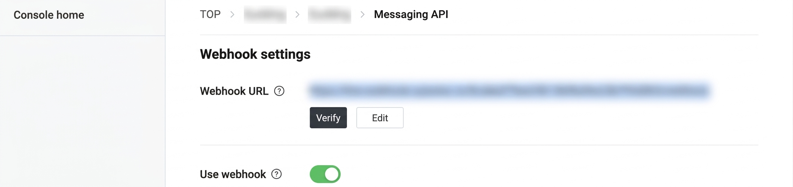

    - 點擊 Issue 取得 **Channel access token**，貼回 CYBERBIZ 後台並儲存。

        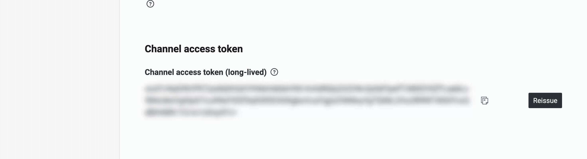

---

## 機器人選單設定

*   若您已有經營中的品牌 LINE 官方帳號，請在後台填入其 **帳號 ID**。
*   系統會在團購過程中（如主選單、訂單完成頁、感謝訊息）協助引導用戶加入該品牌好友，增加會員數。

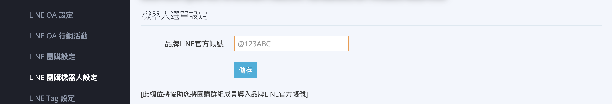

## LIFF 設定（關鍵步驟）

此設定用於讓機器人能在群組中開啟購物介面：

1.  **建立 Login Channel**：登入 [LINE Developers Console :lucide-external-link:](https://developers.line.biz/console)，在同一個 LINE Provider 下點選「Create a new channel」，選擇「**LINE Login**」。

    - **Region** 及 **Company or owners's country or region**：選擇 Taiwan。

    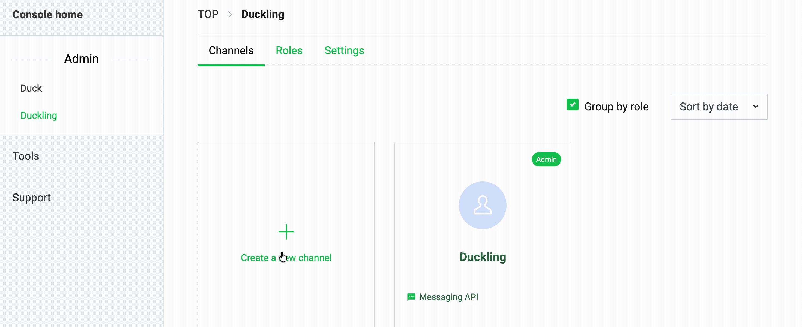

2.  **申請權限**：進入該 Channel 的「Basic settings」頁籤，在 OpenID Connect 下的「Email address permission」點選 Apply，並勾選項目、上傳隱私權條款截圖後 Submit。

    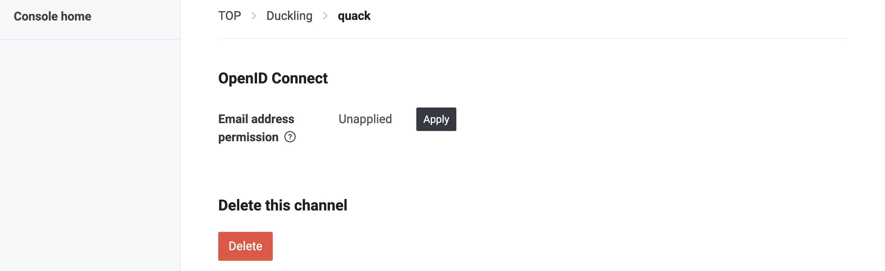

3.  **新增 LIFF**：進入「LIFF」頁籤點選 Add，設定如下：
    *   **Size**：選擇「Tall」。
    *   **Endpoint URL**：輸入 `[您的網址]/liff`。
    *   **Scopes**：全選，且務必將 view all 裡的 **`chat_message.write`** 打開。
    - 設定完成後，點擊 **Add** 建立 LIFF App。
    
    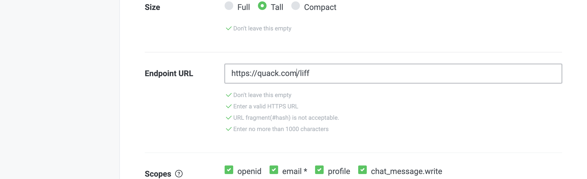

4.  **連動 OA**：在「Basic settings」下方的 **Linked OA** 選擇您的「團購機器人帳號」並點擊 Update。

    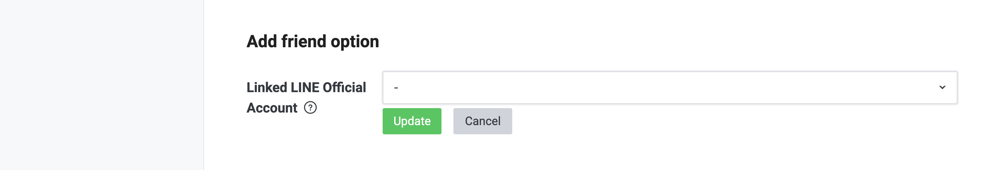

5.  **發布上線**：將取得的 **LIFF ID** 與 **LIFF URL** 貼至 CYBERBIZ 後台，最後將 LINE Developers 狀態由「Developing」改為「**Published**」。

    

## 後續操作

完成機器人設定後，您還需要接續完成以下兩項設定才能正式營運：

<div class="grid cards" markdown>

- :lucide-package:{ .lg }   
  [__團購商品設定__](設定 LINE 團購商品.md){ data-preview }  
  從官網選取商品並設定團購價。

- :lucide-users:{ .lg }     
  [__團購群組設定__](設定 LINE 團購群組.md){ data-preview }  
  將機器人加入群組，並設定分潤方案與活動時間。

</div>

## 常見問題


??? quote "為什麼團購機器人無法在 LINE 社群 (OpenChat) 使用？"
    由於 LINE 社群為了保護隱私，預設對成員身份進行匿名處理，且不支援 Messaging API 的完整連動。因此，團購機器人目前僅支援 一般 LINE 群組 或 多人聊天室。

??? quote "設定完 Webhook 後，點擊 Verify 卻顯示錯誤？"
    請檢查以下兩點：

    1.  網址正確性：確保從 CYBERBIZ 後台複製的 Webhook URL 完整且無多餘空白。
    2.  HTTPS 憑證：您的官網必須擁有有效的 SSL 憑證（HTTPS），LINE 才能成功傳遞訊號。
    3.  後台儲存：請確認您已先在 CYBERBIZ 後台貼入 Channel 資訊並點擊「儲存」，再回到 LINE 進行驗證。

??? quote "為什麼消費者在群組點擊後無法開啟購物介面？"
    這通常與 LIFF 設定有關。請確認：

    1.  Published 狀態：LINE Developers Console 中的 Channel 狀態必須為 Published（綠燈），而非 Developing。
    2.  Scopes 權限：LIFF 設定中的 chat_message.write 是否已勾選並儲存。
    3.  Linked OA：LIFF 是否已正確連結到該團購機器人的官方帳號。

??? quote "重要：為什麼一定要用同一個 Provider？"
    如果您將「品牌帳號」放在 A Provider，而「團購機器人」放在 B Provider，對 LINE 來說，同一個使用者在兩邊的 UID (Unique ID) 會完全不同。這會導致：

    * 系統無法判斷團購的人是否為官網既有會員。
    * 紅利點數、優惠券無法跨平台累積或抵用。
    * 後台訂單數據無法正確歸戶。
