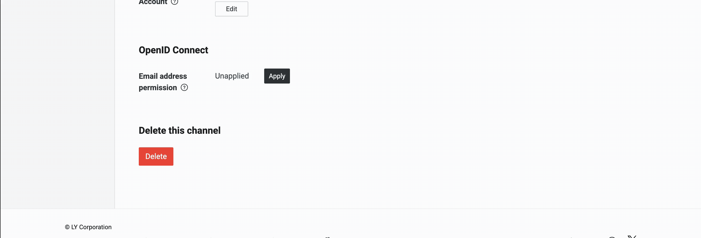
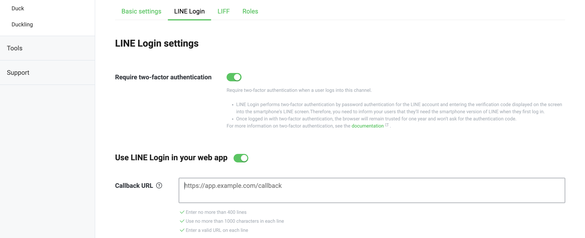
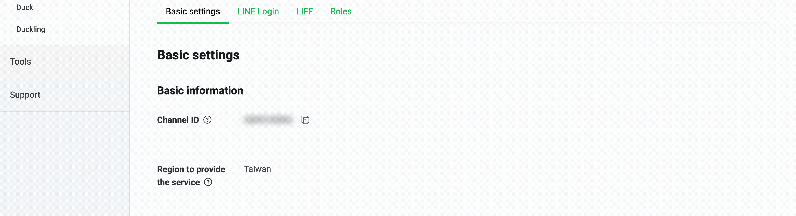
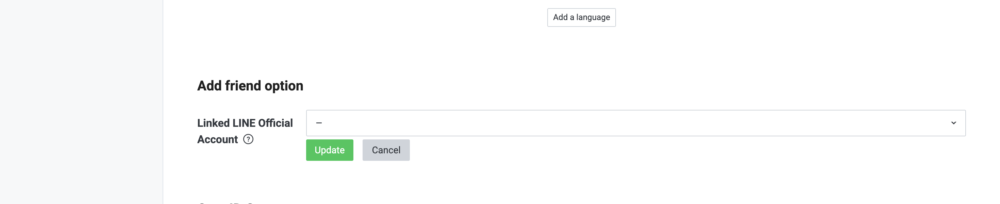
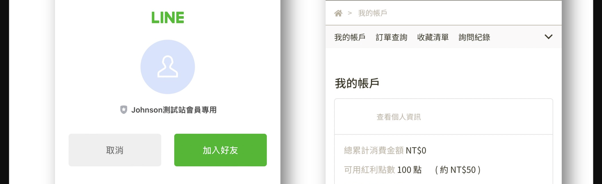

# 設定 LINE 快速登入

啟用 LINE 快速登入，簡化會員註冊流程，整合官方帳號好友追蹤，並支援會員資料同步與 LIFF 一鍵登入。
{ .subtitle }

{ .hero-page }

## 什麼是 LINE 快速登入

**LINE 快速登入** 讓顧客能透過 LINE 帳號直接登入或註冊成為會員，系統會自動抓取客戶 LINE 綁定的「Email」進行帳號比對。這不僅簡化了購物流程，還能增加商家官方帳號的曝光度，並讓商家在後台篩選出透過 LINE 登入的會員。

以下為 LINE 快速登入的詳細設定教學：

## 設定前置注意事項

- **Email 綁定**：顧客的 LINE 帳號 **必須先綁定 Email**，才可以使用 LINE 快速登入功能。

- **Provider 一致性**：若您已有 LINE 官方帳號（Messaging API），請務必確保 **LINE Login Channel** 與 **Messaging API Channel** 處於 **同一個 Provider（服務提供者）** 之下。[瞭解 Provider 及 Channel :lucide-external-link:](https://tw.linebiz.com/manual/line-official-account/line-porvider-and-channel-intro/)。

- **Hinet 信箱限制**：若消費者使用 Hinet 信箱註冊，可能會因為 Hinet 阻擋訊息而導致無法重新設定密碼。

## LINE Developers 後台設定步驟

!!! info "需要先有 LINE 帳戶，瞭解 [如何建立 LINE 官方帳號 :lucide-external-link:](https://help2.line.me/official_account_tw/web/pc?contentId=20013137&lang=zh-Hant)"

1. **建立 Login Channel**：登入 [LINE Developers :lucide-external-link:](https://developers.line.biz/)，選擇正確的 Provider 後，點擊「**Create a LINE Login channel**」。

2. **填寫基本資訊**：

	- **Region** 選擇「Taiwan」(台灣站) / 「Japan」（日本站）。

	- **App types** 勾選「Web app」。

	- 填寫商店名稱（Channel name）、商店簡述（Channel description）、Email 及網站隱私政策/服務條款網址。

	
	
3. **申請 OpenID Connect**：

	- 在「Basic settings」分頁最下方找到「OpenID Connect」，點擊「Apply」。

	- 勾選內容並依照需求上傳商家 Logo 後提交（Submit），這步是 **確保能抓取顧客 Email** 的關鍵。

	

4. **設定 Callback URL（關鍵步驟）**：

	- 切換至「LINE Login」頁籤，在 **Callback URL** 欄位輸入：`https://你的商店網址/customer/auth/line/callback`。

	- **提示**：若您有自有網域，請務必將 CYBERBIZ 網域及自有網域都填入，跨境用戶則填寫一般網域即可，不需加上 `zh-TW`。

	
	
5. **正式發布**：將 Channel 狀態從「Developing」轉為「**Published**」。

	

## CYBERBIZ 後台串接步驟

1. **取得金鑰**：在 LINE Developers 的「Basic settings」頁籤複製 **Channel ID** 與 **Channel Secret**。

2. **回填後台**：前往 CYBERBIZ 後台 **第三方整合 > LINE 註冊登入**。

3. **啟用功能**：貼上 ID 與密鑰，並開啟「**啟用 LINE 登入**」開關後儲存，前台即可看到登入按鈕。

## 進階與增值功能

### 導引加入好友

- 在 LINE Developers 的 **Basic settings > Linked LINE Official Account** 中選擇同 Provider 下的官方帳號。

	

- 設定後，顧客在快速登入時介面會出現「加入好友」的選項。

	

## 後續操作

- :lucide-phone:{ .lg }   
  [__同步會員手機號碼__](設定 LINE 快速登入時取得會員手機號碼.md){ data-preview }       
  申請 LINE 認證權限後，系統將以手機號碼作為優先識別碼，確保會員資料庫的精確度與唯一性。

- :lucide-link:{ .lg }     
  [__配置 LIFF 一鍵登入__](設定 LIFF 自動登入與會員綁定.md){ data-preview }    
  啟用 LIFF 轉址技術，讓顧客在 LINE 內點擊連結即可自動登入，並同步完成好友追蹤與帳號綁定。

## 常見問題

??? quote "出現 400 Bad Request 錯誤畫面"
	這通常與 **Callback URL（回呼網址）** 的配置錯誤有關。請檢查 LINE Developers 後台設定，確保填寫的 URL 與系統提供之路徑完全一致，且包含正確的 `https://` 協定與結尾格式。任何微小的字元差異（如多餘的空格或斜線）都會導致 API 驗證失敗並回傳 400 錯誤。

??? quote "顧客反應在 iOS 裝置上無法自動跳轉至 LINE App"
	這是由於 iOS 瀏覽器的隱私防範機制所致。建議引導消費者優先使用 **Safari 瀏覽器** 進行操作。當系統彈出「要在 LINE 中打開嗎？」的詢問對話框時，請務必點選「打開」。若自動跳轉失效，用戶亦可手動點擊頁面下方的「使用 LINE 應用程式登入」按鈕來強制啟動授權。

??? quote "系統如何處理不同社群帳號間的綁定邏輯"
	系統主要以 **Email** 作為唯一識別碼。當用戶的 Facebook 與 LINE 帳號使用同一組 Email 註冊時，系統將自動將兩者歸納為同一個會員身分並進行綁定。若兩者 Email 不同，系統則會將其視為獨立的會員帳號，且目前不支援跨 Email 的帳號合併作業。
