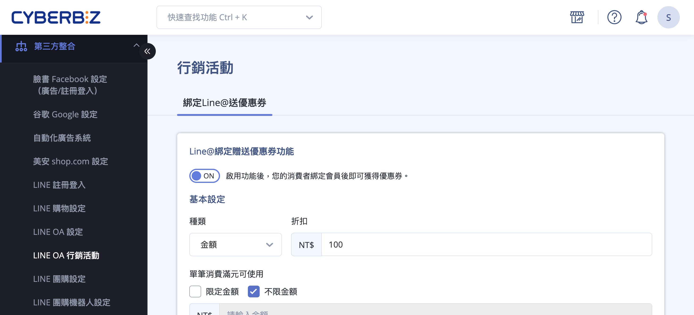
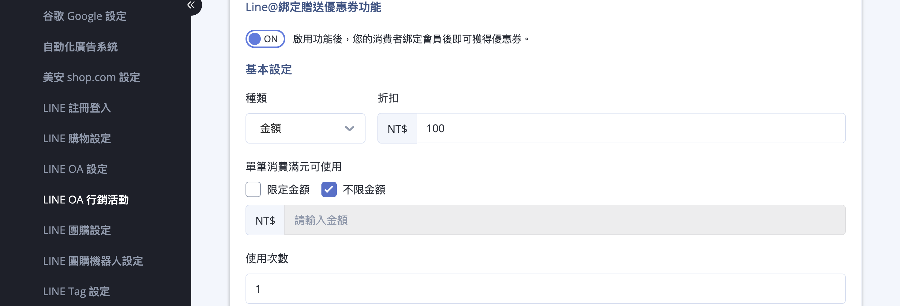
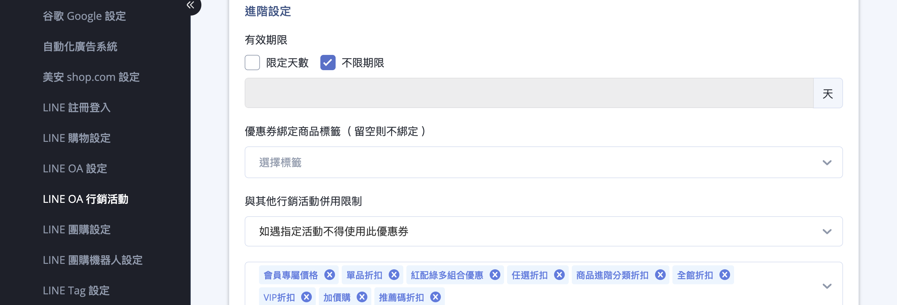

# 設定 LINE 綁定會員贈送優惠券

設定 LINE 官方帳號綁定會員後自動發送優惠券，以提升會員綁定率與行銷效果。
{ .subtitle }

[:lucide-tag:{ title="適用方案" }](../../../resources/conventions#適用方案) | 專業 PLUS / 進階 PLUS / 高手 PLUS / 企業
{ .doc-badge }

{ .hero-page }

## LINE 會員綁定贈送優惠券說明

**LINE 綁定會員送優惠券** 功能旨在透過贈送優惠券的誘因，提升顧客將 LINE 官方帳號與官網會員進行綁定的意願，進而加強品牌與客戶之間的黏著度。

以下為該功能的詳細說明與設定教學：

## 設定前置準備

在啟用此功能前，商家必須完成以下事項：

- [x] [**串接 Messaging API**](串接 LINE Messaging API.md){ data-preview }  ：須先完成 LINE Messaging API 的相關設定。

- [x] **綁定流程確認**：顧客必須完成 [**LINE 官方帳號綁定官網會員**](綁定 LINE 官方帳號與官網會員.md){ data-preview }   的完整流程，方可獲得優惠券。

## 後台設定步驟

1. **前往設定頁面：** 進入管理後台，點選 **第三方整合 > LINE OA 行銷活動**。

2. **啟用功能：** 在頁面中找到「**LINE @ 綁定贈送優惠券功能**」，將開關切換至 **ON**。啟用後，消費者在完成綁定後即可獲得預設的優惠券。

3. **基本設定**

	- **種類**：可選擇「**金額**」或「**百分比**」（例如折扣 100 元或打 9 折）。

	- **單筆消費滿元可使用**：可設定「限定金額」（消費達指定門檻方可折抵）或「不限金額」。

	- **使用次數**：設定每位顧客可以使用此張優惠券的次數上限。

	

4. **進階設定**

	- **有效期限**：可設定「限定天數」或「不限期限」。

	- **優惠券綁定商品標籤**：商家可指定該券僅限用於帶有特定標籤的商品。

	- **與其他行銷活動併用限制**：可設定是否允許該券與全館活動或其他優惠同時使用。

	!!! info "併用邏輯說明"
		商家可設定優惠券是否能與其他行銷活動（如單品折扣、全館活動）同時使用。以下為三種併用情境的系統判定邏輯：
		
		- **無限制：** 此優惠券具備最高相容性，可與網站上所有行銷優惠同時併用。
		
		- **優惠券與指定活動以外併用：** 系統將 **以商品為單位** 進行判定。
        > 若單一商品已符合指定活動優惠，該商品將無法再套用此券，但購物車內其他未參與活動的商品仍可享有折抵。
    
		- **如遇指定活動不得使用此優惠券：** 系統將 **以整筆訂單** 進行判定。
        > 只要訂單中包含任一商品符合指定活動，則該筆訂單將全面鎖定，無法使用此優惠券。

	

5. **套用設定：** 設定完成後，點擊 **儲存** 以套用變更。

## 引導顧客綁定之關鍵

為了確保系統能正確判定綁定行為並發送優惠券，商家 **務必** 讓顧客透過以下特定連結進行綁定：

- **專屬綁定連結**：`https://你的網址/customer/auth/line?line_action=line_login`。

- **應用建議**：商家可以將此連結設定在 [LINE 的 **圖文選單**](設定 LINE 圖文選單.md){ data-preview }  或 [**加入好友的歡迎訊息**](綁定 LINE 官方帳號與官網會員#設定加入好友的歡迎訊息) 中，吸引新好友立即點擊綁定。

## 進階應用技巧

若商家仍有許多已註冊但尚未綁定 LINE OA 的會員，可搭配使用「**LINE OA 加入好友邀請**」功能（透過簡訊或 Email），主動發送帶有誘因的邀請訊息，引導他們完成綁定以領取優惠。

- :lucide-user-plus:{ .lg }   
  [__LINE 加入好友邀請__](../../notifications/發送 LINE 加入好友邀請.md){ data-preview }       
  透過簡訊或 Email 主動發送導流連結，引導顧客加入 LINE 官方帳號，將一般會員轉化為品牌好友。

<!--
- :lucide-ban:{ .lg }     
  [____]()  
  。
-->

## 常見問題

??? quote "為什麼顧客完成綁定後卻沒有收到優惠券" 
	請依序確認以下排除步驟： 
	
	1. **連結正確性**：顧客是否透過專屬連結 `?line_action=line_login` 進行綁定，若僅是一般登入而未帶此參數，系統將無法判定為「綁定活動」。 
	2. **功能開關**：請確認「LINE @ 綁定贈送優惠券功能」已切換為 **ON**。
	3. **Messaging API 狀態**：請檢查 `第三方整合 > LINE 設定` 中的 API 串接是否顯示正常。 
	4. **領取紀錄**：檢查該顧客是否曾解除綁定後再次綁定。每位會員帳號通常僅限領取一次。

??? quote "如果顧客已經是 LINE 好友，現在才進行綁定，還能領券嗎" 
	**可以。** 只要該會員在官網帳號尚未與 LINE UID 關聯，並透過指定路徑完成「綁定流程」，系統即會觸發發券機制。此功能並非僅限「新好友」，而是針對「新綁定行為」。

??? quote "併用限制中的「以商品為單位」與「以訂單為單位」具體差異為何" 
	
	- **以商品為單位**：彈性較高。假設 A 商品有折扣，B 商品沒有；則優惠券僅會對 B 商品生效，A 商品維持原折扣。  
	- **以訂單為單位**：嚴格排除。只要購物車內出現任一項活動商品（如全館 8 折商品），整筆訂單不論金額多寡，皆無法輸入或折抵該優惠券。