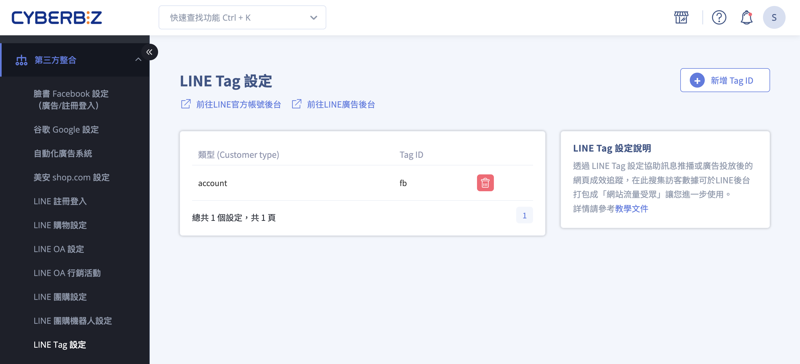
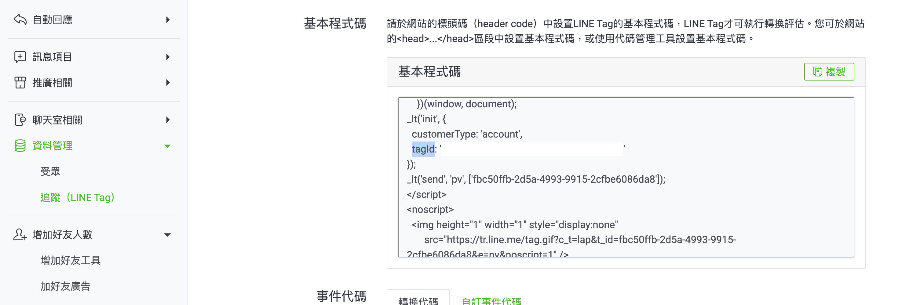
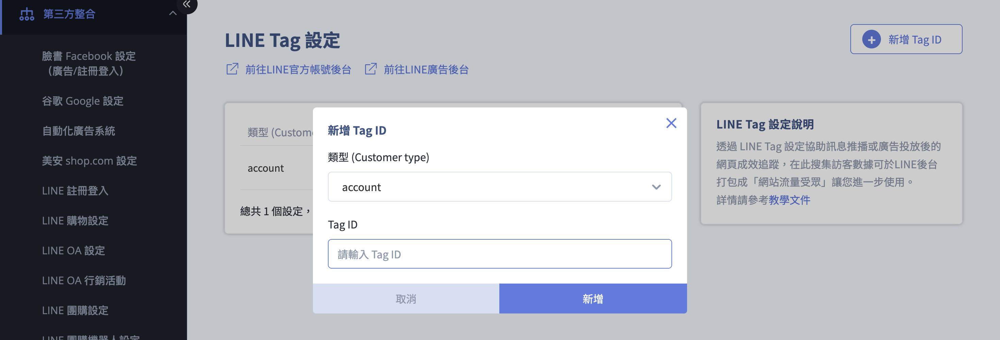
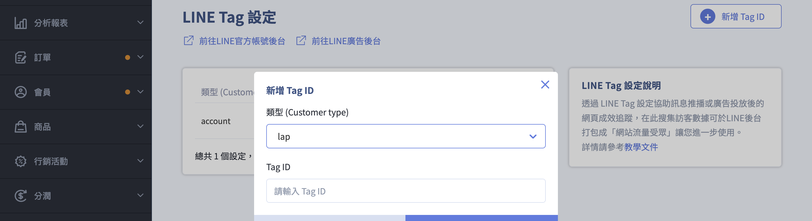

# 設定與管理 LINE Tag

{ .subtitle }

{ .doc-badge }

{ .hero-page }

## 什麼是 LINE Tag

**LINE Tag** 是用於 LINE LAP（成效型廣告）或 LINE OA（官方帳號）的追蹤代碼，功能類似於 Facebook Pixel，可用於追蹤廣告或訊息推播後的轉換成效。

以下為 LINE Tag 的詳細設定教學與應用說明：

## 注意事項

- [x] 設定前請務必先建立好 LINE OA 官方帳號。
- [x] 若您的瀏覽器有安裝 **AdBlock（廣告攔截器）**，設定或檢查時請先將其關閉，以免干擾數據追蹤。

## 取得與設定 LINE Tag ID
您可以在 LINE OA Manager 或 LINE Ad Manager 中取得代碼，並將其填入 CYBERBIZ 後台。

### 用於「訊息推播」轉換追蹤 (LINE OA Manager)

1.  **進入後台**：登入 [LINE OA Manager :lucide-external-link:](https://manager.line.biz/)，選擇欲設定的官方帳號。
2.  **尋找代碼**：於左側選單點擊 **資料管理 > 追蹤(LINE Tag)**，複製頁面中的 **Tag ID**。

    

    !!! tip "使用 ++ctrl+f++ 可快速定位 tagID 所在位置。"

3.  **填入系統**：前往 CYBERBIZ 後台 **第三方整合 > LINE Tag 設定**，點擊 **新增Tag ID**。
4.  **設定類型**：類型選擇 **`account`**，並貼上剛才複製的 Tag ID。

    

---

### 用於「廣告投放」轉換追蹤 (LINE Ad Manager)

1.  **進入後台**：登入 [LINE Ad Manager :lucide-external-link:](https://admanager.line.biz/)，點選欲設定的廣告帳號名稱。
2.  **尋找代碼**：於左側選單選擇 **追蹤(LINE Tag)** ，複製其 **Tag ID**。

    
    
    !!! tip "使用 ++ctrl+f++ 可快速定位 tagID 所在位置。"

3.  **填入系統**：前往 CYBERBIZ 後台 **第三方整合 > LINE Tag 設定**，點擊 **新增Tag ID**。
4.  **設定類型**：類型選擇 **`lap`**，並貼上 Tag ID。

    

---

## CYBERBIZ 支援追蹤事件一覽

系統已自動為以下行為埋設追蹤碼，無須額外撰寫程式：

*   **CompleteRegistration**：完成註冊。
*   **Search**：搜尋商品。
*   **PageView**：瀏覽官網任一頁面。
*   **ViewContent**：瀏覽商品詳細頁。
*   **AddToCart**：將商品加入購物車。
*   **InitiateCheckout**：進入結帳頁面。
*   **Purchase**：訂單完成（購買）。

---

## 如何檢查設定是否成功

*   **方法一（手動檢查）**：到官網執行特定動作（如註冊、加入購物車），之後刷新 LINE 的 Tag 管理頁面，檢查該事件名稱是否出現於狀態列表中。
*   **方法二（工具檢查）**：下載 Chrome 擴充功能「[**LINE Tag Helper** :lucide-external-link:](https://chromewebstore.google.com/detail/line-tag-helper/jgnholagndjghcjedffhinifilbjmklg?hl=zh-TW)」進行即時偵測。

---

## LINE Tag 的進階應用

### 建立受眾

收集到的訪客數據可在 LINE 後台打包成「**網站流量受眾**」，用於廣告精準投放或再行銷。

### 轉換分析

在 LINE OA Manager 的分析功能中，透過「群發訊息 - 自訂轉換」，分析特定訊息帶來的實際轉換表現。

## 後續操作

- :lucide-split:{ .lg }   
  [__受眾串接__](設定 LINE OA 受眾串接.md){ data-preview }  
  篩選官網會員同步至 LINE 建立受眾，以進行精準推播或廣告投放。

- :lucide-ban:{ .lg }     
  [____]()  
  。

## 常見問題

??? quote ""

