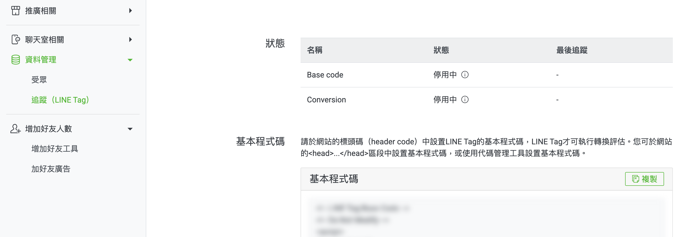
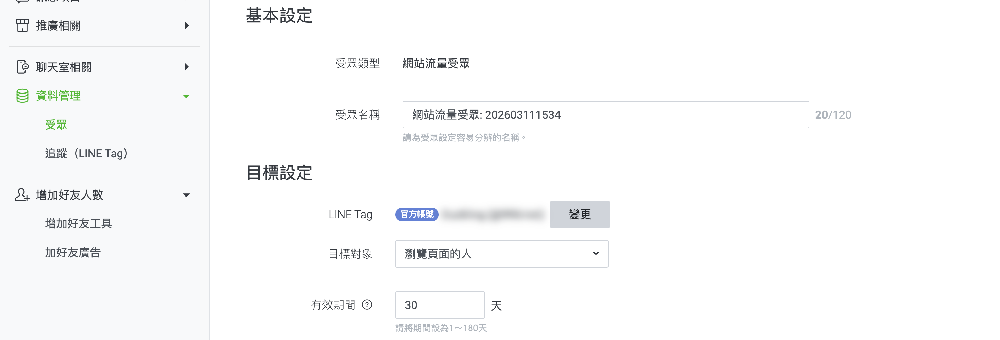
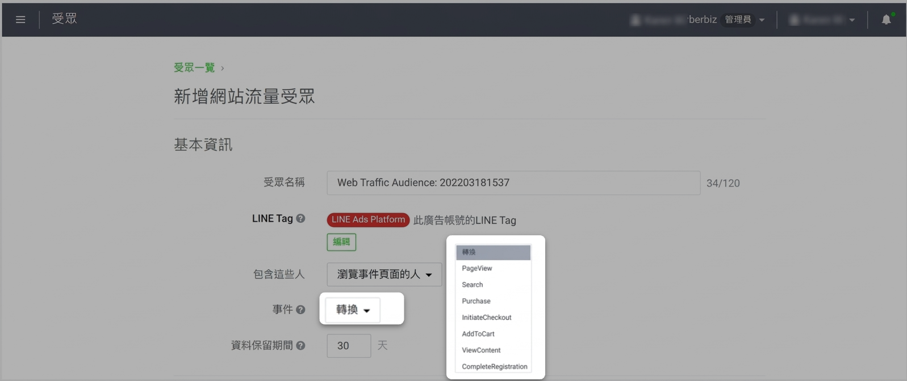
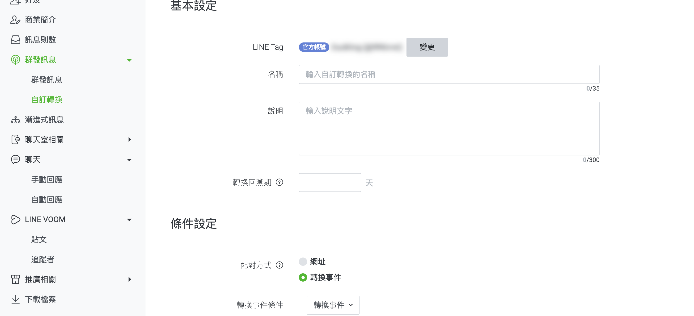

# 設定與管理 LINE Tag

設定 LINE Tag ID，並追蹤 LINE OA 訊息推播或 LINE LAP 廣告帶來的轉換成效。
{ .subtitle }

{ .hero-page }

## 什麼是 LINE Tag

LINE Tag 是 LINE 提供的網站追蹤代碼，功能類似 Facebook Pixel，可用於追蹤：

• LINE OA 訊息推播轉換
• LINE LAP 廣告成效
• 網站流量受眾建立

**LINE Tag** 是用於 LINE LAP（成效型廣告）或 LINE OA（官方帳號）的追蹤代碼，功能類似於 Facebook Pixel，可用於追蹤廣告或訊息推播後的轉換成效。

以下為 LINE Tag 的詳細設定教學與應用說明：

## 注意事項

- [x] 設定前請務必先建立好 LINE OA 官方帳號。
- [x] 若您的瀏覽器有安裝 **AdBlock（廣告攔截器）**，設定或檢查時請先將其關閉，以免干擾數據追蹤。

## 取得與設定 LINE Tag ID
您可以在 LINE OA Manager 或 LINE Ad Manager 中取得代碼，並將其填入 CYBERBIZ 後台。

### 用於「訊息推播」轉換追蹤 (LINE OA Manager)

1.  **進入後台**：登入 [LINE OA Manager :lucide-external-link:](https://manager.line.biz/)，選擇欲設定的官方帳號。
2.  **尋找代碼**：於左側選單點擊 **資料管理 > 追蹤(LINE Tag)**，複製頁面中的 **Tag ID**。

    

    !!! tip "使用 ++ctrl+f++ 可快速定位 tagID 所在位置。"

3.  **填入系統**：前往 CYBERBIZ 後台 **第三方整合 > LINE Tag 設定**，點擊 **新增Tag ID**。
4.  **設定類型**：類型選擇 **`account`**，並貼上剛才複製的 Tag ID。

    

---

### 用於「廣告投放」轉換追蹤 (LINE Ad Manager)

1.  **進入後台**：登入 [LINE Ad Manager :lucide-external-link:](https://admanager.line.biz/)，點選欲設定的廣告帳號名稱。
2.  **尋找代碼**：於左側選單選擇 **追蹤(LINE Tag)** ，複製其 **Tag ID**。

    
    
    !!! tip "使用 ++ctrl+f++ 可快速定位 tagID 所在位置。"

3.  **填入系統**：前往 CYBERBIZ 後台 **第三方整合 > LINE Tag 設定**，點擊 **新增Tag ID**。
4.  **設定類型**：類型選擇 **`lap`**，並貼上 Tag ID。

    

---

## CYBERBIZ 支援追蹤事件一覽

系統已自動為以下行為埋設追蹤碼，無須額外撰寫程式：

| 事件名稱 (Event Name) | 觸發行為說明 |
| :--- | :--- |
| **CompleteRegistration** | 訪客完成註冊 |
| **Search** | 搜尋商品 |
| **PageView** | 瀏覽官網任一頁面 |
| **ViewContent** | 瀏覽商品詳細頁 |
| **AddToCart** | 將商品加入購物車 |
| **InitiateCheckout** | 進入結帳頁面 |
| **Purchase** | 訂單完成（購買） |

---

## 如何檢查設定是否成功

*   **方法一（手動檢查）**：到官網執行特定動作（如註冊、加入購物車），之後刷新 LINE 的 Tag 管理頁面，檢查該事件名稱是否出現於狀態列表中。

    

*   **方法二（工具檢查）**：下載 Chrome 擴充功能「[**LINE Tag Helper** :lucide-external-link:](https://chromewebstore.google.com/detail/line-tag-helper/jgnholagndjghcjedffhinifilbjmklg?hl=zh-TW)」進行即時偵測。

---

## LINE Tag 進階應用

### 建立受眾

收集到的訪客數據可在 LINE 後台打包成「**網站流量受眾**」，用於廣告精準投放或再行銷。

#### LINE OA Manager

1.  **進入後台**：登入 [LINE OA Manager :lucide-external-link:](https://manager.line.biz/)，選擇欲設定的官方帳號。
2.  **操作頁面**：點選 **資料管理 > 受眾 > 建立受眾**。
3.  **受眾設定**:
    
    - **受眾類型**: 選擇 **網站流量**。
    - **目標設定**: 選擇欲設定的 LINE Tag 帳號，以及相關目標設定。

---

#### LINE Ad Manager

1.  **進入後台**：登入 [LINE Ad Manager :lucide-external-link:](https://admanager.line.biz/)，點選欲設定的廣告帳號名稱。
2.  **操作頁面**：點選左上角選單按鈕 :lucide-menu:，選擇 **受眾 > 建立受眾 > 網站流量受眾**。
3.  **受眾設定**：點選 **事件** 可以選擇要設定的事件。

### 轉換分析

在 LINE OA Manager 的分析功能中，透過「群發訊息 - 自訂轉換」，分析特定訊息帶來的實際轉換表現。

1.  **操作頁面**：點擊 **群發訊息 > 自訂轉換 > 建立**。
2.  **設定轉換內容**：
    - **LINE Tag**：選擇設定的 LINE Tag。
    - **配對方式**：選擇 **轉換事件**。

## 後續操作

- :lucide-split:{ .lg }   
  [__受眾串接__](設定 LINE OA 受眾串接.md){ data-preview }  
  篩選官網會員同步至 LINE 建立受眾，以進行精準推播或廣告投放。

## 常見問題

??? quote "為什麼我的 LINE Tag 狀態一直顯示「正在等待資料」或「無活動」？"
    這通常有三個可能原因：

    1. **尚未產生流量**：請親自到官網點擊幾個商品頁，並完成「加入購物車」動作。
    2. **廣告攔截器影響**：請確認檢查時已關閉 AdBlock 等插件。
    3. **Tag ID 填錯位置**：請確認 `account` (OA) 與 `lap` (廣告) 的 ID 沒有填反。

??? quote "LINE Tag 的數據會跟 Google Analytics (GA4) 有落差嗎？"
    會的。這是正常的現象。兩者的 **歸因模型** 不同（例如 LINE 可能採計點擊後 30 天內的轉換，而 GA4 有其定義），且若消費者在 LINE 內置瀏覽器開啟後切換到 Safari/Chrome 完成購買，可能會導致追蹤遺失。

??? quote "我需要手動在每個商品頁埋設 ViewContent 代碼嗎？"
    不需要。CYBERBIZ 系統已完成深度整合，只要您在後台填入正確的 Tag ID，系統會自動在對應頁面發送 `ViewContent`、`AddToCart` 與 `Purchase` 等事件，並帶入金額與商品資訊。

??? quote "如果我同時有兩個 LINE 官方帳號，可以填兩個 Account ID 嗎？"
    目前系統支援填寫一組 `account` 類型與一組 `lap` 類型。若有特殊多帳號需求，建議透過 Google Tag Manager (GTM) 進行額外埋設。

