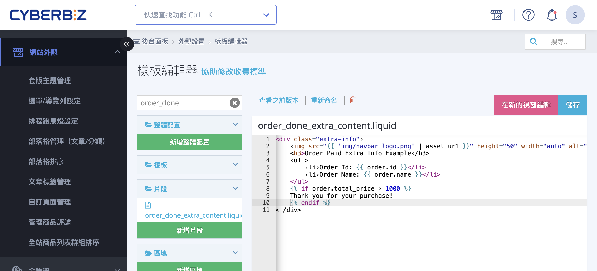
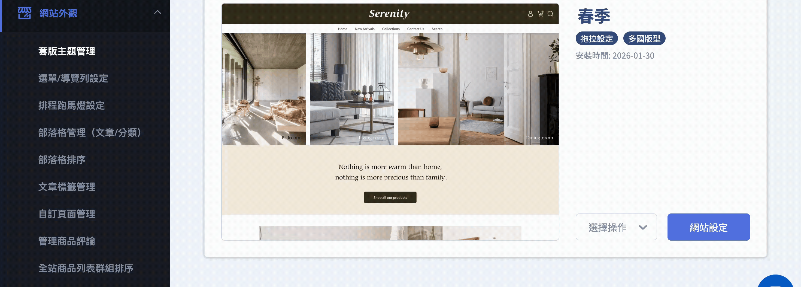
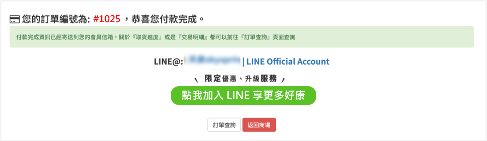
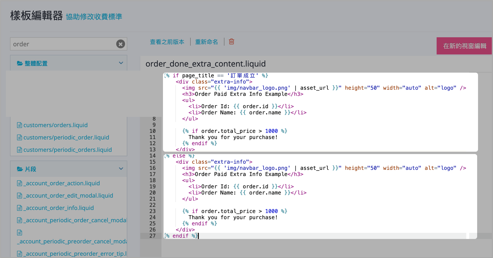

# 設定訂單成立頁與付款完成頁顯示 LINE 加入好友連結

透過編輯 Liquid 樣版檔案，在結帳完成後的關鍵轉換點嵌入 LINE 導流元件，以提升會員回流率。
{ .subtitle }

[:lucide-tag:{ title="適用方案" }](../../resources/conventions#適用方案) | 高手PLUS / 企業  
[:lucide-bolt:{ title="適用功能" }](../../resources/conventions#適用功能) | 拖拉版型
{ .doc-badge }

{ .hero-page }

## 訂單相關頁面顯示 LINE 加入好友連結說明

商家可以透過修改程式碼，在顧客下單後的 **「訂單成立頁」** 以及 **「訂單付款完成頁」** 新增加入 LINE 好友的連結或圖片。

以下為操作說明與教學：

## 前置作業：申請開通

- [x] **向客服申請：** 此功能並非預設開啟，請先至後台向 **CYBERBIZ 客服** 申請開通。
- [x] **版型限制：** 功能開通後僅會套用於「**目前已發布**」的版型。若未來更換新版型，需重新向客服申請開通。
- [x] **適用版型：** 此功能支援 **拖拉版型**。

## 後台操作步驟

1. **進入編輯器：** 登入後台，前往 **網站外觀 > 套版主題管理**。
2. **選擇操作：** 在目前使用的版型上點選「**選擇操作**」>「**CSS/HTML編輯器**」。
3. **搜尋檔案：** 在編輯器搜尋欄中輸入檔案名稱：**`order_done_extra_content.liquid`**。

	

4. **編輯程式碼：** 編輯完成後，點擊 **儲存** 以套用變更。
5. **前台畫面範例：**

	

## 程式碼撰寫建議

商家工程師需自行撰寫 HTML/CSS 程式碼來設計畫面。若商家希望針對不同的頁面顯示不同內容，可以使用以下邏輯進行判斷：

- **區分頁面代碼範例：**
    
    ``` liquid
    
       <!-- 這裡放置要在「訂單成立頁」顯示的內容（如好友連結、圖片） -->
    
       <!-- 這裡放置要在「付款完成頁」顯示的內容 -->
    
    ```
    
    _(註：若不需區分頁面，則直接放置內容即可)_

	

- **恢復機制：** 若修改後發生異常，可參考[「恢復樣版編輯器」](../../website-appearance/使用樣板編輯器恢復網頁代碼.md){ data-preview }  功能將檔案回溯至先前版本。

!!! warning "注意事項"
	- **不提供代寫服務：** CYBERBIZ **不提供語法教學與代碼撰寫服務**，商家需委託自家工程師或外部設計單位處理。
	- **風險自負：** 商家修改程式碼後所產生的任何系統問題或錯誤，商家需自行承擔風險與後果。

## 常見問題


??? quote "為什麼我修改了 `order_done_extra_content.liquid` 卻沒在頁面上看到變化"

	- **確認快取：** 請嘗試開啟無痕視窗或清除瀏覽器快取後重新整理。
    
	- **檢查方案與權限：** 請確認您的方案為「高手PLUS」或「企業版」，且已聯繫客服完成功能開通。
    
	- **檢查版型類型：** 本功能僅支援「拖拉版型」，若使用傳統舊版型（非拖拉式）將無法正常運作。"

??? quote "更換佈景主題後，設定會保留嗎"
	**不會。** 程式碼是存在於特定的佈景主題檔案中。如果您更換或重新安裝了新的主題，必須重新執行上述步驟並將程式碼複製到新主題的對應檔案內。