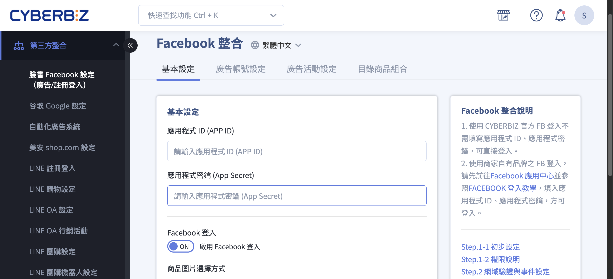
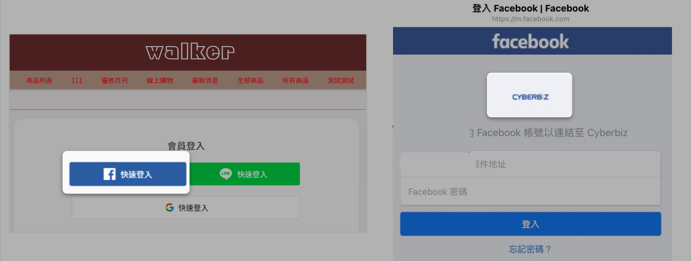
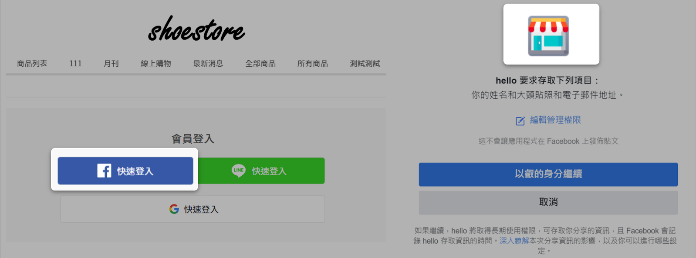
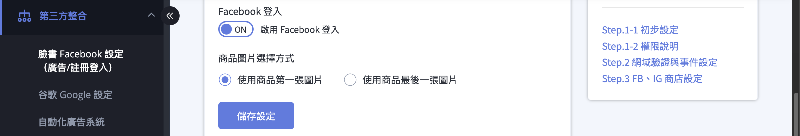

{ .subtitle }

{ .hero-page }

## Facebook 快速登入說明

**Facebook 快速登入** 功能可讓顧客於「會員註冊」或「結帳頁面」直接使用 Facebook 帳號登入，系統會自動抓取其 Facebook 綁定的信箱作為帳號，並將資料與官網顧客列表關聯，方便商家後續篩選受眾。

## 設定前的注意事項

- **網址安全性：** 官網網址必須具備 **SSL 憑證**（即 https:// 開頭）。
- **企業驗證：** 所使用的 Facebook 企業管理平台（BM）需先完成驗證。
- **網域重新導向：** 請確認後台「網域管理」中，「總是將顧客重新導向到這裡」勾選的是 Facebook 所設定的網域。
- **信箱限制：** 若消費者使用 Hinet 信箱，可能會因 Hinet 阻擋訊息而無法收到忘記密碼等系統通知，建議引導使用其他信箱。
- **帳號合併機制：** 若顧客的 Facebook 信箱與 Google 或 LINE 登入使用的信箱相同，系統會自動將其判定為同一會員並進行 **帳號合併**。

## 快速登入功能設定

商家可以根據需求選擇使用「預設圖示」或「自訂圖示」來設定登入畫面中顯示的商家 logo：

=== ":lucide-zap: 預設圖示"

    

=== ":lucide-wrench: 自訂圖示"

    

!!! note "自訂圖示、預設圖示，僅在前台顯示圖示會有差異。"

### 使用預設圖示（最快速）

*   **後台路徑：** 「第三方整合」>「臉書 Facebook 設定 (廣告/註冊登入)」。
*   **操作步驟：** 開啟「**啟用 Facebook 登入**」並點擊「儲存設定」即可完成，前台會顯示系統預設的登入按鈕。

---

### 使用自訂圖示（需建立 Meta 應用程式）

此方法需透過 **Meta for Developers** 建立應用程式，適合希望自訂登入圖示與蒐集更完整受眾資訊的商家。

!!! warning "前置條件：註冊 Meta 開發者帳號"
    在建立應用程式之前，您需要先完成 [**Meta for Developers 開發者帳號註冊** :lucide-external-link:](https://developers.facebook.com/docs/development/register)。完成註冊後，即可前往應用程式頁面建立應用程式。

#### 建立應用程式

1. 前往 [Meta for Developers :lucide-external-link:](https://developers.facebook.com/apps/)，確認已登入開發者帳號。
2. 點擊「**建立應用程式**」。
3. 選擇應用程式類型為「**消費者**」。
4. 輸入「顯示名稱」（顧客登入時看到的店家名稱）並點擊「建立應用程式」。

---

#### 設定 Facebook 登入產品

1. 在應用程式儀表板中，找到「新增產品」區塊。
2. 找到「**Facebook 登入**」並點擊「設定」。
3. 選擇「**www 網站**」。
4. 輸入商店首頁網址（需為 https）並點擊「儲存」。

---

#### 填寫應用程式基本資料

1. 在左側選單點擊「應用程式設定」>「基本資料」。
2. 填寫以下欄位：
    - **隱私政策網址：** 填入官網隱私權政策頁面網址。
    - **服務條款網址：** 填入官網服務條款頁面網址。
    - **資料刪除指示網址：** 選擇「資料刪除指示網址」，通常填入隱私權政策網頁。
    - **應用程式圖示：** 上傳商店 Logo（建議 1024x1024 像素）。
3. 點擊「儲存變更」。

---

#### 設定有效的 OAuth 重新導向 URL

1. 在左側選單點擊「Facebook 登入」>「設定」。
2. 找到「有效的 OAuth 重新導向 URL」欄位。
3. 填入：`https://你的網址/customer/auth/facebook/callback`。
4. 點擊「儲存變更」。

---

#### 取得權限與驗證

1. 在左側選單點擊「應用程式審查」>「權限和功能」。
2. 確保 `email` 和 `public_profile` 權限已取得授權（如需進階存取可能需要設定為「Advanced Access」）。
3. **商家驗證：** 自 2023 年 2 月起，若需進階層級存取權限，必須完成 Meta 的商家驗證。

---

#### 串接資料至 CYBERBIZ

1. 在左側選單點擊「設定」>「基本資料」，取得「**應用程式編號**」與「**應用程式密鑰**」（App Secret）。
2. 回到 CYBERBIZ 後台「第三方整合」>「臉書 Facebook 設定 (廣告/註冊登入)」。
3. 將兩組編號貼入對應欄位並點擊「儲存設定」。

!!! info "應用程式編號與密鑰位置"
   - **應用程式編號 (App ID)**：位於應用程式儀表板頂部或「設定」>「基本資料」
   - **應用程式密鑰 (App Secret)**：位於「設定」>「基本資料」> 點擊「顯示」

---

## （舊版）使用自訂圖示（舊版介面）

此方法需透過 **Meta for Developers** 建立應用程式，適合希望自訂登入圖示與蒐集更完整受眾資訊的商家。

1.  **建立應用程式：**
    *   前往 [Meta for Developers :lucide-external-link:](https://developers.facebook.com/apps)，使用您的個人 Facebook 帳號登入或建立新帳戶，點擊「建立應用程式」。
    *   選擇應用程式類型為「**消費者**」。
2.  **設定 Facebook 登入產品：**
    *   在應用程式內新增「Facebook 登入」產品，並選擇「**www 網站**」。
    *   輸入商店首頁網址（需為 https）並儲存。
3.  **填寫應用程式基本資料：**
    *   **顯示名稱：** 顧客登入時看到的店家名稱。
    *   **隱私政策與服務條款：** 需填入官網對應的頁面網址。
    *   **用戶資料刪除：** 選擇「資料刪除指示網址」，通常填入隱私權政策網頁。
    *   **應用程式圖示：** 上傳商店 Logo（建議 1024x1024 像素）。
4.  **設定有效的 OAuth 重新導向 URL：**
    *   在「Facebook 登入」的設定中，找到「有效的 OAuth 重新導向 URL」欄位。
    *   填入：`https://你的網址/customer/auth/facebook/callback`。
5.  **取得進階權限與驗證：**
    *   至「應用程式審查」>「權限和功能」，確保 `email` 和 `public_profile` 已取得授權。
    *   **商家驗證：** 自 2023 年 2 月起，若需進階層級存取權限，必須完成臉書的商家驗證。
6.  **串接資料至 CYBERBIZ：**
    *   複製應用程式的「**應用程式編號**」與「**應用程式密鑰**」。
    *   回到 CYBERBIZ 後台的 Facebook 設定頁面，將兩組編號貼入對應欄位並儲存。

## 常見異常解決辦法

1.  **應用程式不支援登入：** 通常與 FB 應用程式審核或 API 版本過舊有關。建議至 Facebook for Developers 查看是否有警示訊息或「年度資料檢查」未執行。
2.  **無法取得信箱權限：** 需確認應用程式的 `email` 權限是否設定為「Advanced Access」級別。
3.  **FB 登入功能停用：** 由於 Facebook 不再支援 Android 內嵌瀏覽器的登入驗證，若顧客遇到此問題，請引導其**下載並使用 Facebook APP** 開啟登入。

您是否需要我進一步說明，如何透過「Facebook 商業擴充套件」來設定 Facebook 像素 (Pixel) 以追蹤廣告轉換成效？
## 後續操作

- :lucide-import:{ .lg }
  [____]()
  。

- :lucide-ban:{ .lg }
  [____]()
  。

## 常見問題

??? quote ""

